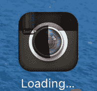
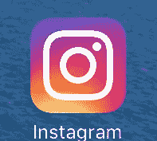
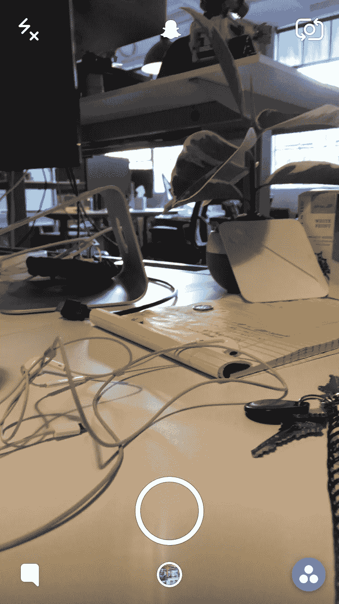
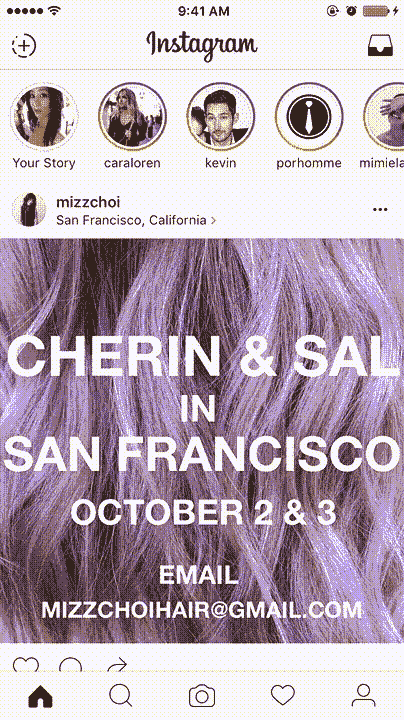
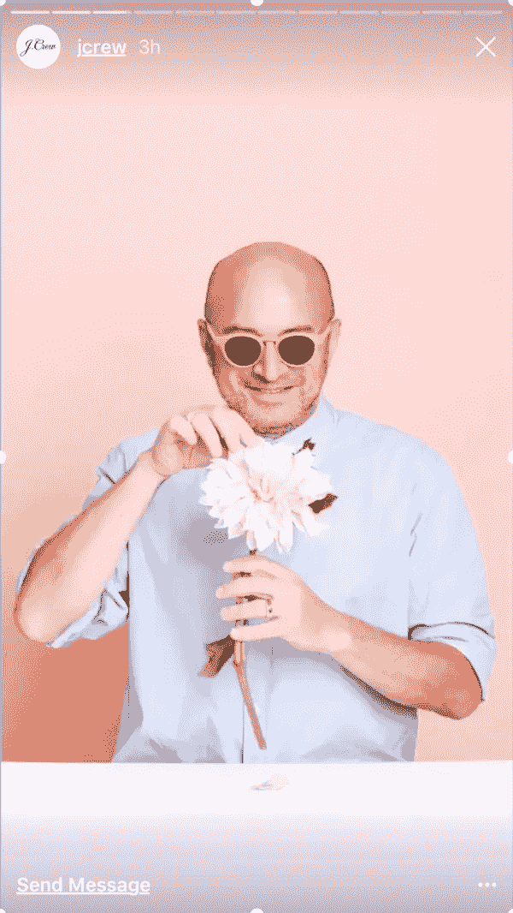

# 尽管有故事，Instagram 仍然是用来消费的，Snapchat 仍然是用来创造的

> 原文：<https://medium.com/hackernoon/despite-stories-instagram-is-still-for-consuming-snapchat-is-still-for-creating-4165492e5d13>

终于，终于，我更新了 Instagram。再见经典 hipstercam icon 你好千年 EDM 图标和故事。

Sentimental :(

许多人哀叹 Instagram 毫无想象力地用故事复制 Snapchat。

但是 Instagram Stories 和 Snapchat Stories 不一样。在真正的产品时尚中，Instagram 和 Snapchat 故意为各自的应用程序定义了非常不同的用户行为。

# 案例 1:创造与消费

Snapchat 已经在减少内容创作的障碍方面做了令人难以置信的工作。当务之急是*在 Snapchat 上创建*个故事(快照),而不是*消费*个故事。

只看第一屏体验。Snapchat 希望您拍一张喵喵的快照😺！在 Instagram 上，你可以直接滚动浏览故事，或者向下滚动查看其他人的帖子。

[Snapchat] vs [Instagram] 1st screen comparison

Instagram 让你寻找那个小小的+图标来开始你的故事，让你*首先考虑*是否要为一个故事拍照。Snapchat 不会让你思考——在决定把照片发布到哪里之前，先拍照。

# 案例 2:个人与数量

Snapchat 从诞生之日起就嵌入了亲密的、个人的、微互动(记住，它最初是作为 sext 应用程序出现的🙈).为了发送快照，我滚动联系人列表，突出显示我的 Snapchat 好友。“集体分享”的唯一方式是创建一个故事，并且只有在 Snapchat 上查看我的故事的人才是我个人认识的人*。

另一方面，我的 Instagram 故事获得了更多的浏览量。这肯定是由于拥有一个公共账户，连接的脸书账户，以及捕捉到我从未使用 Snapchat 的朋友。Instagram 所做的是通过实现 Snapchat 式的故事来保护 Snapchat 的掉队者。这些人从未“得到”Snapchat，但现在他们不必了。

**我的 Snapchat 是私人的，但即使它是公开的，Snapchat 上也没有 Instagram 上强大的发现功能，所以除非我分享我的 Snapchat 代码，否则陌生人不可能偶然发现我的 Snapchat。*

# 案例 3:内在表达与外在感知

我用 Snapchat 拍的自拍照比 Instagram 多得多，而且大多数照片都不值得打印😅。Snapchat 就是拍下瞬间的快照，让三分法见鬼去吧。

Instagram 拥有疯狂的品牌和影响力，甚至在故事中也是如此。Instagram 的故事可能会稍微降低制作水平，但这里有一个亮点:你可以将过去 24 小时内拍摄的任何照片添加到你的故事中，甚至是截图。Instagram 用户，更重要的是品牌，可以在故事中保持制作质量。另一方面，Snapchat 特别强调添加到故事中的老照片。

Left: Instagram Stories with a photo of Hawaii, where I was not. Center: Snapchat Stories clearly calling out an old photo. Right: Brand Instagram Story preserving production quality.

Snapchat 也有许多自我表达工具，包括油漆、文本、贴纸、表情符号、AR 贴纸标签、镜头、地理滤镜和 bitmoji。Instagram 只有画图和文字。

不管你用了多少贴纸、表情符号、绘画和文字的组合，每一张照片都有故事价值。每个 insta 都不是。

# 那么哪个更好呢？

看情况！

如果你是一个品牌，Instagram 有一个更成熟的广告、接触和发现平台。拥有超过 5 亿的月活跃用户，其中 3 亿是日活跃用户，你会在 Instagram 上获得更多的成交量。这是一个更熟悉的应用程序，使用它没有很高的学习曲线。

如果你是像我一样的普通用户，我发现我的右手拇指觉得 Snapchat 比 Instagram 用起来快得多。我不会仔细策划我的 Snapchat 故事，所以与 Instagram 相比，“表演”的压力更小。“噪音”也更少，因为与 Instagram 相比，我在 Snapchat 上关注的人不多。

Instagram 是一个很棒的消费应用，我想知道通过在他们的平台上介绍故事，是否会产生涓滴效应，不仅增加消费，还增加后期创作。在 Instagram 上推广更多的内容创作非常重要，因为 Snapchat 或 Snap Inc .的目标是成为事实上的摄像头。在第一次屏幕体验和现在的新眼镜中，他们的使命是响亮而清晰的。

> [黑客中午](http://bit.ly/Hackernoon)是黑客如何开始他们的下午。我们是 [@AMI](http://bit.ly/atAMIatAMI) 家庭的一员。我们现在[接受投稿](http://bit.ly/hackernoonsubmission)，并乐意[讨论广告&赞助](mailto:partners@amipublications.com)机会。
> 
> 如果你喜欢这个故事，我们推荐你阅读我们的[最新科技故事](http://bit.ly/hackernoonlatestt)和[趋势科技故事](https://hackernoon.com/trending)。直到下一次，不要把世界的现实想当然！

