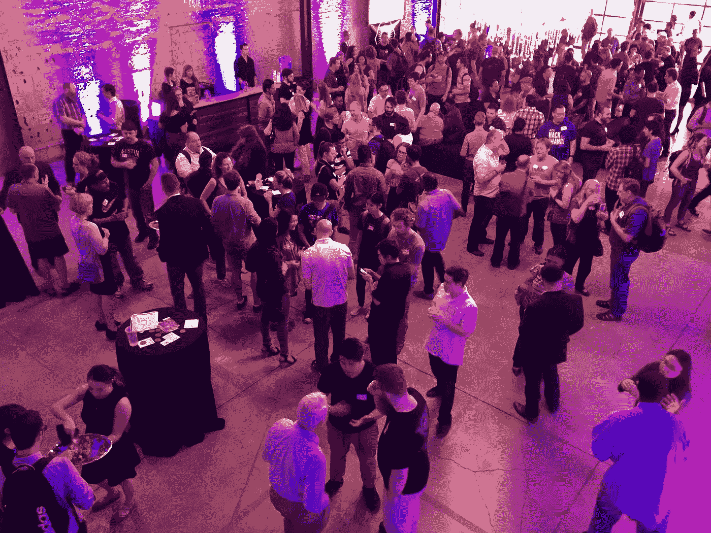

# 规划黑客马拉松时不应该忽视的细节

> 原文：<https://medium.com/hackernoon/details-you-shouldnt-overlook-when-planning-a-hackathon-e02eb59872f1>

策划一场黑客马拉松可能是资源密集型的，超过了常规的活动策划，在常规的活动策划中，你只需要订购一些餐饮，并进行一些装饰。就活动的设置和运行而言，黑客马拉松更像是一个小众活动，所以不要错过细节！它们很重要。

[顾客旅程地图](https://hbr.org/2010/11/using-customer-journey-maps-to)是源于[设计思维](https://www.ideou.com/pages/design-thinking)的有趣工具。使用客户旅程图可以帮助您真正了解您的黑客受众，并在您的活动中塑造他们的体验。它促使组织者不仅要考虑活动本身的来龙去脉，还要考虑人们来参加活动时的情绪起伏。

在计划你的黑客马拉松时，这里有一些你需要注意的细节:

**#1:社交尴尬**

每个事件都有一些。不管是家庭活动还是研讨会，总会有一些时刻让你不得不放松情绪。

黑客马拉松是一个陌生人的聚会，他们聚在一起紧张地解决问题，寻找克服我们社区中许多人面临的障碍的捷径，这意味着情绪肯定会高涨。

ATX Hack for Change 2017 | Photo Credit: ATX Hack for Change Volunteers

计划在黑客马拉松上设立公共空间，为人们提供互动的机会，甚至在黑客马拉松之前提供额外的活动来培养关系。添加活动元素，使体验更加有趣，因为人们开始在活动空间中寻找挑战，如有趣的名牌、古怪的标牌、明亮的颜色和精力充沛的志愿者来指引客人。

**#2:跨栏发生**

在一个神奇的黑客马拉松世界里，活动规划障碍很少，项目按时完成，影响巨大。然而，事实是，除了典型的活动规划失败之外，黑客马拉松还面临着其他障碍，需要在团队动态和项目流程方面加以解决。

重要的是，您要为那些预期的障碍做好准备，找到让黑客轻松选择项目/挑战的方法。此外，在活动期间安排时间专门倾听项目倡导者的当前需求，并探索是否有其他方法来获得他们所需的支持。

为团队休息增加一些灵活性也很重要。参加黑客马拉松会有很大的压力，而缓解压力的机会很少——无论是通过体育锻炼还是有趣的活动，如饼干和牛奶——都会给参与者的体验带来很大的不同。

**#3:完成就够了**

如前所述，团队一起开发项目已经承受了巨大的压力，尤其是有这么多不同的声音。在活动中需要记住和强调的一点是，完成黑客马拉松本身就是一项成就。整个周末团队能够一起工作已经是一个巨大的成功。

我认为，当涉及到应对公民挑战时，一些问题往往非常复杂，以至于一个周末不太可能立即产生变革性的结果。相反，关注活动中产生的对话，并跟踪这些想法的结果。提前传达这些期望可以确保所有参与你的活动的黑客觉得他们的时间花得值，并鼓励他们再次参与，也许是参与黑客攻击那个特定的问题或他们选择的另一个问题。

当你计划你的黑客马拉松活动时，一定要记住黑客经历的细节。您的活动的成功不仅取决于参与程度，还取决于黑客和社区的持续参与。确保细节得到考虑将有助于获得解决问题的长期黑客方法，并继续传播兴奋感。

**开始有困难？想让你的黑客马拉松更上一层楼吗？想和有经验的女孩聊聊吗？**

与我联系: [experimentalcivics.io](https://www.experimentalcivics.io/) 让我们来谈谈吧！我有黑客马拉松包可以帮助你到达你想去的地方。