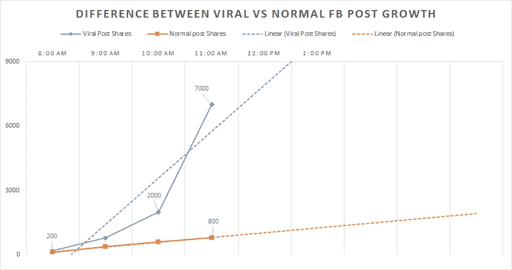
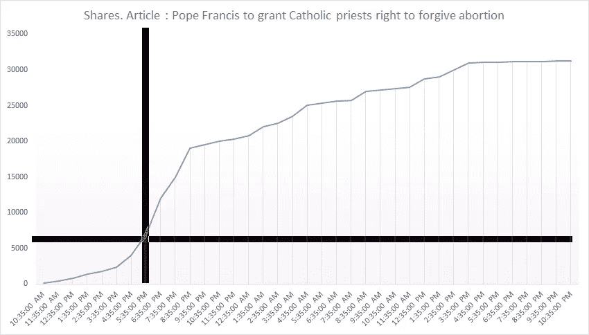

# 使用 FB API 在虚假的病毒故事传播之前检测它们

> 原文：<https://medium.com/hackernoon/detecting-fake-viral-stories-before-they-become-viral-using-fb-api-f67a18cd4f0a>

这是 X 部分文章的第一部分。

第二部分

 [## 爆发——自动检测虚假病毒新闻。

### 两周前，我在 medium 上发表了这篇文章，内容是关于我们如何使用病毒爆发这一工具来检测虚假的病毒新闻…

hackernoon.com](https://hackernoon.com/the-outbreak-detecting-fake-viral-news-automatically-3acded3a97cb) 

第三部分

 [## 爆发——与一小时的分享峰值相比，如何检测真正的病毒帖子。

### 要获得更多关于什么是爆发工具的信息，请阅读这篇文章:

medium.com](/@baditaflorin/the-outbreak-how-to-detect-the-real-viral-posts-compared-to-the-one-hour-share-spike-e0feae4f5f36) 

第四部分

 [## 使用谷歌情感分析了解脸书的反应

### 2019 更新:欧文的新文章:

medium.com](/google-cloud/understanding-facebook-reactions-using-sentiment-analysis-f17b6e561ff3) 

首先提一个问题。你如何发现一篇虚假的病毒文章？

有人告诉你这件事吗？你正在使用一种特殊的软件吗？你使用 facebook 趋势和 twitter 趋势来找出什么是病毒性的吗？

为了弄清楚记者们是如何在当下发现的，我制作了这个 [**谷歌表单**](https://goo.gl/forms/QPNp0nHrSQqoNIg93) **。** 我鼓励您[完成表格](https://goo.gl/forms/QPNp0nHrSQqoNIg93)，这样我们就可以更好地了解记者和博客作者是如何发现病毒式新闻文章的。

## 我们需要建造什么来完成这个:

Outbrake 是我想为记者开发的一项服务，允许他们在病毒式传播之前找到病毒式传播的文章。

# 想法

通过自动抓取通常分享虚假或误导性文章的 FB 页面，记者可以在“下一个谎言”已经如此受欢迎之前看到它们，因此即使你会解释某些事情不是真的，更多的人已经听到了虚假的版本。

> 凡文现在有 **60 万股**，在**第一小时**有 **5K 股**，在**第二小时 11K** ，在**第三小时 19K**

Using this, we can detect this articles way before they spread from one vertical into another and they become viral.

# 高级细节

1.  每个小时，我们都会查看哪些新闻文章发布了美国**1000 家最受欢迎的新闻网站**，并将它们下载到一个数据库中，搜索那些正在迅速传播的网站。
2.  我们每小时从 facebook 下载数据，看看每篇文章有多少分享、喜欢和评论，并找出上升最快的文章，也就是正在传播的文章。
3.  使用 NLP，我们分析了 facebook 用户对病毒式评论发表的评论，以更好地理解病毒式帖子与普通帖子的区别。

# 低级细节

使用一个定制的 python web 解析器，我们每小时抓取一份美国 1000 大新闻网站的列表，并将它们添加到数据库中。第二次解析相同的链接时，我们将它添加到数据库中，并使用 facebook API 计算喜欢、情感和分享数量的差异。
我们**监控每个故事**达 **3 天**，然后我们停止索引那个特定的链接。如果这个故事稍后在我们的数据库中再次出现，我们将再次监控 3 天，然后再次停止。

> 只有大约 5%的帖子，即我们看到的正在成为病毒的帖子，我们下载评论，以便我们可以分析它们，看看人们在谈论什么。

基本原理是，我们可以根据用户对文章的评论，自动完成[学习](https://hackernoon.com/tagged/learning)这篇文章是关于什么以及文章的有效性的过程。

# 脸书 API 有效载荷:

## #从 FB 页面获取文章。

1000 个 FB 页面* 24 小时=每天 24.000 个请求。
如果请求的平均大小是 1MB，那么每天需要从脸书
每月下载 24 GB，这意味着 720GB

## #从 FB API 获取评论、喜欢和分享的数量

1000 个新闻网站*每天 50 篇文章* 5 天(一篇文章被抓取的平均时间)=每小时 250.000 个请求。
每天这将意味着 6.000.000 个请求
如果请求的平均大小是 100k，每小时我需要从脸书下载 25 GB。每天 600GB。**每月最低带宽需求 18TB**

## #获取病毒文章的文本评论。

大约所有文章的 1-5%。

每天，我们将每月下载大约 10.000 条病毒式新闻/热门新闻文章
，这意味着 300.000 个请求* 100 个评论嵌套页面= **30.000.000 个请求**
如果请求的平均大小为 1MB，每天我们需要每月从脸书下载 10GB
，所需的最小带宽为 300GB
这将是我们几乎完全保留的数据，因此服务器端的成本很高。

## Webcrawler API 负载:

1000 个新闻网站每天的有效载荷*每天 50 篇文章=每天 50.000 个请求。
如果请求的平均大小是 1MB，这意味着每天 50GB
每月，这意味着 1.5TB

> 每个月，我们需要向 facebook 发送超过 2 亿个 API 请求，下载超过 20TB 的数据

# 后续步骤:

我将于 12 月 9 日至 11 日在旧金山的第二届@Debug Politics 黑客大会上正式启动这个项目。

但是我已经在努力了。我需要的是有人在数据库设计经验，创造后台架构。还有，有设计经验的人。

我需要融资来推动这个项目向前发展，为服务器和其他与该项目相关的费用。如果你想成为这个项目的一部分，无论是作为赞助商还是开发者，给我发电子邮件到*baditaflorin@gmail.com*

## 关于我

我与 Rise 项目合作，进行数据分析和模式识别，以揭示非结构化数据集中的数据模式。

你可以在网上找我**上媒** [**弗罗林【巴迪塔】**](https://medium.com/u/3b723c70c152?source=post_page-----f67a18cd4f0a--------------------------------)**[**AngelList**](https://angel.co/florin-badita)**[**推特**](https://twitter.com/baditaflorin) **，L** [**inkedin，**](http://linkedin.com/in/baditaflorin)**O**[**penstreetmap**](https://www.openstreetmap.org/user/baditaflorin/diary)**，G******

******有时候我会在博客上写**[**http://florinbadita.com/**](http://florinbadita.com/)****

************************

> ****[黑客中午](http://bit.ly/Hackernoon)是黑客们如何开始他们的下午。我们是 [@AMI](http://bit.ly/atAMIatAMI) 家庭的一员。我们现在[接受投稿](http://bit.ly/hackernoonsubmission)并乐意[讨论广告&赞助](mailto:partners@amipublications.com)机会。****
> 
> ****如果你喜欢这个故事，我们推荐你阅读我们的[最新科技故事](http://bit.ly/hackernoonlatestt)和[趋势科技故事](https://hackernoon.com/trending)。直到下一次，不要把世界的现实想当然！****

********