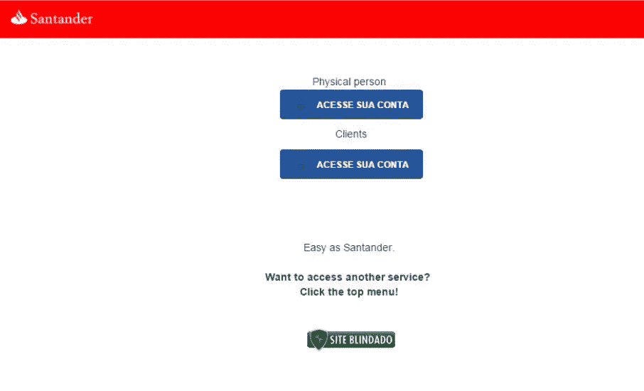
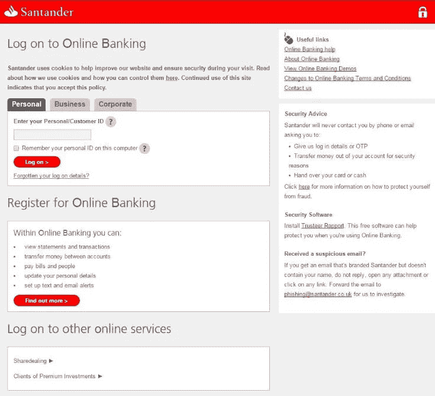

# 检测网络钓鱼攻击

> 原文：<https://medium.com/hackernoon/detecting-phishing-attacks-6c5f760a03d7>

根据朴茨茅斯大学的一项研究，欺诈每年给英国造成 1930 亿英镑的损失，其中大部分是通过网络钓鱼进行的。平均而言，据估计，鱼叉式网络钓鱼攻击给企业带来的平均成本约为 130 万英镑( [Cloudmark](https://blog.cloudmark.com/2016/01/13/survey-spear-phishing-a-top-security-concern-to-enterprises/) )。

在过去的一年里，Zepko 分析师亲眼目睹了与 2015 年相比网络钓鱼攻击的又一次大幅增长。事实上，我们认为 2016 年我们看到的网络钓鱼攻击比其他任何一年都多。我们的预测是，网络钓鱼攻击的数量将继续增加，并将成为 2017 年许多企业的主要担忧。

**那么，什么是网络钓鱼攻击？**

网络钓鱼攻击是一种社会工程攻击，旨在欺骗用户并操纵他们做某些事情，例如:

*   交出敏感信息，如用户名、密码、支付详情和其他敏感或个人身份信息。
*   诱骗用户下载恶意文件，如假发票或启用宏的 Word 文档，从而导致勒索软件或其他形式的恶意软件感染。
*   将用户引向技术支持骗局，操纵他们拨打高级电话或下载恶意文件，如银行木马恶意软件。

有许多不同类型的网络钓鱼攻击，但它们都有一个共同的目标-它们旨在使恶意行为者在经济上受益。

通常，网络钓鱼以网页、电子邮件或文本消息的形式出现，看起来是合法服务的一部分。或者，其他网络钓鱼活动会让用户恐慌，认为除非他们按照屏幕上的说明操作，否则会发生不好的事情，或者引诱用户点击链接或提交数据以换取好处。

**顶级域名钓鱼攻击**

顶级域名(TLD)网络钓鱼攻击是一种网络钓鱼攻击，通过注册与公司名称相似的域名并托管看似真实的服务或业务的网页来欺骗真实的客户或员工。

例如，看看下面的两个域:

[*https://www . domain detect . io*](https://www.domaindetect.io)和[*https://www . domain detect . jo*](https://www.domaindetect.jo)

乍一看，它们似乎是一样的。只有仔细观察，你才能看出它们的不同。这是检测钓鱼域名非常困难的原因之一。它们看起来是合法的，但往往为时已晚。

另一个 TLD 钓鱼网页的例子可以在下面的图片中看到。下面两个网页你觉得哪个是真正的网银登录页面？

不幸的是，即使你选择了第二张图片，你也错了。

上面两张图片都是 Zepko 分析师在 2016 年发现的真实钓鱼页面的示例。正如您所看到的，这些页面的风格和复杂程度各不相同，但用户并不总是清楚什么是合法的登录页面，这也使得检测网络钓鱼域非常困难。

在这一年中，Zepko 分析师已经看到了许多类型的网络钓鱼页面(如银行网站的虚假登录页面、“病毒警报”页面、技术支持页面、社交网络页面、微软“警报”页面、HMRC 登录页面、苹果 iCloud 登录页面等)，似乎没有哪个行业或公司可以免于成为网络钓鱼活动的目标。

那么，我们能帮上什么忙呢？

> **域名检测**

今年 Zepko 推出了一款新产品， [*域名检测*](https://www.domaindetect.io/) *，*帮助企业保护自己、客户和员工免受顶级域名(TLD)的网络钓鱼攻击。

通过 30 天的免费试用，DomainDetect 是防范基于域名的网络钓鱼攻击的最佳方式。

使用 DomainDetect，您可以为您的公司输入许多搜索术语。这些将用于每天扫描超过 250，000 个域，如果匹配，DomainDetect 将向您发送一封电子邮件警报，列出所有与您的搜索条件匹配的域。通过使用 DomainDetect，您可以分析电子邮件警报中提供的所有相似域，在大多数情况下，您可以在活动开始前识别并阻止攻击。

如果你想在 30 天免费期后继续试用，那么你可以每月订阅 99 美元。有关[域名检测](https://www.domaindetect.io/)的更多信息，请访问[常见问题解答](https://www.domaindetect.io/faq/)或在此 注册您的 [**免费试用。**](https://panel.domaindetect.io/register/)

> [黑客中午](http://bit.ly/Hackernoon)是黑客如何开始他们的下午。我们是 [@AMI](http://bit.ly/atAMIatAMI) 家庭的一员。我们现在[接受投稿](http://bit.ly/hackernoonsubmission)，并乐意[讨论广告&赞助](mailto:partners@amipublications.com)机会。
> 
> 如果你喜欢这个故事，我们推荐你阅读我们的[最新科技故事](http://bit.ly/hackernoonlatestt)和[趋势科技故事](https://hackernoon.com/trending)。直到下一次，不要把世界的现实想当然！

