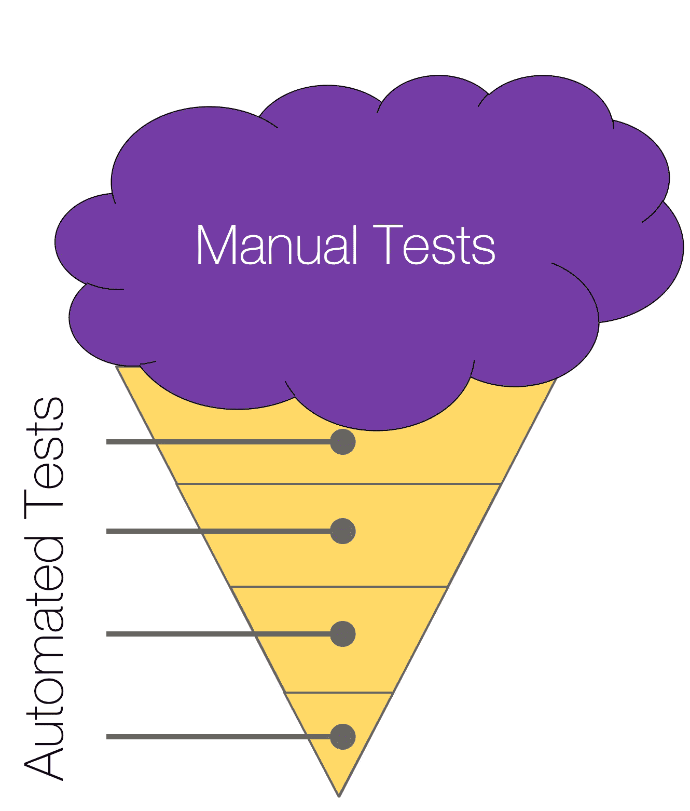
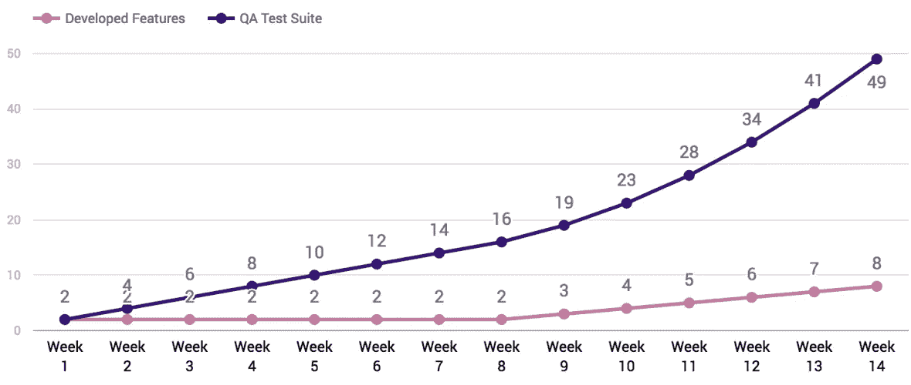
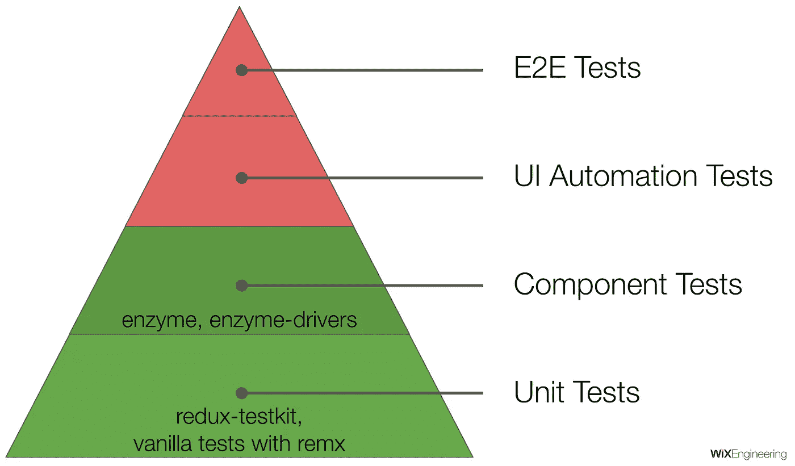
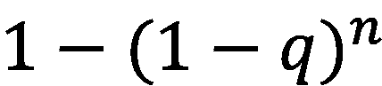
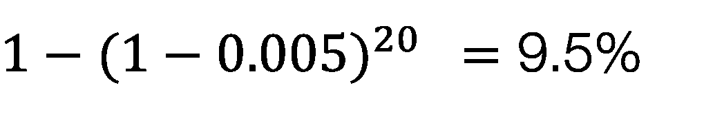
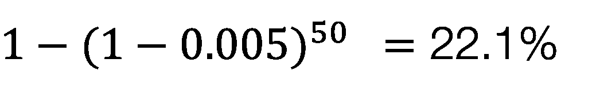
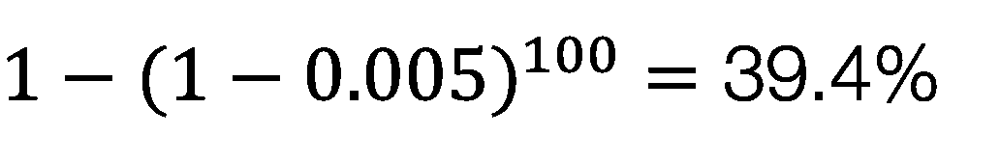
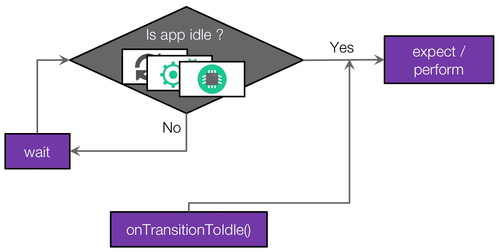
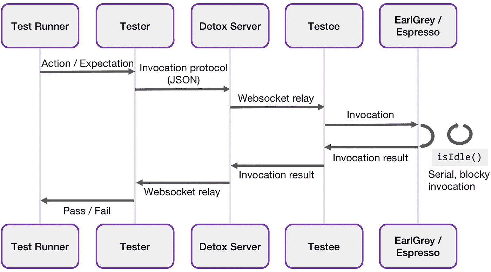

# 排毒:灰盒端到端移动应用测试框架

> 原文：<https://medium.com/hackernoon/detox-gray-box-end-to-end-testing-framework-for-mobile-apps-196ccd9564ce>

Detox from sleep(); Photo by [Dominik Martin](https://unsplash.com/photos/JYFmYif4n70?utm_source=unsplash&utm_medium=referral&utm_content=creditCopyText) on [Unsplash](https://unsplash.com/?utm_source=unsplash&utm_medium=referral&utm_content=creditCopyText)

> 端到端测试位于测试金字塔的顶端，他们应该给**被测系统工作的最大信心，但是在大多数端到端测试框架中，我们发现自己在与“不可靠”的测试作斗争，并最终不信任测试套件。我们希望通过排毒来改变这种情况。**

# 开始

我们的故事从 [Wix 应用](https://itunes.apple.com/us/app/wix-com/id1099748482?mt=8)开始——我们官方的原生 iOS/Android 应用

*   它是用 React Native 从头开始写的
*   大约 18 个月前(2016 年 3 月)开始着手这项工作

就工程工作而言:

*   该应用程序是一个跨公司的努力，它目前合并了来自 6 个不同产品组的代码。
*   目前有 40 名开发人员在这个项目上工作，或者用 infra 工具提供支持。
*   大部分代码是用 JavaScript 编写的

有了 Google Play 和 Apple App Store 作为我们的分发手段，我们的发布本质上就不是持续部署。所以我们有发布列车(每周 2 个站台)。但是发行机制并不是我们不做真 CD 的真正原因。

## 我们依赖手工测试，很多！

1.  目前，完整的回归 QA 测试套件包含 300 个测试，需要 14 个人-天来运行，由于它太大，我们无法在下一个版本中按时完成测试，所以我们只测试其中的~70 个，这也需要很长时间，一个设备需要 3 个人-天。
2.  事实上，如果我们在两个平台上运行整个套件，并且每个平台上只有两个操作系统版本，那么我们最终将需要 56 (2 个平台 x 2 个操作系统版本 x 14)个人-天来完成全面回归。但是情况变得更糟了。

This ice cream cone is a software testing anti-pattern.

## QA 不可扩展

1.  QA 测试套件总是会增长，这意味着即使开发以同样的速度继续，QA 也会在每个版本上有额外的工作，所以我们要么需要雇佣更多的 QA，要么放弃一些测试。
2.  Wix 的移动开发每季度增长约 25%,而且速度还在不断加快。

让我们举一个简单的例子，如果开发以每周 2 个特性或 bug 修复的速度进行，那么 QA 每周将有**两个额外的测试**，这意味着在第 1 周他们将有 2 个测试，在第 7 周套件将会大 7 倍。

向组合中添加一个不断增长的产品，这需要雇用更多的开发人员并提高开发过程的速度，QA 测试套件就像爆炸一样…更高的特性速度意味着 QA 回归套件增长得更快。

The graph on the bottom shows the number of new developed features every week, the graph on the top shows the number tests in a QA test suite.

# 自动化测试是未来的趋势！

不过这并不新鲜…

我们不想雇佣一大群人来做人工 QA，我们想要自动化测试，在 CI 上运行现代化的连续工作流，有非常短的开发反馈循环，如果所有测试都是绿色的，我们就有信心发布新版本。

这是测试金字塔，因为你已经知道了为什么测试如此重要，并且理解了不同类型的测试，我们将关注如何测试每一种类型，而不是解释它们是什么。
让我们把 E2E 分成两部分，纯 UI 自动化(意思是，不测试外部服务)，和完全 E2E，用真实的服务器数据模拟一个用户。这些必须在设备或模拟器上运行。

让我们把重点放在移动开发上，具体反应原生。

我们知道怎么做？

*   **单元测试**
    业务逻辑大多在 JS 中，用 Jest 很容易在节点上测试。
    React Native 和 React 一样，使用 Flux 架构来控制 app 数据流。最流行的 Flux 实现之一是 Redux，我们在应用程序中广泛使用它。尽管 redux 广受欢迎，但我们从来没有对 Redux 应用程序进行过单元测试，所以我们开发了测试 Redux 应用程序的方法和测试工具包，查看 [redux-testkit](https://github.com/wix/redux-testkit) 了解更多信息。
    另一个流行的 flux 实现是 [Mobx](https://mobx.js.org/) ，它比 Redux 更加独立，并且具有强大的测试能力。我们创造了一种自以为是的风格，让我们的工程师更容易理解。R [emx](https://github.com/wix/remx) 可以很容易地测试，单元测试可以是普通的 JavaScript，完全不知道底层的实现，我们将在不久的将来添加更多关于 Remx 的信息。
*   **组件测试** 也在 node 上运行，我们依靠 Airbnb 的 [Enzyme](https://github.com/airbnb/enzyme) ，使用 [Enzyme Drivers](https://github.com/wix/enzyme-drivers) 帮助嘲讽。
*   UI 自动化/端到端
    但是端到端测试怎么办呢？这些测试给人最大的信心，因为它们相当于一个在设备上运行你的应用程序的机器人。维护一个端到端的测试套件很难，而且不如其他的测试套件可靠。但是为什么呢？

## 片状

E2E 测试通常被认为是不可靠的，在所有平台上，web，iOS，Android。

*   测试可能没有明显的原因就失败了，即使没有代码更改。
*   测试是不确定的，应用程序中有许多移动的部分，它们可能在不同的运行中以不同的顺序完成执行。
*   我们不能真正确定应用程序何时空闲，因为不清楚应用程序何时完成处理用户交互。
*   E2E 框架的用户经常不得不手动处理同步，**所以他们发现自己在关键位置添加了多个 sleeps，只是为了让测试通过**。

## **手动同步**

手动同步被如此普遍地使用，以至于我们将它合并到我们的测试框架基础设施中，API 调用充满了包含`sleep()`函数的循环。
这是我从 [Aaron Greenwald](https://medium.com/u/e45d45638b1d?source=post_page-----196ccd9564ce--------------------------------) 在 React Amsterdam 的[演讲中截取的一个例子，这是我们在之前的测试框架中用来测试 React 原生应用的一段实际代码。](https://www.youtube.com/watch?v=cUSUJXAvt6k)

sleep(a_lot);

## 片状测试套件有多不可靠？

为了理解问题有多严重，让我们来计算一个测试套件失败的概率。

**问:**测试失败的概率
**n:** 测试次数

***1-q****是成功的概率。
***(1-q)^n*** 是整个套件成功的概率。
***1-(1-q)^n****是至少一个测试失败的概率。**

**如果测试有 0.5%的几率不稳定:**

****

**And we have 20 tests**

****

**50 tests**

****

**100 tests**

**你说到点子上了，很不靠谱…**

# **过去的经验**

**所以，这是一个复杂的问题…而且我们在过去已经有了一些框架的经验。**

**[**Appium**](https://github.com/appium/appium)
最流行的解决方案是业界事实上的标准。我们还检查了其他拥有移动产品的公司在端到端测试方面的做法，发现许多公司甚至没有自动化，而那些有自动化的公司则使用 Appium。Appium 的内部驱动程序是使用 Instruments (iOS)和 UIAutomator (Android)实现的，它们本质上是与设备交互的外部方式，就像用户一样。**

**我们一般使用 Appium 年，使用 React Native 8 个月，发现我们花在编写测试和抚摸系统上的时间比实际编写特性的时间还多。**

**我们发现端到端测试非常困难:**

**测试是易变的，我们在不同的机器上得到不同的结果，CI 经常失败，唯一的解决方法是增加睡眠，这减慢了测试速度。**

**测试已经很慢了，因为苹果 UIAutomation 工具被限制为每秒执行一个动作，有一个黑客可以毫不延迟地删除这个 cap **工具(已经没有维护)，**所以每次发布新 Xcode 后，我们都必须等待补丁才能升级。**

**[**万磁王**](https://github.com/MagnetoTesting/magneto)还有一点值得注意的是**万磁王**，一个只针对 Android 的 E2E 测试框架，
一个由 Everything.me 提供的解决方案，我之前工作的地方，以 UIAutomator 为主驱动构建。**

1.  **它稳定多了，但我们仍然不能根除片状剥落。**
2.  **我们有 12 个移动开发人员，一个开发人员致力于开发框架和 CI 系统。**
3.  **大约 5-10%的假阴性。**

**其他的框架，像 [Robotium](https://github.com/RobotiumTech/robotium) 和[葫芦](https://developer.xamarin.com/guides/testcloud/calabash/introduction-to-calabash/)已经不在开发中了。**

**这些框架之间的主要相似之处在于它们都是黑盒测试框架。**

## **黑箱测试**

****

**A box**

**什么是[黑盒测试](https://en.wikipedia.org/wiki/Black-box_testing)？这是一种从外部测试东西的方法，而不知道内部发生了什么。
在 mobile 中，黑盒 E2E 框架本质上检查视图层次结构，寻找元素(如果没有找到，休眠，继续以这种方式循环，直到某个超时)，然后与视图交互。同样的原则也适用于网络黑盒 E2E。**

**现在，想一想要求用户提供这个超时是多么不公平，他们不知道操作系统内部发生了什么，甚至不知道应用程序内部发生了什么，这是剥落的主要原因。**

# ****黑盒测试+ React Native****

**当在 react-native 应用上使用时，E2E 变得更加古怪…**

## **翻译**

**在本地应用程序中，只有一个线程负责呈现 UI(主线程)。
使用 React Native 有点棘手，React Native 的独特架构增加了系统的复杂性，其 UI 渲染从协调器开始，协调器计算 UI 的哪些部分发生了变化，这是在 JavaScript 线程上完成的，然后通过异步桥传递，并转换为主线程的本机指令，以渲染真实的布局。由于使用了这种异步渲染机制，现在有两个线程控制渲染，所以黑盒测试框架在控制 React 原生应用时会遇到更大的麻烦。**

## **加载和解析包**

**当 React 本机应用程序启动时，它会从本地打包服务器或设备上的资产加载一个包，在任何情况下，这都是一个异步过程，需要不确定的时间。黑盒测试框架在这个过程中也需要休眠，但是要休眠多久呢？没有真正的答案。**

**黑盒是一个死胡同，我们需要一种不同的方法…**

# **戒瘾诊所**

## **灰色盒子，不是黑色盒子**

**Detox 使用灰盒，而不是黑盒，以允许测试框架从内部监控应用程序并与之同步。**

**灰盒子本质上使用了一段植入应用程序的代码，它可以帮助我们看到里面发生了什么。**

**与黑盒不同，灰盒运行在同一个进程中，可以访问内存，可以监控执行进程。能够读取内部内存使它能够检测进程内部发生的事情:如果有网络请求正在进行，当主线程空闲时，其他线程空闲时，动画结束时，react 本机桥空闲时。它可以在主线程上执行，以确保当它执行动作时，UI 层次结构中没有任何变化。**

**但也有不利的一面——通常当使用灰盒测试框架进行测试时，应用程序会经历不同的编译/运行过程，因为它需要从过程内部执行额外的代码。对我们来说，牺牲这一点并获得巨大的回报是值得的。**

## **使用 EarlGrey 和 Espresso**

**领先的原生灰盒驱动程序由谷歌开发 iOS 版的 [EarlGrey](https://github.com/google/EarlGrey) 和 Android 版的 [Espresso](https://developer.android.com/training/testing/ui-testing/espresso-testing.html) 。这些框架可以与应用程序同步，确保只在应用程序空闲时与之交互。**

**这些灰盒框架中使用的底层同步机制以如下方式工作。**

**它们将每隔几毫秒查询一次内部资源，或者监听来自内部资源的回调，告知它们现在已经切换到空闲模式，而不是在 UI 上重试动作/期望。测试将不会继续，直到他们都返回是，只有到那时，当应用程序空闲时，它将与用户界面进行交互。**

****

**Idling Resources**

## **不依赖于 WebDriver**

**排毒不依赖于网络驱动，因为这不是网络。Detox 使用基于 JSON 的反射机制与其本机驱动程序(扩展了 EarlGrey 和 Espresso)进行通信，这允许一个通用的 JavaScript 实现直接在设备上调用本机方法。**

## **简单 API**

1.  **类似 API 的量角器，用 JavaScript 写的。**
2.  **最少的样板文件和非常小的配置过程。**
3.  ****跨平台:**测试代码不知道它测试的平台，它可以在平台之间共享。**
4.  ****同步:**无需手动同步测试与应用程序，排毒固有的同步，它会执行其命令，只有当应用程序是空闲的，没有更多的睡眠！**
5.  ****可调试:**使用诸如 modern `async-await`之类的原生构造，而不是将所有东西都放在承诺队列中，这意味着断点将按预期工作。**

**A simple login flow test written with Detox**

## **反应本地支持**

**Detox 完全是为原生移动而构建的，并对 React 原生应用程序提供一流的支持。**

**我们发现 React Native 几乎重新实现了 iOS 和 Android，因此除了 EarlGrey 和 Espresso 对原生应用程序的基本同步支持之外，我们还必须为 React Native 创建特殊的同步机制。**

## **评估对设备的期望**

**传统上，测试框架评估在计算机上运行的测试脚本中的期望。排毒直接在模拟器上运行的测试应用程序中评估预期。这使得以前由于不同的范围或性能原因而不可能实现的操作成为可能。**

# **排毒是如何工作的**

**让我们来看看高层次的图表，希望它能帮助我们了解如何排毒工程。**

****

1.  **试运行:行动或期望的执行(等待承诺)**
2.  **测试人员:期望被序列化为嵌套调用 JSON**
3.  **服务器:转发消息**
4.  **被测试者:通过方法反射调用 EarlGrey**
5.  **调用将仅在应用程序空闲时执行**
6.  **被测试者:调用结果通过 websocket 返回**
7.  **测试人员:解决/拒绝期望承诺**

**关于排毒如何工作的更多深入信息，请访问文档。**

# **具有排毒功能的 UI 自动化**

**让我们回到我们的测试金字塔。**

**所以我们现在有了一个稳定的端到端测试框架。但是由于网络和服务器的问题，它可能仍然不稳定。**

**为了做到这一点，我们需要消除网络中测试的依赖性，以一致且及时的方式预期请求和响应，我们将创建纯 UI 自动化(UI 密封测试)。**

## **[react-native-re packer](https://github.com/wix/react-native-repackager)**

**[react-native-repackager](https://github.com/wix/react-native-repackager) 是一个针对 react-native JS 代码的模仿机制。本质上，它扩展了打包程序用任何其他文件覆盖捆绑文件的能力，本质上创建了一种在 react-native 中模拟环境的简单方法。**

**因此，您可以创建自己的预打包响应，或者将您的端点设置到您的本地模拟服务器，这对于分离您的测试关注点非常有帮助。**

**React-native-repackager 也将 Detox 变成了一个 UI 自动化框架。金字塔全绿，没有借口:)可以开始测试了！**

# **排毒在行动**

**令人惊讶的是，灰色盒子不仅比黑色盒子更稳定，而且速度更快。没有更多的睡眠或等待，直到代码执行毫秒应用程序变得空闲。因此，它比黑盒解决方案快 5-10 倍。
事实上，它的速度非常快，可以在 4 分钟内运行完整的排毒测试项目套件(79 项测试)。**

**Detox’s own test suite running on an iOS Simulator**

*   **这是排毒自己的 E2E 测试，当然是用排毒写的**
*   **运行应用程序的模拟器在右边**
*   **运行我们测试的控制台在左边**
*   **我们使用[摩卡](https://github.com/mochajs/mocha)作为我们的测试跑步者，但是你可以使用任何你喜欢的，人们已经用 Jest 成功地设置了排毒。**
*   **您在控制台中看到的每一行都是一个新的隔离测试场景，因此它从头开始重新启动所有的测试，并且可以在将来进行分片。**
*   **如你所见，它非常快**

## **跨平台对吗？安卓在哪里？**

**许多人一直在询问 Android 的排毒支持。这也是 Wix 内部热切期待的一个特性。
现在，开源是一个很棒的东西，它可以形成合作，使项目更上一层楼。
几个月前，来自 KPN(荷兰一家大型电信公司)的[西蒙·拉茨](https://medium.com/u/6a258af9e7ed?source=post_page-----196ccd9564ce--------------------------------)联系了我们，他表示愿意帮助 Android 排毒。从那时起，他几乎成了 Detox 的团队成员，在我们即将推出的 Android 支持中实现关键功能。**

**让我们看看它看起来怎么样**

**Detox’s own test suite running on an Android Emulator**

**这是我们用来测试 iOS 实现的同一个测试套件。它实际上是未受影响的，这样我们可以确保我们的 API 真正是跨平台的。Android 的 Detox 几乎准备好了，事实上，缺少的东西很少，有关我们 Android 发布的更多细节，请关注 github 上我们的[发布页面](https://github.com/wix/detox/releases)。**

## **排毒是一个 TDD 项目**

1.  **它有 100%的代码覆盖率，如果低于这个数字，构建就会失败。**
2.  ****Detox 的 E2E API 经过了 Detox 的测试:**我们在每次构建时都在一个特殊的测试应用上运行整个 Detox API。**
3.  ****它旨在接受贡献:**构建在 TravisCI 上运行，只有符合标准的贡献才会被接受，我们试图保持非常开放并与社区保持联系，非常乐意接受任何形式的帮助。**

** [## wix/detox

### 排毒-灰盒 E2E 测试和移动应用程序自动化库

github.com](https://github.com/wix/detox/) 

我要感谢排毒背后的团队成员:[利奥·纳坦](https://medium.com/u/b717150cccfc?source=post_page-----196ccd9564ce--------------------------------)、[塔尔·科尔](https://medium.com/u/83a4f96844d0?source=post_page-----196ccd9564ce--------------------------------)、[谢尔盖·伊里耶夫斯基](https://medium.com/u/4c6f11f87e4b?source=post_page-----196ccd9564ce--------------------------------)、[西蒙·拉茨](https://medium.com/u/6a258af9e7ed?source=post_page-----196ccd9564ce--------------------------------)、[埃拉德·博戈莫尔尼](https://medium.com/u/ed368caf53a6?source=post_page-----196ccd9564ce--------------------------------)、[丹尼尔·施密特](https://medium.com/u/d14afae26ab6?source=post_page-----196ccd9564ce--------------------------------)，以及我们所有其他内部和外部的贡献者，谢谢你们，你们太棒了！

## 摘要

我们最初的任务是创建一个我们可以信任的框架，这样当构建是绿色的时，我们就可以发布我们的新版本，并以此建立一个真正的持续部署工作流。为了实现这一点，我们需要改变我们的思维状态，没有所谓的片状测试，要么是应用程序中存在错误，要么是测试框架缺乏，我们的首要任务是防止片状化，但这不是一个非常容易的任务。
我们对排毒感到非常兴奋，我们希望它对我们有用，对其他人也有用。**