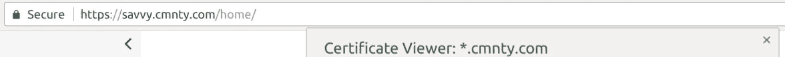
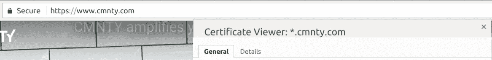
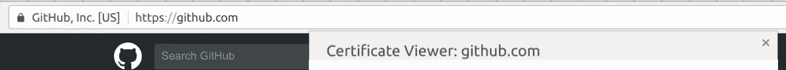

# 警告:停止滥用通配符证书

> 原文：<https://medium.com/hackernoon/dev-rant-stop-abusing-wildcard-certs-3a268bc57644>

## 如果你是一个“平台”，使用通配符代表[所有的事情](http://knowyourmeme.com/memes/all-the-things)

[Obscure source](https://www.amazon.co.uk/Barney%C2%B4s-Suit-Poster-Up/dp/B00E7YNKL6)

通配符证书棒极了( [RFC6125](https://tools.ietf.org/html/rfc6125#section-7.2) )。它们允许您在任意数量的子域上轻松使用 HTTPS/SSL，这意味着您的所有开发子域端点可以使用最低限度的传输加密，而不必担心通过[让我们加密](https://letsencrypt.org/) *等*

不幸的是，通配符证书也有不好的一面——在生产环境中使用它们。**特别是**平台上的生产环境

例如， [CMNTY](https://www.cmnty.com/) 为他们的组织使用相同的通配符证书，以及他们所有的数百(数千？)使用`<customer>.cmnty.com`地址的客户。

Platform customer using wildcard…could be ok.

Main organisation on same wildcard…erm.

我理解对“低价值”、“高容量”客户使用通配符证书的效用(和管理效率)。

所以有蛋糕，也吃。**只需为您的组织使用单独的证书**，即[cert-up](https://www.youtube.com/watch?v=TT_vf5ioXXk) 裸名`cmnty.com` ，并将其用于“官方”组织。

甚至可以为你的开发/登台资源(`*.dev.<domain>.com`)提供一个单独的证书，让事情更进一步，万一他们可以公开访问预览或诸如此类的。

如果没有一些道具和水滴，这个小咆哮是不完整的…

## 小道具

如果你像 GitHub 一样弯曲它并使用 EV-cert，你会得到加分。对非电子商务网站的效用值得怀疑，但我能说什么呢，它们看起来很酷。关于“安全”的“品牌声明”怎么样

EV for the win

## 滴剂

*   [https://auth0.com](https://auth0.com/)⁴
*   [https://www.squarespace.com](https://www.squarespace.com/)
*   [https://www.wix.com](https://www.wix.com/)

## 脚注

[1] Yal 只是碰巧是我工作的那个倒霉的网站。对 CMNTY 没有什么可挑剔的……然而，正在进行更彻底的拆除(插入:muhaha)。

[2] CMNTY 使用`[www.cmnty.com](http://www.cmnty.com)`作为他们的规范名称。会引起一些问题，因为通配符会覆盖…meep。冒着点燃 www 与非 www 之争的风险，我只想说，除非您想编写自定义的 ngnix 规则，否则如果您打算为客户使用通配符，请使用非 www。

[3]令我惊讶的是，不仅仅是 www 上的人可以随心所欲。

[4] [了解更多关于 Auth0 的信息。](http://ernoon.com/authentication-as-a-service-an-honest-review-of-auth0-315277abcba1)