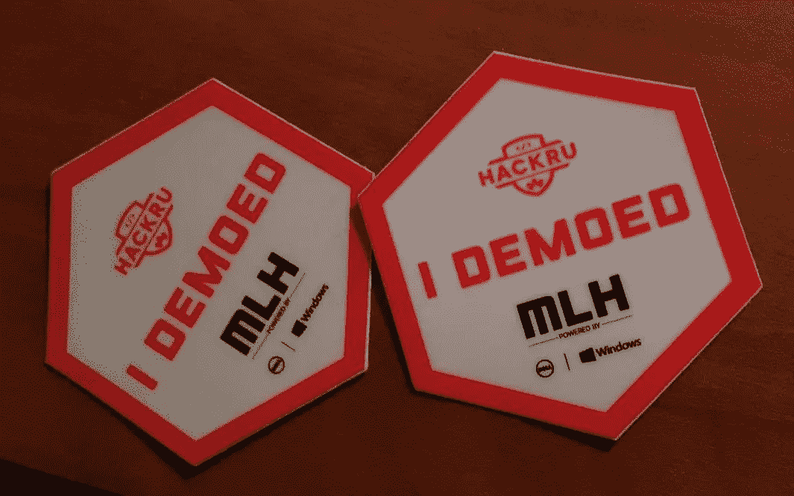

# 毁灭性的:黑客用光了笔记本电脑上的贴纸空间

> 原文：<https://medium.com/hackernoon/devastating-hacker-runs-out-of-space-for-stickers-on-laptop-e7625850d614>

A truly tragic sight: laptop-less stickers.

在上周的一次黑客马拉松中，当地 CS 专业的 Felicia Suarez 发现自己活在一个开发者最糟糕的噩梦中:她的笔记本电脑上没有地方放新的贴纸。

“我刚刚收到了我的第 42 张‘我演示了’MLH 贴纸，我非常兴奋地将它加入我的收藏，”苏亚雷斯回忆道，声音中带着悲伤。“但当我看着我的笔记本电脑时，我意识到它的所有部分——正面、背面和内部外壳——都完全被贴纸贴满了。”她停下来沉默了一会儿。“我考虑过撕下一些旧的贴纸，或者把一张贴纸的一部分盖住，但我不忍心做这样一件可怕的事情。它们是荣誉的徽章，你知道吗？”

在记者发稿时，听到苏亚雷斯痛苦地低声说着“一定要做……”她慢慢地把贴纸往笔记本电脑屏幕上放下。