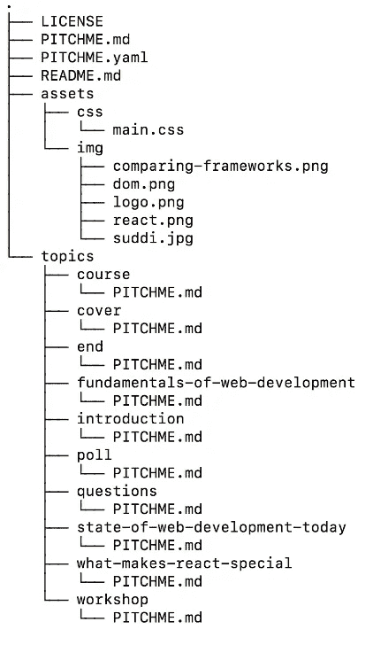

# 使用 GitPitch 和 Fruit Punnets 开发课程和培训材料

> 原文：<https://medium.com/hackernoon/develop-course-and-training-materials-using-fruit-punnets-cf9cfa88040f>

> 关于使用模块化降价和大量浆果更好地接触你的观众的初级读本。

太好了。酸酸的。苦涩。刺鼻。涩。谁不爱新鲜水果？当然，我们都有自己喜欢的。有幸生长在一个热衷园艺的家庭，像覆盆子、草莓、醋栗和红醋栗这样的时令新鲜水果已经成熟，可以采摘了。

但是这些天我个人最喜欢的是เงาะ，或者红毛丹。在东南亚大量生长。


Mouthwatering Rambutan

水果可以是美味的，而且在许多方面令人着迷。但是水果布丁既有趣又贴切……

> 一个 **punnet** 是一个小盒子，用来收集和出售水果和蔬菜，特别是小浆果。


Photo by [William Felker](https://unsplash.com/photos/fqkrXYMosT4?utm_source=unsplash&utm_medium=referral&utm_content=creditCopyText)

如果您正在考虑使用 GitPitch 构建课程或培训材料，那么 fruit punnets 可以提供一些宝贵的经验。

# 令人垂涎的模块化设计很好

如果你阅读任何关于模块化设计的书籍或教程，几乎不可避免地会以这样的语句开头:

> **模块化设计**是一种**设计**方法，将一个系统细分为更小的部分，称为**模块**，可以独立创建，然后在不同的系统中使用。

这当然很有趣。并被公认为良好做法。无论你是[试图为特斯拉 Model 3 制造电池](https://resources.altium.com/pcb-design-blog/how-tesla-rethought-lithium-ion-cells-through-modular-design-and-vertical-integration)，还是以创纪录的时间建造摩天大楼[，但这**几乎不好吃**。](https://www.curbed.com/2017/6/14/15800350/london-modular-dorm-prefab)

然而，当这些相同的想法被映射到使用 GitPitch 的幻灯片演示设计时，事情开始变得**更加有趣**。

# 从内容交付中分离内容

设计良好的课程和培训材料通常需要仔细规划每个概念、主题、章节等的内容。

在可能的情况下，应该保持课程内容和课程内容交付之间的分离，以确保现在和未来的最大灵活性。

水果布丁提供了模块化灵活性的一个很好的例子。如果上面显示的所有浆果都简单地保存在一个大桶里，它会很快变得难以管理。例如，我们如何只提取蓝莓？或者重新排列我们的浆果:覆盆子、蓝莓、黑莓等。

使用水果布丁，选择特定的浆果或浆果组合变得非常容易，按照我们需要的任何顺序。


Photo by [Igor Ovsyannykov](https://unsplash.com/photos/7b5R_0S5a-s?utm_source=unsplash&utm_medium=referral&utm_content=creditCopyText)

# 模块化幻灯片内容和交付

GitPitch 支持[模块化降价](https://github.com/gitpitch/gitpitch/wiki/Modular-Markdown)。这是一个**鼓励和促进**对所有演示内容进行模块化设计的功能。

回顾以上模块化设计的常见定义，我们可以将其重述如下:

> **模块化演示设计**是一种**设计**方法，将任何幻灯片细分为更小的部分，称为**幻灯片**，可以独立创建，然后**在任意数量的幻灯片**中使用。

# 实践中的滑梯

让我把你的注意力转移到 GitPitch 社区，在那里聪明的、有创造力的人们正忙着创造伟大的内容，清楚地展示模块化设计的最佳实践。

例如，这里有一个关于**的很棒的课程，由 [Sudharshan Ravindran](https://github.com/suddi) 创建的 ReactJS** 实用介绍。Suddi 给了我们一个干净的、模块化的展示设计大师班。

[ GitPitch Sample Presentation ] — Click to Focus

作为最终用户，该演示文稿是一个经典的 GitPitch 幻灯片。因此，要理解我为什么如此高度赞扬它，请查看本演示的 Git repo 中的文件和目录结构:



[ GitPitch Presentation ] — Sample Git Repo Directory Structure

简单地浏览一下文件和目录结构，我们就可以看到这个演示是如何使用模块化原则设计的。整体结构被分解成清晰、明确的主题。演示文稿降价也是如此。你自己看吧，就在这里:

[](https://github.com/suddi/intro-to-react) [## 突然/开始反应

### React.js 课程实用介绍幻灯片(https://gitpitch.com/suddi/intro-to-react/master)

github.com](https://github.com/suddi/intro-to-react) 

# GitPitch 托管内容交付

前面我强调了将内容从内容交付中分离出来的重要性。GitPitch 通过提供一个强大的[包含分隔符](https://github.com/gitpitch/gitpitch/wiki/Modular-Markdown)来支持这种方法，它可以在任何顶级`PITCHME.md`中使用。

让我们来看看 Suddi 的顶级`PITCHME.md`中`include`分隔符的用法示例:

```
---?include=topics/cover/PITCHME.md---?include=topics/poll/PITCHME.md---?include=topics/introduction/PITCHME.md---?include=topics/fundamentals-of-web-development/PITCHME.md---?include=topics/state-of-web-development-today/PITCHME.md---?include=topics/what-makes-react-special/PITCHME.md---?include=topics/questions/PITCHME.md---?include=topics/workshop/PITCHME.md---?include=topics/course/PITCHME.md+++?include=topics/questions/PITCHME.md+++?include=topics/end/PITCHME.md
```

正如您所看到的，顶级的`PITCHME.md`完全由使用`include`分隔符注入到演示中的内容组成。你可以把每个`include`语句想象成一个滑梯。每一个都可以很容易地拿起和移动，而不改变底层内容。

因此，如果 Suddi 现在想要更新他的 ReactJs 表示，也许将`workshop`主题移到课程的后面，他需要做的就是**重新安排**他的顶层`PITCHME.md.` **中`include`分隔符的顺序。这将改变内容的交付，而不需要对内容本身做任何改变**。

如果他想使用现有的模块化内容**在 ReactJS 上创建一个新的微型课程**，他只需在同一个存储库中创建一个新的`PITCHME.md`，该存储库只包含微型课程所需主题的子集。

> 您可以使用 GitPitch 在单个 repo 的单个分支中创建无限数量的幻灯片演示。同一分支内的幻灯片可以共享模块化的降价内容和资产，包括图像、徽标和自定义样式。

这些强大功能与 Git 本身的结合使 GitPitch 成为任何开发和交付课程和培训材料的人的一个很好的选择。

# Git 上令人垂涎的演示。* ;-)

如果您正在开发和交付课程或培训材料，并且正在使用 GitPitch，我将非常有兴趣收到您的来信。尤其是关于你想在服务中加入的功能。请在下面的评论区给我留言，或者随时直接通过电子邮件或 [Twitter](https://twitter.com/gitpitch) 联系我。

GitPitch 让你毫不费力地制作和分享关于你所关心的事物的美丽内容。**用它来推销、推销或呈现绝对的任何东西；)**一如既往，我期待看到 GitPitch 社区接下来会创造出什么。

[](https://twitter.com/gitpitch)

**您可以在**[**Medium**](/@gitpitch)**或**[**Twitter**](https://twitter.com/gitpitch)**上关注我，了解 GitPitch 社区的更多新闻、技巧和独特创意。**