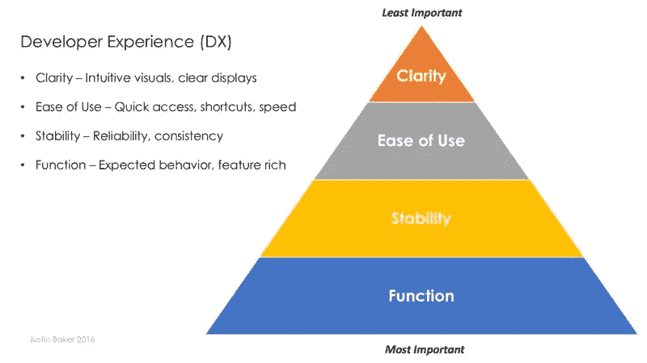

# 开发者体验(DX)——开发者也是人

> 原文：<https://medium.com/hackernoon/developer-experience-dx-devs-are-people-too-6590d6577afe>

## 如何构建开发人员喜欢的软件体验

开发人员被期望使用越来越强大的工具来交付越来越复杂和创新的软件。那么，为什么开发者工具经常感觉像国税局的税单呢？

我认为这源于一种将美学和功能性视为排他的文化，而我认为它们是高度交织在一起的。当软件面向消费者时，我们看到一股旨在培养与用户情感联系的极简优雅的大趋势。但是，当目标用户现在是开发人员时，设计似乎退居功能性之后。

尽管如此，我们还必须认识到，开发人员工具针对的是一个非常特定的用户:开发人员。这些工具通常服务于关键功能，并习惯性地用于非常重要的行动。

对于许多消费者应用程序来说，非工程师理解产品的范围相对容易。让我们以优步为例。UI/UX 团队评估前端环境、社会警告和点对点传输的广泛技术要求。总的来说，他们迎合的是那些想要简单、快捷、可靠服务的消费者。设计团队可以从多年的经验和常识中构建一些关于交通的宽泛的人物角色和假设。

然而，构建一个开发者工具有点不同。开发工具并不一定是为了让工程师的工作变得不那么复杂。它们被用来增强功能性，并允许开发人员做他们以前从未做过的事情。过去，设计师不是开发周期的核心。如果主要目的是功能性..你为什么关注可用性和美学？

“它只需要工作！不好看！”是我过去听说的。这是一个概念，准确地执行一项任务与功能相关，投入正确的输入并获得合理的输出是成功的基准。但是，难道不应该有其他成功的指标吗？节省的时间呢？易用性呢？可扩展性和可靠性如何？做出明智决策的能力如何？我可以向某人展示表格数据的电子表格，或者向他们展示一些信息丰富的图表。两者呈现相同的数据。两者都提供功能。但是，一个人在传递信息和实现其目的方面工作得更好。

# 高级的（deluxe 的简写）

因此，**开发者体验(DX)** 是关于交付稳定、快速、视觉直观的健壮功能。

# 功能

功能绝对至上。开发者工具的好坏取决于它所提供的功能。你不能用美丽的美学或聪明的营销来掩盖低劣的功能。如果效果不好，那就是没效果。

# 稳定性

稳定是信任的基石。DX 的一个重要组成部分是确保正常运行时间和可靠的性能。稳定性也体现在纠正错误以避免严重故障的能力上。没有稳定性，你的产品变得不可靠，使你的‘惊人’功能变得无关紧要。

# 易用性

开发人员讨厌把手从键盘上拿开。鼠标或触控板的每个动作都像是一项艰巨的任务。*易用性*不仅仅意味着该工具易于导航，还意味着你可以快速高效地获取信息。键盘快捷键、表格导航、保存的首选项和直观的搜索/过滤都可以提高开发人员与应用程序交互的速度。然而，*的易用性*也关乎性能。需要几秒钟而不是几毫秒加载的用户界面可能是有用的和令人沮丧的区别。

# 清楚

这一类是最接近审美的。DX 旨在提供直观的界面，呈现关键信息，减少用户错误(例如关于关键任务的确认对话)，并提供对您的定位的可见性(例如通过启示导航)。清晰是指开发人员对一个行为的潜在后果和他们行为的历史(例如审计和分析)。

# 开发者也是人

功能至上并不意味着设计不重要。设计就是有效地向开发者交付功能。你的设计越直观，开发者就越能利用你产品的核心功能。

因此，设计不仅仅是美学——它关乎可用性。对于开发人员来说，这种可用性就是尽可能快速直观地展现功能。

你可能是世界上最有耐心的工程师，但如果你使用的是一个结合了企业级功能和不可用界面的产品，那么你的生活将充满挫折和痛苦。

我们必须记住:**开发人员是重视精心设计的东西的人**。当我们接受 DX 时，我们促进了更强大的开发工具的发展。

*想了解更多关于 DX 的内容，我推荐由 Stephen Boak 和 David Dollar 主持的播客系列“* [*不要让我编码*](http://www.heavybit.com/library/podcasts/dont-make-me-code/) *”。更具体地说，第 5 集讨论了* [*开发者也是人*](http://www.heavybit.com/library/podcasts/dont-make-me-code/ep-5-developers-are-people-too/) *以及对 DX 的相关暗示。*