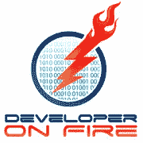

# Developer on Fire 播客评论

> 原文：<https://medium.com/hackernoon/developer-on-fire-podcast-review-46f2bec6b92e>

大多数开发人员在职业生涯的某个阶段都会问自己 5 个关键问题，

1.  我需要学习什么来保持我的技能的相关性？
2.  怎样才能突破到下一个层次？
3.  我如何阻止自己被商品化？
4.  我如何进入下一个“大事件”？
5.  我如何成为一名更好的开发人员？

我开始听播客 [**开发者火了**](http://developeronfire.com/) ，因为我已经缓冲了足够多的特定语言或特定平台的播客。有很多人关注新的玩具，新的宣传或只是促进一个成功的项目。有时你会从一些真正成功的开发者那里得到一些信息来回答一些问题，但你也能走在技术发展的前沿。我需要别的东西。

# 结构

主持人戴夫·雷尔每周挑选一名嘉宾，用一系列结构合理的问题采访他们，比如

*   告诉我们你是如何进入科技行业的，你的背景故事
*   告诉我们你的失败和成功，
*   你认为什么是价值，你如何提供它？

但实际上播客的关键是关于你作为一个开发者如何传递价值。真正有趣的是，该节目的嘉宾来自不同的角色、国家和技术，他们的成功有一些关键的相似之处，也有一些巨大的差异。

# 客人

嘉宾并不专注于某个特定的技术领域，有 John Papa 这样的著名 JavaScript 开发人员，Troy Hunt 这样的技术专家，函数式语言极客，铁杆企业 C#开发人员。来自整个软件开发领域的人。

所有的嘉宾**都分享了某种成功，**无论是在他们的职业生涯中参与重大项目或团队，还是成为行业中的"**知名人物**。

# 突出

*   [第 1 集——John Sonmez，如何将自己推销为一名软件开发人员](http://developeronfire.com/episode-001-john-sonmez-simple-programmer)
*   [第 154 集——科里·豪斯——擅长某事](http://developeronfire.com/episode-154-cory-house-life-the-universe-and-everything)
*   [第 145 集——红隼布莱克摩尔——进入管理层](http://developeronfire.com/episode-145-kestrel-blackmore-force-multiplier)
*   [第 156 集大卫·尼尔——当经理却不想当](http://developeronfire.com/episode-156-david-neal-bacon-driven-drawing)
*   [第 141 集——约翰爸爸——真正的职业建议](http://developeronfire.com/episode-141-john-papa-family-and-foresight)
*   [第 128 集——凯文·奥肖内西——采用新技术(或不采用新技术)](http://developeronfire.com/episode-128-kevin-o-shaughnessy-dedicated-to-learning)
*   [第 121 集——TJ 万托尔——社区参与](http://developeronfire.com/episode-121-tj-vantoll-community-engagement)
*   [第 110 集——瑞秋·里斯——函数式编程和母性](http://developeronfire.com/episode-110-rachel-reese-community,-motherhood,-and-functional)
*   [第 30 集— DHH —停止过度复杂的要求](http://developeronfire.com/episode-030-david-heinemeier-hansson-the-pareto-principle-and-stoic-philosophy)

# 外卖食品

我听说很多开发人员，尤其是在他们职业生涯的早期，试图弄清楚如何让自己与众不同。有很多关于这个主题的精彩剧集，信息非常清楚— ***专攻*** 。

我也听说人们真的很崇拜业内的名人，并问他们是如何成为其中一员的。我想说播客在讲述真实故事方面很棒。听听斯科特·汉瑟曼的这一集，你会了解到这是一项毕生的工作。我鼓励人们不要寻求知名度或宣传，然后希望机会会因此而出现，而是专注于你提供的价值，不要害怕积极地推销自己。当你为真实的人解决真实的问题时，机会就会向你敞开。

Developer on Fire 对我来说是一个每周都可以听的很棒的播客。每一集我都会学到一些新东西，我不会跳过几集，因为我已经知道他们谈论的项目或技术。发现是什么让人们成功，是什么让他们变得伟大，以及他们在这个过程中学到了什么，这是令人谦卑的，有启发性的和有趣的。

哦，我在拍即将播出的一集，我昨天和戴夫一起录的。[http://developer fire . com/podcast/episode-167-Anthony-shaw-创新与灵感](http://developeronfire.com/podcast/episode-167-anthony-shaw-innovation-and-inspiration)

> [黑客中午](http://bit.ly/Hackernoon)是黑客如何开始他们的下午。我们是 [@AMI](http://bit.ly/atAMIatAMI) 家庭的一员。我们现在[接受投稿](http://bit.ly/hackernoonsubmission)，并乐意[讨论广告&赞助](mailto:partners@amipublications.com)机会。
> 
> 要了解更多信息，请[阅读我们的“关于”页面](https://goo.gl/4ofytp)、[在脸书上点赞/给我们发消息](http://bit.ly/HackernoonFB)，或者简单地说， [tweet/DM @HackerNoon。](https://goo.gl/k7XYbx)
> 
> 如果你喜欢这个故事，我们推荐你阅读我们的[最新科技故事](http://bit.ly/hackernoonlatestt)和[趋势科技故事](https://hackernoon.com/trending)。直到下一次，不要把世界的现实想当然！