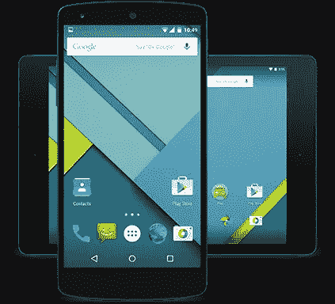
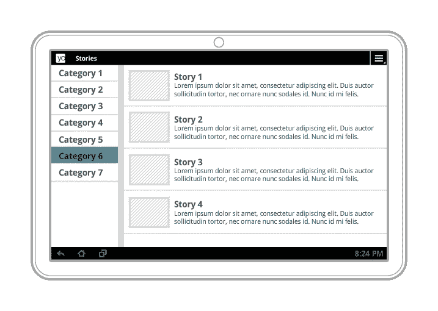
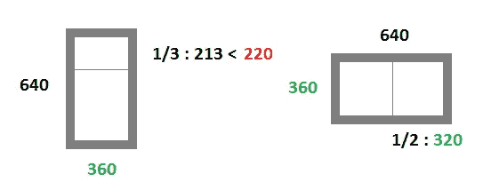

# 开发人员就绪规范(第 1 部分)

> 原文：<https://medium.com/hackernoon/developer-ready-specifications-part-1-1b80acb23e52>

作为一名开发人员，我想象你已经满足了 **UI 规范**太过**模糊**或者不符合 Android 指导方针导致你与设计师**无用的来回**。如何限制这些来回？如何确保 UI 规范为开发做好准备？在这篇文章中，我给出了一些需要记住的要点，在第二篇文章中，我将提出一个“准备好”的清单。

## 1)您是否知道目标设备:智能手机、平板电脑还是两者都有？

大多数应用程序针对智能手机和平板电脑，但有些应用程序只针对一种设备。

美国统计——10 大智能手机，10 大平板电脑:仅智能手机和平板电脑上都存在的应用程序(在同一个包名下)

**智能手机用途**:手机，一周中的白天，专属，老少皆宜

仅智能手机应用程序示例:正在运行的应用程序

**平板用途**:久坐和晚上(沙发冲浪)，不专属，年龄较大

仅限平板电脑的应用程序示例:一款面向企业的店内支付应用程序

## 2)您知道 Android 为轻松管理智能手机和平板电脑带来的可能性吗？

目录限定符允许实现智能手机和平板电脑的特定布局。

**多窗格布局**，以片段形式出现，允许在同一个屏幕上组合多个智能手机屏幕(例如:横向模式下的列表-细节屏幕)。

## 3)你是处于反应性还是适应性的角度？

**响应**:设备上的简单布局变化

**自适应**:专为平板电脑或智能手机设计的屏幕

您是否在努力优化您的产品，使其更适合相关设备(智能手机/平板电脑)的使用？你有更大的视野，你对一个简单的布局调整感到满意吗？

## 4)你有 UI 章程吗？它在 Android 指南中是如何定位的？

UI 章程(图形和人体工程学)允许在应用程序中整合 UI 规则，以保持视觉一致性和可用性。

**指南**基于**材料设计**，推荐使用 Android UI 组件以保持平台一致性等。

这并不意味着你必须在应用程序的所有方面都遵循它们。很明显，你可以做一些**自由**，但是在平台一致性(对可用性和吸引力的影响)方面，整体不能太过分。

你能找出并证明每一个**差距**吗，然后根据 Android 指南评估它们对应用程序全球一致性的影响？

## 5)您是否已经框定了要支持的屏幕配置(最小 dp 屏幕尺寸和方向)？

dp 是一个独立于**屏幕密度**的测量单位**，因此或多或少对应于设备的物理尺寸。那么，一种 dp 方法比使用分辨率、密度或以英寸为单位的屏幕尺寸更有意思。**

覆盖绝大多数 Android 智能手机的最小 dp 尺寸为**320 x480 DP**T6(1)和 **480x800 dp** 平板电脑 *(2)* 。

而且，你还得加上从安卓牛轧糖开始的**多窗口**模式支持。没有必要在每一个屏幕上都允许它:有兴趣在另一个应用程序上使用你的屏幕吗？app 之间有可共享的元素吗？

官方建议是 220x220 dp，以支持两种标准布局分割:1/3–2/3 纵向和 1/2–1/2 横向，以及在更大设备上使用的自由模式(平板电脑和 Chromebooks)。如果我们只针对智能手机，我们可以减少限制。基于 360x640 dp 的目标(最小尺寸覆盖大多数 Android N 兼容设备 *(3)* )，我们可以在纵向上实现最小 360x220 dp，在横向上实现最小 320 x360 DP*(4)*。

景观模式就是评价好。主要用在平板电脑上，在智能手机上用的不多。

***搜索 gsmarena(2017 年 2 月)***

*(1)智能手机:
-对于 API > = 15 的 HVGA (320x480)，有 139 个 mdpi 设备(140–200 PPI)因此 320x480 dp 和仅 6 个密度> mdpi
-对于 API > = 15 的 WVGA (480x800)，有 415 个 hdpi 设备(200–280 PPI)因此 320x533 dp 和仅*

*(2)平板电脑:
-在 HD (720x1280 dp)和 API > = 15 的 FHD (1080x1920 dp)之间，有 43 个 hdpi 设备(200–280 PPI)，一般最小尺寸为 533x853 dp*

*(3) Android N 智能手机:
-对于 HD (720x1280)，有 12 个 xhdpi 设备(280–400 PPI)所以 360x640 dp
-对于 FHD (1080x1920)，有 33 个 xxhdpi 设备(400–560 PPI)所以 360x640 dp 太
-对于 QHD (1440x2560)，有 18 个 xxxhdpi 设备(【t55*

*(4)兼容 Android N 的智能手机最小尺寸为 360x640 dp，以支持多窗口模式:*

*图片谷歌 CC 2.5*

***安卓开发者在*【jacquesgiraudel.com】**

******

> *[黑客中午](http://bit.ly/Hackernoon)是黑客如何开始他们的下午。我们是 [@AMI](http://bit.ly/atAMIatAMI) 家庭的一员。我们现在[接受投稿](http://bit.ly/hackernoonsubmission)，并乐意[讨论广告&赞助](mailto:partners@amipublications.com)机会。*
> 
> *如果你喜欢这个故事，我们推荐你阅读我们的[最新科技故事](http://bit.ly/hackernoonlatestt)和[趋势科技故事](https://hackernoon.com/trending)。直到下一次，不要把世界的现实想当然！*

**