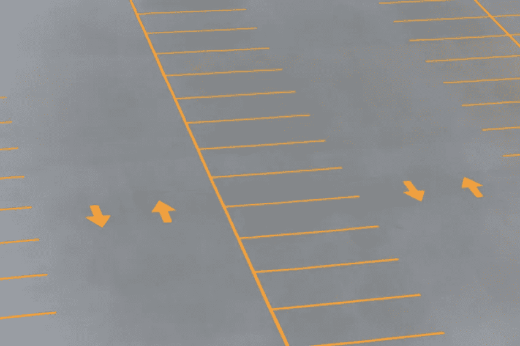

# 开发人员就绪的 UI 规范(第 2 部分)

> 原文：<https://medium.com/hackernoon/developer-ready-ui-specifications-part-2-c710ebc4f403>

在第一部分中，我让你回想起一些评估 UI 规范的要点(在开发开始后，**避免与**设计师**来回**)。

在这一部分，我进一步列出了反复出现的问题，并提出了一个检查表来评估一个规范的详尽性(对应于 Scrum 中 ready 的**定义)。**

# 反复出现的问题

我区分了 4 组问题:对 Android 平台的了解，缺乏全球一致性，不完整的规范和糟糕的沟通。

出于实用主义，我按检查顺序列出这些问题。

用户界面规范

*   该规范不尊重**应用章程**，没有**全局一致性**
*   规范不尊重 **Android 指南**(风格、结构、组件、空间、尺寸等。)
*   该规范没有充分利用平台(例如:多窗格、多窗口等。)
*   该规格不适用于**小型或大型屏幕**(分辨率*密度)
*   该规范没有指出**针对的是哪组尺寸**
*   该规范仅涉及**主流程**，缺少**次流程**(子屏幕、对话框、消息(警告、错误))
*   说明书没有给出所有的**细节**:尺寸(边距、填充、字体、字体大小、块大小)、动画规格
*   使用的单位是**误导**(不知道，不是安卓工作的那个)

多媒体材料

*   收到的材料与规格不符
*   考虑到通过编程可能做到的事情(例如:渐变、闪屏包括其背景与仅标志居中(无用的背景重绘))，材料没有**优化**(无用的文件、重量、性能)
*   输送的物料太大或**质量**不够
*   图形材料不以不同的 **Android 密度**交付
*   材料不是直接可用的**(Android 无效名称、未给出密度目录、同类图形材料之间的填充/框架间隙等)。)**

**其他人**

*   **当 **演化**的**风险已知时，在一个规范上所做的结构化工作很快就受到质疑****
*   **规格无法在**合理时间**内实现**
*   **对于屏幕演进，规范不是最新的**(未考虑已通过的演进/折衷)****

# ****准备好了吗****

********

****列出这些问题，我们必须逐一解决它们，以确定适当的检查。为此，我提出了一个基于 Ready 模型的 Scrum **定义的检查表。******

****[*简短定义*](https://www.scruminc.com/definition-of-ready/)*:Ready 的定义是故事必须是立即可操作的。*****

*******警告*** *:这个列表是一个建议，根据你的工作环境，可能太详细/不够详细，我建议你优先考虑，从短开始，然后逐步改进。*****

****现成规范的检查表:****

****用户界面规范****

*   ****规范**尊重**应用程序章程**如果存在，则存在全球一致性******
*   ****该规范尊重 Android **指南**并充分利用平台的优势，否则:选择是合理的****
*   ****规格包括最小和最大尺寸->覆盖的装置**已在**之前**定义****:DP 中的最小和最大尺寸(见第一部分)******
*   ****规范定义了主要流程和次要流程(子屏幕、对话、消息(警告、错误)等)。)****
*   ****该规范给出了所有的**细节**:尺寸(边距、填充、字体、字体大小、块大小)、动画规范****
*   ****使用的单位是 Android 工作单位(dp 表示空间和尺寸，em 表示内部字母，sp 或 dp 表示字体等。)****

****多媒体材料****

*   ****这种材料符合规格****
*   ****交付时没有易于通过编程再现的**材料:
    *简单的形状
    *在应用程序中以不同颜色显示的单色图像(例如图标)
    *易于通过简单变换另一个图像获得的图像(仅加载重复旋转的箭头图像)
    *带有无用空间的图像(对于具有 9 个补丁文件的部分可再现)******
*   ****材料经过**优化**(考虑用途的适当尺寸、考虑用途的良好质量/重量折衷、质量无差异的最佳格式(重量/装载时间折衷))(1)****
*   ****图像以不同的 Android 密度格式传送:(ldpi)、mdpi、hdpi、xhdpi、xxhdpi 等****
*   ****交付的材料是直接**可用的**(Android-有效名称(无空格或大写)，提供密度目录，同一类别的图像之间没有外部边距/框架间隙(例如:抽屉图标等)。))****
*   ****规范的易失性是**表示**(或者在特性描述中表示) :稳定，即将改变等。****

****其他人****

*   ****规范在合理的时间内是可实现的(例如复杂的动画)****
*   ****已经完成了开发者**审查**(Android 指南、可行性……)****
*   ****对于屏幕更新，过去指定的和真正开发的之间的差距已被审查****

****(1):对于小图像:webp > png(如果 minSdk > 18)、svg(有限支持)、字体图标****

# ****使自动化****

********

****为了便于获得这些工作习惯，一些工具想法:****

*   ****将功能和技术流程中的步骤具体化(**使其成为必须做的事情******
*   ****一个**打印出来的文件**为准备好的定义****
*   ****应用章程****
*   ****“**备忘单**格式的应用章程****
*   ****一份 Android 指南“备忘单”****
*   ****重命名**脚本******
*   ****多媒体材料的验证脚本:重量、尺寸、格式(例如，取决于由其前缀标识的文件类型:例如，图标 ic_x 必须为 20x20，并且为 webp 格式)****
*   ****这款手表由安卓平台的设计师更新****

****在这篇文章中，我已经提醒过你与 UI 规范相关的**重复出现的问题**。****

****一点一点地，我已经提出了检查来解决它们，最后为了**简化过程**，自动化它们的工具。****

*******安卓开发者在***[***jacquesgiraudel.com***](http://jacquesgiraudel.com)****

************************

> ****[黑客中午](http://bit.ly/Hackernoon)是黑客如何开始他们的下午。我们是阿美族家庭的一员。我们现在[接受投稿](http://bit.ly/hackernoonsubmission)并乐意[讨论广告&赞助](mailto:partners@amipublications.com)机会。****
> 
> ****如果你喜欢这个故事，我们推荐你阅读我们的[最新科技故事](http://bit.ly/hackernoonlatestt)和[趋势科技故事](https://hackernoon.com/trending)。直到下一次，不要把世界的现实想当然！****

********