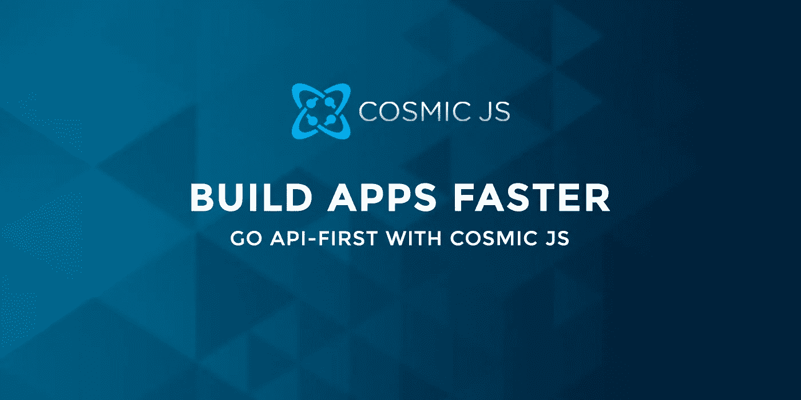

# 开发者聚焦:Abe Hendricks

> 原文：<https://medium.com/hackernoon/developer-spotlight-abe-hendricks-1074aa359007>

另一位开发者英雄加入了我们的新一期 [Cosmic JS](https://cosmicjs.com/) 开发者聚焦系列。我们采访了 Abe Hendricks，他是加州一家政府机构的混合开发者/交互经理/内容编辑。在 [GitHub](https://github.com/pcwa-ahendricks) 上查看他，并享受问答

**你开发软件有多久了？**

我建立网站和单页应用程序已经有一年多了。在此之前，大多数开发都是以数据库开发、商业智能和一些用于任务自动化的基本服务器端脚本的形式进行的。

**您首选的开发堆栈是什么？**

目前我在一家中型地方/地区政府机构工作。长期目标是将任何定制开发保持在一个紧凑的堆栈中。我们试图不去选择无数不同的技术和工具，它们有不同的生命周期和不同的路径。我目前尝试使用 Angular 在前端做尽可能多的开发。对于服务器，我们也使用 JavaScript / Typescript，借助 Express 等框架来填补空白。(如果我是一名自由开发者，我肯定我的方法会有所不同)。当我需要像数据库这样的东西时，我倾向于 Firebase，它非常适合 Angular。

**过去有哪些项目是你最引以为豪的，为什么？**

我很难对任何特定的项目幸灾乐祸。我对自己学习新框架、工具等的速度感到满意。并且能够使用这些新工具进行开发和部署。实际上，我开发应用程序的数量和速度给我留下了更深刻的印象，而不是它们的质量(微笑表情符号)。但讽刺的是，现在我写了这个，我一点也不为此感到骄傲(悲伤表情符号)。

**多谈谈你在你的世界和垂直领域构建应用的流程。Cosmic JS 如何加快了您的项目交付期限的上市时间？**

Cosmic 完全符合我们的组织和需求。在 [Cosmic JS](https://cosmicjs.com/) 之前，我们使用一个流行的博客/ CMS 平台来管理内容，以最简单的方式实现和使用。然而，最终的结果总是感觉尴尬，我会说“梨形”在一个好的一天。试图向非技术人员解释他们需要向 WordPress 添加内容，而同时你告诉他们我们并没有真正使用 WordPress，这对我来说根本没有意义，更不用说他们了。当[宇宙 JS](https://cosmicjs.com/) 出现时，它真的震撼了一些我们一开始不想穿的袜子。Cosmic 的 API-first CMS 正是我们一直以来所需要的。展望未来，Cosmic JS 将允许并使我们组织中的许多个人能够构建我们的应用程序。

**你对目前正在使用的技术感到兴奋，或者想了解更多？**

我觉得我总是在学习，所以开始一点也不兴奋了。(谢谢 JavaScript 社区)。但就我目前在公司的角色性质而言，我每天都要扮演几个不同的角色。我不仅仅是开发者，我还是内容编辑和设计者。在过去的一年中，我已经戴上了开发人员的帽子。在不久的将来，我希望花更多的时间使用 Cosmic JS 来为我们现有的应用程序添加内容，并花更多的时间在草图设计上创造性地工作。我的意思是，如果 JavaScript 没有任何 HTML 或 CSS 伙伴，那它还有什么意义呢？

有点相关:我渴望看到某些项目，如 Angular 的 Material2，在接下来的一年中如何发展和成熟。此外，我希望用 Ionic 框架开发一两个本地应用。

**宇宙 JS 开发者聚焦系列**

[开发者聚焦:布莱恩·穆利斯](https://cosmicjs.com/blog/developer-spotlight-brian-mullis)
[开发者聚焦:弥迦·沃尔特](https://cosmicjs.com/blog/developer-spotlight-micah-walter)
[开发者聚焦:乔·图森](https://cosmicjs.com/blog/developer-spotlight-joe-tuson)
[开发者聚焦:编码道场](https://cosmicjs.com/blog/developer-spotlight-coding-dojo)
[开发者聚焦:简单媒体](https://cosmicjs.com/blog/developer-spotlight-simple-media)
[开发者聚焦:乔恩·卡尔法延](https://cosmicjs.com/blog/developer-spotlight-jon-kalfayan)[开发者聚焦:乔恩·布鲁默](https://cosmicjs.com/blog/developer-spotlight-jon-bloomer)

Cosmic JS 是一个 API 第一的基于云的内容管理平台，使管理应用程序和内容变得容易。如果您对 [Cosmic JS API](https://cosmicjs.com/) 有任何疑问，请通过 [Twitter](https://twitter.com/cosmic_js) 联系我们，或者加入 [Slack](https://cosmicjs.com/community) 上的社区。

> [黑客中午](http://bit.ly/Hackernoon)是黑客如何开始他们的下午。我们是 [@AMI](http://bit.ly/atAMIatAMI) 家庭的一员。我们现在[接受投稿](http://bit.ly/hackernoonsubmission)并乐意[讨论广告&赞助](mailto:partners@amipublications.com)机会。
> 
> 如果你喜欢这个故事，我们推荐你阅读我们的[最新科技故事](http://bit.ly/hackernoonlatestt)和[趋势科技故事](https://hackernoon.com/trending)。直到下一次，不要把世界的现实想当然！

