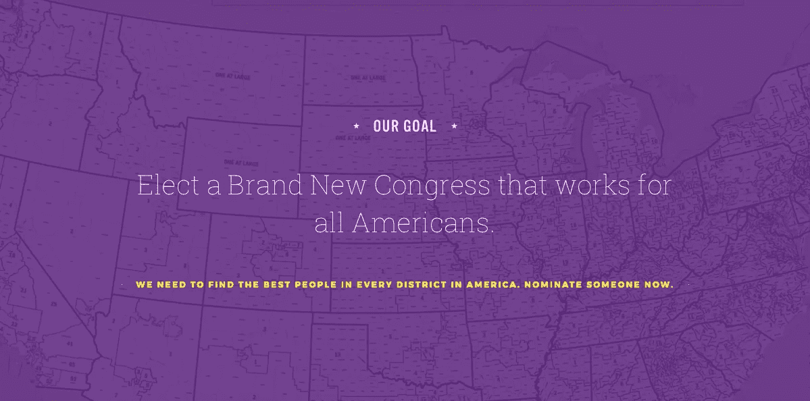

# 开发者聚焦:本·帕克

> 原文：<https://medium.com/hackernoon/developer-spotlight-ben-packer-6534a9627561>

在这次[Cosmic JS](https://cosmicjs.com/)Developer spot light 中，我们采访了 web 开发人员 Ben Packer，他专注于自然语言处理，之后将自己的才华转向了非盈利项目的 web 开发。本担任[全新国会](https://brandnewcongress.org/)的技术总监，该计划旨在选举 535 名新国会议员。在 [Twitter](https://twitter.com/ben_pr_packer) 或 [LinkedIn](https://www.linkedin.com/in/benpaulryanpacker/) 上查看他，并享受问答环节

**你开发软件有多久了？**
我现在编程已经 4 年了，但是大学毕业才脱产专业 3 个月。我什么都做过一点，之前专注于自然语言处理，后来转向了 web 开发。

**您首选的开发堆栈是什么？我用过很多 MERN (MongoDB，Express，React，Node)，但最近换成了 Elixir + Phoenix + Postgres，这是我所有基于宇宙的开发都用的。尽管宇宙 JS 名称中有 JS，但由于其内置的内存存储解决方案，称为“ets”(Erlang Term Storage)，Elixir 非常适合。这与 Cosmic 的 web-hooks 相结合，让我可以非常快速地从缓存中提供基于 Cosmic 的页面，而无需管理单独的外部 Redis 或 Memcached 实例。你可以在这里找到我们的药剂宇宙包装器和缓存解决方案[。](https://github.com/BrandNewCongress/cosmic_ex)**

**过去有哪些项目是你最引以为豪的，为什么？** 我与[全新的国会](https://brandnewcongress.org/)和[正义民主党](https://justicedemocrats.com/)一起工作，建立了有效运行大规模现代基层政治运动所需的工具。我感到非常幸运，因为我可以专注于全职做这项政治工作，而不是像许多开发人员那样自愿分割我的空间。在与全新的国会和正义民主党合作之前，我开发了一个名为 [assemble](https://github.com/ben-pr-p/assemble) 的开源在线会议平台，它使用 WebRTC 技术将物理会议中常见的分组讨论体验带到您的浏览器中。

**多谈谈你构建应用的过程。为政治或思想原因构建应用程序与其他客户端工作有何不同？**
我也很高兴我能够在附带 A-GPL 许可的情况下公开开发所有这些解决方案。一旦我们的工具成熟并准备好重新利用，我们将为其他组织和未来的竞选活动降低运行基层政治活动的成本，这些组织和竞选活动将能够以传统竞选软件服务的一小部分成本自行托管我们开发的内容。

**您对目前正在使用的哪些技术感到兴奋，或者想了解更多？** Cosmic 让我能够更轻松地让我们组织的非编程部门配置我制作的软件，并编辑我们网站上的内容。我们对它的使用已经从一个 CMS 发展到一个通用的管理界面——我们用它来管理一个 URL shorter,作为内部工具的用户白名单，指定变化的 webhooks，等等。有了 Cosmic，在我认识到我们网站或流程的某个特定组件需要更改后，我可以实现一种机制，在几分钟内编辑或配置该组件。

我不认为出于政治原因的发展与更典型的发展有太大的不同——我们行动迅速，有时会出问题，等等。不同的是，我们有志愿者贡献他们自己的时间和/或专业知识。如果你有使用 Elixir、React、Node.js 或建立基于 AWS 的工作流的经验，并且你想帮助选出一个由支持全民医疗保险、对我们的基础设施和可再生能源进行大规模投资并拒绝接受公司资金的个人组成的国会，请给我发电子邮件到[ben@justicedemocrats.com](mailto:ben@justicedemocrats.com)，我们会找到为你提供帮助的最佳方式。

我们的内部工具是使用 React，Ant 构建的。设计(一个 React UI 工具包)，并通过 Phoenix Channels (websockets)与我们的服务器通信，创建一个敏捷的用户体验。工作人员和志愿者最终将花费大量时间在这些工具上，联系我们的支持者，管理活动等。因此，它们必须是高性能的，尽可能少的棘手问题，这一点很重要。

对于我们面向世界的网站，我想尽可能多地把新的网络带入政治空间。我们鼓励支持者做的很多事情都是集体行动的问题——个体无效，但集体有力量，一个人相信你们都在和别人一起工作，这给了你尝试的信心。然而，人们也过度劳累，并对未来感到担忧，不仅包括我们政治制度的未来，还包括他们未来的两个星期。

所以，我希望在接下来的几个月里，我们能够设计出一些体验，不仅能激发集体政治行动中的参与感和归属感，还能在你坐公交车、用你朋友的旧安卓手机上网时提供这些体验。

要了解如何向 [Cosmic JS 社区](https://cosmicjs.com/community)贡献应用、文章和扩展，请联系 support@cosmicjs.com[的我们](mailto:support@cosmicjs.com)。