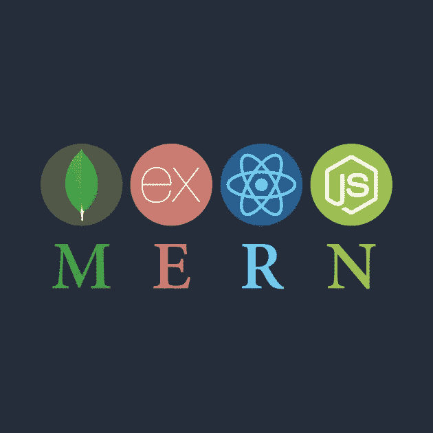
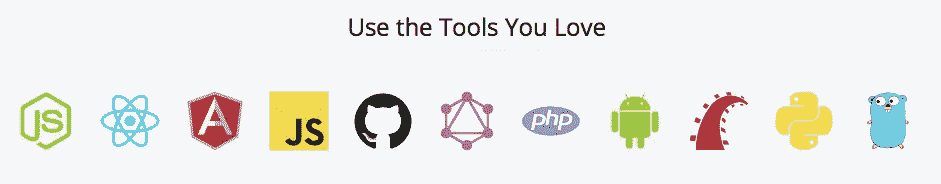

# 开发者聚焦:Yew Wee Chua

> 原文：<https://medium.com/hackernoon/developer-spotlight-yew-wee-chua-e12855b8f40c>

在这次 [Cosmic JS](https://cosmicjs.com/) 开发者聚焦中，我们采访了[第二风能国](http://www.secondwindnation.com/)的首席技术官 Yew Wee Chua，他的团队在过去几年中主要专注于数据分析和网络开发。他们目前正在为具有特定关注领域的内容编辑团队构建内容驱动的应用程序，以便为整个出版网站贡献内容。阅读[第二风国案例研究](https://cosmicjs.com/case-studies/second-wind-nation)。在 [Twitter](https://twitter.com/weewey_) 或 [LinkedIn](https://www.linkedin.com/in/yew-wee-chua-7a987495/) 上查看你的资料，并享受问答环节。

 [## 二风国度|宇宙 JS

### Cosmic JS 是一个云托管的内容平台，提供了一个灵活而直观的 CMS API。建立网站和…

cosmicjs.com](https://cosmicjs.com/case-studies/second-wind-nation) 

**1。你开发软件有多久了？** 我和我的团队已经开发软件 2-3 年了。我们的背景主要是数据分析和网络开发。

**2。你的首选开发栈是什么？** MERN。MERN 代表 Mongo DB，Express.js，React 和 Node.js。要查看所有 Cosmic JS 可以很好地使用和支持的工具，请查看 [Cosmic JS 知识库](https://cosmicjs.com/knowledge-base)。

**3。过去有哪些项目是你最引以为豪的，为什么？** 为一家大型矿业公司构建基于 web 的搜索应用程序。我们在两周内开发并投入生产。此外，它还有一些很酷的功能，比如基于用户搜索历史的推荐引擎。我很自豪，因为我们只有两周的时间来制作它。

**4。多谈谈你构建应用程序的过程。Cosmic JS 如何加快了您的项目交付期限的上市时间？我们通常使用敏捷 scrum 方法工作，从业务中获取软件需求，对产品积压的特性进行优先级排序，冲刺计划等等。Cosmic JS 让我们不再担心后端 CMS，现在我们将更多的时间花在构建前端和部署应用程序上。**

以前我们使用 WordPress。WordPress 是有限制的，因为每当我们需要在应用程序中添加新功能时，我们都需要添加额外的插件，这导致了应用程序的笨拙。因此，我们离开了 WordPress，找到了 Cosmic JS 作为我们的无头 CMS 解决方案。

**5。你对目前正在使用的技术感到兴奋，或者想了解更多？** 我们希望了解更多关于应用程序容器化的知识，并在云上持续部署容器化的应用程序。

> “Cosmic JS 使我们能够更快地进入市场。我们成功构建了一个概念验证，并在一周内完成了部署，这要归功于为我们的编辑器提供的记录完善的 API 和易于使用的用户界面。”—红豆杉

要了解如何向 support@cosmicjs.com[的](mailto:support@cosmicjs.com)[宇宙 JS 社区](https://cosmicjs.com/community)贡献应用、文章和扩展，请联系我们。