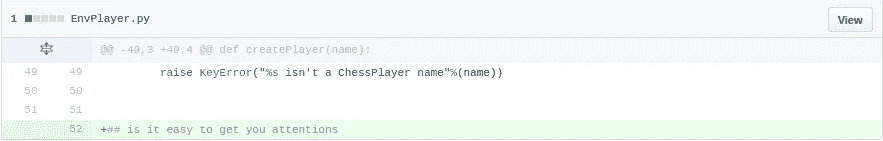
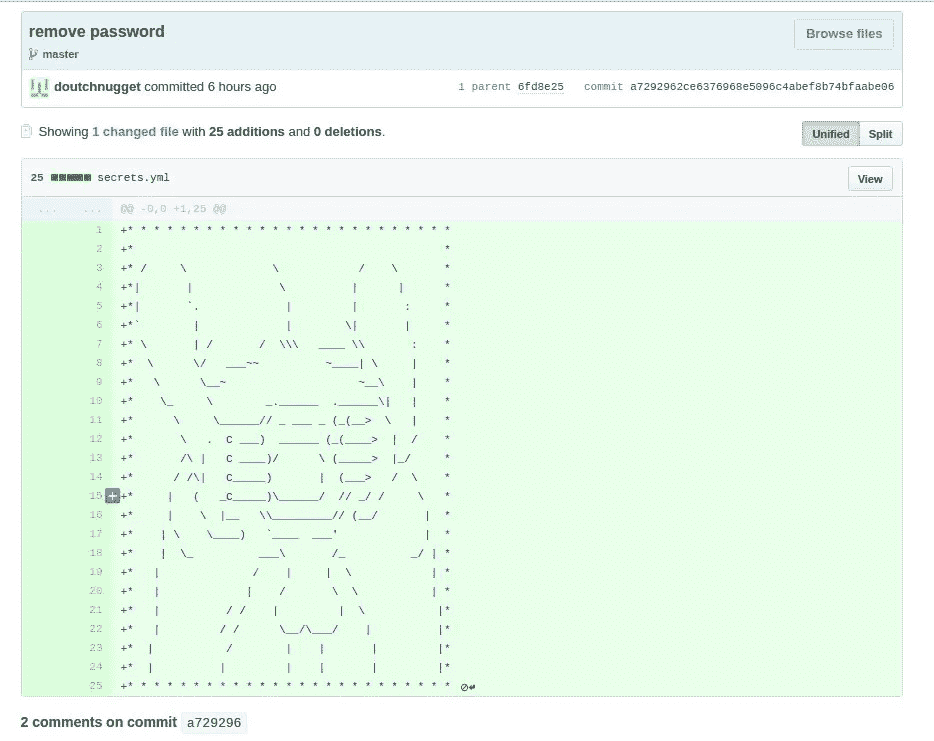
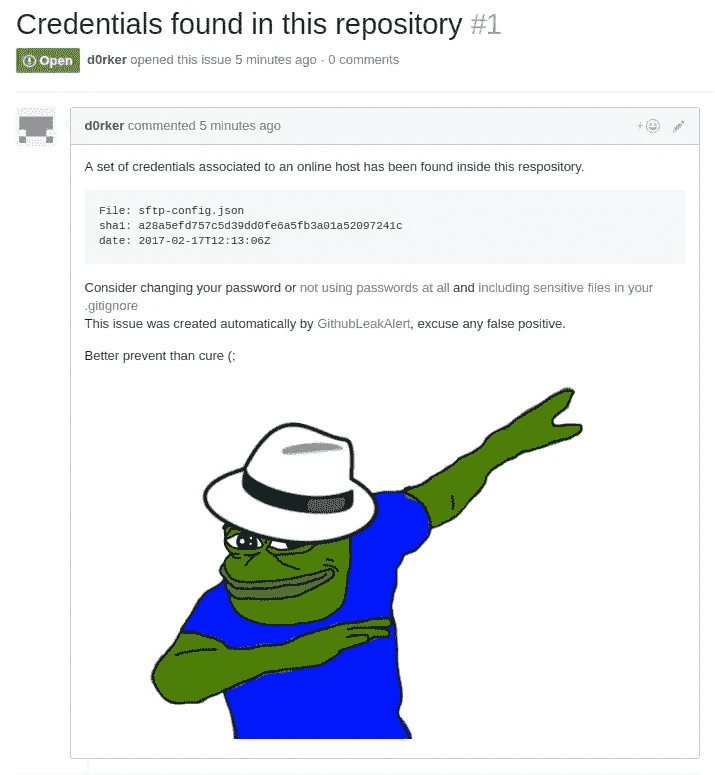

# 开发者不知不觉地在网上发布了他们的证书。我选择警告他们，而不是攻击他们

> 原文：<https://medium.com/hackernoon/developers-are-unknowingly-posting-their-credentials-online-caa7626a6f84>

最近我开始玩 GitHub 呆子，问自己黑帽黑客如何在大规模攻击中利用这些。

> Dorking 是一个术语，指的是应用先进的搜索技术和专门的搜索引擎参数来发现公司和个人的机密信息的做法，这些信息在普通的[网络搜索中通常不会出现。](http://www.webopedia.com/quick_ref/Internet_Search_Engines.asp)

很快就清楚了，在 GitHub 上找东西变得更难了，因为程序员(:

以下是我在搜索所有名为“删除密码”的提交时发现的一些例子

It’s easy to get your attention

ASCII Goatse

好吧，这些提交中有很多噪声。当然，您可以找到一些凭证，但是很难通过编程过滤掉所有的干扰。查找凭据的更好方法是在特定文件中搜索特定字符串。

我选择覆盖 sftp-config.json 文件，这是 sftp 插件用于 Sublime text 的文件。这个插件帮助开发者管理文件传输，可以和 SSH 一起使用。

所以让我们在 GitHub 上搜索**文件名:sftp-config.json 密码**

那更好，我们得到一些新出版的。下一步是实现自动化。幸运的是，GitHub API 提供了我所需要的一切。

我迭代了所有的提交，并且只保留结果，如果

*   这是今年做出的承诺
*   该文件包含密码、登录名和主机(放弃使用 ssh 密钥而不是密码的人……)
*   主机还活着(ping)

我得到了 121 个结果，请记住这只是针对 2 个月内的特定文件，还有很多其他的傻瓜。在我的数据库中是这样的:

Is that a security company? :’ )

现在是时候换帽子了，因为法律上不允许我尝试连接到这些服务器。所以我想我应该警告他们。GitHub API 使得在存储库上创建问题变得很容易，所以这就是我所做的。它看起来是这样的:

You’ve been visited by white-hat pepe

有趣的是，在 GitHub 上发布我的代码时，我自己也发布了我的 GitHub API 令牌…哎呀。

但在那之后不久，我收到了 GitHub 发来的邮件:

> 我们注意到您的一个有效 OAuth 访问令牌被提交给了一个公共 GitHub 存储库。公开披露一个有效的访问令牌将允许其他人代表你与 GitHub 进行交互，从而有可能改变数据、你的联系信息和账单数据。
> 
> 作为预防措施，我们已经撤销了 OAuth 令牌。为了继续使用 OAuth 向 GitHub 进行身份验证，需要生成一个新的令牌。

很好…所以他们已经在这么做了，但只是针对 GitHub 令牌，因为他们有权力撤销它们。

在我写这篇文章的时候，我刚刚发现了 https://gitleaks.com/，这是一个让寻找证书变得更加容易的网站。只需输入“ssh”、“aws”等，你就能找到你想要的。好像以前 gitleak 暂停了，他们刚刚恢复服务。[在这篇关于它的文章中你可以读到](https://hackernoon.com/we-are-resuming-gitleaks-com-d93cf73824e3#.ncesuzj02)

> HN 论坛上的一些人建议我们应该通知用户一个密钥被泄露了。我们不可能通知数百万用户而不因为滥用而被禁止使用 GitHub。

虽然我同意这对于一个人来说是不可行的，但我认为这可以通过社区的努力来实现。如果社区可以通过使用一个公共数据库来跟踪所做的工作，那么每个人都可以运行这个工具，并且一次只产生很少的问题。当然，这并不是那么容易实现的。GitLeaks 还提供了一项服务，可以检查你自己的 GitHub 账户是否存在这种漏洞。这是一个好主意，但它再次依赖于开发商采取行动。也许更好的服务是像 GitHub 那样主动监控用户帐户的令牌。但是对于免费服务来说，这要求太多了…

请随意[在 GitHub 上分叉我的项目](https://github.com/misterch0c/GithubLeakAlert)

> [黑客中午](http://bit.ly/Hackernoon)是黑客如何开始他们的下午。我们是 [@AMI](http://bit.ly/atAMIatAMI) 家庭的一员。我们现在[接受投稿](http://bit.ly/hackernoonsubmission)并乐意[讨论广告&赞助](mailto:partners@amipublications.com)机会。
> 
> 如果你喜欢这个故事，我们推荐你阅读我们的[最新科技故事](http://bit.ly/hackernoonlatestt)和[趋势科技故事](https://hackernoon.com/trending)。直到下一次，不要把世界的现实想当然！

