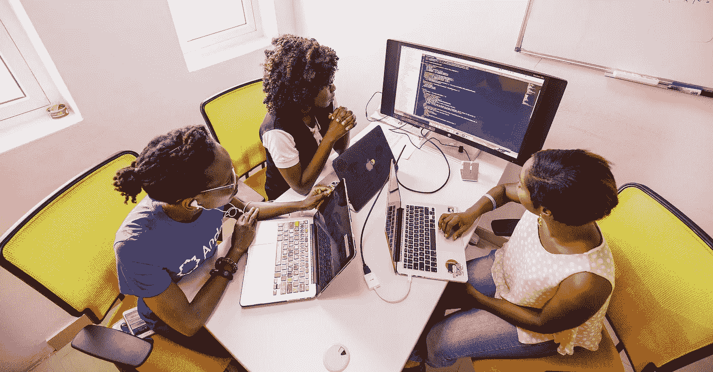
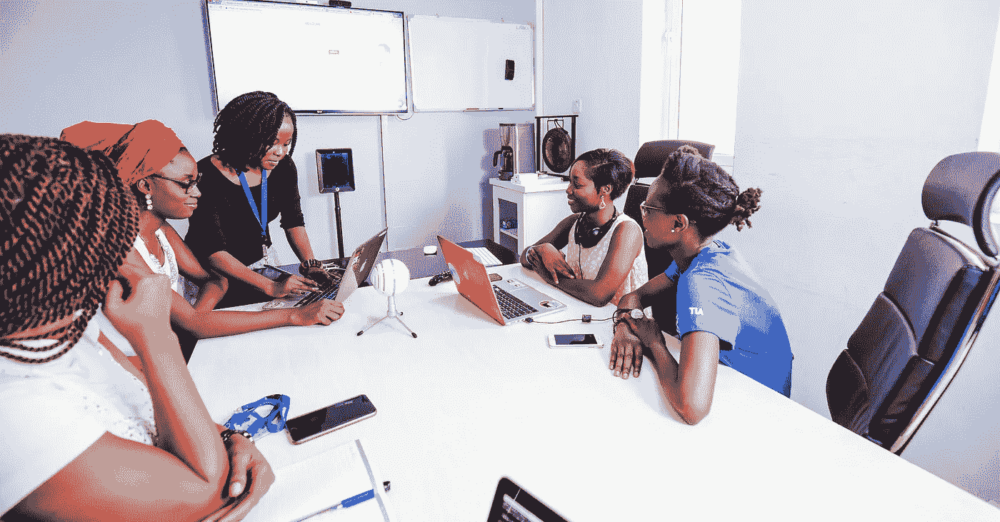

# 在分布式环境中发展人

> 原文：<https://medium.com/hackernoon/developing-people-in-a-distributed-environment-6dac6f639b48>

这是一个三部分系列的第二部分， [*一个工程经理对未来工作的指导。*](https://www.linkedin.com/pulse/engineering-managers-guide-future-work-scott-carleton)

工程师愿意相信分布式关系可以完美地工作；你可以只做你的工作，不被人打扰。那是假的。在分布式[环境](https://hackernoon.com/tagged/enviroment)中，建立人际关系和优先处理“噪音”更加重要，这样我们才能更好地校准信号。

# 拥抱噪音

正如许多人所说的那样，一对一是必不可少的。目前，我每周与我的直接下属进行一对一交流，每两周与他们的所有直接下属进行一次交流。面对面的时间对于配对、合作，尤其是相互了解来说是非常宝贵的。这些一对一的时间花在培养“噪音”上，这是建立信任和校准你们关系中信号的关键。

就像掌握任何事情一样，你进步得越多，你就越意识到你还有多远要走。在我早期的一对一谈话中，我对谈论半个小时的进展或团队动态的想法完全过敏。你会想:“难道我不应该建设，或者制定战略，或者写博客，或者阐明我们的方向吗？”或者:“他们只会抱怨，我宁愿避免这种情况。”

不对。在远程一对一会谈中，你的第一反应可能是列出任务清单和阻碍因素，而挖掘你的直接下属的工作效率和能力通常是更好地利用你的时间。

> 一对一不仅对建立信任至关重要，而且还能在你的组织中起到预警探测系统的作用。

一对一不仅对建立信任至关重要，而且还能在你的组织中起到预警探测系统的作用。作为一名经理，积极寻找问题是最基本的——如果有你不知道的事情，你需要尽快解决。如果你能成为问题的避雷针，你就成为了能够对这些问题进行分类的人。你越早有这些信号，你就能越早从救火转向防火。

# 你的 VDAP 是多少？

一旦你腾出时间，拥抱“噪音”，我发现创建一个系统或协议是很重要的，在这个系统或协议中，你能够通过所有的噪音获得正确的信号。“VDAP”——速度、方向、加速度、位置——是我们在安德拉的[试验的东西，以促进团队内部富有成效的关系。](https://andela.com/what-we-do)

**速度**意在衡量个人或项目的当前进度。你觉得你或你的产品本周进展顺利吗？你正在完成任务并克服障碍吗？

**方向**捕捉对项目和团队目标的更广泛理解。你知道你要去哪里吗？你知道当前项目的目标是什么吗——以及它如何融入公司的目标？

**加速度**是对学习和成长的衡量。这周比上周好吗？你或你的团队比上周行动更快了吗？

**职位**不仅关注项目的当前和未来状态，更重要的是关注个人在团队中的角色。你对自己的进步满意吗？你喜欢你现在的角色吗？你知道你现在在哪里，你想在哪里，以及两者之间的区别吗？

理解你的团队如何看待和感受他们的工作是绝对重要的。VDAP 是一种非常有用、简洁的方法来检测无聊、溺水或阻塞。

它可以是一个很好的，随意的协议，如“嘿，你的 V-Dap 是什么？”反应迅速。或者，你可以深入一个项目，并相应地分解每个部分。

VDAP 的目标是隔离关键信号，并深入挖掘它们，以获得有规律的节奏。它借用了一点物理学——字面意思是，一个物体在空间中移动——以及敏捷的概念，主要是速度和方向。在安德拉，我们每天优先考虑让人们指向正确的方向和完成事情，并随着时间的推移使用小的航向修正来驾驶船只。

分布式团队受益于 VDAP，因为它提供了一个框架来思考您的工作以及如何以紧凑的格式向上传达它。如果你能意识到一个团队每周都在完成工作，但是没有更快的进展，你就有了一个很好的信号去更深入地研究如何优化。如果他们正在完成工作，但不确定他们的前进方向，这是一个介入并帮助团队规划路线图的信号。

> 来自底层的想法是好的——作为一名分布式经理，你的工作是向你的团队展示更大的业务目标和挑战。

最终，构建应用程序和代码的人比作为经理的你拥有更多关于问题的信息。来自底层的想法是好的，作为一名分布式经理，你的工作就是把它们向上提出来。你的工作也是向你的团队展示更大的商业目标和挑战，以便他们能够思考如何解决这些问题。很有可能，他们的解决方案会比你(经理)想出的好得多。简单来说，他们看到的是你看不到的。

# 最近发展区

伟大的工作就是伟大的学习——如果你真的在交付，你就会不断地学习。如果你的 VDAP 很高，你就能同时最大化输出和学习速度。现在我们可以优化流程。

“最近发展区”，或“ZPD”，是一个个人可以不断提升的地方。这是一个黄金地带，无论你在做什么都不太容易，也不太难——这是可以实现的，但对你来说也足够具有挑战性。同样，较小的拉式请求更容易审查和合并，正确的 ZPD 中的任务也更容易升级。

为了加快学习速度，我们需要两样东西:一个开发者的 ZPD 和这个开发者的任务相对难度。这两个问题都不简单。确定开发人员的 ZPD——一个移动的目标——需要产出的历史记录和一些方法来确定一个人是否已经“知道”一些东西。确定一个给定任务的相对难度需要在粒度级别对其进行分类和理解，采取最佳猜测方法，然后在收集更多数据时对其进行迭代。幸运的是，这导致了一个随着时间推移而改进的系统。我们收集的数据越多，我们就能更好地将任务类型与开发人员相匹配，然后提高他们的学习速度。

> 但是如何确定某人是否“知道”某事呢？这比听起来更有挑战性。

但是如何确定某人是否“知道”某事呢？这比听起来更有挑战性。你不能问某人是否知道某事，并期望任何真正的准确性。大学通过管理测试来解决这个问题，测试要求学生提供与他们应该拥有的知识相符的输出。工程面试倾向于使用白板上的问题作为代理。我们的方法有点不同，它围绕着学习科学的最新进展。

我们不是通过测试、评估或白板，而是通过观察行为或信念来确认一个人是否拥有某种知识。通过收集我们在过去三年中每天观察到的每个开发人员的这些行为和信念的数据点，我们可以创建一个概率模型来确定对某人知识的信心。在未来利用这一点，我们将很快能够使用机器学习和其他人工智能技术来预测当前的知识水平，并确定在什么时候需要什么样的反馈来帮助某人提高。

例如:如果我有一个 JavaScript 的 GitHub pull 请求，我可以静态地解析它，并很好地判断你是否理解原型继承——我们可以计算出它的概率和准确性。如果我们确定你没有完全掌握原型遗传的复杂性，那么我们可以看看你过去的知识和你是如何学习的，以确定它是否在你的 ZPD 中。如果不是，我们可以找出差距，填补它们，让你更好地准备去尝试和解决它。

在安德拉，我们正在建立一套系统，让我们能够了解一项任务何时适合工程师的 ZPD。我们还处于早期阶段，但是对于能够利用学习科学来大规模培养个人贡献者的工程组织来说，潜在的影响是巨大的。

但接下来还会有更多。敬请关注下周的帖子，在那里我们将讨论如何在组织的所有部分扩展高效的分布式团队。

> [黑客中午](http://bit.ly/Hackernoon)是黑客如何开始他们的下午。我们是 [@AMI](http://bit.ly/atAMIatAMI) 家庭的一员。我们现在[接受投稿](http://bit.ly/hackernoonsubmission)，并乐意[讨论广告&赞助](mailto:partners@amipublications.com)机会。
> 
> 如果你喜欢这个故事，我们推荐你阅读我们的[最新科技故事](http://bit.ly/hackernoonlatestt)和[趋势科技故事](https://hackernoon.com/trending)。直到下一次，不要把世界的现实想当然！

