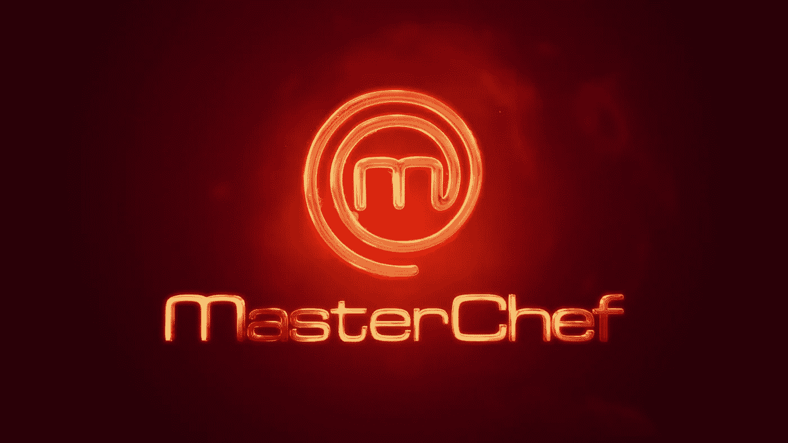
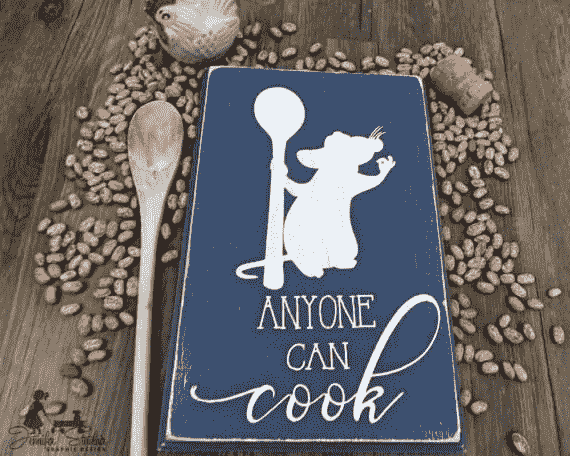
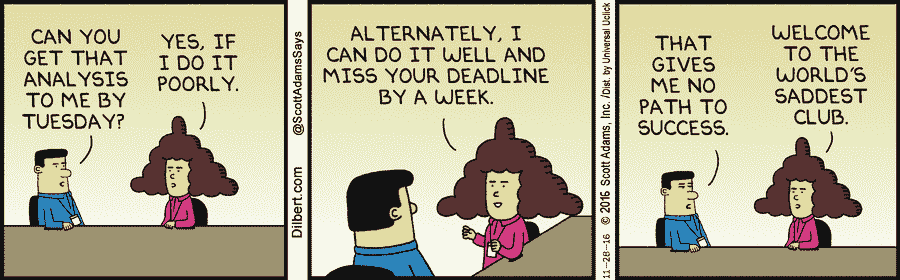
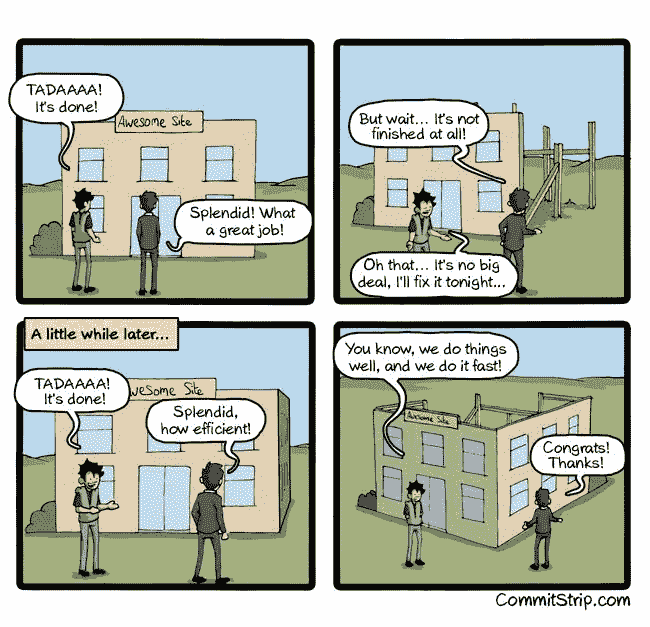

# 开发软件就像参加《厨艺大师》

> 原文：<https://medium.com/hackernoon/developing-software-is-like-participating-in-masterchef-6a2d203e4109>

昨天晚上，我一边换着电视频道，一边看着[的《厨艺大师》](https://hackernoon.com/tagged/masterchef),而一台硒刮刀正在花时间构建我需要的图像数据集。尽管我对烹饪毫无兴趣，但我观察到它与我从事软件项目的方式有很多相似之处。

我经常听到人们说，编码或进入像人工智能这样的特定领域并不是每个人的茶。我的回答受到电影[料理鼠王](https://en.wikipedia.org/wiki/Ratatouille_(film))的启发:

> 任何人都可以编码，你只需要对它充满热情！

下面是我多年来在不同的栈和不同的客户端上工作时观察到的一些相似之处。

# 你为什么做饭？

一位参赛者，职业[为](https://hackernoon.com/tagged/profession)的起重机操作员，被问到这个问题，他回答道:

> 这有助于我放松，理清思绪，最重要的是，当我准备的食物让吃它的人脸上露出笑容时，我真的感到快乐。

很明显，当人们在使用了我们制造的产品后感到沮丧或悲伤时，我们会感觉不好。是关于解决*什么的。任何事情*。这是为了让最终用户满意。

# 烹饪前必须知道的

## 除非你想好了你的菜，否则你不会开始做饭

冲向食品储藏室拿配料的人往往是竞争最后的输家。对于一个优秀的开发团队来说，了解自己将要进入的领域，相应地规划 sprint 并选择合适的技术栈来避免项目中期或上线危机是必不可少的。下面我们来了解一下我们行业中最常被误用的一个术语: [***过早优化***](http://ubiquity.acm.org/article.cfm?id=1513451)

> 在明显发现性能瓶颈之前，通常不值得花费大量时间对代码进行微优化。但是，反过来说，当在系统级设计软件时，性能问题应该从一开始就考虑到。

## 烹饪不同于即食食品

装盘即食菜肴很容易，但要提升它的味道却非常困难。虽然从头开始写所有的东西没有意义，但是我们不应该曲解它，而应该使用一个现成的/万能的产品，它可以像魔杖一样解决所有的问题。

> "没有根的树只是一块木头."
> ― [**马可·皮埃尔·怀特**](https://en.wikipedia.org/wiki/Marco_Pierre_White)

比起现成的产品，我总是更喜欢使用库和框架，尤其是那些开源的。当我使用它们的时候，我试着花时间去理解它们在幕后是如何工作的。我觉得有一个好的核心知识总是有帮助的。

## 这也是关于指导和互相帮助

有一次，一名选手不小心把她准备好的整碗酱汁弄掉了。一个快要吃完她的菜的“竞争对手”来帮她，他们两人一起制作调味汁。软件开发在这个意义上也是类似的。我们花时间帮助其他开发人员，进行协作、讨论和学习。

# 用力用力用力。！！

## 总是有时间限制的

如果有足够的时间，我们可能会成为最好的厨师。但是我们没有无休止烹饪的灵活性。在给定的时间内做出最好的菜需要强大的时间管理，计划和动态地适应出现的情况。[生产力黑客](https://hackernoon.com/how-i-boost-my-development-environment-to-focus-on-task-at-hand-9dbfc13b7829)可以提高可用时间的利用率。

## **做你觉得舒服的菜**

当有选择的时候，参赛者总是更喜欢他们熟悉的基本配料。观察竞争对手在做什么会分散我们的注意力，让我们无法做到最好。此外，我们不需要拿起每一个新的闪亮的技术，并将其插入到一个活的项目中。理解和评估新作品将带来的好处是很重要的，不要因为其他人似乎都在做这件事就去做这件事。

## 即兴创作有风险，但有时是不可避免的

在分配的时间进行到一半时，参赛者意识到有些地方不对，他们必须重新考虑这道菜。它总是伴随着巨大的风险因素。这也意味着对可用资源的明智使用。需要醋但没有？没问题！用柠檬来调节酸度。这里的一个对比是，有时我们可以选择延长交付时间线，如果我们认为延长的时间可以让我们恢复原状。

## **有些菜需要你连续准备 X 个小时**

这是对耐力和注意力的考验。参赛者通常有一个 100 个项目的清单，在非常严格的期限内，错过一个步骤会扣分。他们有时也不得不做出艰难的决定，把一些元素从盘子里拿掉，如果它们太费时间并且不是绝对关键的。我们也经常面临这样的要求，我们必须竭尽全力去完成工作。然而，这是有限度的。一个人显然不能整天做饭。

《厨艺大师》的一个灵感是，在开始前总是保留一份清单，并在完成后不断检查盒子。我已经经历过很多次这种情况，熬了一个通宵，早上我感觉你已经完成了所有的事情。但是当我第二天回来时，我发现有些东西总是被遗漏了。保留一份清单有助于减少这种情况的发生。

# 什么是一道好菜？

## 保持快乐！

> "快乐的厨师做快乐的食物。"
> ― **马尔科·皮埃尔·怀特**

保持快乐。享受你所做的事情，最终好的菜肴将会大量涌现。:)

## **完美融合**

一道美味的菜肴通常是多种元素和质地的完美融合，而不仅仅是单一的一种。与开发相关的一个区别是，一个层级团队正在准备一道菜，而多个子团队并行地准备组件，然后将它们合并和集成在一起。

> 每种成分都有它自己的味道和风味，关键是当我们把它们加在一起时，要建立最终平衡的味道。

## **做得好的菜不一定是好菜**

从远处看，一道味道不好或不均衡的菜仍然很漂亮。但是当涉及到品味和评判的时候，那些就被淘汰了。同样，一个非常美味的菜肴如果展示得不好，也会减分。演示和准备是相互联系的。在网络/手机开发的背景下，用户应该发现用户界面/UX 是舒适和令人愉快的，产品也应该在功能方面达到预期。

## 我可能擅长中国菜，但如果评委更喜欢意大利菜呢？

它也是关于做一些我从未做过的事情。它是关于探索未知领域，并希望从中获得最大收益。再说一次，这并不意味着仅仅为了好玩而去推广闪亮的技术！

## **干净的厨房**

即使在激烈的比赛中，参赛者在继续比赛之前，偶尔也会试着花点时间清理他们的桌子。同样的菜也可以通过在厨房里磕磕绊绊、焚烧物品、保存不干净的盘子和器皿来烹饪。但是，如果代码实践和流程不到位，向大规模的客户提供这道菜总是会有困难。

# 不要惊慌

这让我想到了我的最后一点看法。在参赛者能够做出精美的菜肴之前，多年来进行了大量的练习和排练。跟着搭车人指南和 [**别慌**](https://en.wikipedia.org/wiki/Phrases_from_The_Hitchhiker%27s_Guide_to_the_Galaxy#Don.27t_Panic) **。不管最后期限有时看起来多么艰难或不切实际，做出一道美味佳肴的唯一方法就是保持冷静。**

顺便提一下，如果有人对 ML/AI 感兴趣，这里有一些灵感

 [## 机器学习初学者，学完了机器学习的 MOOCs，深度…

### 回答(第 1 题，共 3 题):课程是一种非常非常有效的学习方式，所以从那里开始肯定是有意义的。之后…

www.quora.com](https://www.quora.com/How-can-beginners-in-machine-learning-who-have-finished-their-MOOCs-in-machine-learning-and-deep-learning-take-it-to-the-next-level-and-get-to-the-point-of-being-able-to-read-research-papers-productively-contribute-in-an-industry) 

> “我认识的每一个世界级的 ML 研究者都花了大量的时间来实现算法，调整超参数，阅读论文，并自己找出什么可行，什么不可行。我仍然觉得这种工作很有趣，希望你也会如此。”——[吴恩达](https://medium.com/u/592ce2a67248?source=post_page-----6a2d203e4109--------------------------------)。

# 非常感谢您抽出时间。下次再见，祝你有美好的一天！:)如果你喜欢，尽可能多的点击下面的按钮！这对我意义重大，鼓励我写更多这样的故事

*让我们也连线上*[*Twitter*](https://twitter.com/kartik_godawat)*[*Linkedin*](https://in.linkedin.com/in/kartik-godawat-aaa18420)*