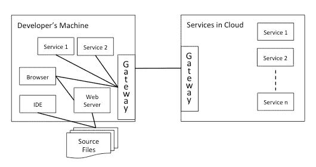
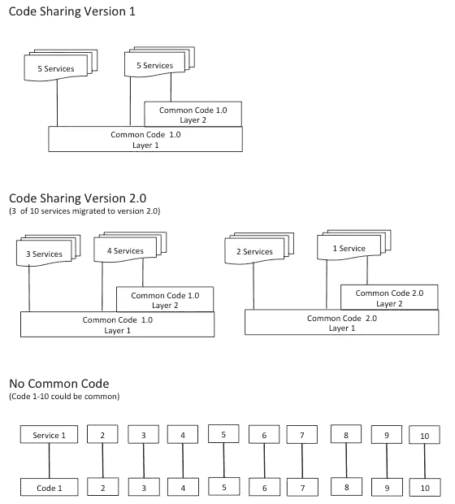
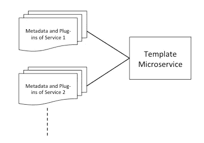
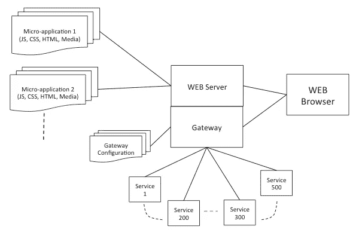

# 微服务的发展——问题与解决方案

> 原文：<https://medium.com/hackernoon/development-of-microservices-problems-and-solutions-b3ce8f1f7ff1>

使用[微服务](https://hackernoon.com/tagged/microservices)构建应用在一些出版物中有很好的介绍。在这篇文章中，我试图涵盖一些没有得到太多关注的问题，并讨论每个问题的解决方案。尽早关注这些领域将有助于您提高生产率、质量和构建灵活的应用程序。我还将展示它可以节省 25%或更多的成本。这些经验是通过在开源平台上工作和与少数客户合作而获得的。

如果您正在构建基于微服务的[应用](https://hackernoon.com/tagged/application)，您会将应用分成几个微服务，并使用各种技术堆栈。根据复杂程度，一个应用可能有 5-500 个微服务。您可能会混合使用 Java、.Net，Python，NodeJS，GO 等。基于技术的堆栈。**一个经常被忽略的重要考虑**，开发者如何在开发环境中使用这些服务进行测试。开发人员在个人机器上使用 IDE 时效率最高。这有助于他们更快地编写和调试代码。在个人机器上运行几个服务来进行调试和单元测试是不切实际的。另一个备受争议的问题是什么“应该和不应该”构成共享代码。人们倾向于不分享。**第三个重要的考虑事项**是创建可重用的服务，这些服务可以通过元数据或脚本获得略有不同的服务的个性。**第四个问题**对于服务器端开发者来说并不重要，但是对于 UI 开发者来说却很重要。它处理如何将一个大的用户界面分割成更小的部分，独立开发每个部分，并在运行时自动将它们组合在一起。

在接下来的部分中，我们将深入这四个方面的细节，并讨论如何解决它们。

# 从开发者的机器上随意连接任何微服务

在运营环境中，您可能会将所有微服务运行在某个地方的私有或公共云上。但由于网络安全原因，开发人员无法接触到它们。即使开发人员可以创建一个到这些服务的安全隧道，这也是大量的工作，而且会分散日常开发的注意力。**打破开发者的专注，他们不得不在开始滚动之前“吃青蛙”。**

开发人员如何从自己的机器连接到云中的服务？您可能已经猜到了—“我们需要一个服务网关。如果你有的话，太好了！如果没有，那么也许有一天你会建立它，向外界公开你的服务。为什么不现在就做，让你自己的开发者成为 API 的消费者。这也有助于抽象、理解服务和标准化。拥有网关是不够的，但这是必需的第一步。

在这种情况下，网关的目标是向开发人员提供接近部署的环境。要在开发人员的个人机器上创建一个真正的部署环境，您需要考虑的事情很少。为了开发和调试，开发人员在本地运行很少的服务(通常 2-3 个),并且喜欢连接到云中的 rest。因此，这是一个混合了开发者机器和云中的服务的环境。它是通过改变服务端点的 IP 地址，拉几个代码库或容器来实现的。如果你把它形象化，你就在创造一个环境，一个对每个人来说都是集中可用的环境的微小变化。实现它的最佳方式是什么？

如果你设计一个轻量级和可配置的轻型网关，最好是通过 UI，这是可以实现的。通过 UI，开发者可以改变服务的 IP 地址。如果足够简单的话，开发者可以在本地机器上部署 it 来协调本地和云服务。下图显示了由此产生的结构。

Connecting Local and Remote Microservices using Gateway

您会发现几个创造性地重用上述 gateway 设计的用例。让我们再举一个例子。如果您正在开发一个使用单点登录(SSO)的应用程序，您可以使用 operational environment 来获取访问令牌，并在本地机器和远程云上运行服务的混合环境中使用它。我打算稍后在一个独立的博客中讨论这个问题。

# 微服务之间的代码共享

微服务架构的好处之一是一个服务的变化不会引起连锁反应。因此，我们的想法是让它们完全独立于彼此之间的代码变化。但这并不意味着你不应该共享代码。这可能意味着您需要对共享代码进行适当的版本管理。共享代码可以进化。但是使用它的服务可以决定是否迁移到新版本。事实上，这就是我们使用开源代码的方式。您将在您的微服务中使用几个开源库。没有理由你不能以同样的方式对待你自己的共享代码。

分享永远不会出错。假设您有 10 个可能使用“X”公共代码的服务。最糟糕的情况是，当你不共享时，所有代码都会多出 10 倍。你从分享“X”的版本 1 开始。“X”移到了版本 2。只有 3 项服务会迁移到“X 2.0”。你仍然会有很多代码共享。您还可以拥有多层共享库。如果不需要，一些服务可能会绕过更高层。下图显示了代码共享和不共享情况下的代码分层。如果你适当地计划代码共享，它是一个大赢家。

Depiction of Code Sharing and Not Sharing Options

您可以在以下领域寻找共享代码:

1.  **实用程序函数—** 实用程序的几个例子是字符串处理函数、使用正则表达式的通用函数、通用域专用实用程序、通用数据结构、域专用但可重复用作模板的数据结构、数据验证代码、文件读写代码等。
2.  **数据库 API** —考虑将 CRUD、查询、分页编写为通用库，这些库可以将模式作为输入。您可以在所有实体中标准化一些基本属性，如 id、名称、友好名称、版本、状态标志等。使用模式文件，您可以定义属性的元属性，如唯一性、类型等。公共代码可以基于元数据实现逻辑。
3.  **通用算法** —接收输入、处理并返回输出的无状态函数或方法。这些算法可以跨服务共享。少数例子是排序、决策树、通用规则。
4.  **日志** —如果您想保留插入不同开源库的选项，可以使用通用日志包装器。
5.  **安全相关 API** —安全数据验证、检查权限等是常见安全功能的示例。
6.  经验法则——四处询问，“有没有我可以重用或贡献的代码？”这是开源模式，你不会出错。

# 可配置和可编程的服务

在计算机软件中有很多机会，有些东西是另一些东西的变体。在微服务的情况下，您也可以找到一个共同点，并将其作为一个通用代码，可以称为“模板服务”。如果你遵循一个数据驱动的设计，那么它可以使用元数据和一些可插入的脚本变成一个特例。例如，假设您有一个名为*订单服务*的服务。它可能会保存数据库中的数据。有一个*发货服务*也在同一个数据库中保存数据。您可以提取出通用代码作为*持久性服务*，它将模式和可插入代码作为输入。另一个选择是部署为三个服务:I)订单服务，ii)客户服务和 iii)持久性服务。如果你使用的是 NoSQL 数据库而不是 RDBMS，那么数据驱动的持久服务设计会更容易。但是在每种情况下你都可以这样做。您可能会发现这种设计的其他好处。例如，在这种特殊情况下，它将应用程序逻辑与数据库逻辑分离开来；数据库专家可以独立于业务服务对其进行优化。这只是一个例子，在你的情况下可能不太可能。但是总的想法是，如果你能把基础设施比如代码从多个服务中抽出来放到模板服务中，那么就要认真考虑它。这并不明显。一旦你习惯了元数据和脚本编程模型，你将开始看到一些这样的机会。我打算在另一篇文章中更详细地讨论这个问题。

Template Microservice — Programmable using Metadata and Plug-ins

# WEB 层和将 UI 分解成更小的部分

谨慎的做法是开发纯 HTML、JavaScript 和 CSS 的多设备 WEB UI，并且不使用任何服务器端库进行渲染。很有可能你已经在做了。在服务器端，它只需要用所需的 JS，CSS 提供一个准系统的 HTML 页面。UI 使用安全层或网关连接到服务。在大型 UI 的情况下，你可以把它分成功能组件，让团队独立开发。让我们把每个功能组件称为**【微应用】**。您可以将每个微应用程序开发为一个 HTML 页面，同时避免在部署集成应用程序时重新加载。

让我们看看服务器为一个微应用程序提供的 HTML 页面。它将包含以下内容。

*< html >*

*<表头>*

*加载开源 css*

*加载通用 css(所有微应用通用)*

*加载针对微应用的 CSS*

*</表头>*

*正文<正文>正文*

*大部分是空的，使用模板渲染*

*</正文>*

*加载开源 JS*

*加载通用 JS(所有微应用通用)*

*加载针对微应用的 JS*

*</html>*

你会注意到变化的部分是微应用特定的 CSS、JS 和相应的 HTML 模板。在集成环境中，以前的微应用程序代码可以卸载，新的微应用程序代码可以加载，无需刷新页面。微应用可以由 URL 来表示，该 URL 可以将其名称作为 URL 中的路径。使用适当的 WEB 服务器设计，您可以使用 path 在服务器端的准系统 HTML 页面中插入特定的 CSS、JS。为了清晰和模块化，您可以在单独的目录中组织微应用特定的 JS、CSS、HTML 模板。这在 UI 端分解您的应用程序，与微服务在服务器端的方式非常相似。

Decomposition of a Large UI as Micro-Applications

# 商业利益

上述考虑带来了显著的商业利益。假设一个开发人员每周花 4 个小时努力连接服务。在一个有 10 名开发人员的 6 个月项目中，这将意味着 4 个人月，即大约 7%。除此之外，沮丧的开发人员以较低的生产率和质量工作，它可以达到 10%。如果你有一个在微服务间共享代码的可靠计划，这将带来额外的节省。编写数据驱动的、可编程的服务，并能够在一定程度上采用它们，将提供灵活性，并在短期和长期内节省时间和金钱。随着 UI 代码的体积增大，它很容易变成意大利面条。你可以通过把 UI 分解成更小的模块(或者传统 WEB app 意义上的微应用)来避免。假设其中每一项都有助于节省 5%的成本。所有这些加起来占 25%。你可以用它来建立高价值的功能，更好的 UX 或团队奖励。灵活和模块化的代码库也为创新打开了大门。

# 未来职位

我打算在单独的帖子中更详细地讨论以下主题。

1.轻量级网关设计

2.数据导出、可编程模板服务

3.作为微应用的 UI 分解

4.开发安全的微服务

> [黑客中午](http://bit.ly/Hackernoon)是黑客如何开始他们的下午。我们是 [@AMI](http://bit.ly/atAMIatAMI) 家庭的一员。我们现在[接受投稿](http://bit.ly/hackernoonsubmission)并乐意[讨论广告&赞助](mailto:partners@amipublications.com)机会。
> 
> 如果你喜欢这个故事，我们推荐你阅读我们的[最新科技故事](http://bit.ly/hackernoonlatestt)和[趋势科技故事](https://hackernoon.com/trending)。直到下一次，不要把世界的现实想当然！

