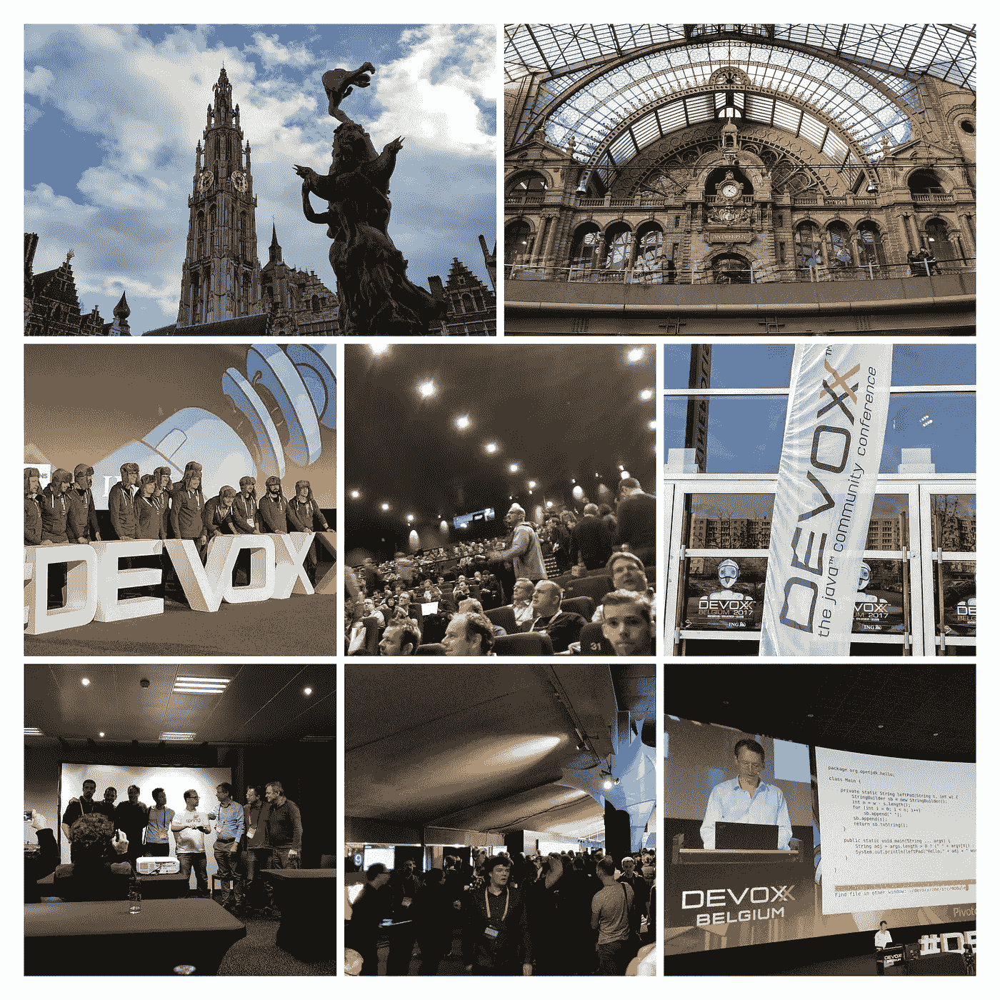
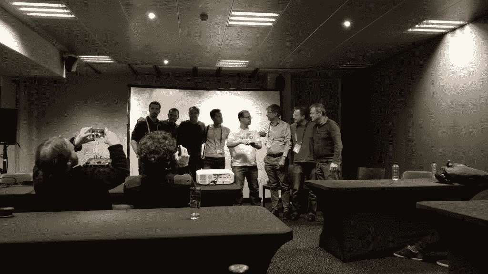
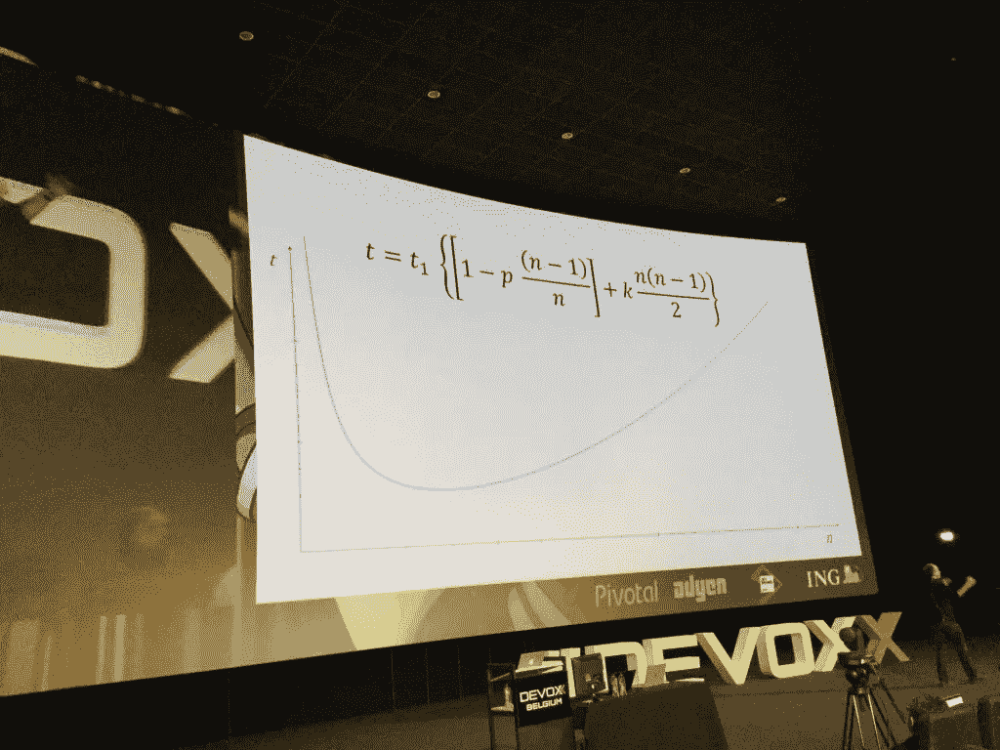
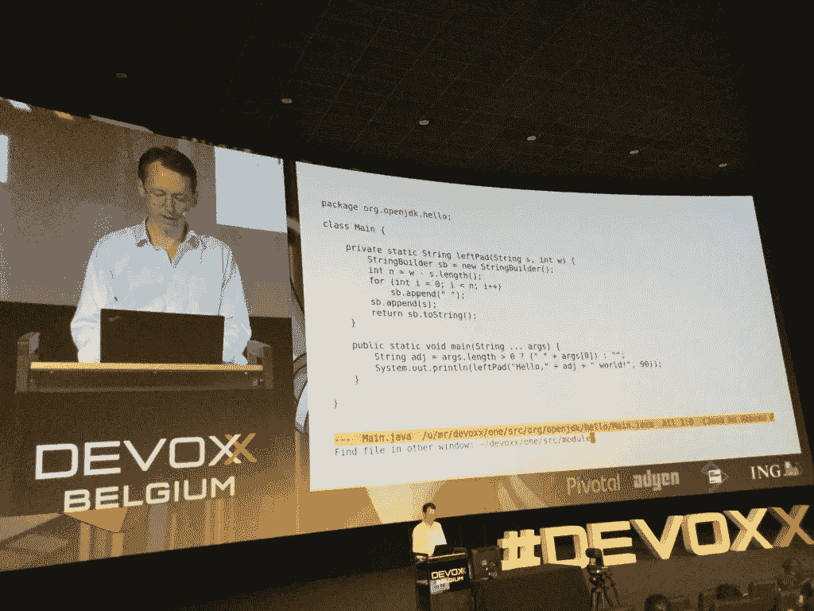
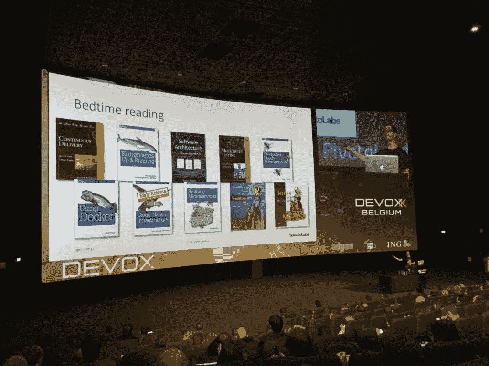

# Devoxx 2017 —总结

> 原文：<https://medium.com/hackernoon/devoxx-2017-summary-43f09594072d>

两周前参加了 ReactiveConf，主题是 JavaScript，之后我去了安特卫普的 T4 devo xx T5，转到了传统的 web 后端开发 T2 T3。它被广泛认为是最好的 Java 会议之一。

数字说明了一切:6 570 项提案、221 名发言者和 3 500 多名与会者。会议在安特卫普的一个大电影院举行，持续了 3 天。我留意了专门涉及 Java 9 和 Spring 的演讲，一点也不失望。以下是我对所选演讲的笔记摘要。

## Mark Reinhold:加快 Java 的发展

甲骨文公司 Java 平台组的首席架构师 Reinhold 解释了 Java 即将推出的特性和调度模式。

由于反复出现的问题，JDK 版本被推迟了几年，所以决定每半年发布一个新版本。现在，人们可以在每个发布周期发布已完成的特性，而不是在所有特性完成后才发布新版本。这将消除一个单一的、未完成的特性阻碍整个发布的情况。

版本的命名约定将保持不变。2018 年 3 月即将发布的版本是 Java 10，半年后是 Java 11，以此类推。

像 Ubuntu 一样，每三年发布一次的版本会有一个 5 年的 LTS(长期支持)。第一个将是 2018 年 9 月的 Java 11。

进一步开发 Java 的主要项目都有一些相当花哨的名字。有巴拿马，瓦尔哈拉，琥珀和织机。Amber 非常有趣，因为它已经发布了 Java 10 的类型推断和模式匹配。

## 春天 BOF

由于第一天的时间很晚(晚上 8 点)，春季的非正式会议只有有限的几个参与者。然而，很多 Spring 的主要开发人员都参加了。

大部分的讨论都是关于 Java 版本模型的变化和 Java 9 中当前的模块特性。

核心 Spring 系统的项目负责人于尔根·霍勒提到，他看到了图书馆供应商即将面临的问题。他们现在被迫每年验证两次他们的库。特别是，静态检查字节码版本的工具可能会有很大的问题，因为每个版本的字节码版本都会增加。

春季使用 [ASM](https://mvnrepository.com/artifact/org.springframework/spring-asm) 因此也受到影响。ller 提到他们的策略是简单地忽略字节码的版本。他会鼓励其他图书馆供应商也这样做。

还有一个关于科特林在春天是否支持的问题。侯勒说，他们“正在竭尽全力”支持科特林。他无法预测科特林是否会成为一名主导球员。这掌握在软件开发人员自己手中。

Spring Team at Spring BOF

## 凯文·亨里:慢慢来，修补事情

Hennly 发表了一个非常抽象的主题演讲，他在演讲中谈到了软件开发的各个方面。他批评了这种趋势，即开发商盲目遵循著名的脸书格言“快速行动，打破常规”。这并不意味着应该交付错误的代码。不幸的是，有些情况下，开发人员实际上在他们的本地环境中遇到了一个错误，但仍然没有纠正就推出了代码。

同样，“率先上市”的口号并不总是正确的目标。现实表明，第一批人并不总能幸存。所以有时候让别人做艰苦的工作，看着他们犯错误，然后把它做得更好可能是件好事。

时间只是项目评估中的一个代理指标——时间并不能解决问题。有人必须做实际的工作，这是发展的关键。评估中最难的部分是解决新问题所需的时间和精力。由于程序员不会做两次事情——他们采用现有的代码并重用它——当新的问题与已经解决的问题相似时，可以做出最好的估计。

代码代表了程序员对问题的理解。它可以被看作是编纂的知识。它不同于生产，在这个意义上，你会在生产实物中看到“生产”。编码是知识的获取，因此程序员应该被视为知识工作者。如果一个程序员主要是知识工作者，那么整个团队共享知识和理解也是非常重要的。从这个意义上说，群体智慧优于个体智慧。研究表明，如果有高度的多样性，群体智力会增加。因此，典型的以“公司适合度”来招聘员工的人力资源行为会适得其反，没有任何好处。另一个结果是，通过简单地雇佣更多的女性，你可以很容易地增加“典型软件开发团队”的多样性。亨利还呼吁关注著名的“银弹”，由弗雷德布鲁克斯命名。Hennly 展示了一个图表，他可以证明，在一定的团队规模下，一个团队产生的全部代码相当于一个开发人员单独完成的代码量。这是由于大型团队的通信负载增加。不幸的是，由于商业决策者没有认识到分工不适用于软件开发，他们试图通过增加更多的人来解决这个问题。他以这样一个事实结束了他的讲话，即大多数严重的故障都可以通过正常的单元测试检测出来。

Kevin Hennly: Move Slow and Mend Things

## Alex Buckley:JDK 9 的模块化开发

JDK 9 引入了模块的概念，它可以用来对包进行分组。不管一个类是否是公共的:如果它不是模块导出的包的一部分，它就不能被其他人使用。JDK 本身被拆分成模块。这是当前版本的主要任务之一。java.base 形成了包含 java.lang、java.io、java.io 和 java.util.

的基础包，模块化的主要驱动力之一是消除拆分包。这是一个包，它的代码分布在不同的 jar 上。因为可以确定实际需要的模块，所以现在可以很容易地减小应用程序的规模。这类似于我们从 JavaScript 的 webpack 和类似的(哎呀，我刚刚真的写了吗；)).

## 马克·莱因霍尔德:一课中的模块

在一次关于 Java 9 的现场编码会议上，Mark Reinhold 展示了如何从头开始创建 Java 9 模块。像 Jackson 这样使用反射的模块需要更多的特权。有一个选项通过反射只授予这些特定模块完全访问权限。

包含模块信息的文件称为 module-info.java。默认的目录结构现在被扩展以提供模块支持。所以如果你有模块 A 的 com.foo.bar1 和模块 B 的 com.foo.bar2，它们应该位于 src/main/com.foo.bar1 和 src/main/com.foo.bar2\.

如果你使用的是还不支持模块的库，JDK 会把它们当作自动模块。所有的类都被导出，所有的模块都是必需的。

您不应该在供应商库上创建 module-info.java，因为一旦他们完成了迁移，它很可能会与供应商的 module-info.java 冲突。

首先是可执行的 jdeps。它会自动创建 module-info.java。有一个关于版本支持的问题。答案是，模块在概念上被视为包的一个超群，属于同一类别。由于包和类没有版本，模块也是如此。

版本的处理已经被常见的构建工具如 gradle 或 maven 解决了。所以没必要和他们竞争。

Mark Reinhold: Programming Java 9 ( with Emacs :) )

## 丹尼尔·布莱恩特:用集装箱连续交货

在这次演讲中，Bryant 介绍了在连续交付环境中集装箱技术发挥重要作用的一些方面和最佳实践。

首先，他提到 CD(连续交付)并不意味着每个提交都必须被部署。这是一个误解。

人们应该让不同的环境——比如开发、阶段、生产或测试——尽可能相似。使用容器技术正好给了你这种能力。在测试环境的特殊情况下，您可能需要额外的配置，使用 sidecar 模式而不是创建自己的映像。

一个[官方的 Alpine Java 镜像](https://hub.docker.com/_/openjdk/)解决了典型 Java 容器的尺寸缩减问题。将 JLink 与 Java 9 模块结合使用，可以减小 jar 的大小。JLink 移除所有未使用的模块。采用 Java 9 的另一个原因；).Bryant 提到了在容器上放置高质量元数据的想法。它可用于强制执行某些安全操作或对其执行测试。例如，在管道中的某个阶段，只允许检查过的集装箱继续前进。

Groovy 可以用来编写 [Jenkins](https://jenkins.io/) 中的流水线步骤。

对于性能和负载测试，[加特林](https://gatling.io/)是个不错的选择。他还强调了一个事实，即我们需要更加认真地对待安全问题。否则，我们整个行业就有被政府监管的风险。使用克莱尔来扫描你的图像的安全问题。非功能性需求经常被延迟到最后一刻。简单地说，这降低了由于早期性能优化而导致的过度工程化的风险。人们不应该认为这是一条规则。有时，预先考虑非功能性需求是有好处的。尤其是安全。

Daniel Bryant: Some ideas for good night lecture

## 于尔根·希勒:春季框架 5——主题与趋势

作为 Spring 的联合创始人和核心框架的领导者，jürgen h ller 有很多话要说。不出所料，房间里挤满了人。他提到 JDK 9 不是一个长期支持的版本。尽管如此，还是应该试一试，因为 JDK 8 有很多改进。人们甚至可以在 JDK 9 上使用 Spring 4.3。

Spring 5 已经配备了模块定义文件。所以不需要依赖自动模块。在版本 5 中，配置可以在一个可选的功能风格中完成。因此，这是继 xml、基于注释或 Java 配置方法之后的又一步。在函数式风格中，我们没有类路径扫描，也没有内部反射发生。

这个反应堆为春天新的反应框架提供了基本基础。两个主要元素是 Flux 和 Mono，后者表示一个或没有元素。Spring Webflux 基于 Reactor，但它是一个完整的、独立的 web 堆栈。WebFlux 没有 Servlet API 也能工作。两种栈都支持已知的 Web-MVC 注释，如@Controller 或@RequestMapping。WebFlux 在 Tomcat、Jetty、Netty 或 Undertow 上内部运行。推荐 Netty 和 Tomcat。

此外，还有所谓的 RouterFunctions，通过将一个处理程序方法传递给一个已定义的路由，可以在功能上构建路由。如果您有许多端点，并且想要集中管理它们，这将非常有用。据我所知，这仅适用于 WebFlux。

Reactor 完全基于事件(node.js 中常见的一种模式),并且有自己的线程，其中操作是单独运行的。

同样值得注意的是一个新的 WebClient，它可以作为 WebFlux/Reactive 端点的客户端。如果您使用微服务架构，这将非常方便。希勒以一条可能是最重要的建议结束了他的演讲。如果您的数据存储不支持 reactive，请不要考虑使用它。坚持好的老古典 MVC。

## Brian Goetz: Java 语言的未来——一切尽在琥珀计划

兼容性是 Java 主要关心的问题之一。Amber 只是众多正在进行的改进项目之一，致力于减少 Java 的冗长。它最重要的原则是读代码比写代码更频繁。因此，可读性是琥珀的首要任务。

Java 背后的人非常保守，在添加特性时总是非常怀疑。由于向后兼容性和投资保护，他们永远不想删除它们。他们绝对不认为自己是先行者。

Java 10 计划对局部变量进行类型推断。Java 在版本 5 中已经有了泛型方法类型参数的类型推断。例如，Collections.emptyList()可以缩写为 Collections.emptyList()。方法返回类型或字段类型不支持它，因为 API 不应该有类型推断。仍然缺少纯数据类的概念。纯数据类可以与 Scala 中的 Case 类或 Kotlin 中的 DataClasses 进行比较。有计划支持他们。

模式匹配提升了 switch 构造的可读性。它将由解构者加入，解构者可用于表壳部件。甚至支持嵌套模式匹配/解构。

例如:
case Rect(Point(var x1，var y1)，Point(var x2，var y2)) - > x1 + x2

> [最初发表于 rainerhahnekamp.com](http://www.rainerhahnekamp.com/en/devoxx-2017-summary/)