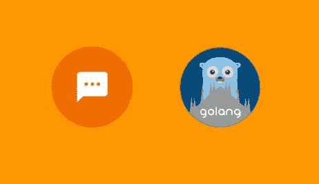
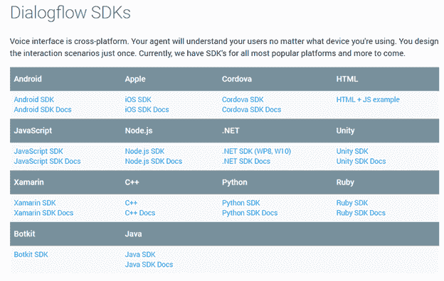

# DialogFlow (API。AI) Golang SDK

> 原文：<https://medium.com/hackernoon/dialogflow-api-ai-golang-sdk-a64c1bec9b09>

**DialogFlow** (原 **API。AI** 通过构建由 **AI** 支持的引人入胜的语音和基于文本的对话界面，为用户提供了与你的机器人互动的新方式。

**DialogFlow** 提供了许多不同编程语言的[SDK](https://dialogflow.com/docs/sdks):

但不幸的是， **Golang** 没有 **SDK**

但是不要难过，我做了一个 [SDK](https://github.com/mlabouardy/dialogflow-go-client) 来整合 **DialogFlow** 和 **Golang** :

这个库允许将来自 [DialogFlow](https://dialogflow.com/) 自然语言处理服务的代理集成到您的 **Golang** 应用程序中。

发出以下命令安装库:

> 去找 github.com/mlabouardy/dialogflow-go-client

下面的例子，显示实体列表:

注意:关于可用方法的更多细节，请查看项目 [Github 库](https://github.com/mlabouardy/dialogflow-go-client)。

关于如何使用这个库的真实示例，请查看我的[以前的教程](/@mlabouardy/bot-in-messenger-with-dialogflow-golang-fcbe6bee1341)，关于如何在 **Golang** 中创建一个 **Messenger Bot** 来显示在电影院播放的电影列表和在电视上播放的电视节目:

