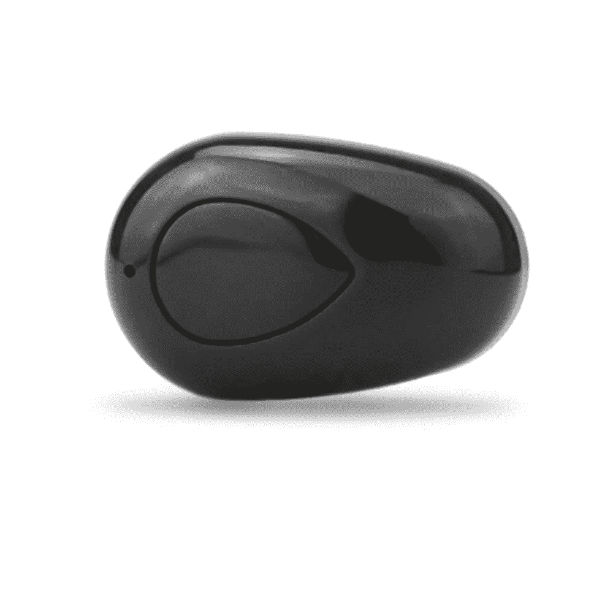

# 苹果失去了它的火花吗？

> 原文：<https://medium.com/hackernoon/did-apple-lose-its-spark-87ae0ae138ee>

## 只是在周一的早上随便想一想。

现在是 2016 年 9 月，本应该是一篇关于苹果如何再次做到这一点的文章，我开始怀疑我们是否已经过了“苹果巅峰”。

几十年来，苹果一直是以客户为中心的创新的领跑者。为我们带来了令人惊叹的产品，如最初的 iMac (1997 年)、iPod、iPhone，在某种程度上还有 iPad 以及可爱的 Macbook Pro 和 Air 系列。彻底重塑我们使用和生活的方式——与科技共存。我为此钦佩他们。

他们没有设计出我们想要的产品，而是发明了改变模式的产品。

## 他们不仅制造新产品，还创造新市场。

他们的产品远远超出了顾客的需求，我们对他们提供的任何东西都变得不顾一切。例如，在 MP3 播放器形状怪异、使用不兼容格式、质量低劣的时代，苹果推出了容量巨大(在当时)且界面简单易用的 iPod。我仍然记得当我搬到夏威夷时，我带了一大盒 CD，当然，这些 CD 没有经受住考验。

当诺基亚(RIP)正在制造越来越小的耐用高效手机时，苹果推出了智能手机，震惊了世界。

这些发展不是进化，而是巨大的飞跃。苹果彻底改变了游戏。顾客从来不知道他们想要苹果的产品，因为他们甚至无法设想技术和设计的下一步。

可悲的是，那些日子似乎一去不复返了。iWatch、iPhone 7 和现在的 AirPod 都像是倒退。

它不再有意义了。尤其是如果你看可用性的话。

我们有一款手表，它是手表和健身追踪器的结合体(*现在采用令人惊叹的陶瓷*))本该是你手臂上的 iPhone。我们有一部像 1999 年那样需要加密狗的手机。简单易用？

事实上，AirPods 和丢失的耳机插孔对我来说是个问题。尽管我理解其背后的愿景，但这让我很恼火。

## 未来是听觉增强现实

在过去的一年里，我已经理解了听觉增强现实的真正力量，并因此购买了这些廉价的隐形耳机，并喜欢它们至今。

[https://www . Amazon . com/蓝牙-隐形-麦克风-免提-智能手机/dp/B01H5CBC1G/](https://www.amazon.com/Bluetooth-Invisible-Microphone-Hands-free-Smartphone/dp/B01H5CBC1G/ref=sr_1_2?ie=UTF8&qid=1473656905&sr=8-2&keywords=invisible+earphone)

电池续航时间很长，音质可以接受，当我处理日常事务时，我可以像正常人一样进行对话。

一年中我把它们放错地方的次数多得惊人！

但是今年我又买了几次，因为外形很棒，而且价格在 10 美元左右。苹果产品的十分之一！

另一方面，当前版本的苹果耳机很烂。它们通常放在盒子里，因为除了前面提到的蓝牙耳机，我还有很棒的舒尔耳机。当我在亚洲飞来飞去的时候，这些耳机给了我美妙的音乐质量，这是我最近经常做的一件事。如果我想升级到 iPhone 7，我就不能再这样做了。我也不想卷入这场争论，我疯狂地在我的座位上寻找 AirPods，因为它们在我睡着后掉了出来。

最近在苹果，我肯定不是一个圈内人，有太多的设计决策没有考虑到人类的使用。

在过去，苹果总是通过忽略它和制造它想要的东西来保持领先。他们用这种方法创造了惊人的产品。

他们现在所做的感觉就像是在利用他们为盈利而创造的狂热追随者。他们真正在测试他们生态系统的锁定效应的力量。他们不再为了创新而牺牲资本，并投资于创造令人难以置信的产品和无与伦比的服务。

我只是不明白他们为什么不创造真正的入耳式 AirPods，可以使用 iBeacon 技术找到，可以在连接到手机(或耳朵)时充电，并且可以调节到足以确保最佳贴合。

但是，这将是惊人的。

这就是我的问题所在。苹果已经成为*不那么令人惊讶的*，一直如此。苹果不懈的进步已经放缓到反复倒退。当你手头有数十亿现金时，规避风险是一种奇怪的策略。

苹果公司应该为他们在过去 30 年里带领科技行业走了多远而受到称赞。但感觉上我们正在因为渐进性痴呆而失去苹果。

对我来说，感觉苹果现在完全失去了让它的产品与众不同的火花。

> [黑客中午](http://bit.ly/Hackernoon)是黑客如何开始他们的下午。我们是 [@AMI](http://bit.ly/atAMIatAMI) 家庭的一员。我们现在[接受投稿](http://bit.ly/hackernoonsubmission)并乐意[讨论广告&赞助](mailto:partners@amipublications.com)机会。
> 
> 如果你喜欢这个故事，我们推荐你阅读我们的[最新科技故事](http://bit.ly/hackernoonlatestt)和[趋势科技故事](https://hackernoon.com/trending)。直到下一次，不要把世界的现实想当然！

