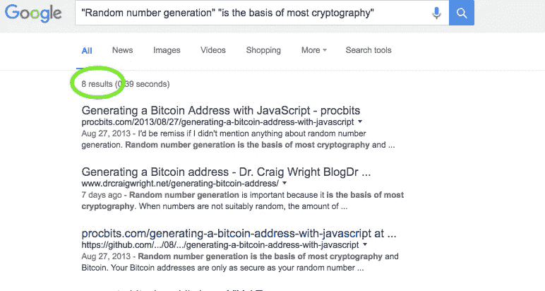

# 聪是不是偷了我的博文？

> 原文：<https://medium.com/hackernoon/did-satoshi-steal-my-blog-post-76a68cdda4f3>

我是 JP Richardson， [Exodus](http://www.exodus.io) 比特币/以太坊钱包联合创始人，活跃的[JavaScript/比特币开发者](https://www.npmjs.com/~jprichardson) ( [github](https://github.com/jprichardson) )。我和你们很多人一样，沉迷于阅读克雷格·赖特是中本聪。

我开始在克雷格·赖特的网站上闲逛，无意中发现了这块宝石:[http://www.drcraigwright.net/generating-bitcoin-address/](http://www.drcraigwright.net/generating-bitcoin-address/)(如果链接死了/被删除: [PDF copy](https://www.dropbox.com/s/srukzm8rjkamp9d/Generating%20a%20Bitcoin%20address%20-%20Dr.%20Craig%20Wright%20BlogDr.pdf?dl=0) )

我认为它看起来非常类似于我在 2013 年写的一篇旧帖子:[http://proc bits . com/2013/08/27/generating-a-bitcoin-address-with-JavaScript](http://procbits.com/2013/08/27/generating-a-bitcoin-address-with-javascript)使用大约 2013 年的一个古老版本 [bitcoinjs-lib](https://github.com/bitcoinjs/bitcoinjs-lib) 。

[谷歌为“随机数生成”+“是大多数密码学的基础”](https://www.google.com/search?q="Random+number+generation"+"is+the+basis+of+most+cryptography")。点击率前两名？我的帖子第一，克雷格·赖特的第二。

下面是截图:

看看代码片段。变量名。旧的 bitcoinjs 版本。语言的排序。

巧合吗？有可能。

克雷格·赖特偷了我的帖子吗？或者只是可能，我是中本聪。

感谢[毛毛小马](https://twitter.com/fluffyponyza)对两个帖子的审核。

> [黑客中午](http://bit.ly/Hackernoon)是黑客如何开始他们的下午。我们是 T21 家庭的一员。我们现在[接受投稿](http://bit.ly/hackernoonsubmission)并乐意[讨论广告&赞助](mailto:partners@amipublications.com)机会。
> 
> 如果你喜欢这个故事，我们推荐你阅读我们的[最新科技故事](http://bit.ly/hackernoonlatestt)和[趋势科技故事](https://hackernoon.com/trending)。直到下一次，不要把世界的现实想当然！

