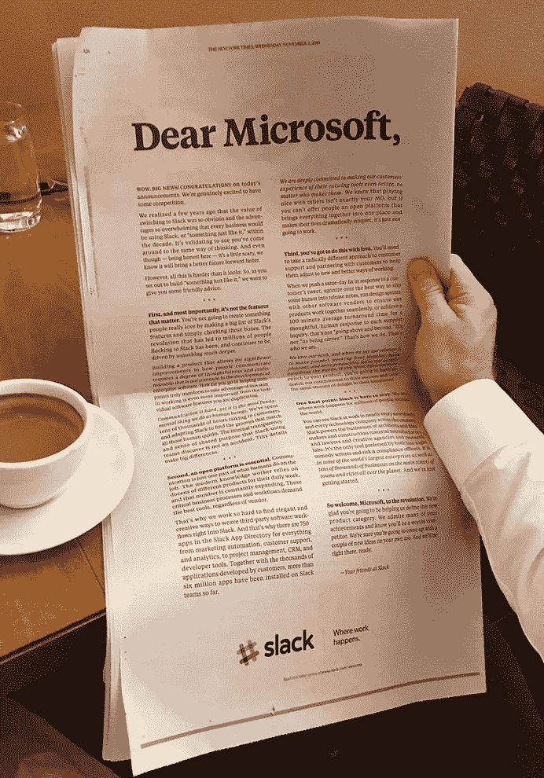
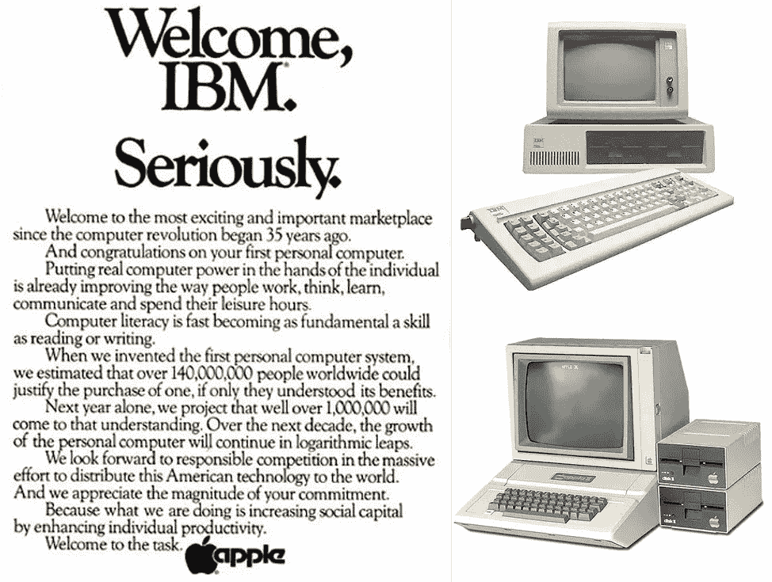
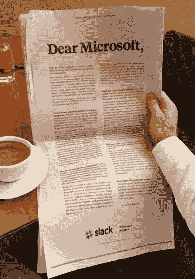

# “胜利的勇士先赢再战，失败的勇士先战再谋胜”——孙子兵法

> 原文：<https://medium.com/hackernoon/did-slack-really-not-see-it-coming-a011cd840e5b>

现在是技术行业的艰难时期。忘记奢华的硅谷派对和自动庆祝的大卫·芬奇电影——当池塘里满是即将到来的新鱼时，你很难向上游。当池塘里满是饥饿的鲨鱼等着在你眼皮底下抢夺猎物时，事情变得更加艰难。

如果你不够大，不能消灭它们，你只能求助于向同一个方向游泳。希望能先找到食物。

科技行业现在是一个由高技能、有干劲的个人组成的生态系统，他们不断推动创新，对我们最喜爱的科技产品进行细微调整。消失的私信；把你的脸变成一片烤面包的过滤器；通过你的手机和一个低薪的骑车人送你的中国外卖——小小的推动让我们的世界天翻地覆。

但在变革的核心，存在着一场让伟大的头脑相互超越的无情竞争。它们争夺同样多汁的鱼:

**留住用户。保持“酷应用”的地位。酷到让 Z 世代放下作业去看凯莉·詹娜假唱她男朋友的说唱。**

所以难怪科技公司会无耻地抄袭彼此的想法；回头看看，抓住独家闪亮的功能，将解锁社会媒体参与的头奖。

因为这是硅谷的生存游戏。

**成为伟大的应用。或者通过复制别人的伟大来避免死亡。稍微改进一下，让它看起来不那么明显；只是为了更快地游向你的数码鱼。**

以脸书为例。首先是从推特**借用的 *@功能*。然后是**脸书直播，**看起来很像推特的**潜望镜**。但是随着 Instagram 越来越受欢迎，事情变得棘手起来，insta gram 的过滤器和社交媒体的可销售性正在从他们的脸书 feed 中吸引过来。Instagram 大大降低了脸书的用户参与度；从青少年到名人，拥有一个精心策划的 Instagram 个人资料突然变得比在脸书跟踪你的大学朋友更重要。**

因此，扎克伯格闻到了这种难闻的威胁，决定支付 10 亿美元，让 Instagram 为他在池塘里游泳，而不是费心更换它。

(值得一提的是，当时的 Instagram 并不像今天这样是广告收入机器。)

但是游戏变得更难了。一只新的鲨鱼来到了小镇: **Snapchat。**

Evan Spiegel for ADWEEK

Snapchat 是一款即时照片通讯应用，它在捕捉池塘中最受欢迎的猎物方面突然变得不可战胜:**千禧一代**。再一次，脸书不会被另一个大学毕业生创办的另一家创业公司排挤掉；因此，2013 年，**扎克伯格向 Snapchat 提供了 30 亿美元，以友好地解雇数百万厌倦了脸书的用户。**

但当时 23 岁的 Snapchat 联合创始人埃文·斯皮格尔没有让这种情况发生。斯皮格尔非常清楚他所坐的黄金王座。尤其是如果他们继续正确出牌的话。因此，很明显，他们要继续在池塘里玩耍，对 30 亿美元说不，并保持突然成为有史以来最大的社交网络的平等对手的苦乐参半的机会。(直到 Snapchat。)

脸书从未忘记这一点。在过去的几年里，祖克伯格不知疲倦地拼命想把 Snapchat 推得更远一点，希望有一个突破点。Instagram 上的故事几乎与 Snapchat 上的故事相同，而且很快将在 Whatsapp 上推出，这是又一次令人印象深刻的购买，可能会被添加到脸书的收藏中。

但是 Snapchat 没有断。事实上，有传言称，尽管存在明显的抄袭 Spiegel 以战略沉默回应 Snapchat 的表现比以往任何时候都好。

该公司[的目标是在今年上市时筹集 40 亿美元，但这个数字预计将达到 300-400 亿美元。](http://www.businessinsider.com.au/snapchat-to-raise-4-billion-in-ipo-2016-10)

更不用说由于其成功的品牌合作和用户参与，他们预计将获得 10 亿美元的广告收入；或者他们的新科技产品**眼镜**，一副可以帮你抓拍的太阳镜。

Snapchat 的成功可能要归功于一个古怪的应用程序，它具有令人上瘾的过滤器和有效的数字营销策略，但我们不得不佩服他们的胜利，他们游得比脸书这样的巨型社交媒体鲨鱼还快。

这不仅仅是运气。斯皮格尔知道他的应用程序的受欢迎程度会吸引脸书带走他的用户。不是因为鸡毛蒜皮或不公平竞争，而是因为这是你成为硅谷最佳科技公司的游戏方式。

你创造了一个伟大的产品。你等着用户上瘾了再告诉他们的朋友。然后你就等着更大的公司来窃取你的想法，因为技术领域的伟大想法不仅仅是积累了数百万——它们推动着下一个伟大的事情。

这是一个艰难的游戏，不是每个人都能玩。当你发现自己的作品被善意地借用来改善另一家公司的服务时，肯定会很不愉快。

但正如他们所说的，这是规矩。

只不过，不是每个人都能接受失败。

本周轮到斯莱克与鲨鱼战斗，他们对此并不高兴。

Slack 是一款受欢迎的实时消息应用程序，已经赢得了 Conde Nast、IBM 和 Linkedin 等公司 400 万每日活跃用户的心。该公司目前估值 38 亿美元；它的成功部分归功于其不被看好的创始故事、无可挑剔的服务和对用户服务反馈的承诺。

然而，Slack 没有看到明显的情节转折走向他们的突出成功。

**团队**，微软本周发布的一款相同的生产力和交流服务。

Teams 所做的正是 Slack 所做的。不同的是，Teams 提供了视频和音频功能，Slack 的用户几个月来一直在向该公司施压，要求实现这一功能。团队也有可能被 **Linkedin、【Slack 的大客户使用，更不用说微软的新收购了。**

你可能会认为，一个允许在工作场所进行即时文件共享和交流的服务应该知道一家公司即将面临的威胁，这家公司的业务完全基于办公室使用的技术。

这只是一个时间问题，微软最终抓住机会，用一个工具来完成它的微软 Office 包，这个工具允许文件共享，而不必使用第二方应用程序。

但我猜 Slack 真的对此感到震惊和愤怒，如果你看看他们在《纽约时报》上发表的整版广告信，指责微软没有公平竞争。

忘记信中明显的观察和无聊的抱怨语气。

Slack 真的没有预见到它的到来吗？还是他们羞于承认自己的天真，认为没人会跟踪他们？

> 创新发生在硅谷，人们发明格式，这很好。然后你会看到这些格式激增。于是@用户名就在 Twitter 上被发明出来了。标签是在推特上发明的。Instagram 有那些。过滤照片不是 Instagram 发明的。
> 
> 你不能只是再造一个产品。但是你可以说‘一种格式真正了不起的是什么？它适用于我们的网络吗？— **凯文·斯蒂斯特罗姆，Instagram 的创始人**

硅谷是一场失败的游戏。努力筹集投资，建立一支由有才华的工程师和营销人员组成的团队。建造一个值得觊觎的开放式办公室。一旦街区周围的孩子或工作中无聊的员工认为你过时了，所有这些都会被扔进垃圾桶。

在一个每条鱼都在争夺数十亿美元和用户的池塘里，如果你想打败等在拐角处的鲨鱼，你必须游得更快。

> [黑客中午](http://bit.ly/Hackernoon)是黑客如何开始他们的下午。我们是 [@AMI](http://bit.ly/atAMIatAMI) 家庭的一员。我们现在[接受投稿](http://bit.ly/hackernoonsubmission)，并乐意[讨论广告&赞助](mailto:partners@amipublications.com)机会。
> 
> 如果你喜欢这个故事，我们推荐你阅读我们的[最新科技故事](http://bit.ly/hackernoonlatestt)和[趋势科技故事](https://hackernoon.com/trending)。直到下一次，不要把世界的现实想当然！

