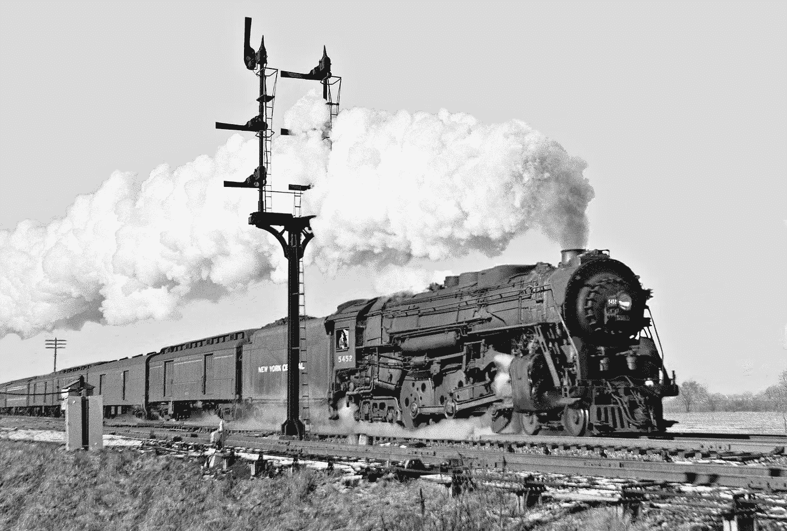
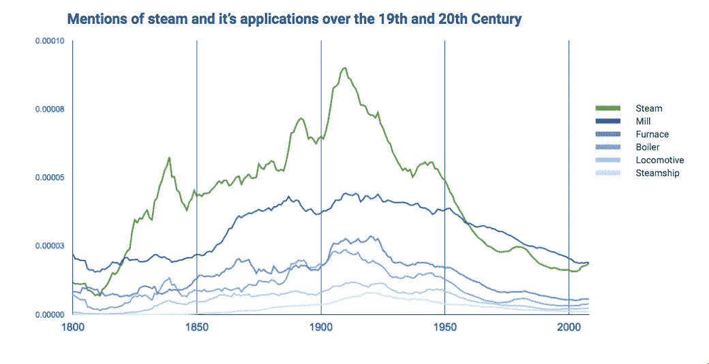
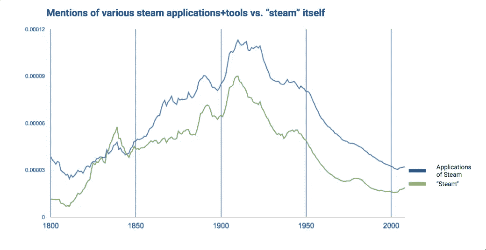
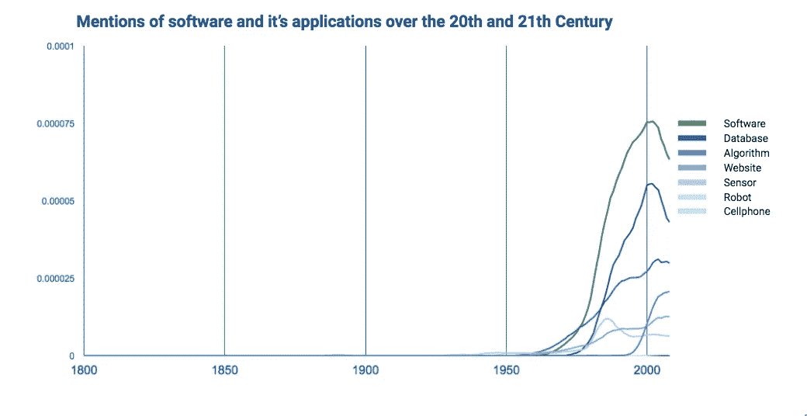

# 蒸汽吞噬了世界吗？

> 原文：<https://medium.com/hackernoon/did-steam-eat-the-world-e9d1cdca3e09>

## 陷入“数字革命”没有抓住重点。

迈克尔·卡塔

马克·安德森因创造了短语“[软件](https://hackernoon.com/tagged/software)正在吞噬世界”而闻名要点:各种形式和规模的公司都在使用[技术](https://hackernoon.com/tagged/technology)来转变他们的商业模式和产品。人们记住了什么？“颠覆即将到来”“不确定性无处不在”“数字体验才是王道。”

****[**嗡嗡声**](https://twitter.com/search?q=cloud%20big%20data%20agile%20digital&src=typd)******[**还没停。**](https://techcrunch.com/event-type/disrupt/) 现有公司正以惊人的速度收购初创公司[投资数百万到“创新实验室”](http://www.bakingbusiness.com/articles/news_home/Business/2015/02/Campbell_shifts_focus_to_fewer.aspx?ID=%7BFA0A84BE-8599-4F03-BE01-6A69E89F152B%7D&cck=1)收益时好时坏。**********

****一直都是这样吗？前几代有没有炒作通用技术？我最近在华盛顿州的西雅图，路过他们美丽的美国国家铁路客运公司车站。这引发了一个问题:人们对 steam 这么感兴趣吗？****

********

****他们是！蒸汽是一个庞大的概念。谷歌有一个[伟大的方式](https://books.google.com/ngrams/graph?content=steam%2Clocomotive%2Csteamship%2Cmill%2Cfurnace%2Cboiler&year_start=1800&year_end=2008&corpus=15&smoothing=3&share=&direct_url=t1%3B%2Csteam%3B%2Cc0%3B.t1%3B%2Clocomotive%3B%2Cc0%3B.t1%3B%2Csteamship%3B%2Cc0%3B.t1%3B%2Cmill%3B%2Cc0%3B.t1%3B%2Cfurnace%3B%2Cc0%3B.t1%3B%2Cboiler%3B%2Cc0)来研究这个问题。它被称为 Ngrams，统计数百年来出版物中出现的术语。如果有人在报纸或书中谈论 steam[填空],我们可以找到该术语的相对频率。我们在讨论挖掘 200 年前的技术人群聊天记录。****

********

****Source: Google Ngrams****

****我将提到的“蒸汽”与当时的主要应用进行了比较:加热、制造、运输。果然，就像今天的软件一样，世界听到的关于“steam”的消息比它任何一个改变生活的应用都多。****

****蒸汽吞噬了世界—**—如果你成为一个经典认知谬误的受害者。**行为经济学家 Tversky 和 Koehler 将其定义为[次加性效应](https://en.wikipedia.org/wiki/Subadditivity_effect)。这是一种奇特的说法“你用一个单一的名字低估了事物的意义。”当我们把所有的技术进步捆绑在一把像 steam 或软件这样的保护伞下时，我们往往会限制我们对这些工具如何推进国家、市场和人民的理解。****

****我们如何克服这种误解？我们必须关注细节。我们不应该说“蒸汽正在接管世界”，而应该专注于听听案例研究:“火车头使我们有可能在几天内，而不是几周内走遍这个国家。”技术进步在这些事实和现实中变得有意义。****

********

****Source: Google Ngrams****

****人们谈论的更多的是小麦磨坊和火车，而不是基础技术。很难看到或听到，除非你花时间把所有应用蒸汽动力对世界产生影响的地方汇总起来。****

******蒸汽没吃遍天下。** [科尼利尔斯·范德比尔特](https://en.wikipedia.org/wiki/Cornelius_Vanderbilt)、[奥立弗·伊文斯](https://en.wikipedia.org/wiki/Oliver_Evans)、[罗伯特·富尔敦](https://en.wikipedia.org/wiki/Robert_Fulton)“吃掉了世界”，他们分别控制着铁路、制造业和轮船工业。蒸汽机的真正影响是那些故事，而不是技术本身。****

****向前闪 125 年。我们今天看到了同样的现象。我用更新的术语进行了同样的搜索。软件和几种应用:数据库、算法、传感器、机器人、手机、网站。****

********

****Source: Google Ngrams****

****软件是一种用途广泛的通用工具。它拥有最多的引用，因为它与所有应用程序有一些共同之处。在这个学期很容易陷入困境。数字是另一个很好的例子。除非我们谈论的是共享全球移动或自动化医生繁忙工作的能力，否则数字化有什么意义。****

****几十年后，综合数据证明了这一点。人们对手机和传感器比对“软件”更感兴趣。同样，在我们编译这些例子之前很难理解。****

********

****Source: Google Ngrams****

****领导团队的课程:了解软件如何改变你的基本商业模式。安德森试图在信中分享这一点，但没有用他的口号表达出来。****

******软件并没有吞噬世界。利用技术改变解决实际问题方式的公司、领导者和团队“吞噬了世界”。******

****我想，没那么上口吧！？****

****普通的首席执行官不负责开发下一个改变世界的技术。蒸汽机的发明者詹姆斯·瓦特于 1819 年去世，比范德比尔特的纽约中央铁路公司成立早了 34 年。他去世后几十年，他的发明才融入日常生活。****

****瓦特是发明家，不是经理。事实上，他讨厌经营自己的小型咨询业务。他和范德比尔特之间的比较并不是为了挑战他们的生活选择或影响。在投资数百万美元之前，了解您作为一个组织的抱负很重要。****

****您的公司或团队有一个目标:将 **X** 产品带给 **Y** 人。您的工作是发现最有效、最有创意、最美丽的方式来制作和分享您的作品。为了技术而投资技术——敏捷转型、云开发、机器学习人工智能等。—可能会让您偏离您的核心工作:为他人创造价值。****

****下一次你发现自己说“软件正在吞噬世界”或“我们需要数字体验”或一些#大数据#颠覆的组合…****

****…只需检查您自己。**确保不要吹热空气。******

> ******特别感谢马特·尼克莱构建并共享了他的 [python 应用程序](https://github.com/econpy/google-ngrams)，该应用程序可以从 Ngrams 查询中获取原始数据。******