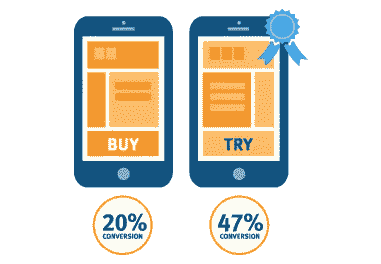
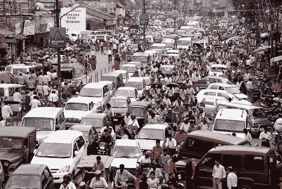
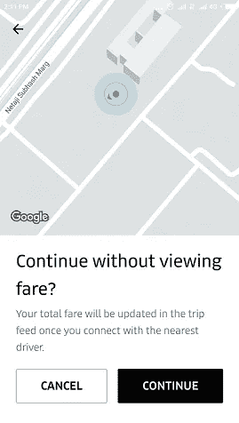
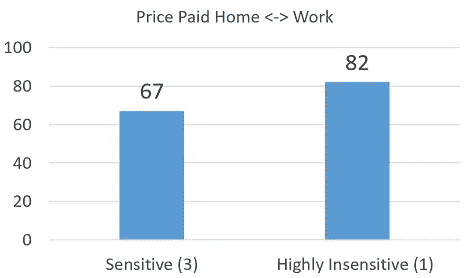

# 优步刚刚在印度进行了第一次提高收入的测试吗？

> 原文：<https://medium.com/hackernoon/did-uber-just-run-its-first-test-to-boost-revenue-in-india-7456d235abdf>

一旦成为产品人，就永远是产品人！！！我刚刚注意到一些整洁的 A/B 测试，这让我怀疑优步是否正在进行一项实验，以提高其在印度的超级用户的收入。

对于门外汉来说，A/B 测试是一种实验形式，其中在统计上相似的组中测试两个特性，称为 A 和 B，以确定新特性是否适合其目标用户群。它经常被用于[测试](https://hackernoon.com/tagged/testing)网络和电子邮件[营销](https://hackernoon.com/tagged/marketing)活动，并且越来越多地被用于移动应用。下面是一个简单的例子:对于一个相同的设计，将单词“Buy”改为“Try”会使转化率增加一倍以上。

A/B Test **example**. Changing a single word more than doubles the conversion rate.

# **我的用户资料:**

在我叙述优步的测试之前，让我描述一下我是哪种类型的优步用户。2015 年从[旧金山湾区](https://en.wikipedia.org/wiki/San_Francisco_Bay_Area)搬到印度德里后，我决定不买车。这里有一个简单的经济因素:一辆中级车，什么都有(租赁/付款，印度昂贵的燃料，维护等等。)每月花费从 40-60，000 卢比(600-900 美元)不等。我每月的优步骑行很少超过卢比。10，000 英镑(160 美元)加上不用在印度疯狂的交通中开车的便利是一个大数目。虽然 160 美元在美国听起来不算多，但在印度，它可能让我成为前 1-5%的优步车手。

Why Uber is such a good choice in India

# **我感兴趣的测试:**

上周四，在预订我的优步时，我注意到一个新的特点。没有给我看价格，让我在订车前确认同样的价格，而是得到了下面的提示。

Uber prompt for booking a car without viewing fare

我直觉地知道这是一个 A/B 测试；事实上，有一段时间我一直在想，考虑到票价太低，无法盈利，优步在印度市场争夺霸权时会进行什么样的货币化测试。

# **测试特点:**

虽然我不是优步的圈内人，但我还是对这项测试的主要特征进行了猜测

*   *目标受众*:花费大量金钱的重度用户，他们似乎使用优步满足大部分(如果不是全部)交通需求
*   测试:价格敏感度。如果人们在预订汽车时没有查看价格，他们很可能对乘车的价格不太敏感
*   *业务目标*:收入和盈利能力

> 对于像我这样的移动 B-to-C 产品的人来说，测试看起来 ***设计得非常好。*** 注意文本“一旦您连接到最近的司机，您的总费用将在 ***行程信息*** 中更新”。
> 
> 1.因为你必须采取额外的步骤来检查行程提要中的票价，很可能一些乘客不会这样做。你可以称这个群体为“对价格高度不敏感”
> 
> 2.对于那些在预订时跳过票价，但后来又来结账的人来说，价格可以被称为“对价格有些敏感”
> 
> 3.点击了提示上的“取消”并在预订前检查了价格的人是“对价格敏感的”

# **检验我的假设**

虽然我的数据有限。只有一个用户(我)和不到 10 次的骑行，早期的指标是定价上确实有些差异。以下是我在对价格“敏感”的旅行中支付的平均价格，例如，在提示上点击“取消”,对价格“高度不敏感”,例如，点击“继续”,但没有检查旅行提要中的价格。

It does appear that being highly insensitive to price has its price — about 23% higher price (no pun intended)

请注意，当我对价格非常不敏感时，我支付的价格大约高出 23%。价格上的一些差异可能是交通延误等因素造成的，因为我在上班时间短途旅行，往往会造成票价 10-15%的波动。为了消除这种偏见，我对两个方向(从家到单位的来回)和不同时间(早上和晚上)的旅行进行了平均。但是考虑到数据集很小，我认为这个测试会有一些偏差。

# **优步可能在做什么:**

优步在印度面临多重挑战:前两项挑战是与印度本土球员奥拉的残酷竞争，以及没有消退迹象的烧钱行为。与此同时，就像任何其他市场一样，它知道自己有一个“核心”用户群，这些用户如此沉迷于优步体验，以至于他们不介意支付更多费用来继续拥有同样的体验。

> 测试是潜在的发现核心#优步用户，看看他们会支付多少额外的费用

# 终极问题:为什么有人会为同样的旅程付出更多？

对我来说，至少有几个原因:

*   我每月节省 75-85%的交通费用，并享受它提供的自由和灵活性。我知道优步不可能永远烧钱，我也不希望它长期失败
*   我还预计，作为更高价格的交换，优步最终将为其核心用户提供差异化服务。虽然我不为优步工作，也没有内部消息，但它可以表现为更好的司机，更好的设施的新车，甚至可能没有最高价格。竞争对手 Ola 已经有了一项类似的服务，名为 [OlaSelect](https://www.olacabs.com/olaSelect) ，形式为包月服务。

# 结语:

旁观印度出租车行业的发展是一件有趣的事情。随着优步(我很少使用 Ola)推出更多的测试，我会让你在循环。

对于所有阅读这篇文章的产品经理来说，让我们享受更多的乐趣。请评论:

*   你如何帮助我收集更多的数据来支持或否定我的假设？
*   优步还应该做些什么来提高在印度的盈利能力？
*   优步是否正在进行其他测试*，你可以从使用产品*中推断出来吗？

***嗨那儿。像这样的文章需要花费相当多的时间和精力来写，所以如果你点击下面的绿色心脏，它会让编辑知道你喜欢它。谢谢***

N E X T → [**印度送餐创业公司的漏桶**](/@SantanuB/the-leaky-bucket-of-indian-food-delivery-start-ups-2eb1792e890c)

> [黑客中午](http://bit.ly/Hackernoon)是黑客如何开始他们的下午。我们是 AMI 家庭的一员。我们现在[接受投稿](http://bit.ly/hackernoonsubmission)并乐意[讨论广告&赞助](mailto:partners@amipublications.com)机会。
> 
> 如果你喜欢这个故事，我们推荐你阅读我们的[最新科技故事](http://bit.ly/hackernoonlatestt)和[趋势科技故事](https://hackernoon.com/trending)。直到下一次，不要把世界的现实想当然！

