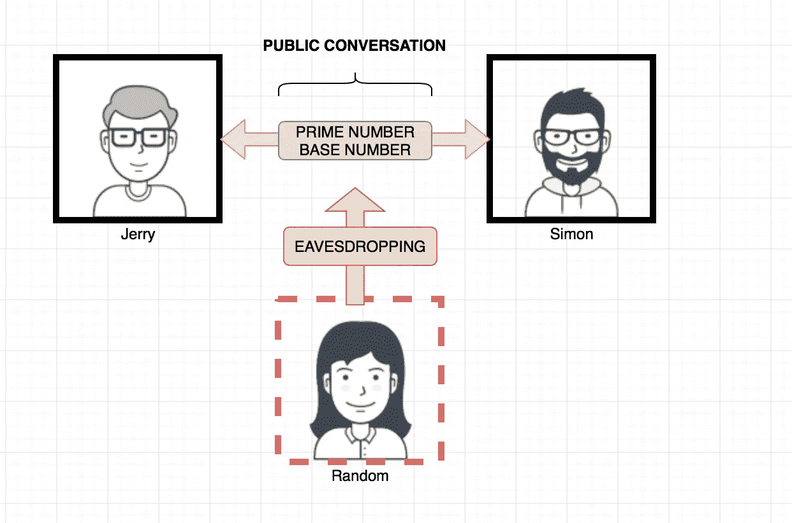
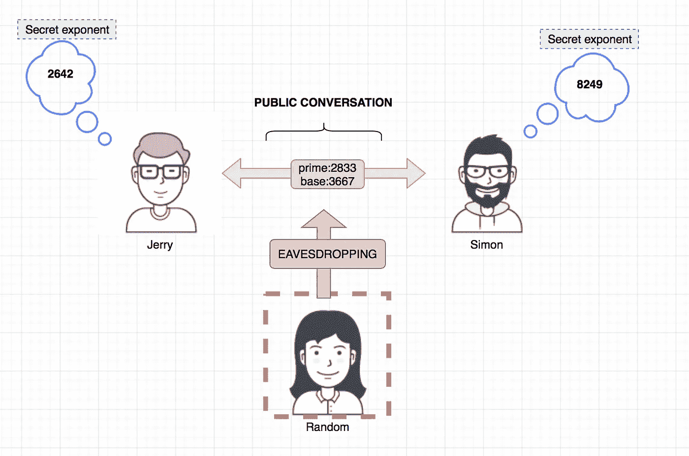
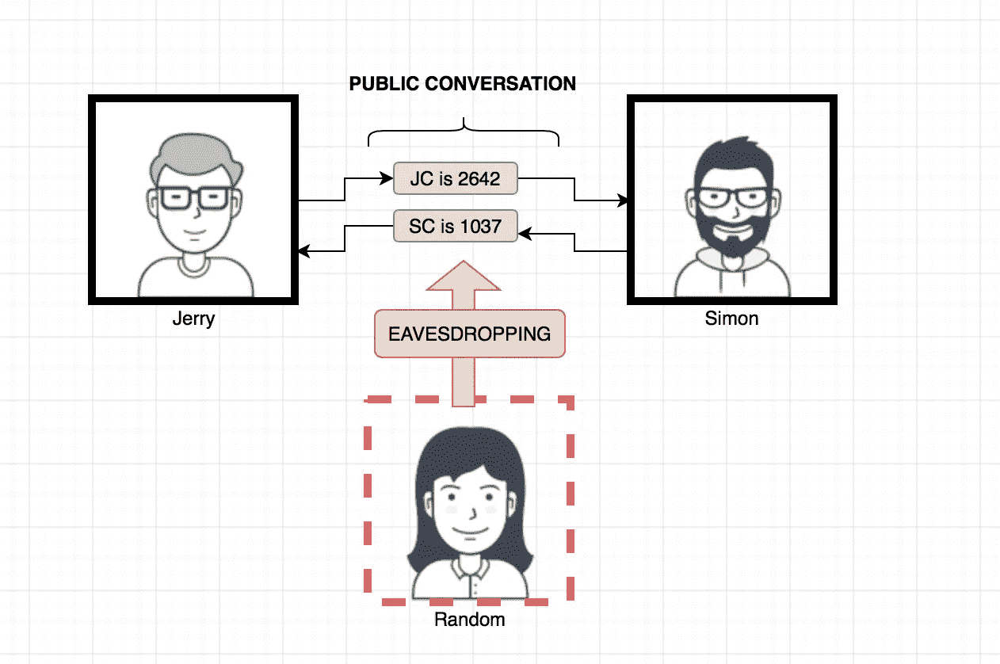

# 迪菲-赫尔曼解释说。

> 原文：<https://medium.com/hackernoon/diffie-hellman-explained-sort-of-5efd0467584c>

D-H 是一种密钥交换机制，一种通过公共信道交换加密密钥的方式，也就是说，**我想和我的好友 Simon 约定一个数字，但是我不想告诉他这个数字是什么。**



Agreeing in Prime and Base Numbers

因此，要做到这一点，有一些要求，也有一些规则必须适用于我们要在开放空间交流的价值观:

*   同意质数
*   同意一个基数
*   每个 1 个秘密指数

因此，所有这些数字都通过公共交通工具相互交流，这是一个要求:**每个用户都会生成一个“秘密指数”，它们之间不能有任何公因数**。所以这里有一些代码来弥补

```
def giveMePrimes():
  primeList = list()
  for num in range(1000,10001):
    if all(num%i!=0 for i in range(2,int(math.sqrt(num))+1)):
      primeList.append(num)
  return primeList
```

这会将范围()中的质数追加到列表中。

对于基指数和秘密指数，我们在一个范围内随机选择数字:

```
secure_random.choice = random.SystemRandom()
secure_random.choice(range(1,10001))
```

假设我们有这些数字:

```
P (prime) = **2833**
N (base) = **3667**
J(Jerry's Secret exponent) = **6531**
S(Simon's Secret exponent) = **8249**
```

只有秘密指数才是我们想要保密的，杰瑞和西蒙只知道他们的“秘密指数”，P 和 N **，简而言之，只有 P 和 N 已经通过公共渠道进行了交流。**



现在，每一方将使用他们拥有的值 **(P，N 和每个单独的“秘密指数”)**计算一个数

Jerry 将计算:(N(底数)的 J(秘密指数)模数 P(质数))

```
JC = N ** J % P (**2642**)
```

西蒙:

```
SC = N ** S % P (**1037**)
```

并且他们会互相传递这些值 **(Jerry 把 JC 传给 Simon，Simon 把 SC 传给 Jerry)。**



很好！现在来回顾一下，让我们看看每个人都知道哪些价值观:

**杰瑞**:质数，底数，杰瑞的秘密指数，JC 和 SC

**西蒙**:素数、底数、西蒙的秘密指数、JC 和 SC

**随机** : Prime，Base，JC，SC

所以现在是魔术发生的时候了，他们都应用了下面的函数:**(对等体的计算数到“秘密指数”模素数)**

杰瑞:

```
SC ** J % P
```

西蒙

```
JC ** S % P
```

如果你计算一下，这可以转化为:

尿壶

```
1037 ** 6531 % 2833 = 1747L
```

西蒙

```
2642 ** 8249 % 2833 = 1747L
```

太好了( **L** == Python 的字面意思)，现在我们有了一个西蒙和杰瑞知道的数字( **1747L** )，这个数字是从一堆公开传播的数字衍生而来的。

有了这个号码作为“钥匙”,西蒙和杰瑞就可以开始用密码进行秘密交流了。

我举了一个例子，我用它来做这个，它有点用:

[](http://bit.ly/HackernoonFB)[](https://goo.gl/k7XYbx)[](https://goo.gl/4ofytp)

> [黑客中午](http://bit.ly/Hackernoon)是黑客如何开始他们的下午。我们是 [@AMI](http://bit.ly/atAMIatAMI) 家庭的一员。我们现在[接受投稿](http://bit.ly/hackernoonsubmission)，并乐意[讨论广告&赞助](mailto:partners@amipublications.com)机会。
> 
> 如果你喜欢这个故事，我们推荐你阅读我们的[最新科技故事](http://bit.ly/hackernoonlatestt)和[趋势科技故事](https://hackernoon.com/trending)。直到下一次，不要把世界的现实想当然！

