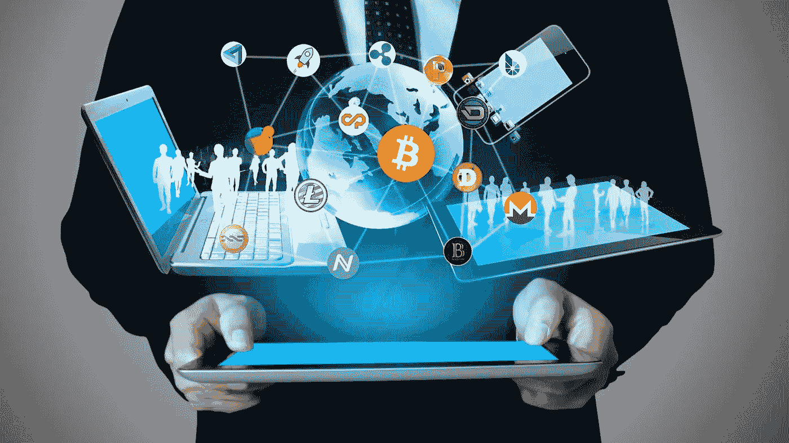

# 数字货币阅读列表

> 原文：<https://medium.com/hackernoon/digital-currency-reading-list-13fe3f565dd8>

*灵感来自克里斯·狄克逊的* [*【加密令牌综述】*](/@cdixon/crypto-token-roundup-4d57c32a87d7) *&丹·罗梅罗的* [*数字货币阅读清单*](/@dwr/digital-currency-reading-list-6219f1623bfd) *。*

我经常被问及如何更多地了解加密货币领域的建议。因此，我整理了一个列表，汇集了一些最好的内容，以便其他人更容易理解。

请随意使用此列表作为路线图，以更好地了解该领域的更大趋势和这一新兴技术的细微差别。

以下资源按照复杂程度在每个子类别中进行分类和排序。我特别推荐臭名昭著的 2014 年纽约时报的马克·安德森的帖子[“为什么比特币重要”](https://dealbook.nytimes.com/2014/01/21/why-bitcoin-matters/?mcubz=1)，联合广场风险投资的帖子[“Fat 协议”](https://www.usv.com/blog/fat-protocols)&[hash power 播客](http://investorfieldguide.com/hashpower/)。

如果你喜欢这些资源，并且想了解最新的内容，请随时在 Twitter 上关注我。

对于一个更详尽的列表，a16z 有一个最好的可用资源集合。

 [## 加密标准

### 这里有一个列表——基于并包括克里斯的上一篇综述——是加密阅读和资源的列表。它组织自…

a16z.com](https://a16z.com/2018/02/10/crypto-readings-resources/) 

## 火帽

 [## 比特币是什么？

### 比特币基地是一个购买、出售、转移和存储数字货币的安全在线平台。

www.coinbase.com](https://www.coinbase.com/what-is-bitcoin?locale=en-US)  [## 以太坊初学者指南

### 以太坊是什么？

blog.coinbase.com](https://blog.coinbase.com/a-beginners-guide-to-ethereum-46dd486ceecf)  [## 像我五岁一样解释比特币

### 如果你还是不知道比特币到底是什么…

medium.freecodecamp.org](https://medium.freecodecamp.org/explain-bitcoin-like-im-five-73b4257ac833) 

## 比特币

 [## 为什么比特币很重要

### 编者按:马克·安德森的风险投资公司安德森·霍洛维茨投资了将近 5000 万美元在…

dealbook.nytimes.com](https://dealbook.nytimes.com/2014/01/21/why-bitcoin-matters/?mcubz=1)  [## 大卫·萨克斯:加密货币实现了我们试图在贝宝建立的“最初愿景”

### 杰克逊:这让我想起了橡树资本的霍华德·马克斯最近发出的投资者信，他在信中说…

www.cnbc.com](https://www.cnbc.com/2017/08/14/david-sacks-cryptocurrency-interview.html) 

[***比特币原创白皮书***](https://bitcoin.org/bitcoin.pdf) 作者中本聪:

## 以太坊

 [## 以太坊是数字货币的前沿

### 过去 3 年，我们一直坐在这里，只看到钱包和交易所等基础设施应用程序出现在…

blog.coinbase.com](https://blog.coinbase.com/ethereum-is-the-forefront-of-digital-currency-5300298f6c75)  [## 将以太坊扩展到数十亿用户

### 代币的售价意味着它们将拥有数百万用户。但是区块链能支持它吗？如果没有…

medium.com](/@FEhrsam/scaling-ethereum-to-billions-of-users-f37d9f487db1) 

## 加密货币生态系统

 [## 超越比特币泡沫

### 要了解此类协议的巨大但不可见的优势，想象一下这些关键协议中的一个…

www.nytimes.com](https://www.nytimes.com/2018/01/16/magazine/beyond-the-bitcoin-bubble.html)  [## 通往数十万亿美元资本的道路

### 有三个基本假设试图回答这个问题，“超级大赢家将会走上什么样的道路…

多重资本](https://multicoin.capital/2018/03/15/paths-to-tens-of-trillions/)  [## 加密货币的网景时刻

### 正如网景公司的首次公开募股标志着互联网时代的真正开始，2017 年将是广泛…

blog.eladgil.com](http://blog.eladgil.com/2017/07/cryptocurrencys-netscape-moment.html)  [## Fat 协议|联合广场企业

### 在区块链应用程序堆栈中，协议和应用程序之间的这种关系正好相反。价值…

www.usv.com](https://www.usv.com/blog/fat-protocols)  [## 关于代币的思考

### 令牌今天还很早，但明天将改变技术。

news.21.co](https://news.21.co/thoughts-on-tokens-436109aabcbe)  [## 区块链代币和去中心化商业模式的曙光

### 在过去的几年里，风险投资公司已经向数字货币初创公司投资了超过 10 亿美元，而且…

blog.coinbase.com](https://blog.coinbase.com/app-coins-and-the-dawn-of-the-decentralized-business-model-8b8c951e734f)  [## 加密令牌:开放网络设计的突破

### 互联网和网络被创建为开放平台，任何人——用户……

medium.com](/@cdixon/crypto-tokens-a-breakthrough-in-open-network-design-e600975be2ef)  [## 为什么权力下放很重要

medium.com](/@cdixon/why-decentralization-matters-5e3f79f7638e) 

## 播客

 [## 哈希力量——一部关于区块链和加密货币的纪录片

### 欢迎哈希力量，一个音频纪录片，探索世界的区块链和加密货币与领导人在…

investorfieldguide.com](http://investorfieldguide.com/hashpower/)  [## 加密货币的沉默大师——尼克·萨伯

### “可信第三方是安全漏洞。”—Nick Szabo Nick Szabo(@ nickszabo 4)是一个博学的人。广度和深度…

蒂姆.博客](https://tim.blog/2017/06/04/nick-szabo/) 

## 书

*[***《加密资产:比特币及以后的创新投资者指南》***](https://www.amazon.com/Cryptoassets-Innovative-Investors-Bitcoin-Beyond/dp/1260026671/ref=sr_1_1?s=books&ie=UTF8&qid=1506706709&sr=1-1&keywords=cryptoassets+the+innovative+investor%27s+guide+to+bitcoin+and+beyond)*

*[***区块链革命:比特币背后的技术如何改变货币、商业和世界***](https://www.amazon.com/Blockchain-Revolution-Technology-Changing-Business/dp/1101980133)*

*[***掌握比特币:编程开放区块链***](https://www.amazon.com/Mastering-Bitcoin-Programming-Open-Blockchain/dp/1491954388/ref=sr_1_1?s=books&ie=UTF8&qid=1506706689&sr=1-1&keywords=mastering+bitcoin)*

## *电影*

* [## 比特币银行|网飞

### 这部纪录片以采访爱好者和专家为特色，涵盖了比特币的根源、未来和未来

www.netflix.com](https://www.netflix.com/title/80154500) 

# 阅读更多关于[黑客正午](http://hackernoon.com)

 [## 加密货币-黑客正午

### 在黑客正午阅读关于加密货币的文章。黑客如何开始他们的下午？

hackernoon.com](https://hackernoon.com/tagged/cryptocurrency)*