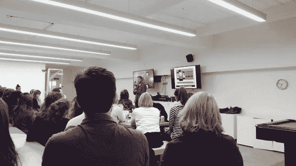
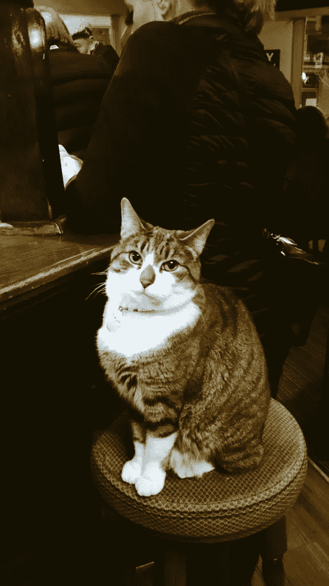

# 数字妈妈日:在 MOO 的谈话

> 原文：<https://medium.com/hackernoon/digital-mum-days-the-talk-at-moo-b5d84c3a8958>

我知道，这是个随意的标题，但你不觉得有点好奇吗？我喜欢一个挑逗性的标题，它会让你“嗯”了一声，然后当你渴望知道更多的时候，手指交叉会把你吸进去。具体来说，“MOO 上的谈话”发生在本周早些时候的周二，是 Holler 的联合创始人兼李奥·贝纳移动和社交全球负责人詹姆斯·柯克汉姆(James Kirkham)的一次谈话。他的演讲题目是“社交媒体将不再一样”,由 MOO 主持，MOO 是一家印刷精美名片的公司，总部位于肖尔迪奇#obvs

我匆匆忙忙地与数码妈妈的犯罪伙伴安妮卡进行了会谈，离开了哈克尼欢乐的数码妈妈海运集装箱办公室(是的，真的)。尽管事实上我们已经在东伦敦了，但当我们沿着 Scrutton 街走的时候，我们还是设法迟到了#awks，首先，完全错过了建筑物(doh！)第二，一进门，并没有意识到谈话是在大楼的地下室进行的。当我们到达时，房间已经满了，而詹姆斯已经开始了；我进入了高效模式，在厨房外的一个会议室里发现了两张凳子，狡猾地示意安妮卡过来，这样我们一起走进去的另外两位不认识的女士就不会看到她们，然后我们把她们重重地放在乒乓球桌旁(很自然地)，摆出一副一直在那里的样子*。*

詹姆斯有很多关于社交媒体的话要说，我用紫色墨水的笔在我可信赖的记事本上尽可能多地做了笔记。由于我的几个同事不能来，我觉得我有责任尽可能多地吸收信息，以便我可以在以后分享它，这就是我现在打算做的事情，所以现在开始:

***‘现在效力依赖于人们谈论的伟大思想’***

詹姆斯进一步阐述了这一点，他举了一个梅赛德斯电视广告的例子，这是一个“社会驱动的广告”，恰当地加上了#youdrive。人们可以通过在推特上发布标签来选择广告的结尾，还可以发回一张个性化的电影海报图像，其中有一辆奔驰。他强调了反应性内容的增加，并警告说**品牌不应该使社交媒体饱和，只是简单地用噪音填充它。**

詹姆斯告诉我们的另一个有趣的社交媒体活动是为汝拉威士忌酒厂公司创建的。这个想法是在一个小时内产生的，成本在 100 英镑左右，但回报超过 20 万英镑——令人印象深刻的东西，那么他们做了什么？！作为对谷歌地图将酿酒厂所在地汝拉岛从地图上移除的回应，他们推出了#findjura。媒体报道了围绕“失踪的岛屿”的讨论，人们似乎很喜欢玩这个设计的“把故事钉在驴上”风格的#findjura 游戏。我必须说，与梅赛德斯相比，我更喜欢这个例子，因为它是一个不太知名的品牌，背后没有庞大的预算，但利用吸引人的标签和个性包的力量，它仍然能够产生巨大的影响。这不正是社交媒体的力量所在吗？

不出所料，詹姆斯是一个狂热的科技爱好者，老实说，他演讲中对科技快速发展的热情意味着我有时几乎无法跟上笔记的节奏。然而，让我印象深刻的一个要点是，当技术被完全采用时，最初用来描述它的词会消失，因为它已经如此深入我们的生活。为了说明这一点，他说十年后,“智能手机”这个词将不再被使用，我必须说我倾向于同意。

他给了我们一些令人印象深刻的互联网使用统计数据供我们思考:

**14 年前，4 亿人使用互联网**

**如今，30 亿人使用互联网，20 亿人通过智能手机访问互联网**

从而展示了互联网与移动电话的融合，以及为什么他在之前的演讲中提到 ***“你的社交策略就是你的移动策略”*。的确是这样。**

这巧妙地融入了我们在手机上使用的社交媒体和应用程序。他举了一个看似滑稽但最终非常成功的例子“yo”，这是一个可以让你按下按钮向联系人发送“Yo”的应用程序。这个应用程序是由一个人零投资开发的，现在已经有了一百万用户。詹姆斯关于“Yo”的观点是，凭借其一键式功能，这款应用符合我们日益追求的目标——简单。他接着说:***‘无所不能的应用已经死了’***此外还有一幅瑞士军刀的图片。

没有 Snapchat 这个社交媒体平台，任何关于社交媒体和移动的讨论都是不完整的，尽管我越来越想尝试一下。詹姆斯说，Snapchat 就是要活在当下，同时补充道，它非常适合偷窥和挑逗，有趣又刺激。Testino 甚至在 Snapchat 上分享了一些博柏利新系列的照片。他与一些青少年谈论了他们与 Snapchat 的互动，他们似乎发现 Snapchat 是真实的，因为 Snapchat 的短暂性增加了他们的诚实度。他还告诉我们，年轻人使用“Snapchat Discover”作为寻求建议的一种方式，因为他们被它的视觉特性所吸引。

在这一点上，詹姆斯告诉了我们 Tunepics，这款应用程序本质上允许用户分享图片/照片，并在顶部添加了音乐和情绪轮。如果你没有注意到，社交媒体上的情绪是一件大事，它可能会持续一段时间，更不用说这些天来我们日常互动中越来越多的使用表情符号了。大多数时候，我通常会部分地对这种厚颜无耻的眨眼感兴趣，但不能说我曾经认真地使用过茄子(我们都知道它代表什么，对吗？！)

詹姆斯谈到了 Periscope，并强调了# DrummondPuddleWatch(在 Drummond，人们看着其他人导航和/或跳进一个巨大的水坑)的不可预测的成功！)以及 Twitter 上相对较新增加的时刻。他还补充说，有了 WhatsApp，信息服务的兴起将为品牌提供思考的机会，尤其是当这些信息变得越来越音频/视频化的时候。

他的演讲继续以每小时 100 英里的速度进行，他讨论了通过使用你穿戴的技术的“触觉体验”，情感界面允许你通过使用可穿戴技术判断国家和身体的情绪。我必须说,“有毒朋友探测器”手镯听起来确实很不错，但是，嘿，你永远不知道…

他总结了需要学习的关键知识，提醒我们社交媒体内容需要:

**预约**

**个人**

**量身定制**

**相关**

以及这样的事实:***“社会无处不在，它渗透着一切”***

四舍五入为:

你的想法鼓舞了技术专家。这是从事创意行业的最佳时机

难怪这个演讲结束后，我发现自己抓了一把又一把免费爆米花，并在把这些都拿走后补充能量。当人们开始离开时，安妮卡和我找到了我们的数字妈妈伴侣，并安排了一次去酒吧的旅行，听取汇报。我们不可能泄露我们在那里谈了些什么，因为，嘿，当妈妈们晚上出去的时候，你知道，谈话会变得非常有趣。然而，我要告诉你的是，一只戴着钻石项圈的猫走进了酒吧，在酒吧里大步走着，扑通一声坐在了一个高脚凳上，我很自然地拍了张照片，并在推特上发布为#standard。毕竟，互联网仍然喜欢猫的照片。

> [黑客中午](http://bit.ly/Hackernoon)是黑客如何开始他们的下午。我们是 [@AMI](http://bit.ly/atAMIatAMI) 家庭的一员。我们现在[接受投稿](http://bit.ly/hackernoonsubmission)并乐意[讨论广告&赞助](mailto:partners@amipublications.com)机会。
> 
> 如果你喜欢这个故事，我们推荐你阅读我们的[最新科技故事](http://bit.ly/hackernoonlatestt)和[趋势科技故事](https://hackernoon.com/trending)。直到下一次，不要把世界的现实想当然！

