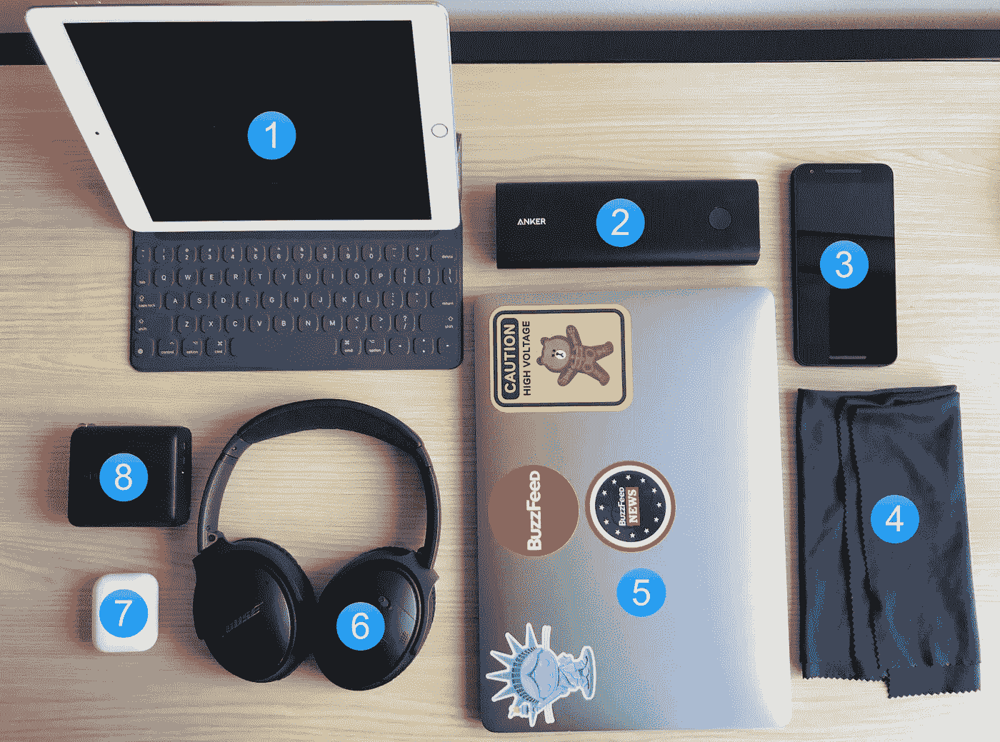

# 数字游牧生活:我背包里的技术

> 原文：<https://medium.com/hackernoon/digital-nomad-life-tech-in-my-backpack-3ee5a87b50ca>

在过去的一年里，我在 6 大洲、17 个国家、7 个时区和 21 个城市生活过。与此同时，远程全职工作。

工作是我的首要目标。工作是让我过这种生活的动力。所以很明显，连接是我关注的中心。此外，我是 BuzzFeed 基础设施团队的一员，这意味着，我每个月必须有一周的时间待命，其他时间通常是 24/7 全天候待命。

那么，我带着什么呢？说实话，我随身携带的东西变化很大！

# 任何放进我背包里的东西都必须在那里找到自己的位置，而且每周至少要用一次才能让它留在自己的位置上。

在这个系列的第一部分，我将尝试分解一下**我背包里的** [**科技**](https://futuretravel.today/tagged/tech) **通常是什么**。

*前言:没有我信任的 powerhorse，我的* ***苹果 iPhone 7 Plus*** *，这一切都不可能。老实说，这是我存在的动力。拍摄的照片不算太差(*[【instagram.com/sricola】T21](http://instagram.com/sricola)*)，不辜负电池续航时间的期望，大屏幕意味着我可以在旅途中阅读、写作或观看任何东西。*

1.  **配有智能键盘的 iPad Pro 9.7(4G LTE)**——当我想要比 iPhone 更大的东西，但不想拿出笔记本电脑时，这是我的随身设备——查看电子邮件、阅读、观看视频或几乎任何其他东西。有了 T-Mobile 的数据服务，我在美国、加拿大和墨西哥都能享受到高速互联网，在北美大陆以外的地方，网速虽然较慢，但也是可控的。
2.  **Anker PowerCore+外置电池** ( [链接](http://amzn.to/2uhsGwf) ) —让我的设备保持充电，巨大的 20，100 毫安时电池意味着有足够的电量。它还有一个 USB-C 充电端口，这意味着我也可以用它给我的 MacBook Pro 充电！对我来说，这本身就是一个巨大的卖点。
3.  **LG Nexus 5x 搭配 Google Project Fi** ( [链接](https://g.co/fi/r/NKY61D)，如果你签约，我们俩都可以得到 20 美元)——这是我的备用手机。我在漫游时用它来获得高速互联网，价格不算太贵，但也不算太贵，10 美元/GB。无论你在哪里——巴厘岛、东京、圣地亚哥——无论你去哪里，当你需要那一点点快速[互联网](https://hackernoon.com/tagged/internet)时，你就是救世主。手机也是解锁的，这意味着如果需要，我可以插入一个本地 SIM 卡。
4.  **超细纤维布** ( [链接](http://amzn.to/2u7VDdv))——我的意思是，所有这些设备都是指纹磁铁，没有人想要一个脏屏幕。我能说什么呢？我痴迷于干净的屏幕。
5.  **MacBook Pro，非 Touch Bar** ( [链接](http://amzn.to/2u7EiRO) ) —我对这个小笔记本电脑又爱又恨。电池寿命时断时续，图形上有故障自动对焦，过热但很轻，可以使用上述电池组充电。我开始喜欢上了低剖面键盘。
6.  **Bose QC35 降噪耳机** ( [链接](http://amzn.to/2u76rZg) ) — Bose 制造固体声学器件。它们不是我理想的发声对，但蓝牙功能和噪音消除使它在飞行或嘈杂的环境中成为上帝的礼物。电池寿命让我轻松度过 8 小时的飞行。
7.  **苹果 ai rpods**——好吧，这对我来说很难接受。他们也很难找到，因为苹果搞不清供应链。苹果比较老的有线 EarPods 从来没有在我耳朵里呆过，我对这些持怀疑态度。但是，没有老式的悬空电线，这些实际上留在我的耳朵里！我不敢带着它们在街上闲逛，但它们非常适合随意聆听。它们很容易收起，电池续航时间也不错。
8.  **Anker power core Fusion**([*链接*](http://amzn.to/2uh9sGS))——这是我一生电力需求的瑞士军刀。它不仅是一个多端口 USB 和 USB-C 充电器，它还有一个内置电池，可以自行充电。内置电池较小，但足以给我的 iPhone 7 Plus 充电至少一次。

**其他荣誉奖**

*   美国电源板——我有一个迷你 3 插座电源板。提示:有了它，你只需要一个插座和一个转换器就可以连接你所有的设备。
*   电缆——我的意思是，这是没有办法的。你*将*以一吨电缆告终。