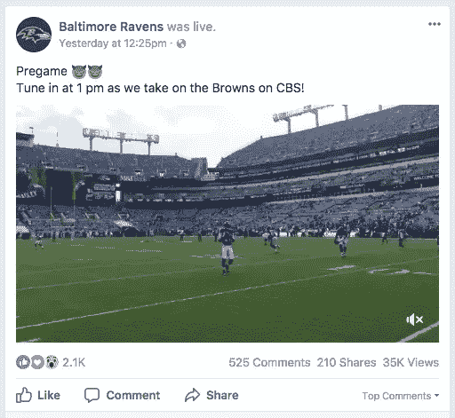

# 为什么社交媒体上的帖子没有截止日期？

> 原文：<https://medium.com/hackernoon/digital-pet-peeve-september-18-621d39d28a01>

## 数码宠物:9 月 18 日

你们都见过——脸书的[或者 Instagram 的](https://hackernoon.com/tagged/facebook)[算法](https://hackernoon.com/tagged/algorithm)，默认情况下，它会按照非时间顺序对内容进行排序，有时会出现一个明显过期的帖子。

(不只是旧…而是实际上过期、无效、陈旧、不适用——你明白了。)

例如:在比赛结束后，在您的订阅源中看到一个体育比赛宣传片帖子？

This was in my feed on Monday and referred to a game that was played on Sunday.

也许我错过了什么，但是:

> 为什么社交媒体平台不提供在帖子上包含截止日期(预定或其他)的功能，以便像体育或电视节目宣传帖子这样的东西会自动从算法中**取消**资格，并且在事件结束后不会出现在人们的订阅中？

我知道可能有数字营销方面的考虑，但也许有人可以告诉我这方面的价值。(以及为什么它比仅用相关内容填充人们的提要要好！)

否则，这只会让我恼火……数码宠物 1 号。

我另一个讨厌的事？Apple Music 在我创建电台时更改歌曲！

 [## 为什么 Apple Music 在我“创站”的时候会换歌

### 数字宠物:9 月 19 日

medium.com](/@markschindler/why-does-apple-music-change-songs-when-i-create-station-ad116e2c4b44)