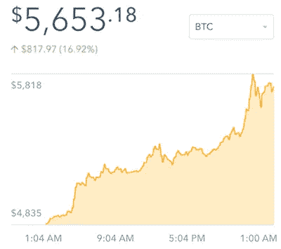
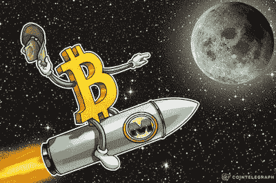

# 数字郁金香或:我如何学会停止担忧，拥抱硬币。

> 原文：<https://medium.com/hackernoon/digital-tulips-or-how-i-learned-to-stop-worrying-and-embrace-the-coin-844236edaf4>

1637 年，阿姆斯特丹的郁金香球茎售价是平均年薪的好几倍。[比特币](https://hackernoon.com/tagged/bitcoin)昨日触及 5000 美元，被拿来与古老的荷兰非理性繁荣进行多次比较。

有人认为[加密货币](https://hackernoon.com/tagged/cryptocurrencies)将颠覆美联储，使 Visa 破产，或者成为汇款的主要机制。在极端情况下，[有些人把今天的加密货币比作 1993 年的互联网](http://blog.pmarca.com/2014/01/22/why-bitcoin-matters/)。就我个人而言，我是一个怀疑论者，钦佩加密货币的数学和技术，但不认为它作为价值存储或交易手段有太多实际意义。

**然而，尽管我持怀疑态度，我还是拥有加密货币。**

*在这一点上，我应该提到这篇文章不是关于加密货币是好是坏的争论。网络上有很多写得很好的文章来证实你想相信的任何事情。这篇文章也没有涉及区块链技术的更一般的应用。相反，这意味着以加密货币为例，具体研究如何处理投资风险中的“不确定性的不确定性”。*

让我从投资 101 开始解释我的所有权。评估一项投资的典型方法是对其 [**期望值**](https://en.wikipedia.org/wiki/Expected_value) 建模。经济学书呆子可能更喜欢 [**预期效用**](https://en.wikipedia.org/wiki/Expected_utility_hypothesis) 或者甚至是像 [**资本资产定价模型**](http://www.investopedia.com/terms/c/capm.asp) 这样花哨的东西。无论你的决策过程如何，你都依赖于对潜在回报的良好估计。无论你关注的是债券、股票、天使投资还是赌场的赌注，都有方法可以预测结果的范围和分布，并进行适当的投资。他们并不总是完美的，但他们确实提供了一个体面的基线。(提示:在赌场玩桌上游戏几乎从来都不是一项好的投资。除非你是联邦快递。)

太好了。因此，有了这些知识，我们只需要想出加密货币结果的概率分布，并进行适当的投资。问题来了:**想出一个比特币的结果分布是不可能的。这种不确定性有两个原因:缺乏历史先例，缺乏对已经广泛使用的东西的纯粹替代。如果有的话，我们至少可以构建一个起点。**

Millions of cryptocurrency users here?

如果你对推导加密货币结果的潜在分布的不可能性感到困惑，考虑一个思维实验。以一组假想的文明为例，它们进化出了一种有点像我们的货币体系(例如，法定货币或贵金属支持的纸币)。让我们进一步说，他们都开发了一个类似加密货币的想法。有百分之多少的文明最终采用新技术作为主要的交换手段或价值储存手段？

**我真的不知道，任何人也不知道。** *也许*一场加密货币革命是完全不可避免的，就像文明似乎总是从背着山羊以物易物过渡到使用贵金属并最终使用纸片进行交易一样。也许没有哪个文明最终会脱离菲亚特，密码将永远是书呆子的副业。我们不应该试图量化结果或推测不可知的概率，而是应该沉浸在自己的无知中，继续前进。

通常，当面对一项我无法创造某种结果分布的投资时，我会放弃。当有更有信心的投资时，没有必要冒未知的风险。这并不意味着我们不应该冒险——毕竟，天使投资可能是这个星球上风险最大的投资。但我可以在一定程度上量化它:大多数公司失败，少数被收购，更少的公司推动整体回报。但是，如果我真的不知道如何评估一家公司，我喜欢保留[干粉](http://www.investopedia.com/terms/d/drypowder.asp)。

加密货币是一种完全不同的动物。如果我的怀疑是错误的，那么我对经济、政治和驱动世界的动力的假设是错误的。由于我目前的投资是基于这些信念，我**预计加密货币将与我其余的投资负相关**。拥有加密货币不仅仅是另一种可以与股票或债券相比较的投资，而是对我的世界模型不确定性的对冲。

当然，加密货币的可能结果不是二元的。也许他们作为技术爱好者的利基市场保持了价值，或者互联网中不太谨慎的部分继续使用比特币进行非法交易。但我对这些并不感兴趣，因为它们没有质疑任何关于世界的基本假设。然而，如果美元/日元/欧元/英镑崩溃或加密货币成为世界经济的重要参与者，我可以自信地说“我在一个非常重要的方面错了。”

更一般地说，我认为我们都应该不断地考虑这个问题，“如果我错了呢？”不是说我们在某个决策或结果上错了，而是说我们分析世界的方式存在根本性的缺陷。重要的是，这不仅仅是运气不好。例如，假设我从飞机上跳下来，我的降落伞打不开。在我快速跳水的过程中，我至少知道，从任何基本意义上来说，我都没有错，只是我不幸抽到了那根短稻草。另一方面，如果我构建了一个完全无法预测现实的经济模型，这就需要对模型进行彻底的重新评估。这要求我重新思考我对世界如何运转的假设。这样，拥有加密货币最好被认为是对我的世界模式中潜在重大缺陷的对冲。

To the moon?

所以，就我个人而言，我拥有一篮子加密货币，我称之为**“贾斯汀对世界投资组合的看法是错误的。”**在对比特币/以太坊最有利、对我认知信心最不利的情况下，加密货币将**送上月球！**