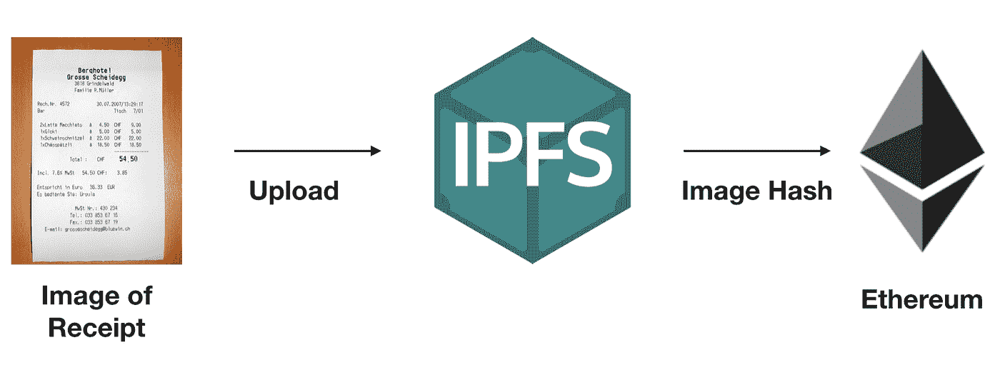
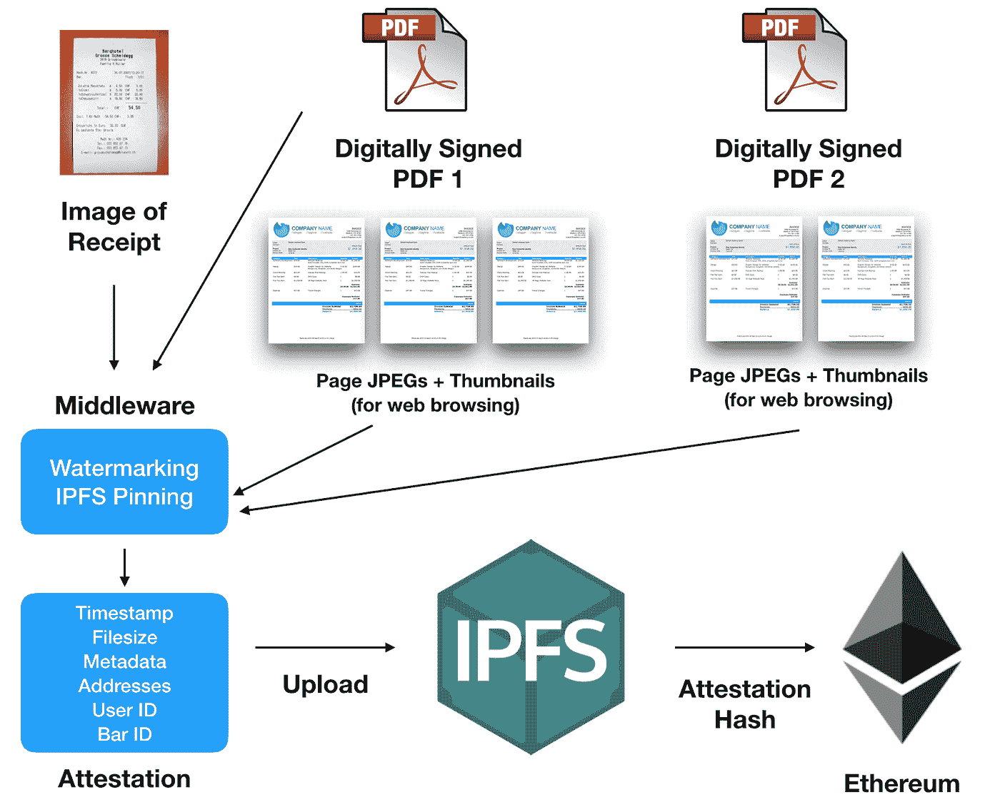
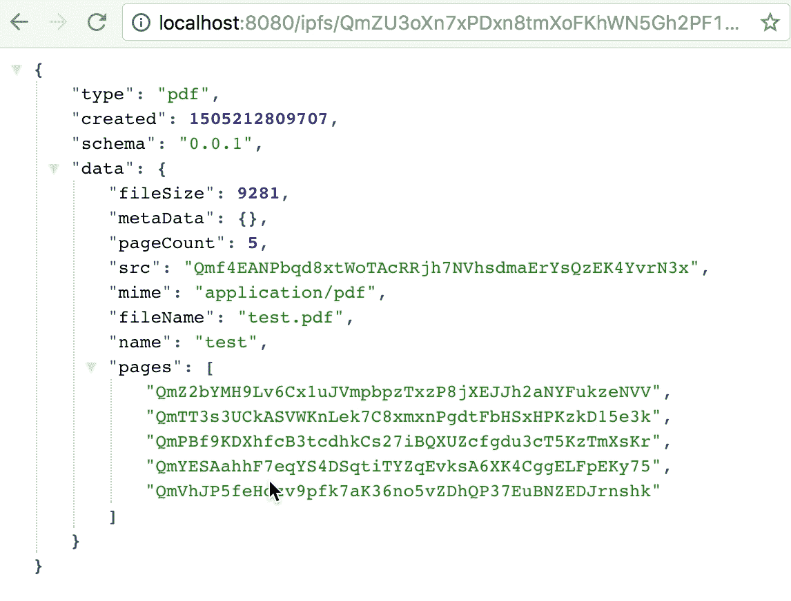
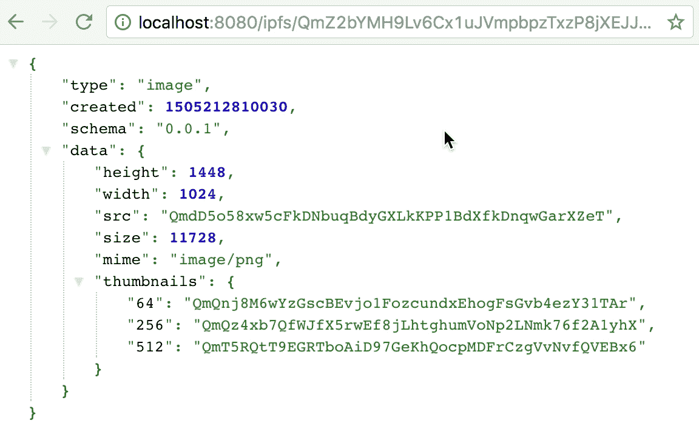

# Digix 开发更新—2017 年 9 月 12 日

> 原文：<https://medium.com/hackernoon/digix-dev-update-12-sept-2017-a81e00b5b5a5>

**业务更新**

**非常感谢我们的调查参与者**

我们将向最近在本周末完成了一项简短的 Digix 调查的 Digix 支持者提供一份 DGDs，以示感谢。

**丽岛聚会**

作为以太坊新加坡 Meetup 的一部分，Digix 今晚在 SGInnovate 为 [**REIDAO**](http://www.reidao.io/) 组织了一场[活动](https://www.meetup.com/Ethereum-Singapore/events/242273915/)。

REIDAO 正在为平台上列出的每一处房产创建由房地产支持的代币(以太坊上的数字资产)，代币 ID 是唯一的。每个代币 ID 都有自己的可用/创建代币上限、自己的估价(基于支持它的资产)以及自己的跟踪记录(价格变动、租金收入/股息等)。

**开发者更新**

安东尼·欧费米奥(首席技术官)

在上周的 [dev 更新](/@Digix/digix-dev-update-6th-sept-2017-a49a7c7078ba)中，我提到了开源我们的几个 Solidity 库。上周，我致力于重构 DigixCore 2.0 契约，以使用 npm 模块中的那些库。

本周，我与开发团队密切合作，让我们新的访问完整堆栈和 Solidity 开发人员熟悉我们的代码库，以便我们不断增长的开发团队可以协助完成剩余的重构任务。

**剩余的可靠性重构任务**

以下组件正在接受重构和单元测试。

**产品清单合同**

-用于管理可用于启动新 DGX 发行流程的认可金条(即 LBMA 批准的产品)列表的应用程序。

**资产授权合同证明**

-允许 PoA 机构(供应商、转让机构、托管人和审计员)执行其任务的应用程序，作为 DGX 发行和赎回生命周期的一部分。

**资产管理合同**

这允许用户查看 Digix 系统中的所有资产，包括允许用户列出

**Digix 管理合同**

最初称为**核心管理**该合同是一个面向内部的应用程序，允许 Digix 支持管理资产和执行任务，例如替换未通过审计的资产、向资产添加附加文档、市场管理和配置，以及允许我们启动和管理 DGX 发行和赎回生命周期的功能。

下周，我将飞往菲律宾，与我们的其他 Solidity 和 Truffle 开发人员密切合作，让他们了解我们的代码库，以便他们可以开始协助完成上述剩余的重构和测试任务，并拥有合适的开发人员资源来开始构建我们的 DAO 治理原型，并在最终批准后全速进行开发。

**克里斯·希区柯克(核心开发者)**

上周，我编写、测试并开源了 [Dijix 套件](https://github.com/DigixGlobal/dijix)，该套件涵盖了 Digix 资产证明系统的需求。Dijix 是模块化的，因此可以在未来扩展，但目前它自动化了 3 个主要概念的数据管理:

*   资产证明
*   pdf
*   形象

Dijix 处理所有的事情，从入口点“我有这个文件要证明”一直到发布到 IPFS，并返回一个 IPFS 散列，它表示该数据的一个更丰富的版本，否则是可能的。

本周，我想更直观地概述 Dijix 的要点:

**Digix 的老办法**

Old Approach

**Digix 的“DIJIX”方法**

New Approach

这个系统意味着我们现在可以存储更丰富的数据，并在未来的迭代中以更可靠的标准化方式升级这些数据的格式。上面的例子只是第一个版本，但是我们最终可以实现任何类型的数据。

Dijix 有一些特别酷的特性，包括:

*   中间件挂钩允许我们在处理数据时转换数据(例如加密或解密或绑定到 ipfs，甚至进行 ETH 事务)
*   同构—在节点和浏览器中使用相同的代码
*   节点和浏览器中的完整测试套件
*   用于批处理的 CLI 工具
*   图像和 pdf 的处理速度更快，浏览 PoA 系统使用的带宽更少
*   在移动设备上观看效果更好
*   通过插件版本控制系统的未来发展

查看 github repo 以了解更多实现细节。或者看看这个视频，了解 CLI 是如何工作的。在浏览器或节点应用程序中也是如此。

完成这一行程序后，我们现在已经上传并固定了多个 IPFS 对象，包括根 PDF 文件本身、关于 PDF 的易于访问的元数据、每个页面的 JPEG 版本的链接以及每个页面的缩略图:

本周的下一个任务是集成 react 组件以获取和呈现这些数据，并集成到新的资产证明系统的(待定)API 中。