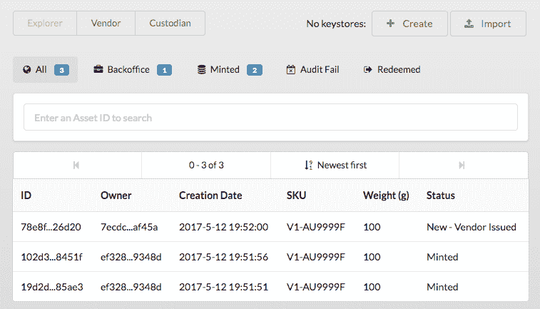
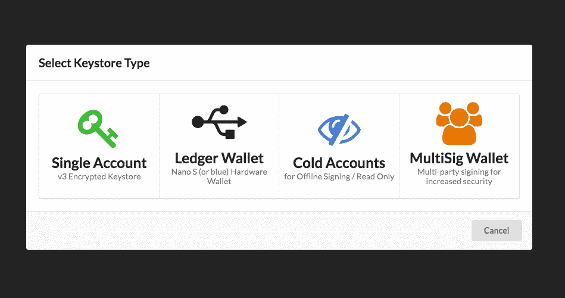
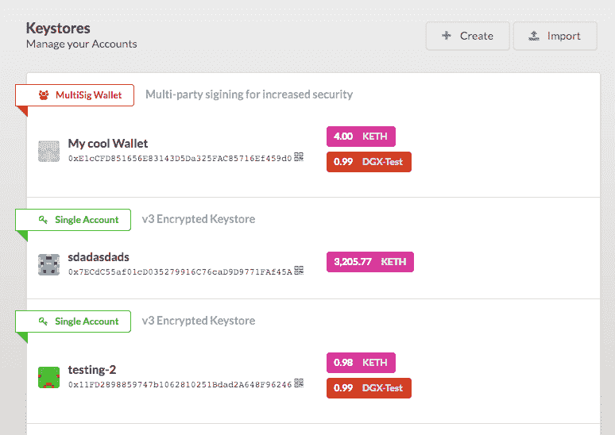
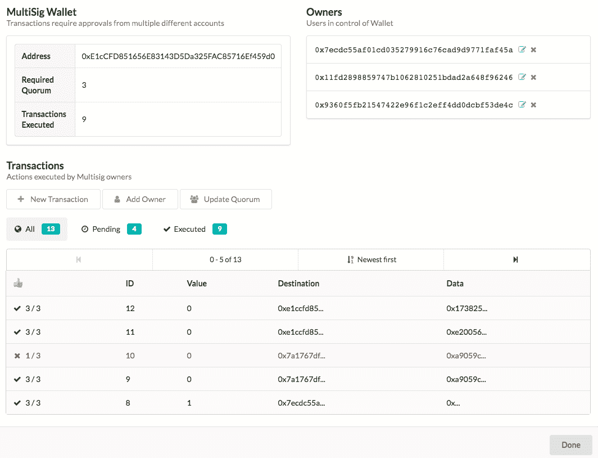
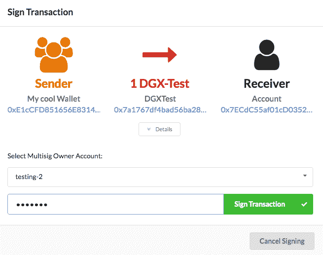
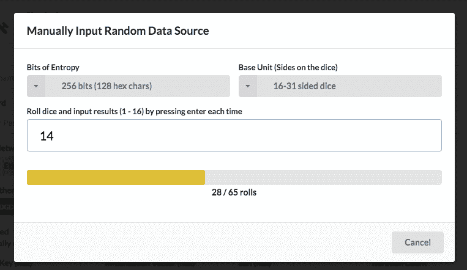

# Digix 开发更新 2017 年 6 月 3 日—未删节

> 原文：<https://medium.com/hackernoon/digix-dev-update-jun-3-2017-unabridged-6f56674f30ab>

*KC Chng(首席执行官)*

**ETC 退款**

我们很高兴退款程序按预期执行。对于任何由于硬分叉的意外后果而在赎回 ETC 合法所有权方面仍有问题的用户，请在 Slack 或 reddit 上 ping 我们，我们将尽最大努力尽快回复您。

遇到的一些常见问题和说明:

1)没有足够的 ETC 气体来调用兑换功能。请确保你有足够的 ETC 来这样做。

2) DGD 兑换令牌被分发到经典链上的相同地址(DGD 保存在主链上的块#3，800，000 处)。当您在主链上生成您的私有密钥时，您也拥有传统链上相同密钥和公共地址的所有权。

3)如果您将 Mew 与 Trezor 或 Ledger Nano 一起使用，请确保您的 HD 派生路径在 ETC 链上与在 ETH 链上相似。

4)在 DGD 代币持有者决定如何处理无人认领的余额之前，退款将持续一年。

5)如果您尚未阅读指南，请访问[https://github . com/digix global/etc-redemption/blob/master/guide/guide . MD](https://github.com/DigixGlobal/etc-redemption/blob/master/guide/GUIDE.md)

过去两周的主要信息是让每个人都意识到并关注 ETC 退款，因此将恢复定期开发更新。在本周的更新中，我们也包括了过去两周所做的事情。

**前进路径**

在 Smartpool 创始人进行安全审计的同时，我们正在努力将我们市场的前端与我们的核心合同相集成。我们预计我们的核心合同会有微小的变化，如果没有变化的话。

Digix 也开始寻找更多的核心开发人员加入我们的团队。请继续关注未来 2 个月内新员工的进一步公告。

几个新的合作伙伴正在筹备推出我们的市场。下周我们将继续发布一些新的公告。

**社区建设工作**

上周，Digix 的首席合规官肖恩·杰(Shaun Djie)在微软的启动日赞助活动 BASH @ 71 艾耶尔拉惹上，花时间展示了 Digix 的旅程和技术堆栈。我们非常高兴地看到，区块链爱好者的数量在新加坡不断增长。

[http://www . spiffy . SG/startup/leveraging-区块链-technologies-with-digix-global-at-bash-chope-Microsoft-startup-days/](http://www.spiffy.sg/startup/leveraging-blockchain-technologies-with-digix-global-at-bash-chope-microsoft-startup-days/)

Thank you for the kind words Andrew

上周，我们还在 SGI 办公室举办了 Indorse 和 Status.im 活动，参加者爆满。

At SGInnovate

本周一，来自 INFURA & [MetaMask](https://metamask.io/) 的 Michael Wheuler 将在 ConsenSys 亚太区主办的活动上展示他们的产品。请在 https://www.youtube.com/watch?v=N784-1G6ZZY[观看直播& ab_channel=DigixGlobal](https://www.youtube.com/watch?v=N784-1G6ZZY&ab_channel=DigixGlobal)

安东尼·欧费米奥(首席技术官)

**安全审计**

目前正在对 [Smartpool.io](http://smartpool.io) 进行安全审计。我们一直在私下讨论代码库，并密切合作，在我们发布之前完成这一非常重要的步骤。

**代码质量审计**

我们将聘请 DappHub 对我们处理代码质量的代码库进行单独审计。此次审计的重点不是寻找安全漏洞，这是 SmartPool 执行的安全审计的范围，而是确保我们的代码库是一致的，具有良好的测试覆盖率，并且没有错误。

**市场更新**

本周，我们将描述完成 Digix 黄金市场开发所需的一系列用户故事。Marketplace 由几个服务器端 API 组成，允许我们处理客户的实物金条订单、KYC 文档的上传和批准，以及将由我们 Marketplace 的 Spectrum enhanced 版本使用的后台服务。

**克里斯·希区柯克(Digix 内核开发)**

5 月 7 日

这是多么有趣的一周啊。参与了许多项目，包括 ETC 赎回试运行部署和代码审查(感谢 Vincent)、Digix Explorer 界面(与供应商和托管人视图集成)、IPFS 酷炫以及一般调整和测试。

让我们从 IPFS 开始:一个很好的改进是，我们想出了一个更好的方法来存储 IPFS 的资产证明文件。不可否认，很明显，我们现在不是在 chain 上保存 PoA 文档的散列，而是将包含元数据的 JSON 文件的散列保存到(可能很多)其他数据字段，包括其他 IPFS 内容散列。这种链接的数据结构意味着我们可以获得无限的存储空间和灵活性，因为上传的内容是资产的证明(例如存储图片库、视频等的能力),具有无限的未来前景，没有额外的可靠性。图案不错！

另一件与 IPFS 相关的事情是，随着我们推出测试 DGX 2.0 功能(如资产浏览器)，我们将不时在 IPFS 发布频谱部署。

这就把我带到了资产浏览器:我已经为 DGX 2.0 PoA 系统中的浏览器视图和操作完成了一个 MVP。多个类别，ID 搜索，分页，排序，它拥有一切。

它还与其他供应商和保管人视图更紧密地集成，后者也有 API 更新，并继承了分页和排序。

IPFS 部署演示发布:[https://gateway . ipfs . io/ipfs/qmpfrquetrf 9 gtyamffdgrnpw 3 Bos 5 ampcveezqjtdoxben/](https://gateway.ipfs.io/ipfs/QmPFrQEtrF9gtYAMFFdGRnPw3Bos5aMPCVEeZQjTdoxBeN/)

下周，我将致力于将 multisig 钱包集成到 Spectrum 中，不仅仅是作为 dapplet，而是作为*account type*，这意味着它将干净地集成到几乎所有的交易类型中，并为 multisig 交易提供一个真正整洁的 UI，它可以由任何现有的密钥库类型(包括硬件钱包)启动。

5 月 19 日

本周，我一直在为 Spectrum 实现 MultiSig 密钥库类型，使用的是 Consensys 的 https://github.com/ConsenSys/MultiSigWallet 合同(假人团队正在使用它来存储大约 440，000+ ETH)。

该功能允许部署和管理该合同，并无缝集成到 Spectrum 的现有帐户系统中。独特的是，multisig 密钥库类型将自动“代理”给定的交易，自动查找相关所有者的签名地址(以启动交易)并转换交易数据的格式以提交给 Multisig。这使得通过 multisig 合同钱包签署交易对最终用户来说更加简单，因为他们永远不必干预合同数据。它还可以与 Ledger nano 结合使用，因此您可以轻松安全地签署 *super* (如果您是*疯狂的*妄想狂，您甚至可以通过 multisig 的冷帐户通过 Ledger 签署)。

虽然这种集成在功能上已经完成，但不幸的是，我还没有能够完成所有的样式(仍然有一些 JSON 输出需要制成表格)并且在周五有一个活动，所以我将把抛光工作留到周日(并将在 IPFS 上发布另一个发行版)。同时，请查看下面的 WIP 截图:

新密钥库创建菜单

像普通帐户一样，多重签名被添加到密钥库列表中

点击账户配置以管理 Multisig 合同配置、所有者和交易(分页和分类)

使用 Multisig 密钥库类型签名时，用户可以选择哪个“所有者”帐户启动交易，UI 将根据所选地址的“密钥库类型”显示。

最后，上周日我还做了一天实验，想出了一个非常简单的概念证明，叫做 DGXi——“I”代表接口。这份合同是 DGX 的象征性包装，允许人们持有随着时间推移而贬值的价值，但保持相同的数量——这与 DGX 相反，数量减少，但仍保持 1:1 的黄金价值。

到目前为止，还没有计划对这一概念做任何事情，但它对于不想实施自己的滞期费计算的交易所和 dapps 来说可能非常有用(因为它允许人们通过固定的“通货膨胀”来存款和取款，这只是通过固定的“通货膨胀”来确定性地减少价值，在取款时支付费用)。如果有人有兴趣查看合同代码，请访问[https://github . com/digix global/DGXi/blob/master/contracts/DGXi . sol](https://github.com/DigixGlobal/DGXi/blob/master/contracts/DGXi.sol)。

5 月 26 日

本周首先总结了上周谈到的 Multisig wallet UI，它现在将包含在 spectrum 的未来版本中。

然后，我部署了 ETC 退款合同的最终版本(根据代码审查的建议，它需要一个分叉版本的 truffle-compile 来禁用优化器)，并对 ETC redemption dapplet 进行了一些小的调整。它现在等待块 3800000，这时快照将发生。

我还在水龙头服务上花了一些时间，该服务使用 Kovan 上的注册表将用户列入白名单，并使 DGD 持有者能够提取少量 ETC 以执行赎回步骤。此项服务为一次性服务，适用于 https://digixparity04.digix.io/faucet/0x<输入您的地址>的 DGD 持有者

6 月 3 日

本周的大部分时间用于 ETC 兑换流程，包括对 UI 的各种调整、更新指南、提供支持以及重要的实际执行兑换流程步骤——部署、捕获、铸造等。我还对水龙头进行了一些更新，帮助 DGD 持有者获得少量 ETC 进行索赔。

我花了少量时间在光谱上；在生成私钥时，为额外的安全性实现了一个简洁的附加功能:通过骰子滚动提供随机熵的选项——可选地替换“crypto.randomBytes”。这还实现了一个 XOR 变换，以减少有偏见的骰子的影响。([https://www . Reddit . com/r/bit coin/comments/22 nezb/just _ got _ my _ 16 _ sided _ dice _ extra _ secure _ paper/cgopcvx/](https://www.reddit.com/r/Bitcoin/comments/22nezb/just_got_my_16_sided_dice_extra_secure_paper/cgopcvx/))

## doxity

# # # git @ github . com:digix global/DOX ity . git

-78d 1 fa 1-来自 yudilevi/patch-1 的合并拉取请求#15 在样本中添加了一个缺失的逗号。doxityrc 文件

- 76b64ac —在示例中添加了一个缺失的逗号。doxityrc 文件

# # etc-退款

# # # git @ github . com:digix global/etc-refund . git

-eb4c 575—[维护]部署到经典

- 28fbb75 — [maint]删除 multisig，保留 multisig 集成测试

- f8b964a —合并提交' b 143 AAA E1 e 458 D2 d 2544 CB 08 a 03483919230d 33 '

- 2e9804b — [maint]禁用优化器，重建

-6913 b0d—[维护]合同数据检查

-22eb 84d—[功能]频谱:用户界面调整

##光谱

# # # git @ github . com:digix global/spectrum . git

- f05ebe1 — [maint]次要文件系统组织

-a 449552—[维护] ipfs 分布

-82e 1 e 71—[维护]修复 deps

-8803329—[维护]清理，deps

-182 f2c 0—[功能]允许在交易中更改所有者

-40a 0919—[功能] multisig 部署器

- 0c482f5 — [feature]如果 web3 未传递到事务模式，则显示网络选择器

-1b 99227—[维护]随机 IPF 部署

##块菌-灵知-多西格

# # # git @ github . com:digix global/multisig-dapplet . git

- e5fb8d6 — [maint]增强版本，删除频谱 dep

-1f 14474—[维护]更新自述文件

-0a 0885 b—[功能]将发送信息中的 json 数据制成表格

-4c 8d 39d—[功能]se spectrum:动态契约，UI 调整

##白名单-龙头

# # # git @ github . com:digix global/whitelist-水龙头. git

-540 bfc 3—[维护]修复

- 1d2663a — [maint]修复脚本，重新部署

-e67e 728—[维护]重新部署

- 023c0eb — [wip]清理、文本编辑、修复部署

-bacb 461—[功能]允许传递“经典”以提供到经典的龙头

-0540 ce 3—[功能]填充脚本

-32926 bb—[功能]添加入职脚本

- 9a1b6cf — [wip]次要文本更新

-f7bb 43 c—[功能]水龙头 http 服务器

-e 39402 b—[功能]初始提交；注册管理机构合同+测试

##核心 2

# # # git @ github . com:digix global/core 2-storage-library-contracts . git

-e833c 710—[测试]资产库存

# # etc-退款

# # # git @ github . com:digix global/etc-redemption . git

- cea8832 —更新指南. md

- 8e9e724 —更新指南. md

- 5ee3666 —更新指南. md

- 0b929d9 —更新指南. md

- 31e1ccc —更新指南. md

- 955656f —合并提交' b0ff 47 c 44 b 58187 b 6 ecad 09 acbb 294353 C1 FD 07 b '

-d423f 51—[维护]更新指南

- b0ff47c —更新指南. md

- 9ff80dc —更新指南. md

- 7018792 —更新指南. md

-4971 a50—[维护]固定时间估计

- 4cf7c34 — [maint]更新 IPFS 哈希

-58fe 6c 4—[维护]实时合同的用户界面更新

- 5c4dae5 —更新指南. md

- 748eca1 —合并提交' f 02 DDE 3254 fcdcdc 9 d6cf 525 f0b 91 ebb 3d f 8 DFB 7 '

-8d 38286—[维护]添加报告

- f02dde3 —更新指南. md

- fe8c5cb —更新指南. md

- fdc624d —更新指南. md

- d720ed7 —更新指南. md

- 62b3083 —更新指南. md

- 44eece3 —更新指南. md

- eeadeee — [maint]更新地址

-702290 f—[维护]添加帐户

- c60dff4 — [maint]添加源代码链接

- bece299 — [maint]修复自述文件链接

- a509167 — [maint]构建、更新 ipfs 哈希

-83ff 7b 9—[维护]将应用程序添加到指南

- 64d102f — [maint]次要 ui 修复+格式化

- b774ac9 — [wip]注释掉钱包测试(未使用)

- 0f8f67f — [maint]修复格式

-9654092—[维护]添加交易所信息

-be 66536—[维护]添加水龙头信息

-98ca 3fe—[维护]更新自述文件

-448 a3dc—[维护]重建文档

-689 e138—[维护]重建文档，更新自述文件，指南

- cf9e2e0 — [maint]修复版本和包膜

-d 4405 f 9—[维护]在没有优化器的情况下构建和迁移

- e4f27e4 — [maint]更多步骤 1 数据

- e072f23 — [maint]更新标题文本

- 3d47d52 — [maint]更新以使用实时合同，使用充值密钥

- 467ceeb — [maint]白名单 npm 发布目录

-49d6e 00—[维护]更新关于 multisigs 的自述文件

##光谱

# # # git @ github . com:digix global/spectrum . git

- 5814f01 — [maint]为随机数据生成添加熵字段

-e4a 843d—[维护]移除兑换+覆盖

-eee 380d—[维护]构建

- fb0f2b6 — [maint]重新部署

- c125ba6 — [maint]更新令牌列表中的令牌地址

-B1 B4 c0e—[维护]新版本

-200e 752—[维护] ipfs 构建

-71f 74 cf—[maint]bump etc-赎回和构建

- 0b3c677 — [maint]更新覆盖，ipfs 部署

-9493503—[维护]修复了零件并添加了包覆面提取

-c94a 0 e 6—[维护] ipfs 部署

- eae25aa — [maint]添加 ipfs 部署脚本

-960 f4fc—[维护]发布 IPFS 地区

-0683 f2b—[维护]仅使用 ETC

- eee0d28 — [maint]修复链接的 dep，发布到“src”的白名单

##白名单-龙头

# # # git @ github . com:digix global/whitelist-水龙头. git

-DCF 140 e—[维护]日志记录

- af68d4b — [hotfix] temp 硬编码列表

- 9cf6865 — [hotfix]水龙头温度修复

-9135 a69—[维护]使用科万

- c43bcba — [bugfix]设置气体

-F3 e 150 a—[维护]重新部署

- 24f47b7 — [maint]提高填充效率

> [黑客中午](http://bit.ly/Hackernoon)是黑客如何开始他们的下午。我们是 [@AMI](http://bit.ly/atAMIatAMI) 家庭的一员。我们现在[接受投稿](http://bit.ly/hackernoonsubmission)，并乐意[讨论广告&赞助](mailto:partners@amipublications.com)机会。
> 
> 如果你喜欢这个故事，我们推荐你阅读我们的[最新科技故事](http://bit.ly/hackernoonlatestt)和[趋势科技故事](https://hackernoon.com/trending)。直到下一次，不要把世界的现实想当然！

