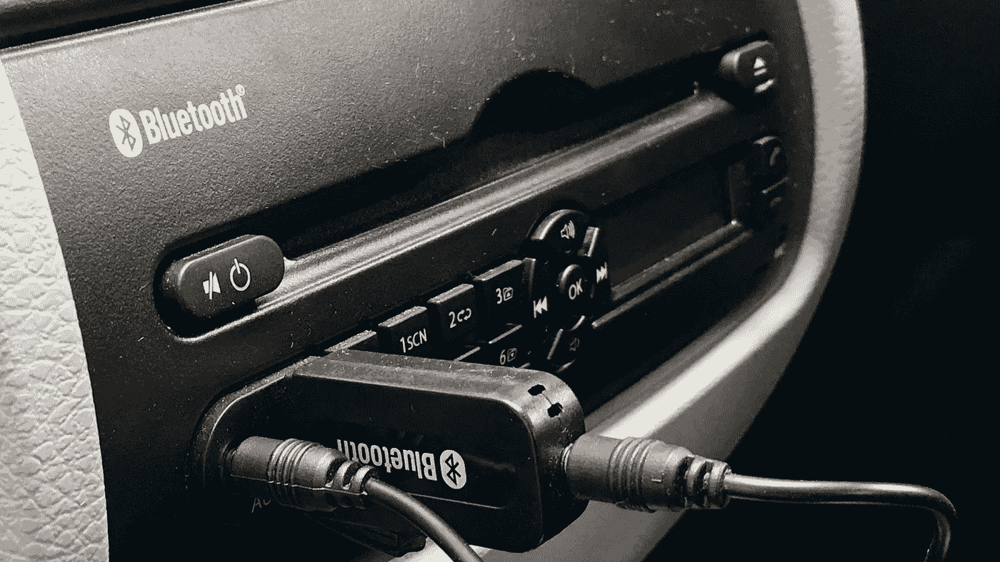

# 数字生活方式的困境

> 原文：<https://medium.com/hackernoon/dilemmas-of-a-digital-lifestyle-27c044940157>

Is two blueteeth one bluetooth too many?

几周前，我终于把旧车折价贴换了一辆新型号的。除此之外，新车配备了一个不错的音频系统，有四个扬声器和蓝牙连接。

经过一番摆弄，我能够通过蓝牙将我的手机连接到汽车系统。我参加派对迟到了，但在开车时接听免提电话，享受通过汽车音响系统聆听来电者声音的奢侈，仍然令人兴奋不已。然而，蓝牙一次只能连接一个设备。如果你家里有孩子，这可能是一个问题。

我 14 岁的女儿和她所有的朋友在他们的手机或 iPods 上都有自己的个人收藏。每次我带着他们到处跑，他们都渴望在汽车的音乐系统上尝试他们的歌曲。

我不希望他们使用汽车的蓝牙，因为这将意味着失去我的免提通话，并经历断开和重新连接我的手机的整个过程。这辆车确实有 USB 和辅助端口，但第一个端口不能连接到手机，第二个端口需要一根超长的电缆才能连接到后座的孩子，这可能有点乱。

我的解决方案是一个小小的蓝牙适配器，我在₹300 附近的易趣上买的(5 美元)。一端有 USB 连接器，另一端有辅助电缆。你把它插在汽车的 USB 接口上就可以给它供电。然后，您将蓝牙适配器与手机配对，之后它会通过汽车的辅助端口将手机上播放的音乐传输到汽车的音频系统。它比听起来简单，而且工作得天衣无缝，甚至可以在汽车蓝牙通话时暂时关闭音乐。

但是坐在我的小车里感觉有点奇怪，有两个蓝牙连接。在内心深处，我不禁担心那些在金属车内疯狂反弹的电磁蓝牙波是不是在我们的大脑中制造出来的。

是的，大多数人认为蓝牙是无害的，因为每个人都在使用它，似乎没有不良影响。但不久前，每个人都曾快乐地吸烟，几乎每个人都还在漫不经心地吞下可乐、蛋糕和几乎所有其他包装食品中的数吨糖。

如果能旅行到二十年后的未来，看看科学对蓝牙效果的判断，我会付出什么代价呢？但是一个父亲能做的也就这么多了。

现在，孩子们有他们的音乐，我有我的手机，一切都很好。

> [黑客中午](http://bit.ly/Hackernoon)是黑客如何开始他们的下午。我们是 [@AMI](http://bit.ly/atAMIatAMI) 家庭的一员。我们现在[接受投稿](http://bit.ly/hackernoonsubmission)，并乐意[讨论广告&赞助](mailto:partners@amipublications.com)机会。
> 
> 如果你喜欢这个故事，我们推荐你阅读我们的[最新科技故事](http://bit.ly/hackernoonlatestt)和[趋势科技故事](https://hackernoon.com/trending)。直到下一次，不要把世界的现实想当然！

