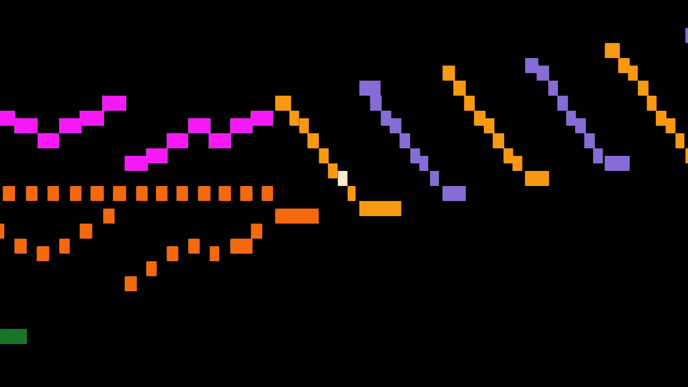
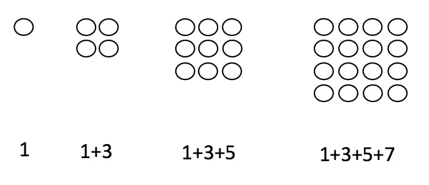
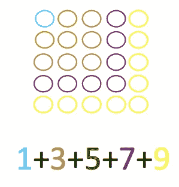

# 用这个简单的问题发现你内心的数学家

> 原文：<https://medium.com/hackernoon/discover-the-mathematician-within-you-with-this-simple-problem-e0b20cbd7118>

## 多重表现的力量

我永远不会做音乐。我从未学过演奏乐器，一点也没学过。我不知道乐谱是如何制作的。对我来说，乐谱就像外语一样难以理解。因此，虽然作为一名听众，我可以在肤浅的层面上欣赏古典音乐，但理解它是为了其他人。

这一切都在五年前的研究生院发生了变化，当时一位教授向我们介绍了[音乐动画机器](http://musanim.com)——斯蒂芬·马林诺夫斯基的动画图形乐谱项目。当教授演奏巴赫的托卡塔和 D 小调赋格片段时，我目瞪口呆，肃然起敬。这件作品和平常没有什么不同，除了它用最直观的视觉化赋予了生命。我不需要用晦涩的符号或术语来理解巴赫的作品。音高和节奏的微妙之处用最简单的彩色条来表现。我可以识别甚至预测重复出现的模式。我听到了以前我听不到的音符。

Bach as you’ve never seen him

在那一刻，一个新的想法抓住了我。毕竟，我对音乐有了深刻的理解。我不是一个艺术大师，但这是我人生中第一次能够真正接触古典音乐。这只花了我 27 年的时间，一场鼓舞人心的演讲挑战了我在学校里所学的一切音乐知识。

> 我们需要为数学做斯蒂芬·马林诺夫斯基为古典音乐做的事情——让每个人都能接触到它，尤其是那些长期以来放弃与这门学科的美丽和优雅联系的人；甚至它的简单。

受詹姆斯·坦顿的“无字数学”项目的启发，以下面这个问题为例:

*对前 100 个奇整数求和。*

没什么大不了的——任何人和他们的计算器都可以通过不懈的努力解决这个问题。但那是九十九个单独的计算；对于这个品牌的数学来说，生命太短暂了。

您可能会尝试使用[公式来对算术级数求和。但是这似乎很难令人满意(毕竟，这个公式不是凭空产生的)。](https://www.mathsisfun.com/algebra/sequences-sums-arithmetic.html)

让我们把前几项相加，看看会发生什么。不管看起来多么古怪，这种策略对数学家来说是再自然不过的了。关键是保持开放的心态，对任何模式保持警惕。所以:

**1**

1+3 = **4**

1+ 3+ 5 = **9**

1+ 3 + 5+ 7 = **16**

注意到什么了吗？结果值 1，4，9，16 可能看起来很熟悉。你会记得它们是平方数。

等一下。我们只是在添加奇数——谁邀请了 squares 来参加聚会？嗯，他们在这里。我们现在必须问一个每个数学家都想问的问题。

*为什么？*

为什么奇数相加会得到平方？让我们找出答案。我们可以长时间盯着上面的符号，但灵感可能不会出现，除非我们改变表现形式。嗯，我们称它们为平方数是有原因的——这些值对应于平方的面积！因此

1 = 1 x 1

4 = 2 x 2

9 = 3 x 3

16= 4 x 4

诸如此类。这很好，因为我们现在可以形象化这个模式，看看发生了什么。我们可以画正方形。

我们现在可以从字面上*看到*奇数的求和结果是平方。赔率和方块之间的联系正通过这幅绘画作品慢慢显露出来。你能感觉到这种联系；为什么加上下一个奇数会产生下一个正方形。也许你不能确切地指出它。

让我们再来一次，这次在每一步使用不同的颜色。

一点颜色能做的事真令人惊讶，对吧？联系现在很清楚了——增加一个奇数对应于正方形的下一个“层”；那个倒 L 型。为了得到下一个方块，我们需要在最下面一行有 5 个，在右边一列还有 4 个，也就是总共还有 9 个点。

所以把前一百个奇数相加，不多不少于一个 100×100 平方的面积。是一万。但答案只是这个问题的一个旁注。考虑一下刚刚发生的事情——我们从算术和开始，用一页上的符号表示。我们探索，我们探测，我们发现了一个几何关系。我们设想了这个问题，并自己发现了其中的联系。我们发现了奇数的几何——我们将课程中通常被分开的数学主题联系起来。

简而言之，我们成为了数学家。

教育工作者的经验——也是研究生课程的重点——是在展示数学概念时使用多种多样的表现形式。

> 只有一小部分学生能掌握学校数学的句法形式。这并没有降低他们的能力；局限性在于课程和教学法。

作为教育者，我们有责任尽可能多地建立理解和参与的切入点。光是观想并不是灵丹妙药；为了理解和解决我们的问题，我们需要调用我们的奇数，基本加法和平方的核心知识。但是图像表现是解决问题的重要启发式方法——数学家通常将抽象的问题转化为视觉问题。对于学生来说，视觉化是解决问题的一种同样重要和吸引人的方式。

数学思维不在于蛮力计算，而在于转移表象，寻找联系。我希望这个例子能说服你(如果你需要说服的话),你内心有一个数学家。

因此，我邀请你探索这个迷人的夏天:

1 + 2 + 3 + … + 98 + 99 + 100 + 99 + 98 + 97 + … + 3 + 2 + 1

享受吧。

我是一名研究数学家，后来成为教育家，致力于数学、教育和创新的结合。

*上*[推特](https://twitter.com/fjmubeen) *或者*[*LinkedIn*](https://uk.linkedin.com/in/junaidmubeen)*。*

*如果你喜欢这篇文章，你可能想看看我的以下作品:*

 [## 数学天才是脆弱的。我们需要停止摧毁它。

### 几乎从未有过的数学传奇

medium.freecodecamp.com](https://medium.freecodecamp.com/mathematical-genius-is-fragile-society-needs-to-stop-destroying-it-5fdf3f08336e)  [## 数学系学生被困在塞尔的中文教室里

### 随着对强人工智能探索的展开，我们是否正在失去对人类智能的控制？

hackernoon.com](https://hackernoon.com/maths-students-are-trapped-in-searles-chinese-room-d5ab9eafbc51)  [## 我的侄子带回家这个危险的数学问题

### 接下来发生的是对学校数学的可悲控诉。

brightreads.com](https://brightreads.com/my-nephew-brought-home-this-menacing-maths-problem-e8bbba30e5cb) 

> [黑客中午](http://bit.ly/Hackernoon)是黑客如何开始他们的下午。我们是 T21 家庭的一员。我们现在[接受投稿](http://bit.ly/hackernoonsubmission)并乐意[讨论广告&赞助](mailto:partners@amipublications.com)机会。
> 
> 如果你喜欢这个故事，我们推荐你阅读我们的[最新科技故事](http://bit.ly/hackernoonlatestt)和[趋势科技故事](https://hackernoon.com/trending)。直到下一次，不要把世界的现实想当然！

