# 发现阿里云——使用容器服务部署 Wordpress 集群

> 原文：<https://medium.com/hackernoon/discovering-alibaba-cloud-deploying-a-wordpress-cluster-using-the-container-service-ce51cffac066>

## 放弃

此内容是我们在线课程/培训的一部分/灵感来源。在 2019 年黑色星期五期间，我们对这些材料提供高达 80%的折扣。

您可以在这里享受您的[折扣。](http://bf.eralabs.io)

[](http://bf.eralabs.io)

本文的目标是使用真实世界的例子来发现阿里云。我们将使用 Docker 容器创建一个 Wordpress 网站，我们将使用阿里巴巴容器服务来部署它。

你应该创建一个帐户，设置你的支付信息，但你会得到 300 美元的免费信贷。

完整的教程和更多内容发表在我的培训[无痛码头](http://painlessdocker.com)中。


请访问[培训网站](http://painlessdocker.com)了解更多详情。

[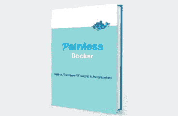](http://painlessdocker.com)

像 AWS 一样，首先创建一个 **VPC** ，这是一个专用于您帐户的虚拟网络。这样设置的目的是从逻辑上将您的基础架构和资源与同一云中的其他虚拟网络隔离开来。


创建一个 **Vswitch** 或虚拟交换机，以便选择您的云区域、CIDR 和您网络中的 IP 地址数量。

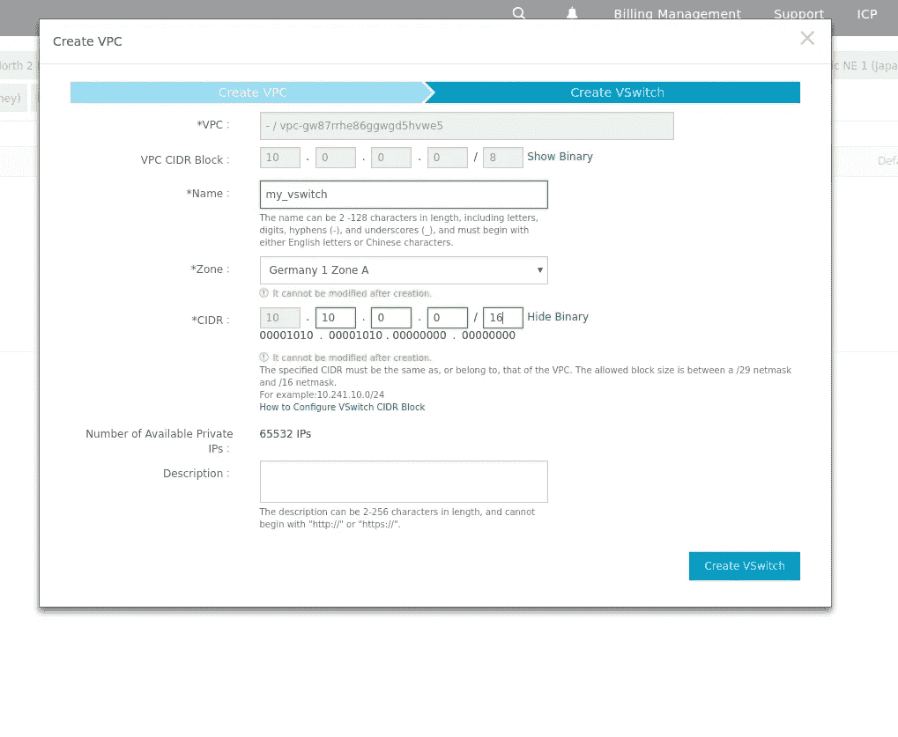

激活**资源访问管理**:身份和访问控制服务，使您能够集中管理您的用户(包括员工、系统或应用程序)，并通过权限级别安全地控制他们对您的资源的访问。

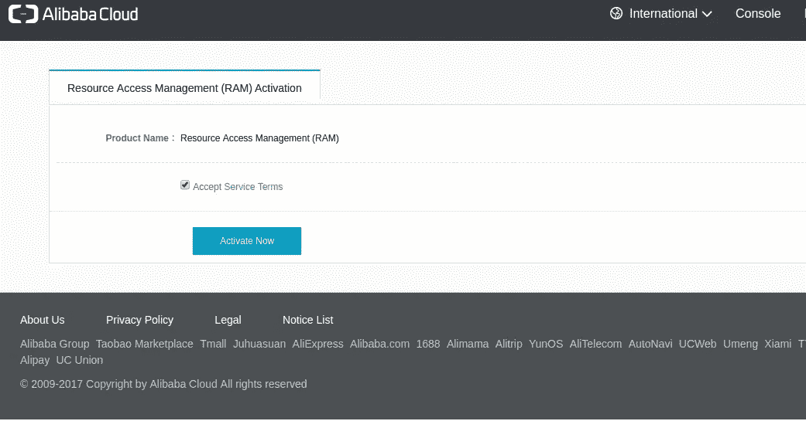

转到您的控制台主页并选择**容器服务**。

现在创建一个集群:

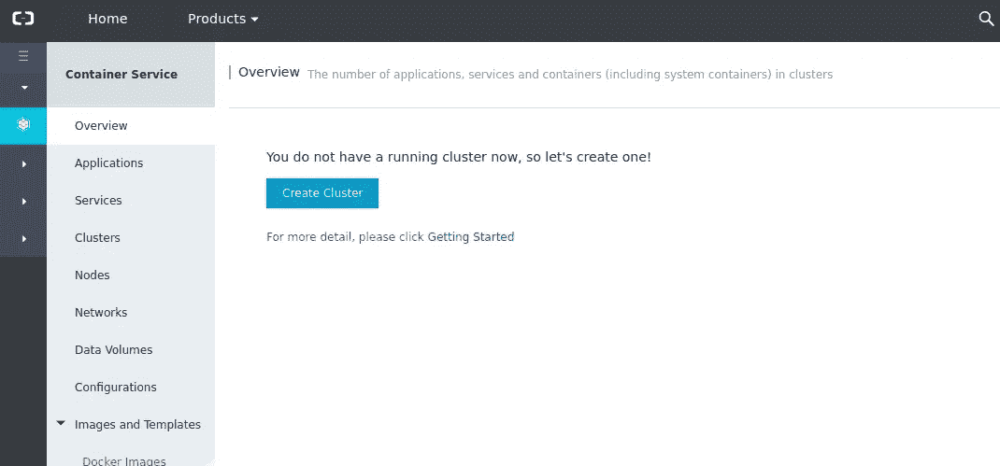

选择集群的名称并选择 VPC。选择一个区域和一个分区。我保持其他一切的默认值。

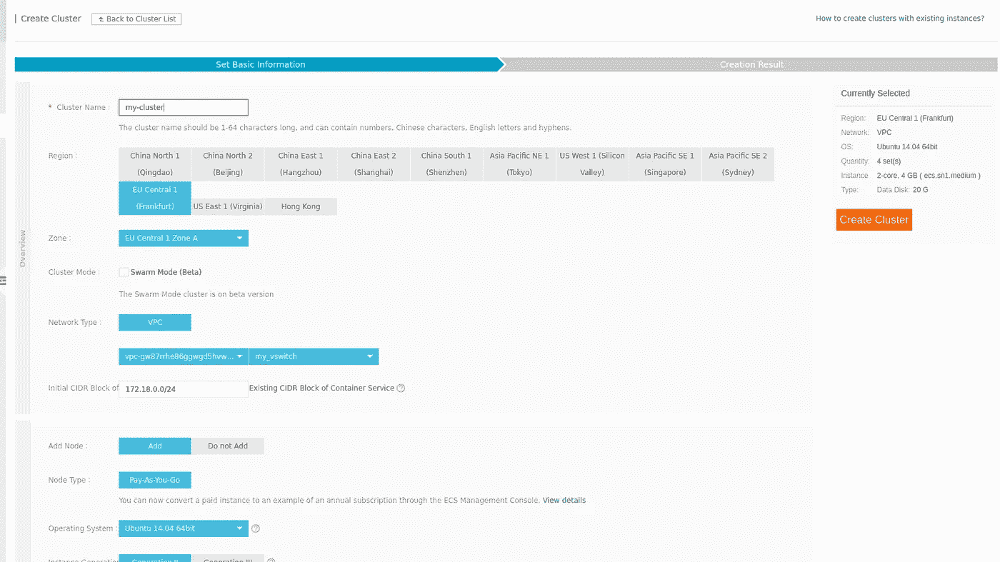

创建群集可能需要一些时间。

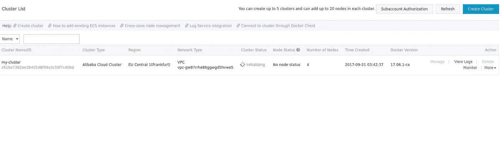

让我们从创建应用程序开始

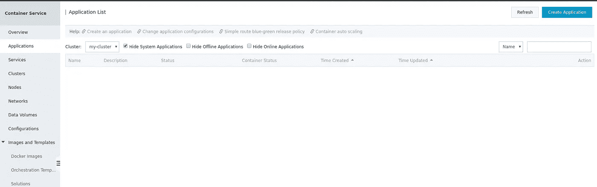

我将我的应用程序命名为“wordpress ”,选择我创建的集群，并选择“Pull Docker Image ”,以便在没有指定 tag 时获取最新的 Docker 图像。

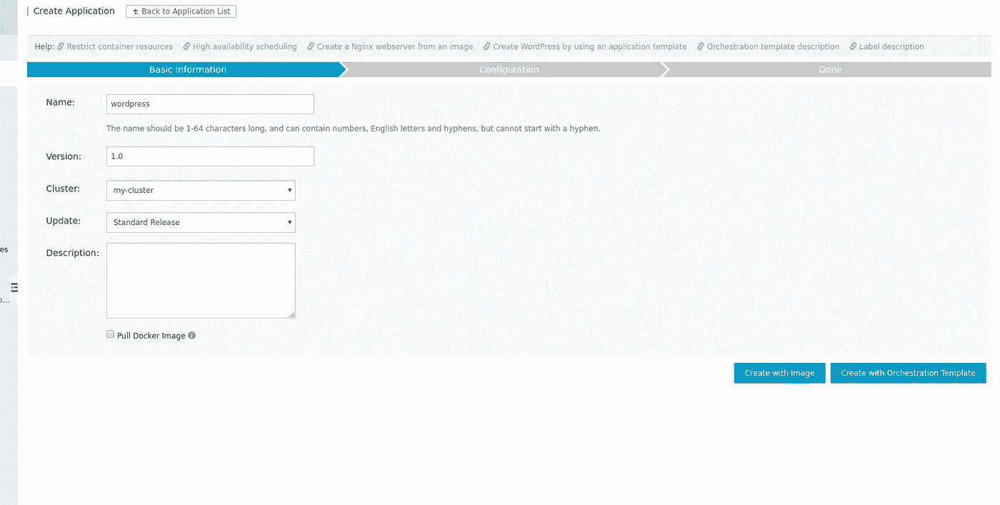

我们可以使用“用图像创建”或“用编排模板创建”。

您可以使用编排模板来定义和部署多容器应用程序。

支持 Docker 撰写格式。

单击“使用现有的编排模板”时，您可以访问预定义的编排模板或一些默认设置的模板。

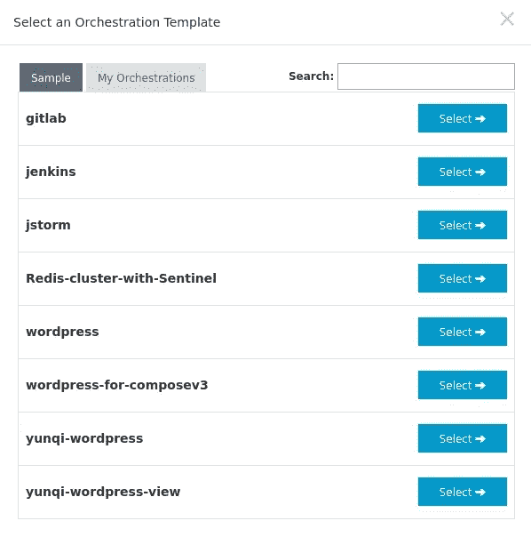

使用预定义的 Wordpress 模板对我们来说更容易和更快，我们将在剩下的部分使用它。

看起来是这样的:

```
web:
  image: registry.aliyuncs.com/acs-sample/wordpress:4.5
  ports:
    - '80'
  environment:
    WORDPRESS_AUTH_KEY: changeme
    WORDPRESS_SECURE_AUTH_KEY: changeme
    WORDPRESS_LOGGED_IN_KEY: changeme
    WORDPRESS_NONCE_KEY: changeme
    WORDPRESS_AUTH_SALT: changeme
    WORDPRESS_SECURE_AUTH_SALT: changeme
    WORDPRESS_LOGGED_IN_SALT: changeme
    WORDPRESS_NONCE_SALT: changeme
    WORDPRESS_NONCE_AA: changeme
  restart: always
  links:
    - 'db:mysql'
  labels:
    aliyun.logs: /var/log
    aliyun.probe.url: [http://container/license.txt](http://container/license.txt)
    aliyun.probe.initial_delay_seconds: '10'
    aliyun.routing.port_80: [http://wordpress](http://wordpress)
    aliyun.scale: '3'
db:
  image: registry.aliyuncs.com/acs-sample/mysql:5.7
  environment:
    MYSQL_ROOT_PASSWORD: password
  restart: always
  labels:
    aliyun.logs: /var/log/mysql
```

如果您尝试使用 V3 Wordpress orchestration 文件，您将会得到以下错误消息:

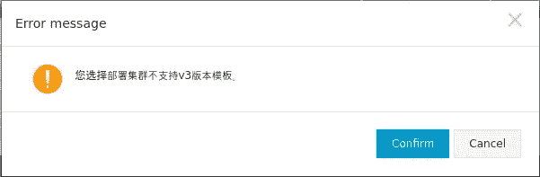

我们的 Docker 集群与 Docker Compose v3 不兼容！这是错误消息告诉我们的内容。

这是我的集群的样子

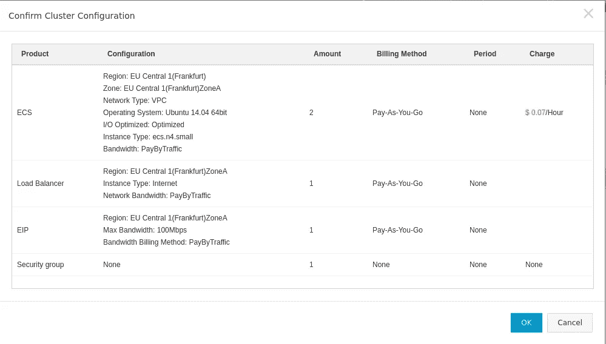

现在转到服务器负载平衡器服务，以访问外部负载平衡器的 IP 地址。后者将在我们的两个集群实例之间自动分配流量。

到目前为止，我们使用两个节点的集群创建了一个 Wordpress，每个节点托管 Web 和 DB 容器，以及一个外部负载平衡器来将流量分发到我们的节点。

在这一点上，我可以挑出一些利弊:

# 缺点:

在创建集群和应用程序时，我感觉速度有些慢。我测试了 3 或 4 个集群，每次阿里云都非常非常慢！！

我不确定这是否特定于集群和容器编排或其他服务可能会经历同样的缓慢操作。

我还注意到 GUI 中的一些其他错误，一些按钮没有响应，我必须重新加载页面才能点击按钮..

英语可以作为控制台的主要语言，但是我收到了一条用中文写的错误信息..

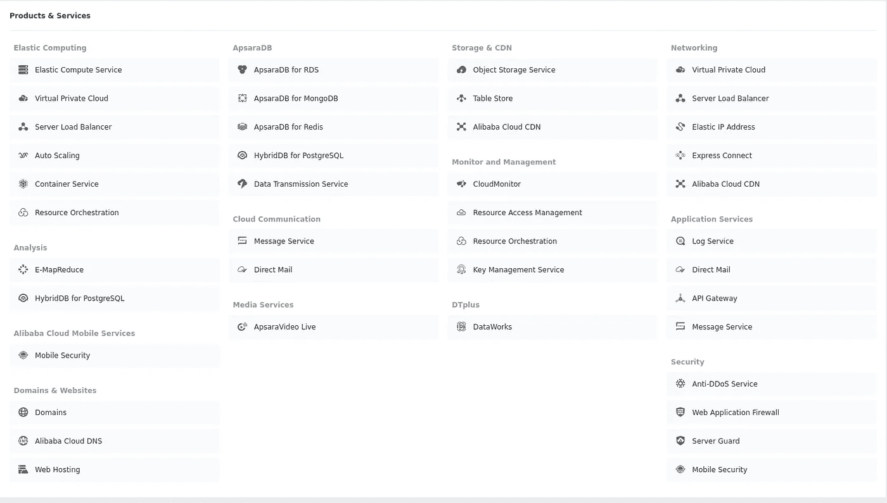

# 优点:

容器编排服务的存在对于阿里云用户来说是一个很好的点。并非每个云提供商都有这项服务。

我发现使用 Docker Compose 文件的可能性和将集群设置为群模式(beta)的可能性非常有用。

当使用阿里云时，你会注意到你会被引导去建立网络和安全的最佳实践。您应该创建一个 VPC 和一个网络，设置，激活资源管理..等等

阿里云正在实施已知的标准，所以如果你之前一直在使用 GCP 或 AWS，你会注意到阿里巴巴与你一直使用的没有太大不同。

阿里云在提供特价和免费服务方面相当慷慨，这是一个非常好的观点！

# 连接更深

在本教程中，我们使用阿里云容器服务原型化了一个 Wordpress 博客。

> 如果你喜欢这篇文章或者想找到类似的教程，你会喜欢上[无痛码头课程](http://painlessdocker.com)。

你也可以注册 [DevOpsLinks](http://devopslinks.com) ，一个 DevOps 专业网络和我们的 [DevOps 讨论板](http://discuss.devopslinks.com)，在那里你可以问和回答 DevOps 相关的问题！

我们还开始了[发货时事通讯](http://shipped.devopslinks.com):一个关注容器&编排的独立时事通讯。

> 如果您对了解 AWS 等其他云提供商更感兴趣，您可以使用此表格[注册](https://eon01.typeform.com/to/MMPiyz)，我将与您分享我的一些新项目和一些欢迎礼物！

黑客快乐:-)