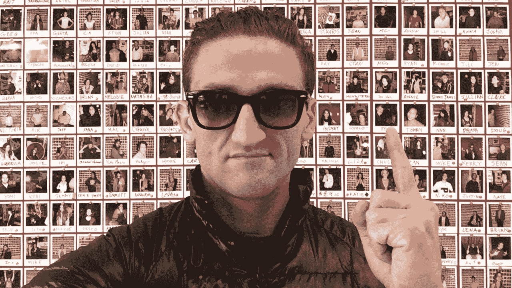
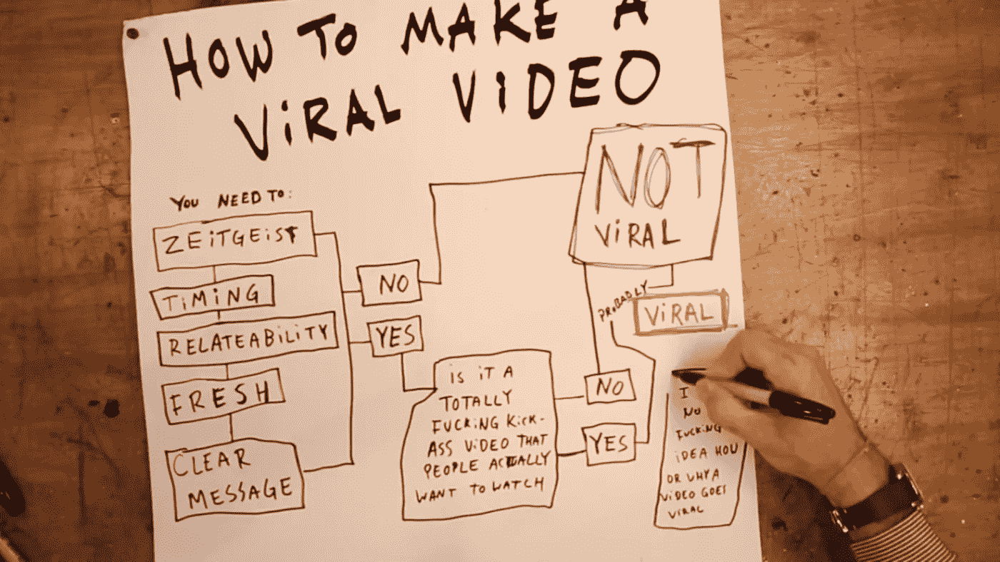
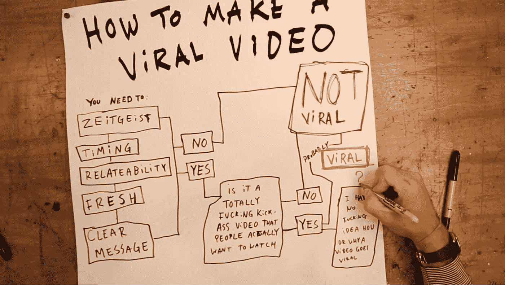
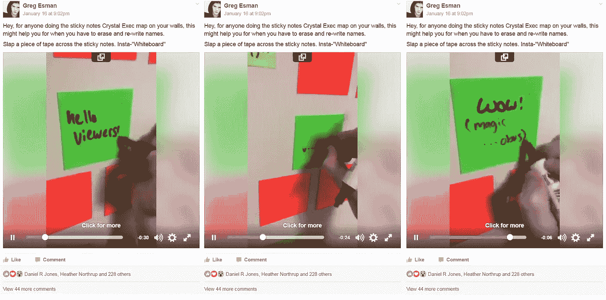

# 发现(一些)病毒视频的秘密

> 原文：<https://medium.com/hackernoon/discovering-the-secrets-to-some-viral-videos-3d846bfaa956>

凯西以制作 YouTube 视频而闻名。

凯西制作了不止一个视频。

凯西还制作了一个视频，解释如何制作一个病毒式的视频(据他所知)

但凯西也表示，他并不确切知道一个视频是如何或为什么会火起来的。

在凯西的视频中，他解释了一个制作病毒视频的方法，是这样的:

**“And, is it a totally fucking kick-ass video that people actually want to watch?”**

*   时代精神——确保它是当下的
*   时机——太早了。没人明白。太晚了？没人在乎。
*   关联性——不言自明
*   新鲜——其他人都在做同样的事情吗？
*   清晰的信息——人们会明白吗？

但是问题是。你注意到他手底下的信息了吗？

**“I have no fucking idea how or why a video goes viral”**

然后他说:

> “所以如果你能在这里找出这个小问号，那么你我的朋友就是上帝，应该以制作视频为生，因为你能——”

好吧。我就是这么做的。(*种)*

有不同种类的病毒视频，但对于不到一半的凯西的病毒视频来说，这里是他缺失的那部分的配方:

*   简单的想法，但强大的概念
*   任何人看了都会说“太牛了！我应该想到这一点！”【情感情感情感！！]
*   而且它必须是观众会觉得他们也能很容易地做/很容易地得到/已经有了做它的材料的东西。以至于他们会对马上做这件事感到兴奋，并告诉他们的朋友“看看这个！我们可以去做这个！!"

这就是我们的想法。结果呢？

[1 . https://youtu.be/qRv7G7WpOoU](https://youtu.be/qRv7G7WpOoU) — 2\. [https://youtu.be/keFBEoBy0zY](https://youtu.be/keFBEoBy0zY) — 3\. [https://youtu.be/lqlrru1V69E](https://youtu.be/lqlrru1V69E)

或者，稍微转移一下这个想法，怎么样:

*   任何人都可以做的简单想法
*   它提供了一个有趣的挑战
*   但这似乎很简单，人们可以成功，所以他们想试一试(这个食谱中的两个神奇成分是它看起来和感觉上都很有吸引力，与第一印象相反，它实际上需要一些技巧)

所以我们发现了一种模式，但也许你在想“……好吧……你在几个视频中发现了一种模式，那就是**已经**火了。”。

不是问题，批判性思维的朋友！我发了一个帖子，检查了凯西食谱中的所有要点，以及我自己的所有要点。

以下是我的结果:

“Whiteboard” Sticky Notes

让我们回到凯西的问题:

**“If you can figure out this little question mark right here, then you my friend are a God and should be making videos for a living because you can — ”**

我的答案是它必须是:

*   一个简单的想法，但强大的概念
*   任何人看了都会说“太牛了！我应该想到这一点！”【情感情感情感！！]
*   而且它必须是观众会觉得他们也能很容易地做的事情/很容易地得到/已经有了做这件事的材料。以至于他们会对马上做这件事感到兴奋，并告诉他们的朋友“看看这个！我们可以去做这个！!"

我对凯西食谱的添加只点击了不到一半的凯西的病毒视频。其他的是一种不同的视频，也有自己的秘方。

…但我们将把这一发现留到下一次。

如果你喜欢你刚刚读到的内容，请点击下面的“Heart”按钮，这样其他人可能会偶然发现这个迷你旅程。如果凯西在读这封信，嘿。来和我在**上聊天吧。任何人也可以这样做，我的大门永远为你敞开。**

*[*奇怪的是，你们中有多少人会发现“白板”便利贴在生活中很有用*](https://docs.google.com/forms/d/e/1FAIpQLSf40i-VS5QHLuaYp2bLSUGUELABiIhxTQ6uXOmvOTygkDXSUQ/viewform?c=0&w=1) *？让我知道！**

******

> *[黑客中午](http://bit.ly/Hackernoon)是黑客如何开始他们的下午。我们是阿妹家庭的一员。我们现在[接受投稿](http://bit.ly/hackernoonsubmission)并乐意[讨论广告&赞助](mailto:partners@amipublications.com)的机会。*
> 
> *如果你喜欢这个故事，我们推荐你阅读我们的[最新科技故事](http://bit.ly/hackernoonlatestt)和[趋势科技故事](https://hackernoon.com/trending)。直到下一次，不要把世界的现实想当然！*

**