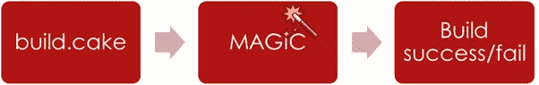
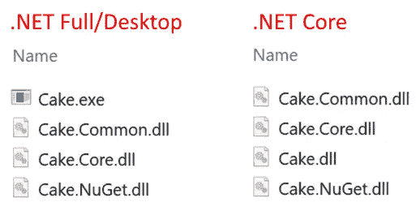

# 驱散魔法！

> 原文：<https://medium.com/hackernoon/dispelling-the-magic-6dc0fdfe476c>

## 蛋糕的层和块

当你不知道一项技术背后的细节时，很容易将它视为魔术，但如果你敢看幕后——它可能没有你已经知道的那么复杂或陌生。

在这篇博文中，我将介绍一下开源构建流程编排工具[蛋糕](http://cakebuild.net)的一些组成部分。

我将向您展示如何在不同的环境甚至语言中重用蛋糕，我将详细介绍一些部分，并浏览其他部分。

如果有任何部分你想让我去更详细的请让我现在！我会在这篇博文的最后提供例子和资源的链接。

# “只是 C#和。净”

这是我经常说的一句话，因为 Cake 脚本提供了 C#的一个超集——这意味着你可以用 C#做任何事情。Cake DSL 通过它的别名仅仅提供了一个快捷方式来使 API 和工具更容易使用，但是你总是可以选择喜欢“常规的”代码引用程序集，编写方法和类。

这方面的一个例子是使用 JSON，在你的控制台或 MVC 应用程序中，你可能会使用 JSON.Net 来序列化/反序列化你的 JSON。NET 对象，并用 Cake 脚本做同样的事情，这与普通的 C#没有太大区别

基本上，唯一的区别是`#addin`预处理器，它从 NuGet 获取并引用一个程序集，并且不需要在名称空间/类/方法中包装代码。

成为“公正的”C#和。NET 意味着你将永远拥有安全网。NET、C#和大量可用于这些技术的资源。

# 蛋糕块

蛋糕分两种口味，一种为全经典。NET，它也适用于 Mono 和。NET Core——微软新推出的跨平台框架/运行时。

获得蛋糕工具最常见的方式是通过`Cake`和`Cake.CoreCLR` NuGet 包(*蛋糕也可以通过 Chocolatey、Homebrew、GitHub 和官方 docker 容器获得*)。

Cake / Cake.CoreCLR NuGet package

NuGet 包包含在各自的运行时下执行所需的所有依赖项，但是“魔力”在于三个程序集和一个控制台应用程序

## Cake.exe/Cake.dll——“工具”

举几个它处理的事情

*   脚本的编译
*   参数解析
*   控制台日志记录
*   模块/组件的组成
*   基本上，它将所有东西粘合在一起，并提供“蛋糕体验”

## 蛋糕。核心——“心脏”

提供诸如

*   Cake 工具/插件/模块使用的核心抽象/接口/属性
    ( *这是创建 Cake 插件/模块*时唯一需要引用的程序集)
*   DSL 解析和将/codegen 转换为罗斯林理解并能编译的 C#
*   基础工具实现*(工具解析、执行、设置等。*)
*   蛋糕任务运行时(*任务运行器/依赖图/设置&拆机等。*)

## 蛋糕。普通—“实干家”

这个程序集提供了近 400 个方便的别名/扩展方法，例如

*   工具( *MSBuild，NuGet，.NET 核心 CLI，代码签名等。*)
*   API(*压缩、项目文件解析、文本模板化、HTTP 等。*)
*   构建系统支持( *AppVeyor，VSTS，詹金斯，TeamCity，MyGet 等。)*

## 蛋糕。nu get——“取物者”

Cake 模块，支持从 NuGet 获取依赖项，例如像`#addin`、`#tool`和`#load`这样的预处理器指令。

# 蛋糕作文—“就是 C#和。净部分二”

组件`Cake.Core`、`Cake.Common`和`Cake.NuGet`都可以在 NuGet.org 上找到，目标是两者。NET Full/Desktop 和。网芯。

这意味着你可以引用和利用几乎所有的投入到蛋糕中的部分/大部分工作和努力。NET 应用程序、环境或平台——它只是标准的 C#代码和程序集！

也就是说，蛋糕在很大程度上依赖于依赖注入，并且随着时间的推移已经被重构为定制模块——因此，对于项目的新手来说，如何将它们组合在一起可能会有点令人生畏。使用 AutoFac 之类的控制容器的反转来实现这一点的一个粗略的基本示例如下所示:

正如观察力敏锐的人可能从评论中看到的，有一些情况下，实现目前驻留在`Cake.exe/Cake.dll` ( *这可能是我们在未来的重构中看到的东西*)，它们实现的接口存在于核心中，因此您可以实现并提供您自己的实现，或者根据您重用的蛋糕的哪些部分，您可能不需要它们(*对于单元测试，我们提供蛋糕。为工具测试提供虚假的上下文和文件系统、环境抽象等的测试。单元测试 Cake 插件/模块可能是另一篇博文的好主题——如果你认为是这样的话，请告诉我。*

# 概念验证自定义脚本主机

因此，要为您自己的“构建脚本”实现创建您自己的定制主机，您目前需要实现几个接口:`ICakeArguments`、`ICakeConfiguration`、`ICakeLog`、`ICakeReportPrinter`和`IScriptHost`，因为前面提到的这些实现目前驻留在`Cake.exe/Cake.dll`中，但是所有其他的都可以在`Cake.Core`中获得，以便在任何。NET 项目。

为了证明这一点，我创建了*“概念验证，绝不是官方的，不要在生产中使用，只是为了看看香肠是如何制作的，等等。”*汇编名为`Cake.Bridge`，编译为两者。NET 和。NET 核心，这意味着它可以用在大多数地方。NET 今天可以使用了(*二进制文件在 NuGet 上，源代码在 GitHub 上，我会在这篇文章的最后提供所有资源的链接*)。

`Cake.Bridge`提供了一个静态的`CakeBridge`类，该类提供了使用 Cake 任务运行器和`ICakeContext` ( *是所有 Cake 别名/方法扩展的*)的简单访问，创建该类的目的是演示一种简单的方法来重用来自任何。NET 语言，而不仅仅是 Cake 所支持的 C#。

你得不到的是 DSL 提供的蛋糕，没有插件和模块支持。

为了说明这一点，我编写了一些代码片段，介绍如何使用来自不同的。NET 语言使用`Cake.Bridge`汇编， ***免责声明*** 代码片段是概念的快速和粗略的证明，主要是证明它可以做到，显然需要做更多的改进，以使它们在习惯用法上更加正确。

通常已经存在更多本地的、突出的和广泛使用的构建系统。

## PowerShell

即使可能主要选择 sysadmin 语言——PowerShell 仍然是一种基于. NET 的语言，并且它能够利用。NET 使它成为一种非常强大的脚本语言，因为该语言本身没有提供的任何东西通常都可以通过接触它所运行的框架来解决。这也意味着你可以用它来做蛋糕:

## visualbasic 语言

你不能谈论。NET 语言，但没有提到 Visual Basic，现在它也加入了。网络核心党也是它与时俱进。很明显，你可以用一些基本的东西来烤蛋糕(*据我所知，VB.NET 没有交互控制台，所以我创建了一个简单的 VB.NET 核心控制台应用程序)*

## F#

F#是一种. NET 语言，它使 Cake 完全有可能与 F#一起使用。
完全免责声明虽然，由于我对 F#语言不是很精通，想要一个看起来有点像 F#的东西，我请我的朋友[马腾·朗格](https://github.com/mrange)帮忙做了一个从 C#到 F#的快速移植，结果是:

## 蛋糕/ C#

作为参考，下面是移植到其他语言/运行时的灵感来源，其中涉及的引导较少，但除此之外，它们非常相似:

# 结论

尽管蛋糕看起来有一些魔力，而且它是 DSL，但它基本上只是。NET 和 C#拥有这些领域的技能，这些技能可以用于 Cake 脚本或以其他方式使用 Cake 程序集。如果你的需求与官方支持的方式有所不同，你仍然可以分一杯羹。

# 资源

## 蛋糕。桥

*   GitHub:[https://github.com/devlead/Cake.Bridge](https://github.com/devlead/Cake.Bridge)
*   https://www.nuget.org/packages/Cake.Bridge

## PowerShell 概念验证

*   [https://github.com/devlead/PsPoC](https://github.com/devlead/PsPoC)

## Visual Basic 概念证明

*   [https://github.com/devlead/VBPoC](https://github.com/devlead/VBPoC)

## F#交互式脚本概念验证

*   [https://github.com/devlead/FsxPoC](https://github.com/devlead/FsxPoC)

## C#交互式概念验证

*   [https://github.com/devlead/CsxPoC](https://github.com/devlead/CsxPoC)

## 蛋糕

*   网址:[http://cakebuild.net](http://cakebuild.net)
*   GitHub:[https://github.com/cake-build/cake](https://github.com/cake-build/cake)
*   https://www.nuget.org/profiles/cake-build