# n 个鸡蛋 k 层拼图的最简单解释

> 原文：<https://medium.com/hackernoon/dissecting-the-famous-egg-dropping-puzzle-eec5064a341b>

## 谷歌的面试问题变得简单多了。

Photo by Hisu Lee via [Unsplash](https://unsplash.com/photos/bQLCyj-9-tk)

# 鸡蛋掉落拼图(2 个鸡蛋，100 层版本)。

> 给定两个鸡蛋，计算出一座 100 层大楼的最高楼层，一个鸡蛋可以掉下来而不碎

鸡蛋掉落谜题是一个已经在互联网上流传了一段时间的数学谜题，据了解，它被谷歌、微软、埃森哲甚至惠普等大公司的面试所采用。

你要确定在最坏的情况下找到临界楼层所需的最小尝试次数。

Photo by Pablo Vargas via [Unsplash](https://unsplash.com/photos/lQ_26aB7aR8)

# 丢蛋难题中的假设:

1.  这两个蛋是一样的。
2.  如果一个鸡蛋没有因为从某一层掉落而破碎，那么它也不会因为从低于该层的任何一层掉落而破碎。
3.  如果一个鸡蛋掉在某个地板上摔碎了，它会从上面的任何地板上掉下来摔碎。
4.  鸡蛋掉在一楼可能会碎。
5.  一个鸡蛋即使掉在第 100 层也不会碎。

## 注意:

*   如果你不希望它被破坏，你应该停止阅读，开始寻找答案。
*   如果您已经阅读并知道解决方案，您可以跳过下面的内容，继续阅读解决方案的组合视图。

# 2 个蛋，100 层楼掉蛋难题的解决方案。

虽然答案并不难理解，但要找到答案还是需要一些思考。

该解决方案是利用有限数量的试验得出的。然后 2 蛋，n 层解决方案可以很容易地推广。

**逐步解决优化答案:**

*   如果第一个鸡蛋破了，我们需要从最低的开始一个一个地测试剩下的楼层，直到剩下的鸡蛋破了。例如，如果第一次掉落在第 50 层，鸡蛋打破了，那么从第 1 层到第 49 层将再掉落 49 次，以确保剩余的鸡蛋不会打破，直到我们知道答案。
*   如果第一次跌落是在第 10 层并且它打破了，那么总共需要 10 次试验才能知道最坏情况下的答案，即鸡蛋在第 9 层或第 10 层开始打破。试验将是:10 → 1 → 2 → 3 → 4 → 5 → 6 → 7→ 8 → 9
*   为了利用所使用的试验次数(10 次试验)，如果第一次掉落在第 10 层并且鸡蛋没有打破，则第二次掉落应该在第 19 层，即如果鸡蛋在第 19 层打破，那么你应该按照以下顺序掉落鸡蛋:10 → 19 → 11 → 12 → 13 → 14 → 15 → 16 → 17 → 18(总共 10 次试验)。
*   考虑到这种利用，最终的顺序(如果鸡蛋从未打破)将是 10→19(10+9)→27(10+9+8)→34(10+9+8+7)→40→45→49→52→54→55，即 10 次试验可以测试多达 55 层。
*   利用三角形数的公式， *m* 次试验可以测试[m(m+1)]/2 层楼，即

> 13 次试验可以测试 13 * 14 / 2 = 91 层
> 14 次试验可以测试 14 * 15 / 2 = 105 层

因此，测试一座 100 层的建筑需要 14 次试验。

# 让我们看看组合学中的解。

为了推导任意数量鸡蛋的鸡蛋掉落难题的一般解，让我们再次回顾 2 个鸡蛋的情况。我们将以另一种方式解释这个解决方案。

为了简单起见，我们将只使用 15 层。我们将把鸡蛋(如果一个鸡蛋没有打破)扔在 5、9、12、14、15 层，这意味着最多 5 次尝试就足以获得答案。下表显示了所有可能的结果。

**备注:**

*   一个鸡蛋在试验中被打破，用黄色突出显示。
*   “答案”指的是已知最高的不打破鸡蛋的楼层。

总共有 16 种情况，对应于 15 层建筑的答案 0 到 15。通过分析打破卵(即黄色细胞)的试验的分布，我们可以看到 16 个病例确实被分成 3 组:

> 0 个黄色单元格:1 个案例(橙色行)
> 
> 1 个黄色单元格:5 个案例(绿色行)
> 
> 2 个黄色单元格:10 个案例(青色行)

为了利用所有的试验和蛋，病例的数量应该与黄色细胞的全部可能组合的数量相同，即

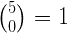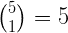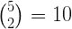

因此，15 层建筑可以表示为:

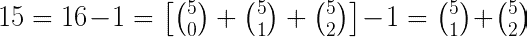

我们可以推广给定 *m* 次试验的两个鸡蛋的解决方案:

*可测试的最大楼层数为…*

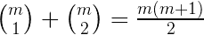

# 现在，用三个鸡蛋玩丢鸡蛋拼图怎么样？

像往常一样，我们将从一个简单的案例开始:3 个鸡蛋，4 次试验。

*   如果第一次试验打破了(第一个)鸡蛋，那么将有 2 个剩余的鸡蛋进行 3 次试验，按照上面的方法，可以测试 6 层。这意味着我们应该从 7 楼扔下第一个鸡蛋。
*   如果它从 7 楼摔落而破裂，我们将遵循在 3 次试验中用 2 个鸡蛋测试 6 楼建筑的策略，即从 3 楼、5 楼和 6 楼投掷(如果鸡蛋没有破裂)。
*   如果一个鸡蛋从 7 楼掉下来没有打破，我们可以重复上面的基本原理来确定我们应该在下一层掉一个鸡蛋。如果下一次掉落打破了鸡蛋，将有 2 个剩余的鸡蛋进行 2 次测试，可以测试 3 层。这意味着第二次试验将在第 11 层进行，剩下的 2 次试验用 2 个鸡蛋(如果一个鸡蛋从第 11 层掉下来摔碎了)，剩下的楼层是:8，9，10。

> 按照同样的策略，如果一个鸡蛋在 11 层没有打破，我们将尝试 13 层，然后如果一个鸡蛋在 13 层没有打破，我们将尝试 14 层。

一张图片胜过千言万语(至少他们是这么说的)

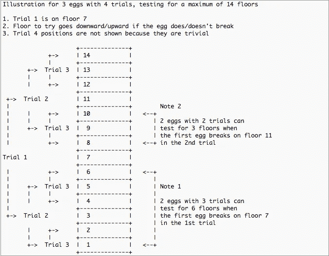

组合观点在这里也适用！原因是最佳策略应该利用给定数量的鸡蛋的所有可能的试验，其中每个不同的鸡蛋打破组合(在这种情况下总共 15 个组合)应该产生不同的答案。

用数字来表示，它将是:

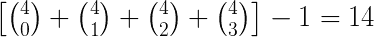

**备注:**

*   一个鸡蛋在试验中被打破，用黄色突出显示。
*   “答案”指的是已知最高的不打破鸡蛋的楼层。

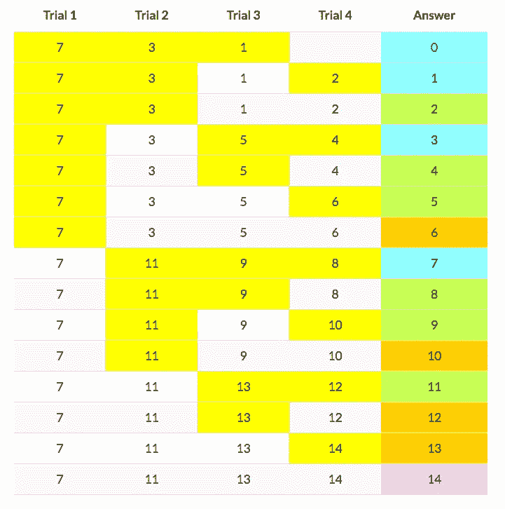

# 一般解有 *x* 个鸡蛋和 m 个试验。

基于上述讨论，一般的解决方案是:

通过 *x* 个鸡蛋和 *m* 个试验，我们可以测试的建筑物的最大层数由下式给出:

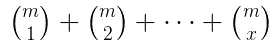

考虑到可能出现的情况，其中 *x* > *m* ，我们应该将一般解写成:

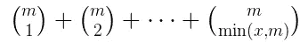

> 给读者一个小问题:当 x > m 时意味着什么？

一般解决方案的数值摘录如下所示。突出显示了 2 个鸡蛋和 100 层建筑的初始问题的答案，即 100 由 91 和 105 限定，因此答案是 14 次试验。

[带有这些数值和试验次数计算器的完整电子表格](https://code.oursky.com/wp-content/uploads/2016/07/egg-dropping-puzzle.xls)可用。

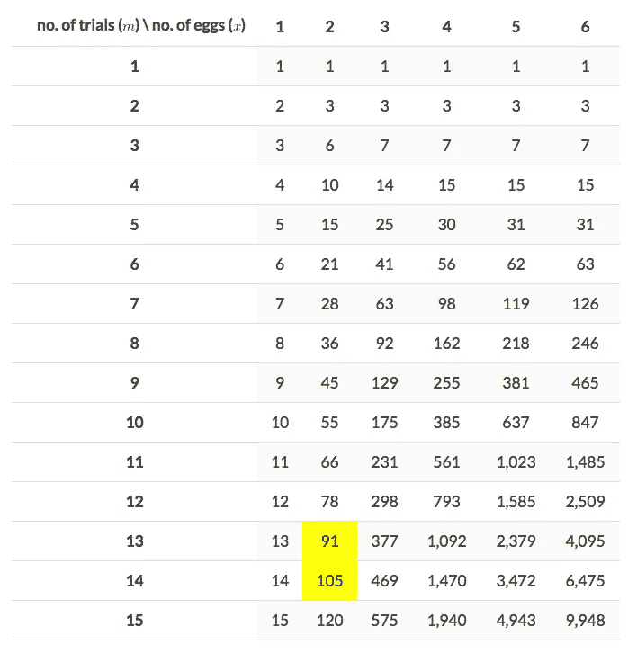

# 对于那些想进一步探索的人来说…

1.  对于程序员来说，编写一个程序来获得在给定的 *x* 个鸡蛋的情况下，在 n 层建筑上进行测试所需的试验次数。(需要提示？[https://en . Wikipedia . org/wiki/Dynamic _ programming # Egg _ dropping _ puzzle](https://en.wikipedia.org/wiki/Dynamic_programming#Egg_dropping_puzzle)
2.  为什么试验可以利用所有可能的组合？
3.  给定 *x* 个鸡蛋和 *m* 个试验，你会在第 *kth* 次试验中把鸡蛋扔到哪一层楼(给定最高层不会有鸡蛋打破平衡)？

*原载于 2016 年 7 月 18 日*[*code.oursky.com*](https://code.oursky.com/famous-egg-dropping-puzzle-in-combinatorics/)*。有什么意见吗？下面和我们分享一下！*

😻在 [Oursky](https://oursky.com) 我们致力于帮助品牌和企业家实现他们的想法。如果您正在寻找合作伙伴来帮助构建您的下一个数字产品，请联系我们。