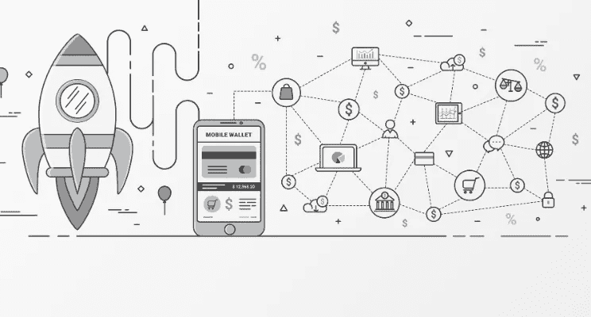

# 区块链功能在保险中的应用

> 原文：<https://medium.com/hackernoon/distributed-ledgers-blockchain-and-insurance-370ca7e2d6a>

想必你对区块链和 DLT(分布式账本技术)的概念并不陌生，至少在高层次上是如此。区块链是一种底层技术架构，比特币是一种全球加密货币，也是一种分布式数字支付系统。区块链几年来一直占据头条，但最近达到了狂热的程度。

几个月前，我发表了一篇名为[区块链(和新兴技术)炒作斗争](https://www.linkedin.com/pulse/blockchain-emerging-technology-hype-struggles-timothy-myers)的文章，毫不奇怪，它仍然在以协议、验证和简单的爱的形式产生大量讨论。为什么我一点都不惊讶？在我的职业生涯中，几乎每个人都同意这样一个观点，即从商业设计开始是获得市场成功解决方案的唯一途径。然而，在实践中，组织似乎不能这样运作。这一验证也遇到了一些质疑，即 DLT 技术如何真正实现个人和商业保险领域的变革。

# 糟糕的设计

保险和任何行业中的区块链试点主要是技术启动的项目，在这些项目中，该计划的真正目的是证明该技术，并在许多情况下证明该技术将适合当前的业务设计。是的，由于自动化和其他基本技术能力，流程和部门互动发生了变化，但从根本上说，改变业务模式的全部潜力没有得到挖掘。阅读关于保险计划的白皮书和报告强化了这种行业方法。人们可能会认为这种渐进方法几乎没有风险，许多人认为这将允许保险公司通过迭代方法发展到未来，在这些早期技术验证试点的基础上建立更多试点和项目。

技术驱动的计划错过了成功的主要因素；有目的的、深思熟虑的业务设计，其中业务被构建为利用由人员、流程和技术提供的业务能力来解决特定问题。

> *技术驱动的计划错过了成功的主要因素；有目的的、深思熟虑的业务设计，其中业务被构建为利用由人员、流程和技术提供的业务能力来解决特定问题。*

技术必须提供信息，而不是驱动商业设计。HBR 的优秀文章[如何设计一个成功的商业模式](https://hbr.org/2011/01/how-to-design-a-winning-business-model)透视了公司如何思考、运营和竞争。我的经验反映了 HBR 文章中的观点，任何规模的老牌公司都不知道如何与商业模式竞争。

> *我的经历反映了 HBR 文章中的观点，任何规模的老牌公司都不知道如何与商业模式竞争。*

# 从这里去哪里

在区块链世界，唯一的竞争方式是通过商业模式。区块链是一项基础技术，也就是说，它有能力以历史上不可能的方式改变经济和社会互动。因此，通过区块链做生意有两个基本事实。它们是:

1.  *传统经济和区块链经济模式不能共存共荣。*
2.  *区块链的商业模式要想成功，就必须借助区块链的能力。*

区块链使您能够设计保险业务运营模式，从根本上改变企业运营、互动的内容和方式，以及它们提供或需要行业中的哪些服务。功能和这些功能的示例应用包括:

1.  **不变性:**一个不可变的分类帐，保存可信数据或交易的历史——“基于价值而非信息”——用于加强信任。**业务案例:**任何货币交易，包括支付、再保险、索赔，其中各方之间的互动可以在没有保险公司对互动的直接控制的情况下存在。
2.  **信任:**在历史上，信任是通过契约性的、基于纸面的协议来实施的，并且是通过集中的业务流程执行来授予的。**业务案例:**包括条约、法定报告和会计、保单条款和条件、互助和合作保险组织在内的任何场景，其中合同条款和条件由于不可变的可信数据源的组合而可以自动化或流程消除。
3.  **监管:**所有权和身份明确的不可否认的监管链。**业务案例:**交易主数据或分类账数据，其中按时间顺序记录了欺诈、担保、所有权或救助以及代位求偿情况。
4.  **数据可访问性:**数据的匿名性和开放性消除了提供当今服务和产品所需的公司和资源的复杂生态系统。**商业案例:**通过添加物联网设备和区块链，重新想象数据，允许业务设计消除对保险产品和服务的需求，从财产数据聚合解决方案到理赔解决方案，如 Clue。
5.  **点对点:**一种网络形式的交互，在这种方式中，对等点通过交互直接获得结果，而不需要中介。**商业案例:**保险业务模式的复兴，如互助保险和合作社保险，它们提供模仿永久产品等产品类型的基于同行的解决方案，将重新出现，以转移和分散风险，在这种模式下，较小的个人小组在小组参与者之间合作管理风险。

# 走向

理解、建模和组装区块链提供的构建模块，使之成为一个新经济、有竞争力的保险业务模式，这需要商业领袖的高度关注，并认识到没有捷径可走。自上而下、深思熟虑和有指导的方法是确保您将集中经济的包袱抛在身后，支持更扁平、分布式的设计，与未来的保险解决方案共存的唯一方法。

*如果您喜欢这篇文章，请点赞或与您的网络分享，这样其他人也可以从中受益。*

*原载于 2017 年 11 月 16 日*[*https://www.linkedin.com*](https://www.linkedin.com/pulse/distributed-ledgers-blockchain-insurance-timothy-myers/?trackingId=fmLj2wyrT8FZQLC%2BN7wkhA%3D%3D)*。*