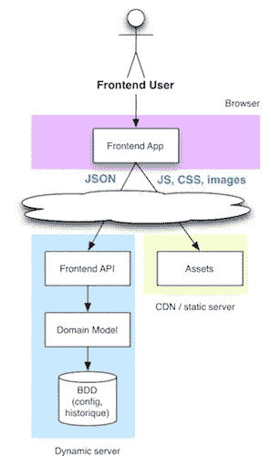
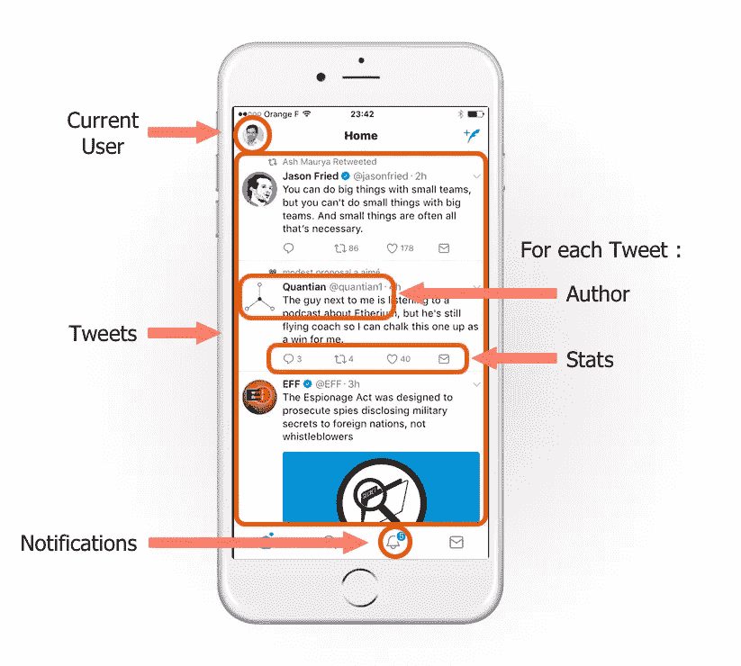
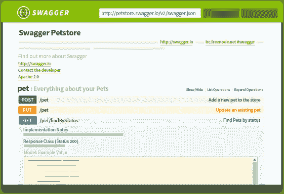

# 深入 GraphQL 第一部分:休息怎么了？

> 原文：<https://medium.com/hackernoon/dive-into-graphql-part-i-whats-wrong-with-rest-709ebcb898dc>


REST in peace

这是 GraphQL 系列的第一篇文章。令人惊讶的是，这篇文章并没有谈论 [GraphQL](https://hackernoon.com/tagged/graphql) 本身，而是谈论它所解决的问题。他们大多归结为休息。

更新 25/09/17:修正多个 HTTP 请求影响浏览器性能的不准确性，以及遗漏的 HTTP/2 提及。

# REST 解锁的 API 中心架构

首先，休息*本身*没有问题。REST 是构建以 API 为中心的架构的完美解决方案。在 REST 之前，公开(SOAP) web 服务需要复杂的工具、数小时的配置和大量的手册。消费这样的 web 服务需要专有的 SDK、资源密集型的准备和验证，还需要大量的手册。当时，除了微软的，从浏览器消费网络服务甚至是不可想象的(想想用 JavaScript 解析 XML WSDL)[。](https://msdn.microsoft.com/en-us/library/windows/apps/ms531063(v=vs.85).aspx)



API-centric architecture

2000 年发明的 REST 和 2007 年普及的因其简单的语法而大放异彩。REST 使得请求和响应易于构建和解析，这就是为什么世界各地的前端和后端开发人员迅速采用它的原因。REST 也是无状态和可缓存的，这使得伸缩变得轻而易举。它工作得如此之好，以至于今天，以 API 为中心的架构无处不在，REST 是首选的工具。

但自 2007 年以来，世界已经发生了变化。REST 的一些缺点，在当时是一个很好的权衡，现在却成了生产率、性能和可维护性的一大难题。

我们来看看为什么。

# 互联网现在是移动的

2015 年，谷歌宣布[首次从移动设备获得的搜索量超过了桌面](http://searchengineland.com/its-official-google-says-more-searches-now-on-mobile-than-on-desktop-220369)。自那以后，随着发展中国家跳上移动互联网的潮流，完全跳过有线连接，移动互联网消费稳步增长。所以让我们面对现实:我们今天构建的网络应用程序将主要在移动设备上使用，而不是在 WiFi 上。

4G 或 3G 上的移动设备比 WiFi 上的慢，因为[无线电通信的延迟开销](https://hpbn.co/optimizing-for-mobile-networks/#anticipate-network-latency-overhead)在 4G 上在 100 毫秒和 600 毫秒之间波动(在 3G 上高达 3500 毫秒)，还因为移动连接的质量变化很大，除了延迟之外，还会影响吞吐量。

对于单个 HTTP 请求，响应时间危险地接近 1 秒，根据 UX 专家 Jakob Nielsen 的说法，这是用户思想流动的极限。这意味着一个移动应用程序在不失去用户注意力的情况下可以发出的 HTTP 请求的最大数量是*一个*。


我们不要忘记电池寿命。无线电通信非常耗电，因此移动设备会尽快关闭设备无线电，失去与无线电塔建立的频道。为了进行新的 HTTP 请求，移动设备必须唤醒无线电，并向无线电塔请求一些带宽。如果应用程序设计者不考虑他们的 HTTP 请求，这会很快耗尽电池。

在移动设备上，以 API 为中心的应用程序特别容易受到延迟和电池寿命的影响，因为它们会疯狂地查询 REST 后端。

# 面向服务的架构糟透了(对客户来说)

想象一下，一个类似 Twitter 的移动应用程序使用 REST API 作为后端。让我们列出应用程序显示主页必须获取的资源:



REST 后端为每个端点暴露*一个资源。因此，移动应用程序必须向几个端点发送请求:*

1.  `GET /user`抓取当前用户名和头像
2.  `GET /notifications`获取未读通知的数量
3.  `GET /tweets`获取最近 20 条推文的列表
4.  `GET /users?ids=[123,456,789,...]`获取最近 20 条推文作者的简介
5.  `GET /tweet_stats?ids=[123,456,789,...]`获取最近 20 条推文的统计数据
6.  `POST /views`发送屏幕上显示的推文的浏览统计数据

这是 6 个 HTTP 请求——这还不包括对头像图像或嵌入媒体的请求。请求 4 和 5 必须等待请求 3 的返回。因此，这个简单的页面需要 1 秒以上的时间来获取所需的数据，尽管移动浏览器可以发出 4 到 6 个并发 HTTP 请求。

此外，网络和移动应用倾向于使用不止一个*服务提供商*(理解:不止一个 HTTP 域)。应用程序依赖不同的 REST 提供者进行[认证](https://developer.github.com/v3/oauth_authorizations/)、[头像](https://en.gravatar.com/site/implement/)、[评论](https://disqus.com/api/docs/)、[分析](https://developers.google.com/analytics/)等等，这是很常见的。在这种情况下，延迟问题变得更加棘手，因为每个新域都需要特定的 DNS 查找，而 HTTP 客户端无法在域之间共享 keepalive 连接。

总而言之，REST 的主要缺点是默认情况下会使客户端变慢，尤其是在移动设备上。

# 分组请求需要工作

一种解决方案称为 [*数据包含*](http://jsonapi.org/format/#fetching-includes) 。这个想法是从一个端点请求几个相关的资源，希望服务器知道两者之间的关系。类似于:

`GET /tweets?include=authors,stats`

这允许合并请求 3、4 和 5，但仅此而已。数据包含不允许请求不相关数据的*集合*(比如推文和通知)。

2013 年，脸书推出了另一种解决方案。他们称之为[批次终点](https://developers.facebook.com/docs/graph-api/making-multiple-requests)。它是一个 REST 端点，在这里您可以在`batch`查询参数中发送几个子请求:

```
curl \
    -F 'access_token=...' \
    -F 'batch=[{"method":"GET", "relative_url":"me"},{"method":"GET", "relative_url":"me/friends?limit=50"}]' \
    https://graph.facebook.com
```

在内部，脸书服务器查询其数据存储，并将结果分组到单个 JSON 响应中:

```
[
    { "code": 200,
      "headers":[
          { "name": "Content-Type",
            "value": "text/javascript; charset=UTF-8" }
      ],
      "body": "{\"id\":\"…\"}"},
    { "code": 200,
      "headers":[
          { "name":"Content-Type",
            "value":"text/javascript; charset=UTF-8"}
      ],
      "body":"{\"data\": [{…}]}}
]
```

对于纯粹主义者来说，这个批处理端点根本不是 RESTful 的，因为它没有真正公开一个*资源*。此外，当您需要将一个调用的响应(例如，tweet 列表)传递给另一个调用(tweet 作者简介)时，它不起作用。

最后，实现批处理端点策略需要时间。基本上就像开发一个*代理服务器*。我知道这一点，因为 marmelab 开发了一个 Node.js 中间件，名为 [koa-multifetch](https://github.com/marmelab/koa-multifetch) 。这是每个应用程序开发人员都应该包含在他们的 REST 服务器中的一个组件，以便达到一个不错的性能水平。这就是开发一个快速移动应用程序如此昂贵的原因。

# 没有标准意味着标准太多

REST 不是一个标准，它是一种架构风格，一套松散的原则。这些原则给开发人员留下了很大的实现空间。例如，[删除请求](https://stackoverflow.com/questions/2342579/http-status-code-for-update-and-delete)的推荐 HTTP 响应代码可以是 200 或 204。至于分页，您可以使用一个`page`查询参数，一个`Content-Range`头，或者，为什么不呢，`limit`和`offset`。查询和响应缺乏唯一的 REST 标准导致 REST 标准激增:Open API、OData、Hydra、JSend 等。


当你需要查询一个 web 服务的时候，你不能只使用一个标准的 REST 客户端，因为*没有标准的 REST 客户端*。您必须从头构建一个定制的 REST 客户端，或者调整[一个高度可配置和高度复杂的通用 REST 客户端](https://github.com/mgonto/restangular)。不管怎样，这都需要时间。而当你需要开发一个 web 服务后端的时候，你不能只使用你语言的 REST 框架。您必须首先花一周时间与您周围的所有开发人员和软件架构师进行讨论，并尝试决定您应该使用哪种 REST 风格。哦，不要让我开始内容类型协商或 [HATEOAS](https://jeffknupp.com/blog/2014/06/03/why-i-hate-hateoas/) 。

开源热潮只是加速了这一趋势:今天，如果你需要一个 REST 库，你必须从一大堆选项中选择。仅 JavaScript 一项，就有超过 900 个 rest 客户端 npm 包[。](https://www.npmjs.com/search?q=rest%20client&page=1&ranking=optimal)

所以，是的，自由导致多样性，但在互联网数据通信的情况下，多样性意味着浪费。REST 标准的缺乏极大地影响了开发速度。

# 前端和后端开发人员需要一份合同

REST 没有 schema 的概念，schema 是一个确切描述 web 服务应该返回什么的契约。就像上面的标准一样，模式的缺失导致了可能的文档格式的多样性:JSON 模式、RAML、Swagger 等。



在许多公司中，后端开发人员仍然使用 Word 文档来描述他们的 API 的资源和字段。一个 API 契约中要描述的东西太多了，手工制作的规范往往是不完整的。它们缺乏对错误情况、数据类型、参数边界等的描述。而且他们要花很长时间来写，所以他们总是过时。

问题是，没有描述 API 的明确契约，前端和后端开发人员必须做出假设，直到他们将他们的组件连接在一起。他们做的假设越多，整合阶段持续的时间就越长。

REST 中缺少单一模式会导致开发延迟，让开发人员感到沮丧。

# 敏捷导致臃肿的响应

API 往往会随着时间而变化。但是如果服务器 API 改变了，所有的消费者都会崩溃。

通常的解决方案被称为*版本控制*:服务器公开几个版本的 web 服务，对于一个给定的版本，API 从不改变。当然，【REST 版本控制没有标准，但是我们已经讨论过了。至于服务消费者，他们应该被告知新版本，并花时间更新他们的 API 调用。

然而，敏捷软件开发导致更短的发布周期。如今，[一个流行的网络服务一个月可以很容易地改变几次](https://developer.github.com/changes/)。要求开发人员如此频繁地更改他们的服务消费者的代码是不可取的。

这就是为什么有些 API 不使用版本控制而是用 [*进化*](https://www.mnot.net/blog/2012/12/04/api-evolution) 来代替。这个想法是*永远不要删除或修改*资源响应中的字段，而是*总是添加*一个新字段。例如，假设您已经为一个`GET /users/:id`请求开发了如下响应:

```
{
    "id": 123,
    "name": "John Doe"
}
```

然后一个产品经理来了，要求能够在平板电脑上显示中间名——但是我们仍然需要在移动设备上显示和以前一样的名字。没问题，只需*添加*一个新字段:

```
{
    "id": 123,
    "name": "John Doe",
    "full_name": "John W. Doe"
}
```

直到一个新的产品经理(他们每 6 个月换一次)为了支持名字后缀把 UI 彻底改了，因为新老板坚持要叫埃德温·丹尼森·洛厄尔三世。随着最终用户逐渐升级他们的应用程序，支持以前的名称格式也很重要。好了，我们来添加更多的字段。

```
{
    "id": 123,
    "name": "John Doe",
    "full_name": "John W. Doe",
    "full_full_name": "John W. Doe Sr."
}
```

你明白了。


问题是 web 服务存在的时间越长，资源就越多。在 Twitter API 中，一条 tweet 由超过 30 个字段组成，如果你想在会议室的电视机上显示关于你公司的热门 tweet，其中大部分是不需要的。

但是 REST 只包含资源的概念——没有*字段*的概念，例如，您可以使用它将响应限制为您需要的细节。缓解这种情况的尝试([稀疏字段集](http://jsonapi.org/format/#fetching-sparse-fieldsets)，[部分响应](https://developers.google.com/google-apps/tasks/performance#partial))是存在的，但它们总是可选的。REST 中的默认规则是需要整个资源，包括所有字段。所以 REST web 服务随着时间变得越来越慢，因为它们的响应越来越重。

# 仅 HTTP CRUD

REST 是仿照 HTTP 的。它使用了 HTTP 动词(`GET`、`POST`、`PUT`等)。)，需要 HTTP 传输，并且存在与 HTTP 相同的性能和安全问题。即使 Roy Fielding 最初的 REST 论文[将 REST 描述为协议不可知的](https://www.ics.uci.edu/~fielding/pubs/dissertation/rest_arch_style.htm#sec_5_3_2)，REST 实际上*只是 HTTP。*

此外，大多数关于 REST 的讨论只描述了 CRUD(创建、检索、更新、删除)交互。对于其他通信场景(文件上传、命令、远程过程调用等)，您只能靠自己了。


例如，许多现代应用程序需要实时更新。HTTP 通信是基于一个请求和一个响应的，它不是为没有任何请求就推送更新而设计的。因此，在 REST 中处理发布/订阅场景需要一种相当复杂的方法:

1.  客户端 A 大约每 10 秒钟向中央服务器发送一个`GET /events`请求。
2.  一天，客户端 B 向中央服务器发送一个`POST /events`请求，请求体中包含一个事件
3.  下一次客户机 A 向中央服务器发送`GET /events`请求时，它接收客户机 B 发出的事件

太浪费资源了(尤其是在移动端)！HTTP REST 领域的唯一解决方案是将客户机 A 变成服务器:

1.  服务器 A 向中央服务器发送一个`POST /subscriptions`请求，回调 URL`http://serverA.com/remote_events`作为参数。
2.  客户端 B 向中央服务器发送一个`POST /events`请求，请求体中包含一个事件。
3.  中央服务器发送一个`POST /remote_events`到服务器 A，事件在主体中。

但是，如果客户端 A 是一个移动设备，您如何做到这一点呢？这是否意味着将每部智能手机都变成网络服务器？这不是一个可行的解决方案。

像 WebSockets 或 HTTP/2 这样的现代协议解决了问题的一部分(协议)，但是它们没有指定要使用的数据交换格式。对于这些协议的发布/订阅来说，REST 是不合适的。例如，WebSockets 没有像 HTTP 那样的动词概念——只有消息。因此，除了 REST 之外，应用程序经常使用其他架构(如 [WAMP](http://wamp-proto.org/faq/) )来处理这些场景。

# 解决方案

总而言之，其余的[架构](https://hackernoon.com/tagged/architecture)使得应用程序开发缓慢、困难、昂贵，并且功能过于有限。这些问题是真实存在的。许多公司苦于休息，许多公司试图找到更好的替代方案。

也许我们可以通过添加 REST 缺少的所有东西来修补 REST:用于请求多路复用的[HTTP/2](https://hpbn.co/http2/#request-and-response-multiplexing)、[批处理端点](https://github.com/marmelab/koa-multifetch)、[稀疏字段集选择器](http://jsonapi.org/format/#fetching-sparse-fieldsets)、[模式](https://github.com/OAI/OpenAPI-Specification)、 [Swagger 文档](https://swagger.io/)等。有像 [API 平台](https://api-platform.com/)这样的完整框架致力于这项任务。我的观点是，这就像试图用叉子喝汤。你可能最终会设法做到，但这真的是个好主意吗？我认为 REST 并不真正符合现代 web 应用程序的需求。考虑到 Marmelab，我的公司，在 REST 上投资了多少，这是很不幸的。

为什么不用 SQL over HTTP？SQL 有`UNION`、`JOIN`、`HAVING`、`GROUP BY`，而且是标准化的。根据数据库模式验证查询。但是 SQL 将可能的操作限制为`SELECT`、`CREATE`、`UPDATE`和`DELETE`，所以在用例方面还是太有限了。SQL 也有很强的关系偏向，这使得它对于查询文档或图形数据库来说很不理想。但是让我们保留使用声明式查询语言的想法。

如果您认为可以通过使用普通的远程过程调用(RPC)来解决功能有限的缺点，那么您的思路就对了。但是风险是退回到[肥皂](https://en.wikipedia.org/wiki/SOAP)，没有人想再次陷入[极度复杂的坑](http://web.archive.org/web/20070113213839/http://www.loudthinking.com/arc/000602.html)。


Google 发明了[协议缓冲区](https://developers.google.com/protocol-buffers/)来解决性能和模式的痛点，并于 2008 年将其公之于众。它是一种语言中立、平台中立的可扩展机制，用于序列化结构化数据。这是一个很好的解决方案，但是它没有解决复杂查询和聚合的问题。另一个 RPC 二进制协议 Apache Thrift 也没有。

更接近圣杯的是网飞在 2015 年年中开源的 Falcor。Falcor 既是服务器中间件，也是客户端 SDK。但它是工具，不是架构。而且是纯 JavaScript 的；如果你做的是 Objective-C 或者 Kotlin，那你就不走运了。Falcor 不提供模式和静态类型，并且它缺乏强大的查询语言。

# 结论

一定有更好的办法。我们真正需要的是用一种新的架构来取代 REST，这种架构允许:

1.  查询资源的集合(例如，在一个往返行程中的 tweets 和 profile)，甚至来自不同的域
2.  查询明确的字段列表，而不是完整的资源
3.  提供描述请求和响应语法的模式
4.  成为一个标准，但不要太依赖于 HTTP 协议
5.  支持现成的发布/订阅场景
6.  将重点从服务器转移到客户端。

我相信脸书最近发布的一个创新工具解决了这个问题(提示:它以 G 开头)。阅读本系列的下一篇文章来发现它的样子。


如果你想阅读其他作者关于这个主题的更多内容，我推荐以下文章:

*   [从休息到写作](https://0x2a.sh/from-rest-to-graphql-b4e95e94c26b)，作者雅各布·吉莱斯皮
*   [GraphQL 是 GraphCool 团队开发的更好的 REST](https://www.howtographql.com/basics/1-graphql-is-the-better-rest/)
*   阿波罗团队的 GraphQL 与 REST
*   萨梅尔·布纳的《安息 API 是安息 API》

*原载于 2017 年 9 月 4 日 marmelab.com*[](https://marmelab.com/blog/2017/09/04/dive-into-graphql-part-i-what-s-wrong-with-rest.html)**。**