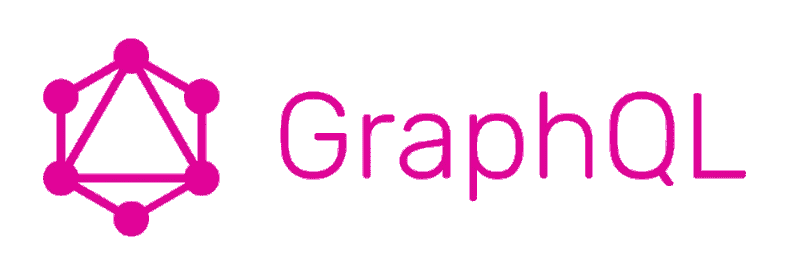
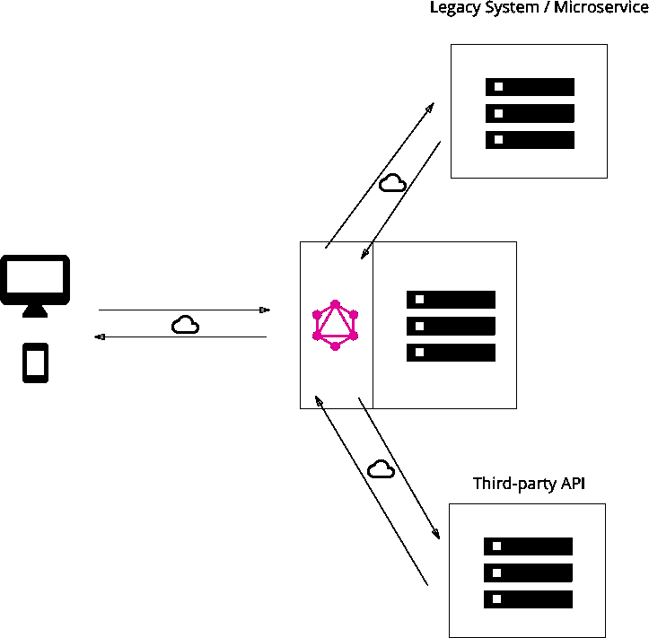
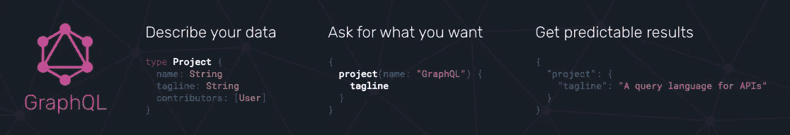

# 深入 GraphQL 第二部分:GraphQL 查询剖析

> 原文：<https://medium.com/hackernoon/dive-into-graphql-part-ii-anatomy-of-a-graphql-query-cf0bfc5280d>


在[深入 GraphQL 系列](https://marmelab.com/blog/2017/09/03/dive-into-graphql.html)的第一篇文章中，我解释了为什么 REST 不太适合今天的网络和移动应用。REST 使得应用程序开发速度慢、难度大、成本高，而且功能过于有限。我们需要一个新的英雄，一个允许:

1.  查询资源的集合(例如，在一个往返行程中的 tweets 和 profile)，甚至来自不同的域
2.  查询明确的字段列表，而不是完整的资源
3.  提供描述请求和响应语法的模式
4.  成为一个标准，但不要太依赖于 HTTP 协议
5.  支持现成的发布/订阅场景
6.  将重点从服务器转移到客户端。

我确信[脸书](https://hackernoon.com/tagged/graphql)发明的查询语言 GraphQL 是一个很好的候选语言。这种信念是基于几个月来对 GraphQL 的开发，并被 Marmelab 的许多开发人员所认同。我会在这篇文章中解释 GraphQL 是什么。



但是首先，让我们打破一些关于 GraphQL 的误解。

# GraphQL 不是什么

首先，GraphQL 不是用于图形数据库的查询语言。那就是[小妖精](http://tinkerpop.apache.org/)。GraphQL 中有*和*两个图的概念，但是学习者只有在阅读了一半文档后才能理解它(我会在下一篇文章中解释)。与此同时，许多好奇的开发人员放弃了，认为如果他们使用关系数据库或文档数据库，这与他们无关。

所以在我看来，GraphQL 最大的缺陷就是它的名字。其他名字会更好，比如，“焦糖”。这并不是说它不会发生在其他人身上:我将“ [admin-on-rest](https://github.com/marmelab/admin-on-rest) ”命名为 React 库，它可以与任何 REST *或 GraphQL* 后端一起工作。所以让我们弄清楚这一点:GraphQL 适用于任何数据库——关系数据库、键/值存储库、文档数据库和图表数据库。您甚至可以在 REST API 前面使用它。


GraphQL 不是一个 React 库，它甚至不仅仅是一个 JavaScript 库。我知道，你会发现大多数关于 GraphQL 的教程都使用 JavaScript，但这只是因为 JS 开发人员倾向于编写大量代码，所以他们希望分享它(双关语)。GraphQL 是一个*规范*，有多种语言的实现。可以在 JS、Objective-C 或者 Java 中的客户端使用 GraphQL。可以在 JS、Go、Python、Ruby、PHP 等在服务器端使用 GraphQL。

GraphQL 不是传输协议。您可以将 GraphQL 用于任何传输方式——HTTP、WebSockets，如果您愿意，甚至可以通过 Bittorrent 将 GraphQL 查询作为文本文件发送。这使得它不同于 REST，REST 依赖于 HTTP 协议，建立在 HTTP 语法(`GET`、`POST`、`PUT`等)之上。).

根据这个想法，GraphQL 不处理认证、授权、压缩、缓存、内容协商等。那是你的责任。

GraphQL 有意不包括内置的过滤、排序、计算或连接。您自己仔细设计所有这些来满足 API 消费者的需求，就像 REST 一样。

# 您的第一个 GraphQL 查询

现在，与其描述 GraphQL *是什么*，不如让我们看看它*与 REST 相比做了什么*。例如，在 REST 中，从 API 请求一条 tweet 通常如下所示:

```
----------------------------------- request
GET /tweets/123 HTTP 1.1
Host: http://rest.acme.com/
----------------------------------- response
HTTP/1.1 200 OK
Content-Type: application/json
{
    "id:" 123,
    "body": "Lorem Ipsum dolor sit amet",
    "user_id": 456,
    "views": 45,
    "date": "2017-07-14T12:44:17.449Z"
    // etc.
}
```

在 HTTP 上的 GraphQL 中，等效的代码是:

```
----------------------------------- request
POST / HTTP 1.1
Host: http://graphql.acme.com/
Content-Type: application/graphql
{
    Tweet(id: 123) {
        id
        body
        date
    }
}
----------------------------------- response
HTTP/1.1 200 OK
Content-Type: application/json
{
    "data": {
        "Tweet": {
            "id:" "123",
            "body": "Lorem Ipsum dolor sit amet",
            "date": "2017-07-14T12:44:17.449Z"
        }
    }
}
```

在这个例子中有几件事需要注意:

*   在 REST 中，API 为每个资源公开一个端点(`/tweets`就是这样一个端点)，而在 GraphQL 中，整个 API 只有一个端点(在示例中是`/`)
*   就像 REST 一样，GraphQL 响应的主体是一个 JSON 对象。然而，响应的格式是标准化的，并且内容总是在`data`键下可用。
*   在 GraphQL 中，参数在括号之间(这里:`(id: 123)`)和查询内部传递。
*   在 REST 中，您需要一个完整的资源，而在 GraphQL 中，您必须显式地列出您想要的字段(本例中的`id`、`body`和`date`)。
*   GraphQL 查询使用一种特殊的查询语言，称为… graphql。它看起来像 JSON，但不是真的。我们很快就会看到。
*   GraphQL 请求使用一种特殊的内容类型`application/graphql`
*   与 REST 不同，GraphQL 不依赖于 HTTP 语义。为了读取资源，GraphQL 使用一个`POST` HTTP 请求。


如果你是一个铁杆 REST 迷，这最后一点可能会让你畏缩。什么，用`POST`到*读*一个资源？不是和溺死小猫一样犯罪吗？对您来说更糟糕的是:在 GraphQL 中，如果您想:

```
----------------------------------- request
GET /?query=query%20%7B%20Tweet(id%3A%20123)%20%7Bid%20body%20date%20%7D%7D
Host: http://graphql.acme.com/
----------------------------------- response
HTTP/1.1 200 OK
Content-Type: application/json
{
    "data": {
        "Tweet": {
            "id:" "123",
            "body": "Lorem Ipsum dolor sit amet",
            "date": "2017-07-14T12:44:17.449Z"
        }
    }
}
```

如果你感到震惊，请多包涵。几分钟后，你会发现这是一个多么伟大的想法。所以是的，GraphQL 服务器通常不关心 HTTP 动词。更常见的是对所有事情(读写查询)使用`POST`,因为它在教程中可读性更好。如前所述，您甚至不需要使用 HTTP 来与 GraphQL 服务器通信。

顺便提一下，您可以从`GET`请求中看到，换行和制表在 graphql 查询中并不重要。

# GraphQL 是远程过程调用，不是基于资源的

在之前的文章中，我介绍了移动 Twitter 主页的用例:


为了呈现这个页面，应用程序需要读取 10 条最新的 tweets，而不仅仅是一条。在休息时，你可以这样做:

```
----------------------------------- request
GET /tweets/?limit=10&sortField=date&sortOrder=DESC HTTP 1.1
Host: http://rest.acme.com/
----------------------------------- response
HTTP/1.1 200 OK
Content-Type: application/json
[
    {
        "id:" 752,
        "body": "consectetur adipisicing elit",
        "user_id": 249,
        "views": 12,
        "date": "2017-07-15T13:17:42.772Z",
        // etc.
    },
    {
        "id:" 123,
        "body": "Lorem Ipsum dolor sit amet",
        "user_id": 456,
        "views": 45,
        "date": "2017-07-14T12:44:17.449Z"
        // etc.
    },
    // etc.
]
```

在 GraphQL 中，就像您调用`Tweet`查询来获得一条 tweet 一样，您通常调用`Tweets`查询来获得几条 tweet。但是，您需要列出希望出现在响应中的字段:

```
----------------------------------- request
POST / HTTP 1.1
Host: http://graphql.acme.com/
Content-Type: application/graphql
{
    Tweets(limit: 10, sortField: "date", sortOrder: "DESC") {
        id
        body
        date
    }
}
----------------------------------- response
HTTP/1.1 200 OK
Content-Type: application/json
{
    "data": {
        "Tweets": [
            {
                "id": "752",
                "body": "consectetur adipisicing elit",
                "date": "2017-07-15T13:17:42.772Z",
            },
            {
                "id": "123",
                "body": "Lorem Ipsum dolor sit amet",
                "date": "2017-07-14T12:44:17.449Z"
            },
            // etc.
        ]
    }
}
```

`Tweet`和`Tweets`是查询名称，由服务器定义。事实上，GraphQL 的核心是一种远程过程调用(RPC)语言:它让客户机调用服务器上的过程(查询)。这意味着它绝对不局限于 CRUD(创建、检索、更新、删除)场景。

但是我应该警告你:对于*命名*查询没有约定。一些 GraphQL 服务器将使用`Tweets`作为 tweets 列表，另一些可能使用`allTweets`，还有一些使用`getTweetPage`，等等。我知道[给事物命名是计算机科学](https://martinfowler.com/bliki/TwoHardThings.html)的两大难题之一，但我仍然很遗憾 GraphQL 规范没有更进一步。

# 聚集

您可能想知道为什么 GraphQL 响应在响应中包含一个`Tweets`键，而不是将 tweets 列表直接放在`"data"`下。这是因为您可以同时查询几个资源——在一次往返行程中:

```
----------------------------------- request
POST / HTTP 1.1
Host: http://graphql.acme.com/
Content-Type: application/graphql
{
    Tweets(limit: 10, sortField: "date", sortOrder: "DESC") {
        id
        body
        date
    }
    User {
        full_name
    }
    NotificationsMeta {
        count
    }
}
----------------------------------- response
HTTP/1.1 200 OK
Content-Type: application/json
{
    "data": {
        "Tweets": [
            {
                "id": "752",
                "body": "consectetur adipisicing elit",
                "date": "2017-07-15T13:17:42.772Z",
            },
            {
                "id": "123",
                "body": "Lorem Ipsum dolor sit amet",
                "date": "2017-07-14T12:44:17.449Z"
            },
            // etc.
        ],
        "User": {
            full_name: "John Doe"
        },
        "NotificationsMeta": {
            count: 12
        }
    }
}
```

除了`Tweets`之外，我还调用了`User`查询来获取连接用户的详细信息，并调用了`NotificationsMeta`查询来获取待处理通知的数量。GraphQL 允许我将几个查询聚合成一个 HTTP 请求。


不过，还缺少一样东西:每条推文的作者姓名和头像。在 REST 中，您必须等待第一个查询的响应来获取每条 tweet 的`user_id`，然后用这些 id 查询`/users`端点。这将阻止页面的呈现，直到第二个响应返回。在 GraphQL 中，可以直接在推文中查询作者:

```
----------------------------------- request
POST / HTTP 1.1
Host: http://graphql.acme.com/
Content-Type: application/graphql
{
    Tweets(limit: 10, sortField: "date", sortOrder: "DESC") {
        id
        body
        date
        Author {
            username
            full_name
            avatar_url
        }
    }
    User {
        full_name
    }
    NotificationsMeta {
        count
    }
}
----------------------------------- response
HTTP/1.1 200 OK
Content-Type: application/json
{
    "data": {
        "Tweets": [
            {
                "id": "752",
                "body": "consectetur adipisicing elit",
                "date": "2017-07-15T13:17:42.772Z",
                "Author": {
                    "username": "alang",
                    "full_name": "Adrian Lang",
                    "avatar_url": "http://avatar.acme.com/02ac660cdda7a52556faf332e80de6d8"
                }
            },
            {
                "id": "123",
                "body": "Lorem Ipsum dolor sit amet",
                "date": "2017-07-14T12:44:17.449Z",
                "Author": {
                    "username": "creilly17",
                    "full_name": "Carole Reilly",
                    "avatar_url": "http://avatar.acme.com/5be5ce9aba93c62ea7dcdc8abdd0b26b"
                }
            },
            // etc.
        ],
        "User": {
            full_name: "John Doe"
        },
        "NotificationsMeta": {
            count: 12
        }
    }
}
```

因此 GraphQL 允许您将许多查询组合成一个查询，包括对相关资源的查询。这样，您总是可以在一个请求中获得屏幕所需的所有数据。事实上，最后一个查询足以在一次往返中呈现整个 Twitter 主页。任务完成！

**提示**:如果你想知道 GraphQL 服务器是如何工作的，[本系列的第三篇文章](https://marmelab.com/blog/2017/09/06/dive-into-graphql-part-iii-building-a-graphql-server-with-nodejs.html)将回答你的问题。这是一个为 Twitter 应用程序构建 GraphQL 服务器的教程。现在，请考虑服务器已经存在，并从这些服务器端的考虑中解放出来。

# 检查 GraphQL 服务器

等等，我怎么知道可以在服务器上调用`Tweets`、`User`和`NotificationsMeta`查询呢？我是说，除了我正在写这个教程？换句话说，作为一名前端开发人员，我如何知道可以在 GraphQL 后端调用哪些查询以及每个查询中的哪些字段？


GraphQL 通过公开查询映射来满足这一需求。每个 GraphQL 服务器都可以回答一个叫做`__schema`的特殊查询——它叫做*自省*查询。它不是一个[特别可读的查询](https://gist.github.com/craigbeck/b90915d49fda19d5b2b17ead14dcd6da)，而且您无论如何也不会手工编写它(所有 GraphQL 客户端都可以在一个命令中进行自省)，所以让我们来看看这个查询的结果:它是服务器*模式*。对于我的示例 Twitter API 服务器，GraphQL 模式如下所示:

```
# entry points
type Query {
    Tweet(id: ID!): Tweet
    Tweets(limit: Int, sortField: String, sortOrder: String): [Tweet]
    TweetsMeta: Meta
    User: User
    Notifications(limit: Int): [Notification]
    NotificationsMeta: Meta
}

type Mutation {
    createTweet (body: String): Tweet
    deleteTweet(id: ID!): Tweet
    markTweetRead(id: ID!): Boolean
}

type Subscription {
    tweetPublished(userId: ID!): Tweet
}

# custom types
type Tweet {
    id: ID!
    # The tweet text. No more than 140 characters!
    body: String
    # When the tweet was published
    date: Date
    # Who published the tweet
    Author: User
    # Views, retweets, likes, etc
    Stats: Stat
}

type User {
    id: ID!
    username: String
    first_name: String
    last_name: String
    full_name: String
    name: String @deprecated
    avatar_url: Url
}

type Stat {
    views: Int
    likes: Int
    retweets: Int
    responses: Int
}

type Notification {
    id: ID
    date: Date
    type: String
}

type Meta {
    count: Int
}

# custom scalar types
scalar Url
scalar Date
```

哇，这个服务器暴露了很多东西！通过阅读模式，我一眼就能看出:

*   我可以*读取*关于推文、用户和通知的数据(`type Query`列出了读取的入口点)
*   我可以*创建和删除*推文，并将其中一条标记为已读(`type Mutation`列出了写入口点)
*   我可以*为给定用户订阅*新发布的推文(T1 列出了发布/订阅入口点)

每个入口点都有一个返回类型，模式列出了所有这些类型的可用字段。例如，`Tweets`查询返回一个`Tweet`类型的记录列表，它公开了`id`、`body`、`date`、`Author`和`Stats`字段。这些字段也是类型化的，或者是标量类型(`Int`、`String`或`ID`，类似于`String`)，或者是自定义类型(`User`和`Stat`)，我也可以看到可用的字段。

GraphQL 模式就像 REST APIs 的招摇过市。它包含了与服务器交互所需的所有信息。

实际上，与本文不同，GraphQL 的开发是模式优先的。前端和后端开发人员从商定一个模式开始。它们定义了前端和后端之间的契约。然后，每个团队开发自己的部分，没有任何惊喜。在本系列的下一篇文章中，您将会看到它是如何工作的。

**注意** : GraphQL 建议主键使用`ID`类型。这意味着 GraphQL 期望记录由一个*字符串*来标识。这也解释了为什么在上面的 GraphQL 结果中，`Tweet.id`字段有字符串值，尽管这些值是数字。

**注**:你可能已经注意到了`scalar Date`声明。它是大多数模式都包含的类型声明，因为 GraphQL 规范在默认情况下没有定义`Date`类型！

# GraphQL 是一种声明式查询语言

您可能注意到模式语法看起来很像查询语法。那是因为一样。这种类似 JSON 的、无逗号、无分号的语言被称为 graphql 语言。它用于描述类型、查询、突变、片段、订阅。有一个专门的网站，但是你已经学会了基本知识:

*   GraphQL 为`String`、`Int`、`Float`、`Boolean`和`ID`提供了内置的标量类型。
*   您可以通过开始一个`type`声明来定义一个对象类型。对象类型包含字段，每行一个。每个字段都有一个名称和一个类型，可以是对象类型，也可以是标量类型
*   对象字段可以有括号内的参数(如在`Notifications`查询中)。这些参数也有类型。
*   必填字段的类型名称后面有一个感叹号(例如`ID!`)
*   您可以添加注释(以`#`符号开始)
*   模式可以包含注释，称为*指令*(作为`@deprecated`名称字段)
*   您可以通过开始一个`scalar`声明来定义一个标量类型


该模式没有解释服务器如何获取结果，它描述了结果应该是什么样子。从这个意义上说，graphql 语言就像 SQL 一样，是一种声明性语言。但是与 SQL 不同，GraphQL 请求和响应非常相似——您总是知道会发生什么。

实际上，为了编写一个 GraphQL 查询，我首先考虑我期望的结果，例如:

```
{
    Tweets: [
        {
            id: 752,
            body: "consectetur adipisicing elit",
            date: "2017-07-15T13:17:42.772Z",
            Author: {
                username: "alang",
                full_name: "Adrian Lang",
                avatar_url: "http://avatar.acme.com/02ac660cdda7a52556faf332e80de6d8"
            },
        {
            id: 123,
            body: "Lorem Ipsum dolor sit amet",
            date: "2017-07-14T12:44:17.449Z",
            Author: {
                username: "creilly17",
                full_name: "Carole Reilly",
                avatar_url: "http://avatar.acme.com/5be5ce9aba93c62ea7dcdc8abdd0b26b"
            },
        },
        // etc.
    ],
    User: {
        full_name: "John Doe"
    },
    NotificationsMeta: {
        count: 12
    }
}
```

然后我删除冒号、逗号和值。最后，我加入参数。结果是获得该结果的 GraphQL 查询:

```
{
    Tweets(limit: 10, sortField: "date", sortOrder: "DESC") {
        id
        body
        date
        Author {
            username
            full_name
            avatar_url
        }
    }
    User {
        full_name
    }
    NotificationsMeta {
        count
    }
}
```

使用 GraphQL，我可以确定响应包含什么，而不管实现 GraphQL 服务器使用的是什么技术。在我的第一个 GraphQL 项目之后，当我明白我在第一个项目中学到的所有东西都可以直接应用到第二个项目时，我开始欣赏这个优势。

**提示:**如果你觉得在每个查询中重复你想要的字段列表很麻烦，看看 GraphQL [片段](http://facebook.github.io/graphql/#sec-Language.Fragments)——它们有点像宏。

# 突变和订阅

我已经解释了如何调用`Query`:

```
{
    Tweet(id: 123) {
        id
        body
        date
    }
}
```

实际上，GraphQL 希望请求以定义请求所针对的入口点类型的关键字开始。在没有关键字的情况下，它退回到`query`，但是我也可以使它显式:

```
query {
    Tweet(id: 123) {
        id
        body
        date
    }
}
```

就这样，您已经学会了如何调用变异和订阅:只需在请求前加上适当的关键字:

```
mutation {
    createTweet(body: "Hello, world!") {
        id
        body
        date
    }
}subscription {
    tweetPublished(userId: 123) {
        id
        date
        body
        Author {
            username
            full_name
            avatar_url
        }
    }
}
```

一个 GraphQL 查询只能包含三个关键字`query`、`mutation`和`subscription`中的一个。这意味着您不能在单个查询中聚合读写操作。

**注意** : GraphQL 没有指定用于实时订阅的传输。通常是 WebSockets，但是你可以使用 iOS 推送通知，长轮询，甚至电子邮件！

**提示:**为你的请求命名*是一个好习惯。您可以在关键字和左括号之间添加名称，如下所示:*

```
query getTweetDetail {
    Tweet(id: 123) {
        id
        body
        date
    }
}
```

这在客户端调试 GraphQL 时会很方便，因为调试工具会按名称列出客户端发出的查询。

# 变量和准备好的查询

在第一个例子中，我已经请求了 id 为`123`的`Tweet`:

```
----------------------------------- request
POST / HTTP 1.1
Host: http://graphql.acme.com/
Content-Type: application/graphql
{
    Tweet(id: 123) {
        id
        body
        date
    }
}
```

为了构建这样的查询，我必须将一个值(`123`)连接或插入到一个字符串中。这为注入攻击打开了方便之门——不是 SQL 注入，而是 GraphQL 注入。

为了使这个查询安全，我可以将`123`值转换成一个`$id`变量，并告诉 GraphQL 将`123`值绑定到这个变量。如果这听起来像 SQL 中的预准备语句，那是故意的。

要在 GraphQL 查询中使用一个变量，我必须在查询的顶部，在左括号之前声明它，并指定它的类型。至于变量值，我可以在查询字符串中传递它，作为序列化的 JSON 对象:

```
----------------------------------- request
POST /?variables={"id":123} HTTP 1.1
Host: http://graphql.acme.com/
Content-Type: application/graphql
($id: ID!) {
    Tweet(id: $id) {
        id
        body
        date
    }
}
```

现在，查询不会受到注入攻击。除了允许查询的可重用性，graphql 变量还简化了繁琐的字符串插值和转义。

**提示:**如果你正在寻找记住 GraphQL 语法的方法，我推荐[Hafiz Ismail 的 GraphQL 备忘单](https://raw.githubusercontent.com/sogko/graphql-shorthand-notation-cheat-sheet/master/graphql-shorthand-notation-cheat-sheet.png)。

# GraphQL 位于客户机和服务器之间

在这一点上，开发人员经常会想:好吧，GraphQL 是一种语言，但它如何转化为我的软件架构呢？



基本上，GraphQL 服务器是一个 API 网关，是客户端和后端服务器之间的代理。后端服务器可以是任何东西(REST API、关系数据库、NoSQL 数据库)。您甚至可以使用几个后端，并将它们隐藏在一个 GraphQL(代理)服务器后面。

GraphQL 服务器有多种语言，第一种是 Node.js。但是如果 JavaScript 对您的团队没有意义，您就不必局限于它。你不需要在服务器上写太多代码——你甚至可以使用一个后端即服务工具，比如优秀的 [GraphCool](https://www.graph.cool/) 来帮你处理 GraphQL 服务器端。

客户端通常还有一个小的 GraphQL SDK，帮助构建请求和解码响应。这完全是可选的，但这就是使用*标准*的优势:你不必为每个项目重写代码。

# 简而言之 GraphQL



所以 GraphQL 是一种“查询语言”，就像 HTTP 动词和资源 URL 是 REST 的“查询语言”一样。但是这种语言比 REST 要发达和标准化得多。

*   GraphQL 是一个 API 网关，或者说是位于数据后端前端的代理服务器。
*   GraphQL 是一种 DSL，用来表达暴露给客户端的业务逻辑
*   GraphQL 是一种声明式查询语言。客户得到他们想要的。
*   GraphQL 是为远程过程调用而设计的，并不局限于 CRUD。
*   GraphQL 是一种强大的静态类型语言。它使开发更快，更不容易出错。
*   GraphQL 支持读、写和订阅操作
*   GraphQL 将重心移向客户端。客户端决定在响应中得到什么字段，而不是服务器。
*   GraphQL 在 HTTP 上工作…但不是唯一的。这是一个获取和更新数据的规范，可以在任何协议中实现
*   GraphQL 支持在一个现成的请求中聚合和组合多个资源
*   GraphQL 服务器提供了内置的 API 文档
*   GraphQL 支持 API 进化，并允许不推荐警告
*   GraphQL 不关心后端存储。您可以保留您的数据库，甚至可以保留您的 REST API，如果它还在使用的话。

总而言之， *GraphQL 不是下一个 REST，它是下一个 SOAP* ，从零开始重新设计，吸取了 REST 最重要的经验:简单。我相信这是个好主意。


好了，关于 GraphQL 是什么，你已经看得够多了。是时候用 GraphQL 进行真正的开发了。在本系列的下一篇文章中，我将教你在 Node.js 中为一个类似 Twitter 的移动应用程序开发一个 GraphQL 服务器。

*原载于 2017 年 9 月 5 日*[*marmelab.com*](https://marmelab.com/blog/2017/09/05/dive-into-graphql-part-ii-anatomy-of-a-graphql-query.html)*。*