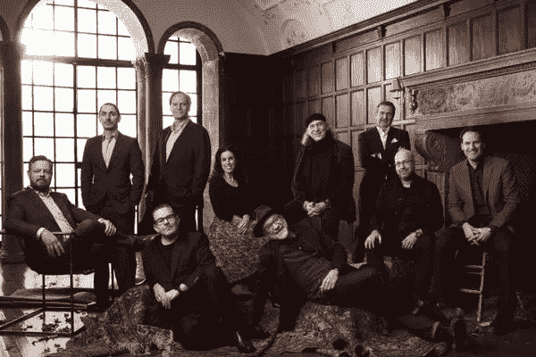

# 广告业的多样性

> 原文：<https://medium.com/hackernoon/diversity-in-the-ad-industry-1544704e58e9>

Ad Age’s 2016 Agency A-List

越来越多的人意识到广告公司正面临着一个多样性的问题，尤其是看看上周的 T2 格言。然而，不幸的是，这是一个多层次的问题，没有简单的解决方案。

我们必须从我们今天生活的国家开始，目前大约有 40%的人口属于少数种族或少数民族。今年美国的西班牙裔人口为 5540 万，约占 17%，非洲裔美国人是美国第二大族裔群体，有近 2000 万人(也没有出现在 A-List 中)。但是让我们把种族放在一边，只关注广告行业的性别多样性，所谓的 A-list 只有一位女性高管被列为 A-lister。根据 2012 年人口普查，美国女性人口[为 1.57 亿](https://www.census.gov/newsroom/releases/archives/facts_for_features_special_editions/cb12-ff05.html)。

对我来说，这是最具启发性的，作为一个少数民族和两个女孩的父亲，我可能有点偏见，但你是在告诉我，每 9 个男人中就有一个女人能够在技能、智慧和创造力上与男人匹敌吗？这些人是这个行业的精英，人们视他们为精英中的精英，但只有一位女性代表？我们向业内其他人发出了什么样的信息？

> 伊德瑞斯·艾尔巴最近在英国议会发表了关于多样性的演讲，他说“你看，人才已经没有了，但是机会还没有。”

我们知道广告行业充满了优秀的人才，但是我们是否给了他们平等的机会和支持来帮助他们成长并成长为下一代的一线明星。对于这个行业的生存和信誉来说，这既是一种责任，也是一种必须。

我的建议是发现人才，告诉他们机会，并教育他们如何成为明天的领导者...

> [黑客中午](http://bit.ly/Hackernoon)是黑客如何开始他们的下午。我们是 [@AMI](http://bit.ly/atAMIatAMI) 家庭的一员。我们现在[接受投稿](http://bit.ly/hackernoonsubmission)，并乐意[讨论广告&赞助](mailto:partners@amipublications.com)机会。
> 
> 如果你喜欢这个故事，我们推荐你阅读我们的[最新科技故事](http://bit.ly/hackernoonlatestt)和[趋势科技故事](https://hackernoon.com/trending)。直到下一次，不要把世界的现实想当然！

