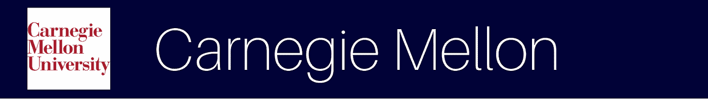
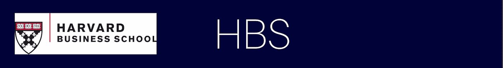
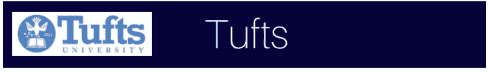

# 粗草案风险投资公司大学网络的多样性和包容性

> 原文：<https://medium.com/hackernoon/diversity-inclusion-across-the-rough-draft-ventures-university-network-73bdb49693a>

在 RDV，我们与数百名下一代技术领导者合作，他们有能力通过他们正在开发的前沿技术推动变革，并解决技术行业面临的关键挑战，包括多样性和包容性。

为了庆祝我们合作的校园中现有的多样性和包容性计划，以及为学生领袖提供一个将类似计划带到他们的校园的蓝图，我们汇总了一份成功计划的列表。这些计划为更广泛的技术社区提供了一种可扩展的方式来访问不同的人才库。

*   ALPFA :美国拉丁裔专业人士协会(ALPFA)是在全球市场上扩大拉丁裔领导机会的首要商业组织。ALPFA 为其成员、社区和商业伙伴创造机会、增加价值和建立关系，同时扩大拉丁裔在全球劳动力中的领导地位。
*   [巴布森代码:](https://www.babsoncode.com/)巴布森代码帮助巴布森学生开发技术技能组合，以匹配他们的创业心态。代码是任何技术的校园资源，有助于引导学生通过商业和技术的交叉。他们举办各种各样的活动，包括研讨会、特邀演讲人、与公司的交流活动，以及他们的生活学习社区 Codeplex 中的点对点活动。
*   [ETower](http://etower.org/) : ETower 通过提供一个生活社区和空间，联合各种类型的学生创业者来创造一个创新的环境。ETower 致力于为学生创业者提供资源，包括网络会议、演讲系列和指导。
*   巴布森大学的“向前一步”计划:巴布森大学的“向前一步”计划旨在提升学生的抱负和领导力，并促进对平等的支持。《向前一步》还提供了一个职业妇女网络，为她们提供支持资源，以增强她们的权能并鼓励她们取得成就。

*   [波士顿学院女性峰会:](http://www.bcownit.com/)波士顿学院女性峰会(以前称为 Own It)是一个为期一天的峰会，旨在通过将所有与会者与同学、演讲者和嘉宾联系起来，并创造一个空间来进行有意义的对话和分享改变游戏规则的想法，从而赋予所有与会者权力。
*   [计算机科学协会:](http://bccss.io)波士顿学院计算机科学协会(CSS)致力于帮助对技术和创业感兴趣的学生实现他们的目标。在整个学年中，他们举办各种活动，如客座演讲、研讨会、黑客马拉松、协作项目等。他们与不列颠哥伦比亚大学计算机科学系紧密合作，为学生创造更好的学习环境和寻找新的机会。
*   [企业家协会:](http://bc.orgsync.com/org/entrepreneursociety42148/About)波士顿学院企业家协会是一个由志同道合的个人组成的团体，其使命是通过介绍激动人心的演讲者和实践活动来培养企业家精神和促进创造力。
*   [拉丁美洲商业俱乐部:](http://latinamericanbc.weebly.com/)波士顿学院的拉丁美洲商业俱乐部是一个学生管理的组织，主要有三个目标:1。通过对这些新兴经济体不断变化的社会提供不同的视角，提高对拉丁美洲地区当前面临的社会和政治问题的认识。2.为拉美学生提供在美国寻找优秀实习和工作机会的工具。3.创建一个强大的网络，帮助学生与拉丁美洲学生和波士顿学院的校友建立联系。
*   [商界女性:](http://www.bcwib.com/)波士顿学院商界女性是一个由女大学生组成的组织、网络和社区，致力于女性赋权和教育。WIB 致力于发展和扩大其成员的职业和个人机会，重点是商业、领导力、女性庆典和创新。

*   [提升、招募、保留&组织 STEM 中的女性(ARROWS)](https://www.bu.edu/arrows/):ARROWS 的任务是组织、调整和纵向整合旨在提升波士顿大学 STEM 社区女性地位的项目。
*   [黑人商业学生协会(BBSA):](https://www.facebook.com/pg/BBSABu) 波士顿大学黑人商业学生协会(BBSA)是一个活跃的校园资源，通过在不同背景的学生与校友、专业人士和公司之间架起桥梁，促进商业世界的多样性。最终目标是让本科生成员获得广泛的职业建议和机会。
*   [波士顿大学全国黑人工程师协会(BUNSBE):](http://www.bunsbe.org/) BUNSBE 致力于维持 NSBE 的使命，即“增加有文化责任感的黑人工程师的数量，他们在学术上出类拔萃，在职业上取得成功，并对社区产生积极影响。”他们是全国黑人工程师协会(NSBE)的一个分会，但接受任何关心支持他们的事业或认为他们可能从他们的努力中受益的成员。
*   [科学与工程专业女研究生(GWISE):](https://www.bu.edu/gwise/) 波士顿大学科学与工程专业女研究生(GWISE)致力于创建一个社区，以支持和促进科学、技术、工程和数学领域的女性。通过专业发展研讨会和讲习班、社交活动、指导和外联，GWISE 促进了波士顿大学各学科之间的互动，并将研究生与博士后、教师以及波士顿内外更广泛的网络联系起来。
*   [亚洲科学家和工程师协会(SASE):](http://sites.bu.edu/sase/) 亚洲科学家和工程师协会(SASE)帮助亚洲遗产科学和工程专业人士实现他们的全部潜力。
*   西班牙裔专业工程师协会(SHPE): SHPE 一直致力于提高工程学院的西班牙裔入学率和保留率。SHPE 通过提供学术和职业发展机会，成功地支持西班牙裔学生攻读工程和科学学位。

*   [多样性和不平等交汇处的创业:](https://brownentrepreneurshipconference.splashthat.com/)多样性和不平等交汇处的创业是一个为期一天的会议，它提供了关于创业如何成为实现包容和社会经济流动性的潜在途径的重要观点，特别是在被排斥和边缘化的时代。
*   [Hack@Brown](http://hackatbrown.org/) : Hack@Brown 的使命是让每个人都有能力去学习和建造令人敬畏的东西。Hack@Brown 的核心理念是多元化、包容性和指导，旨在布朗大学和 RISD 大学围绕学习、建设和分享知识建立一个充满乐趣的社区。他们通过组织年度黑客马拉松、组织定期研讨会、构建校园数据 API 以及将学生与创业世界联系起来来实现这一目标。
*   《向前一步，布朗大学》:向前一步，布朗大学致力于为年轻女性培养一个强大而多样的支持网络，让她们有信心和雄心去追求自己的目标。《向前一步》通过灵感、教育和交流的方式解决了女性目前面临的挑战，从而对正在成长的一代产生了持久的影响。
*   [Mosaic+](https://www.facebook.com/brownmosaicplus/) : Mosaic+是布朗大学的一个俱乐部，致力于通过培养社区和鼓励合作，使布朗大学的计算机科学成为代表人数不足的少数民族更容易接受的空间。
*   [WE@Brown](http://brownentrepreneurship.com/we-at-brown/) : WE@Brown 是布朗创业计划组织的第一个校际女性赋权会议。他们的使命是让女性走出舒适区，在职业生活中追求自己的激情。
*   WiCS 的目标是增加女性在计算机科学领域的参与度。WiCS 还寻求通过他们的社交、指导和外展计划，改善科技行业中代表性不足的少数族裔的多样性和包容性。
*   [商界女性](http://www.brownuniversitywib.com/):布朗大学的商界女性项目将有抱负的领导者与商业教育研讨会、慈善事业和涵盖全国女校友的导师项目联系起来。WiB 专门为女性设计活动，让年轻的女大学生掌握在任何行业中担任领导的必要技能。

*   [全国黑人工程师协会](http://www.cmunsbe.com/):NSBE 的 CMU 分会的使命是增加有文化责任感的黑人工程师的数量，他们在学术上出类拔萃，在专业上取得成功，并对社区产生积极影响。
*   [西班牙裔专业工程师协会(SHPE):](http://www.cmushpe.com/)SHPE CMU 分会的使命是促进西班牙裔在工程、科学和其他技术专业的发展，以实现教育和职业的卓越。
*   女工程师协会(SWE) :瑞典女工程师协会 CMU 分会重视瑞典女工程师协会的国家使命，并通过提供与同行建立关系、与专业人士建立联系以及回馈 CMU 和匹兹堡社区的途径，为妇女促进工程和其他 STEM 领域的发展。

*   [哥伦比亚全国黑人工程师协会(NSBE):](https://www.columbiansbe.org/) 哥伦比亚 NSBE 分会努力维护 NSBE 的使命，即“增加具有文化责任感的黑人工程师的数量，他们在学术上出类拔萃，在专业上取得成功，并对社区产生积极影响。”
*   [哥伦比亚妇女商业协会:](http://columbiawomensbusinesssociety.org/about/)哥伦比亚妇女商业协会(CWBS)是一个本科妇女组织，旨在为哥伦比亚学生和纽约市内外的女性专业人士创建一个商业领导网络。作为该大学最大的职前团体之一，他们致力于通过提供教育活动、网络资源、职业机会以及与成功女商人的指导关系来帮助哥伦比亚妇女实现她们的职业目标。
*   [多元文化商业协会:](http://blogs.cuit.columbia.edu/mba/)多元文化商业协会(MBA)是一个本科生职前组织，致力于通过为学生提供实现其职业目标所需的机会和资源，在哥伦比亚大学的学生群体和大型企业之间架起一座桥梁。他们的目的是通过吸引全球和不同行业的学生参与职业机会来丰富哥伦比亚社区。
*   [西班牙裔专业工程师协会(SHPE):](http://www.columbia.edu/cu/shpe/) 作为哥伦比亚的一个职前组织，SHPE 致力于通过一系列小组、讨论小组、研讨会和讲习班来促进职业发展、领导力和社区拓展，让来自各种背景的学生成为下一代西班牙裔领导人。哥伦比亚大学 SHPE 分会致力于维护 SHPE 教的使命和价值观，为大学生提供持之以恒的必要网络，致力于社区发展活动，并支持国家组织。
*   女工程师协会(SWE) :作为女工程师协会 E 区(中大西洋)分部的一部分，哥伦比亚大学的学生分会致力于激励妇女在工程师和领导者的职业生涯中实现其全部潜力，扩大工程专业作为改善生活质量的积极力量的形象，并展示职业多样性的价值。

*   [黑人商业学生协会(BBSA):](http://www.columbiabbsa.com/) 黑人商业学生协会旨在支持哥伦比亚商学院黑人学生群体的个人和职业发展。
*   [哥伦比亚商界女性(CWIB)](https://www.cbswomen.org/) :哥伦比亚商界女性(CWIB)的使命是培育一个终身社区，使所有哥伦比亚商学院(CBS)的女性能够通过[项目](https://hackernoon.com/tagged/programming)、指导、辅导和建议，为她们的成员提供教育、支持和友谊，实现她们的个人和职业抱负。
*   [ClusterQ](http://www8.gsb.columbia.edu/programs/mba/student-life/diversity/lgbt-at-columbia) : Cluster Q 是哥伦比亚商学院的 LGBT 商业协会，是一个开放和欢迎女同性恋、男同性恋、双性恋、跨性别和同性恋学生、[教职员工](https://hackernoon.com/tagged/faculty)和管理人员的社区。Cluster Q 的成员是世界顶级商学院中最大和最多样化的 LGBT 群体之一，也是所有商学院中最大的异性恋者代表。除了各种社交和专业活动之外，Cluster Q 还为其成员提供了强大的社交机会和广泛的 LGBT 社区。

*   [商界女性协会](http://cornellswib.strikingly.com/):商界女性协会(SWIB)隶属于康奈尔大学戴森学院，是康奈尔大学最大的本科女性商业组织，将所有专业的学生联系在一起，并与商界的专业领袖建立联系。他们旨在通过教育和经验赋予有才华和聪明的女性权力，为其成员提供工具，帮助她们在个人和职业上取得进步。
*   计算机行业的女性(WICC) :汇集了康奈尔大学计算机行业的女性。不仅寻求鼓励未来的女性并扩大她们的机会，而且还向计算机领域的现有女性提供支持，以便她们能够在计算机科学领域开辟自己的道路。
*   [女工程师协会(SWE)](http://www.swe.cornell.edu/) :女工程师协会康乃尔学生分会倡导多样性的重要性，并联合各种资源，鼓励当今和未来整个工程界在学术、领导、专业和个人方面的卓越表现，从而促进工程领域的女性发展。
*   [康奈尔大学科技创业中心(TEC):](http://orgsync.rso.cornell.edu/org/tec/) 康奈尔大学科技创业中心(TEC)是一个学生组织，由康奈尔大学工程和科学专业的研究生和本科生组成，其愿景是联系对创业感兴趣的志同道合的个人，通过与学生、教授、商业领袖和校友的互动，促进对创业过程的理解。

*   [WiTNY:](https://tech.cornell.edu/impact/witny) 纽约妇女参与技术和创业倡议(WiTNY)的使命是促进、鼓励和推动妇女参与高等教育和纽约市场技术相关领域的创业。通过战略举措和有目的地与纽约市的主要机构和项目整合，WiTNY 的目标是为大学、本科和研究生做好准备的高中女生，让她们做好准备，以确保在技术行业获得回报丰厚的职位。

*   纽约城市大学 x 妇女在纽约理工大学冬季实习项目:冬季实习项目为 200 名纽约城市大学一年级或二年级学习计算机科学或相关领域的女学生提供带薪实习机会。到目前为止，参与公司包括威瑞森、OATH、埃森哲、花旗、特纳、AppNexus、Grand Central Tech、Bitly、Blackstone 和许多其他公司。

*   [Four94](http://four94.org) : Four94 旨在通过向妇女提供网络、信心和知识来创办自己的公司，从而增强她们成为企业家的能力。他们的一些倡议包括:Scratchpad 伙伴关系、小插图系列和开放办公时间。
*   [哈佛非洲商业和投资俱乐部(HABIC):](http://harvardafricabusiness.org) HABIC 汇集了哈佛大学的学生和来自学术界、商业、金融和发展领域的专家，旨在促进人们更好地理解商业和投资道德及其与发展的关系。
*   [聪明女性证券:](http://www.smartwomansecurities.com/harvard/index.html)哈佛聪明女性证券(SWS)旨在通过市场教育、接触行业专业人士和现实世界的金融经验，为大学本科女性提供做出投资决策所需的技能。
*   [WiCS](http://www.harvardwics.com/) :哈佛计算机科学女性协会是一个致力于在哈佛内外建立技术女性社区的组织。他们试图通过为哈佛和大波士顿社区的学生提供教育、指导和榜样，赋予女性考虑技术职业的权利。
*   WECode:WECode(Women Engineers Code)是 WiCs 的一部分，是最大的学生主办的计算机科学女性会议。她们的使命是扩展全世界技术女性的技能、网络和社区。他们在为期两天的精彩活动中将女性聚集在一起，分享关于技术和创新的想法和对话。
*   [商界女性:](http://www.huwib.org/)商界女性致力于通过商业教育和经验将一群充满活力、有事业心的年轻女性团结起来，从而增强她们的能力。HUWIB 的成员拥有 8 个分支委员会和 13 个执行委员会职位，他们致力于制定计划，将有抱负的商业领袖引入商业中的各种机会。
*   [哈佛女工程师协会](http://harvardseasswe.us/) ( [SWE](http://harvardseasswe.us/) ):激励和支持女性在工程师和领导者的职业生涯中实现全部潜力，扩大工程专业作为改善生活质量的积极力量的形象，并展示多样性的价值。
*   [哈佛黑人科学家协会&工程师协会](http://www.hcs.harvard.edu/hsbse/wp/) ( HSBSE)致力于黑人学生在科学、技术、工程和数学(STEM)道路的每个阶段的发展和成长。
*   哈佛大学本科生 BGLTQ+商业社会 ( HUBBS)，致力于为 BGLTQ 学生开辟追求职业目标的道路。

*   [AASU(非裔美国学生联合会)](http://www.hbs.edu/mba/student-life/activities.../club-details.aspx?...africanamericanstuden) : AASU 努力为其成员营造一种环境，让他们与 HBS 国内外的黑人社区发展紧密的个人和职业关系，参与更广泛的 HBS 社区，在学术上出类拔萃，并对社区产生积极影响。
*   [拉丁裔学生组织](http://www.hbs.edu/mba/student-life/activities-government-and-clubs/Pages/club-details.aspx?name=latinostudents):拉丁裔学生组织自豪地在哈佛商学院和他们的整个职业生涯中推广拉丁裔文化。
*   [女同性恋、男同性恋、双性恋、&跨性别学生协会(LGBTSA):](http://www.hbs.edu/mba/student-life/activities-government-and-clubs/Pages/club-details.aspx?name=lgbtsa) LGBTSA 是一个由 LGBT 学生、伴侣、异性恋盟友组成的团体。他们致力于在教室、公司招聘和校园里为 LGBT 学生维持一个支持性的环境。
*   [系列 W:](http://wsahbsclub.com/initiatives/seriesw/) 系列 W 的目标是创建一个由才华横溢的个人组成的网络，无论是在哪个阶段或系列，他们都可以相互支持自己的伟大想法。W 系列致力于为 HBS 的女性企业家和早期投资者赋权，联系那些追求大胆想法的女性，为有想法但需要帮助实现想法的女性提供资源，并将对天使风险投资感兴趣的女性聚集在一起。
*   [女学生协会(WSA)](http://wsahbsclub.com/) : WSA 的使命是联系、赋权和颂扬下一代女性领导人，让 HBS 社区参与到持续追求工作场所内外的性别平等中来。
*   [女性投资峰会:](https://www.womenininvestingsummit.com/)WII 峰会旨在召集 HBS 校友、行业专业人士和在职 MBA，就当前影响买方群体的话题进行为期一天的公开讨论。

*   麻省理工女研究生是一个由学生领导的组织，致力于麻省理工女研究生的个人和职业发展。作为研究生理事会的一个小组委员会，他们为麻省理工学院的女研究生提供了一个统一的声音。
*   [GW6](http://gw6.scripts.mit.edu/) 第 6 课程毕业妇女(GW6)的任务是为 EECS 毕业妇女提供一个发展导师关系和友谊的环境，并在完成学位时获得支持和鼓励。
*   [女工程师协会(SWE)](http://swe.mit.edu/) :致力于激发年轻一代对工程的兴趣，鼓励工程多元化的理念，确定并倡导麻省理工学院和更广泛社区的女工程师的需求。
*   打破模式黑客马拉松:打破模式是麻省理工学院斯隆管理学院的一项学生主导的活动，其愿景是提高领导团队的多样性。黑客马拉松是在麻省理工学院媒体实验室举行的一项紧张、互动、为期一天的活动，旨在建立工具来打击无意识的偏见和不容忍。

*   [斯隆管理学院的女性(SWIM)](http://www.sloanwomeninmanagement.com/) : SWIM 致力于通过网络活动、演讲系列、专业发展研讨会和导师项目为麻省理工学院斯隆管理学院的所有女性提供更多机会。
*   [什么都可以问我(AMA)系列](http://mitsloan.mit.edu/student-blogs/mba-2017/ask-me-anything-series-embracing-sloans-diversity-and-influencing-world-views/):安全空间，学生们在这里拥抱斯隆的多样性，并通过听取同学们对各自旅程和身份的看法来影响世界观。过去的 ama 包括在美国长大的黑人或拉丁美洲人，在美国是穆斯林，在商界是 LGBTQI，等等。
*   [黑人商业学生协会(BBSA)](https://sloangroups.mit.edu/blackbusinessstudentsassociation/about/) :寻求建立一个社区，支持黑人学生的个人和职业目标，并促进与黑人社区相关的商业问题。
*   拉丁美洲商业俱乐部:任务是加强麻省理工学院斯隆管理学院的拉丁社区，并在麻省理工学院推广拉丁文化。
*   斯隆管理学院 LGBTQI :为斯隆管理学院的女同性恋、男同性恋、双性恋和变性学生、合作伙伴、教职员工营造一个开放和诚实的环境。
*   [南亚商业俱乐部](https://sloangroups.mit.edu/southasiabusiness/about/):在麻省理工学院斯隆管理学院培养对南亚文化的欣赏，并促进任何与管理相关的活动，将学生与南亚企业联系起来。

*   [拉丁美洲专业人士协会:](http://neu.orgsync.com/org/alpfanu/)ALP fa 的东北分会的使命是通过专业发展、网络和工作机会赋予不同的领导者权力。他们的会议致力于帮助学生在积极的环境中提高他们的商业专业技能。
*   黑人工程学生协会(BESS):BESS 的使命是为学生工程师建立一个网络和团结，为工程师建立一个支持系统，以确保他们留在现场。
*   [东北大学科技女性(NUWIT):](https://nuwit.ccs.neu.edu/) NUWIT 是一个特殊的兴趣小组，支持在东北大学学习或对计算机和信息科学感兴趣的女性。
*   [东北大学的 oSTEM:](http://www.coe.neu.edu/orgs/ostem)oSTEM 是一个在 STEM 领域培养 LGBTQIA+社区领导力的组织。
*   [学生反对制度性歧视(SAID)](http://neu.orgsync.com/show_profile/130420-students-against-institutional-discrimination) :学生反对制度性歧视(SAID)是一个学生团体联盟，致力于将东北大学及其附近的系统性歧视降至最低。他们的目标是改变东北大学的现行政策，使多元化、包容性和融合性在东北大学社区中得到认可和接受。
*   [商界女性](http://neu.orgsync.com/show_profile/28022-women-in-business-club):商界女性俱乐部的目的是通过会议、特邀演讲人、研讨会和志愿者工作，与商界、其应用和其他类似主题有类似兴趣的其他个人进行学生、专业和个人互动，将东北大学本科生与商业环境联系起来。

*   [科学与工程多样性联盟](https://www.facebook.com/NYUADSE) : ADSE@NYU 是科学与工程多样性联盟的一个分支机构，总部位于纽约大学，致力于促进 STEM 领域的多样性和包容性。
*   [全国黑人工程师协会:](https://www.nyunsbe.org/)NYU 的 NSBE 分会致力于帮助会员在学校内外取得成功。他们在全年组织了许多项目和活动，为会员和学生提供实习和交流的机会。他们也组织学习小组和集体郊游。
*   [oSTEM:](https://www.facebook.com/ostematnyu/) NYU 的科学技术工程和数学(oSTEM)章节促进了坦登工程学院和其他 NYU 学校的同性恋和跨性别多样性。
*   Pride Corp: Pride Corp 是一个专业发展协会，旨在 NYU 内外建立一个更深层次的 LGBTQ 社区。
*   NYU 计算机妇女协会(WinC)提供了一个社区来结识来自纽约不同公司的 NYU 学生、教师和专业人士。

*   [OPEN](http://open.olin.edu/) : OPEN 是一个为 LGBTQ 人群和盟友培育社区和支持一个安全和支持性环境的俱乐部。他们的使命是促进对所有性和性别身份和生活方式的认识、开放和理解，并为奥林和巴布森社区的所有成员营造一个安全和支持性的环境。
*   [女工程师协会](http://olincollege.swe.org/) : Olin 的 SWE 分会旨在激励女性在工程师和领导者的职业生涯中充分发挥潜力，扩大工程专业作为提高生活质量的积极力量的形象，并展示多样性的价值。
*   [熬夜创作(SLAC):](http://meet.olin.edu/olin-isms/stay-late-and-create-slac) SLAC 正在一个包容和协作的环境中围绕教程、研讨会和小组项目会议建立社区。

*   [黑人沃顿:](http://www.blackwhartonundergrad.com/)黑人沃顿是一个充满活力的组织，致力于为对商业或商业相关问题感兴趣的非裔美国本科生提供专业、社交和学术机会。
*   [沃顿拉丁美洲人](http://www.whartonlatino.org/):沃顿拉丁美洲人是一个本科生组织，成立的目的是促进和汇集拉丁美洲社区和那些对拉丁美洲感兴趣的人。
*   [沃顿妇女](http://www.whartonwomen-penn.com):沃顿妇女是一个促进商界女性个人和职业发展的组织。
*   [女工程师协会](https://www.seas.upenn.edu/~swe/):宾夕法尼亚大学 SWE 学生分会有三个主要目标:职业发展、对当地高中和小学的教育推广以及其成员的社会活动。

*   创业俱乐部:普林斯顿创业俱乐部(E-Club)是一个完全由学生管理的组织，旨在培养普林斯顿的学生创业精神，并在各种背景的学生中成为创业活动的催化剂，将来自广泛领域的学生聚集在一起，解决有意义的创业问题。
*   [全国黑人工程师协会(NSBE)](https://nsbe.princeton.edu/):NSBE 普林斯顿分会通过辅导、指导和激励计划的形式促进学术成就，提供简历写作和网络技能等讲习班，以便成为进入职业世界的理想敲门砖，并为通过普林斯顿的少数族裔工程师提供强大的网络和支持系统，从而帮助黑人工程师和学生在数学/科学领域的专业和学术发展。
*   [ReModels:](http://women.princeton.edu/get-involved/) ReModels 是一个组织，它提供进入工程领域的途径，并通过应用设计体验和充满活力的社区改变后代对工程的看法。
*   [女工程师协会(SWE)](https://www.princeton.edu/~swe/) :普林斯顿女工程师协会致力于促进工程学士学位女学生、教授和普林斯顿女校友的社区意识，并向年轻女孩介绍学习工程提供的各种机会。
*   [商界女性:](http://www.princeton.edu/~pwib/)商界女性是一个组织，旨在通过商业技能研讨会、小组讨论和校外公司参观，让充满想象力和企业家精神的普林斯顿女性通过商业接触和体验，增强她们的能力。
*   计算机科学中的女性(WiCS) : WiCS 是一个组织，其目标是 1)支持和指导计算机科学系的女性，以及 2)开展外展计划以激发年轻女性对计算机科学的兴趣。

*   [全国黑人工程师协会](https://sites.tufts.edu/nsbe/):塔夫斯 NSBE 大学通过与 STEM 多样性办公室、墨西哥工程师和科学家协会以及女工程师协会的合作伙伴关系，努力实现其使命。
*   [在科学、技术、工程和数学领域(OSTEM):](http://tuftsenigma.org/ostem/) oSTEM 为塔夫茨社区的成员提供资源，这些成员在性别或性方面属于少数群体，无论他们属于哪个群体。这包括本科生、研究生、博士后和教授。在他们每周的会议和活动中，oSTEM 讨论与年轻同性恋学者生活相关的问题。
*   计算机科学女性协会(WiCS)帮助联系计算机科学领域的女性，提供一个机会网络，并支持所有成员的努力。

*   [CS 俱乐部:](https://www.facebook.com/Wellesley-CS-Club-856871510992038/) Wellesley CS 俱乐部是一个学生组织，旨在丰富社区在 CS 课程之外的计算机科学体验。韦尔斯利计算机科学俱乐部是 ACM 和 ACMW 的一个分会。
*   [WeStart:](https://www.facebook.com/wellesleystartup/posts/185998918405387) WeStart(韦尔斯利创业俱乐部)旨在鼓励和帮助渴望成为商业和社会领域企业家的学生。他们邀请企业家通过小组讨论和讲座分享他们的经验、想法和愿景。他们还每月举办与创业相关的技能和知识研讨会，如构思过程和如何制定商业计划。
*   [WHACK:](http://wellesleyhacks.org/) WHACK 是韦尔斯利学院的黑客马拉松，是一个 36 小时的黑客马拉松，庆祝技术领域的多样化身份。

*   [非裔美国人文化中心:](https://afam.yalecollege.yale.edu/)该中心培养并鼓励了一代又一代的耶鲁黑人成为世界一流的学者、活动家和专业人士。
*   耶鲁大学的 Dwight Hall:这是一个 501(c)(3)非盈利组织，反映了耶鲁大学多元化的学生群体和在纽黑文及其他地方开展社会正义工作的悠久历史。耶鲁大学德怀特大厅是一个独立的、无党派的伞式组织，也是美国最大的校园学生服务组织。
*   耶鲁大学黑人学生联盟(B.S.A.Y .或 BSAY)成立，倡导增加黑人入学率，发展非裔美国人研究，改善与纽黑文非裔美国人社区的关系，并在耶鲁大学校园建立黑人学生文化中心。
*   [格林伯格世界研究员计划](https://worldfellows.yale.edu/about/program):为世界研究员提供机会，为耶鲁的学术生活做出贡献，参与活动，与同龄人合作，旁听课程，指导学生并主持圆桌讨论。在这一过程中，它让新兴的全球领导人接触到新的理念、做事方式和思维方式。聪明的头脑被更新、挑战和扩展。他们的同伴来自不同的背景和学科，但他们有许多共同点:他们是充满活力的实践者、有能力的领导者、具有非凡的品格，并致力于利用他们的能量和才能对世界产生积极的影响。
*   [耶鲁大学女科学家](http://wisay.sites.yale.edu/) (WISAY):致力于促进女性在科学、技术、工程和数学(STEM)领域的利益，支持女科学家，并倡导所有领域的性别平等的团体。
*   La Casa 文化中心:一个为拉丁裔学生提供职业和社交机会的资源社区。
*   [聪明女人证券:](http://www.smartwomansecurities.com/yale/)女人理财网和群。
*   [女性领导力倡议(WLI)](https://admissions.yale.edu/womens-leadership-initiative) : WLI 大学通过创造一种校园文化，强调女性在耶鲁大学和世界各地提供的各种经历中的领导力，从而赋予未来的女性领导者权力。
*   [LGBTQ 资源办公室](https://lgbtq.yale.edu/):LGBTQ 资源办公室致力于创建一个可见的 LGBTQ 社区，包括来自耶鲁所有学校的教职员工和学生，以及各种各样的生活经历。我们积极地与其他倡导支持多元化的耶鲁办公室建立联系。
*   [女性领导力项目:](http://som.yale.edu/programs/executive-education/for.../womens-leadership-program)项目前的在线视频和项目后的实施计划扩大了密集的面对面研讨会的影响。耶鲁大学的教职员工将领导一系列广泛的互动和体验式学习课程，这些课程被证明能够提高女性的领导行为。参与者建立对决策偏差的认识，学习如何创建高绩效团队，协商双赢结果，管理危机，了解公司治理，并创建强大的个人品牌。
*   [平等机会项目办公室:](https://equalopportunity.yale.edu/)任何学生、员工或耶鲁项目或就业申请人，如果对平权行动、平等机会、性骚扰、种族骚扰或耶鲁招生或就业的公平性有任何关切，无论是一般意义上的还是关于他或她自己的情况，都可以联系平等机会项目办公室。
*   [美国原住民文化中心:](https://nacc.yalecollege.yale.edu/)美国原住民文化中心(NACC)致力于推广美国印第安人、阿拉斯加原住民和夏威夷原住民文化，并探索美国原住民在当今世界面临的问题。该中心致力于向土著社区以及大耶鲁社区介绍美国土著问题和文化，将包括演讲、艺术家讲座和装置以及与主要土著知识分子对话在内的活动带入校园。

如果我们错过了您的学校或团体/计划，请告诉我们！[娜塔莉@roughdraft.vc](mailto:Natalie@roughdraft.vc)

如果你是一名学生，想让你的创业公司、公司或项目更上一层楼，给我们写封信吧&让我们一起探索我们能共同创造什么。想了解更多关于草稿公司的信息，请访问我们的网站或关注我们的推特。

*   这篇文章最初发表在 BostInno 上。*