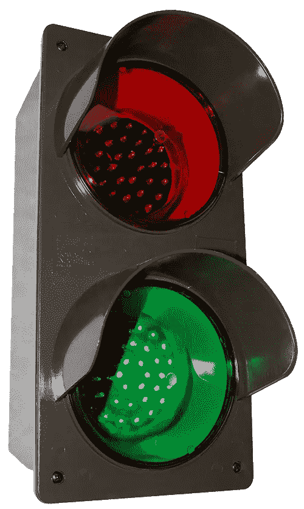
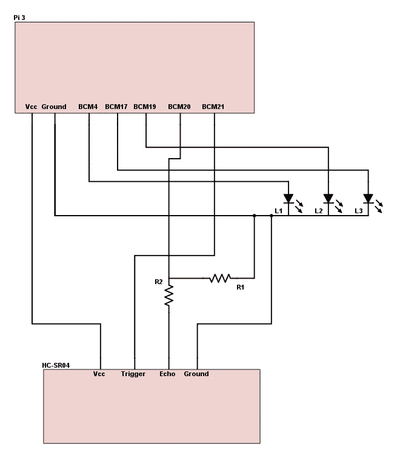
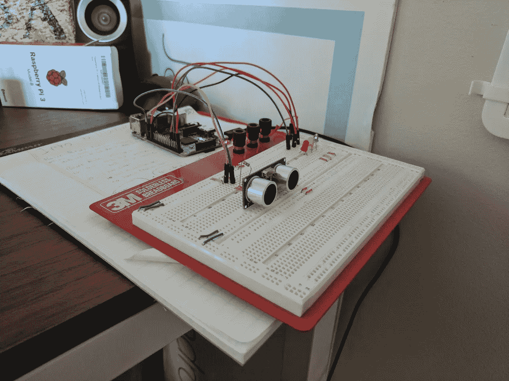
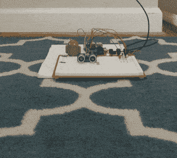

# 一头扎进安卓系统

> 原文：<https://medium.com/hackernoon/diving-into-android-things-d46bf3d6fb92>

从十几岁开始，我就一直在摆弄电子产品。我上学，毕业时获得了计算机工程学位，重点是硬件(嵌入式系统、ASIC 设计等)。我不知何故跌倒了...毕业后就进入了软件行业，一晃 9 年过去了，我现在是[无线电台](http://radiopublic.com)的一名 [Android](https://hackernoon.com/tagged/android) 开发人员。当[谷歌](https://hackernoon.com/tagged/google)在 2016 年末宣布他们的物联网平台 [Android Things](https://developer.android.com/things/index.html) 时，我兴奋不已，因为这给了我一个理由来打破我的旧试验板、电阻器、led 和电源调节器。这也给了我一个买树莓派的理由。有了 Android Things，我终于能够在一个更嵌入式(坦白说，更有趣)的平台上利用我在 Android 开发方面的专业知识。

我不打算在这里讨论太多的 Android 基础知识，因为很多优秀的开发者已经在这方面做得很好了:

*   [安卓硬件基础知识](https://riggaroo.co.za/android-things-hardware-basics/)安卓 GDE，丽贝卡·弗兰克斯
*   [Android 事物教程:入门](https://blog.mindorks.com/android-things-tutorials-getting-started-8464c11009ff#.29vvi2x82)Android 开发者 Amit Shekhar
*   安卓事物:电子 101 由安卓工程师乔·伯奇负责

我将分享一个我在 2 月 10 日星期五开始，2 月 13 日星期一完成原型制作的项目。当探索新事物时，找到它的实际应用对我来说很重要。我拥有一栋建于 90 年代初的房子。从 2017 年开始，它可以使用一些自制的技术。我和我家其他成员有一个表面问题，那就是在车库里停车(正确并对齐)。要么我们把车停得离墙很近，不能绕过车的两边，要么我们不确定车是否会被车库门卡住。

# 你好坎特帕克莱特

我的第一个 Android Things 项目是建立一个辅助停车设备，它使用几个传感器来辅助司机在车库中正确停车。想想你进入洗车场时看到的信号。正常情况下，有两到三盏灯。当你第一次进入时，灯是绿色的，它指示你继续向前行驶。当你开得足够远时，红灯会提醒你停下来。我想把这个放在我的车库里。

Image from Signal Tech

第一步是原型化 CantParkRight。

# 制作硬件原型

类似 Raspberry Pi 的设备提供的一个巨大优势是能够快速、廉价地构建像我正在构建的这种辅助设备的原型。事实上，我可以正式利用 Android APIs(以及谷歌 API)是一个很大的优势。

我用于原型的材料包括:

*   树莓 Pi 模型 3 运行 Android 的东西预览 1
*   HC-SR04 超声波接近传感器
*   2 个电阻，10KΩ和 20KΩ
*   3 个发光二极管(红色、黄色、绿色)
*   一块试验板
*   跳线的分类

我已经有了大部分的补给。前段时间买了一个树莓 Pi，最近从[亚马逊](https://www.amazon.com/HC-SR04-Ultrasonic-Distance-MEGA2560-ElecRight/dp/B01MA4O5G5/ref=sr_1_cc_1?s=aps&ie=UTF8&qid=1487174915&sr=1-1-catcorr&keywords=hc-sr04)买了一包 5 个 HC-SR04 超声波传感器。经过一番研究后，我选定了 HC-SR04。HC-SR04 的工作原理是，向 TRIGGER 引脚发送一个 10 S(微秒)信号。在接下来的几毫秒内，HC-SR04 会发出 8 个 40KHz 的声波，最终会反弹回来。如果一个物体在范围内，信号将反弹回来，并被传感器的接收器部分检测到。然后，HC-SR04 向 echo 引脚连接的任何器件发送一个可变长度的 ECHO。该脉冲的长度由信号返回传感器之前传播的距离决定。HC-SR04 的射程约为 400 厘米(约 13 英尺)。完美。注:点击查看 HC-SR04 [上的数据表。](http://www.micropik.com/PDF/HCSR04.pdf)

经过大量实验后，以下是我的电路在试验板上的布局。

CantParkRight hardware schematic

CantParkRight IRL, messy

一些硬件问题:

*   传感器之间的精度差异很大，尤其是“山寨”传感器。在 5 个传感器中，一些传感器对物体运动更敏感，而另一些则变化较小。
*   发送到 ECHO 引脚的信号为 5V。Raspberry Pi 上的 GPIO 端口额定电压为 3.3V。发送高电压可能会损坏它，因此我使用电阻将电压降至 3.3V。

# 制作软件原型

这个项目最好的部分是在 Android Studio 中编写软件，通过 ADB(通过 WiFi)部署它，并在我的眼前看到结果。我的实现基于:

*   [安卓事物基础:用超声波传感器测量距离](https://hackernoon.com/android-things-basics-measure-distance-with-ultrasonic-sensor-3196fe5d7d7c#.fphbtwuy7)丹尼尔·达洛斯

在本文中，Daniel 使用 while 循环、回调和线程构建了几个实现，有些是同步的，有些是异步的。我决定以此为基础，但是使用 RxJava 来实现传感器数据的异步处理。我在自己开发的大多数 Android 应用程序中都使用过 RxJava。它提供了快速方便的方法来构建、重用和排列逻辑片段，这些片段利用了从一端到另一端的数据流，基本上非常适合 CantParkRight。

声明:我不是 RxJava 专家。可能有更有效的方法来完成我使用 RxJava 所做的事情。

关键是我如何启动触发器并等待回音。我的第一个实现使用了 RxJava Observable，它本质上封装了一些 While 循环(查看我的存储库，然后转到第一次提交)。

该过程是:

*   向触发器发送 10 秒信号
*   开始一个 while 循环，一直执行到 ECHO 变高，记录开始时间
*   开始一个 while 循环，迭代直到回声变低，记录结束时间并计算用于计算距离的脉冲宽度

它有时会工作，但通常由于我仍在研究的原因，传感器会停止响应(即触发后回声从未变高)。当我使用 GpioCallback 时，情况得到了改善。GpioCallback 允许你监听边沿触发(信号变高，信号变低，等等。)异步。我将 GpioCallback 的实现与 RxJava Observable(更确切地说是发射器)结合起来。据我所知，发射器相对于使用普通可观察对象(使用 Observable.create)的优势在于，它迫使您指定背压策略，这在读取从传感器推送的值时非常重要。CantParkRight 使用缓冲背压模式。使用 RxJava 允许我启动距离检测过程，只需订阅正确的可观察值。当我在 onDestroy(…)中取消订阅时，使用发射器还允许我用正确的代码取消注册我的 GpioCallback。这可以防止将来的内存泄漏。

CantParkRight prototype in action

# 下一步是什么

对于 CantParkRight，我正在努力打造一个可以轻松安装在车库里的实际设备。随着原型的完成，我开始努力去实现它。

同时，你可以在 GitHub 上查看 [CantParkRight 的源代码。请务必在](https://github.com/emuneee/cant-park-right) [Twitter](http://twitter.com/emuneee) 或(咳嗽) [Google+](http://google.com/+EvanHalley) 上关注我，了解 CantParkRight 的最新动态。我打算在接下来的几个月里在这里发布完成的项目，但是观看资源库是跟上进度的好方法。

*原载于 2017 年 2 月 15 日*[*【emuneee.com】*](http://emuneee.com/blog/2017/02/15/diving-into-android-things/)*。*

> [黑客中午](http://bit.ly/Hackernoon)是黑客如何开始他们的下午。我们是 [@AMI](http://bit.ly/atAMIatAMI) 家庭的一员。我们现在[接受投稿](http://bit.ly/hackernoonsubmission)并乐意[讨论广告&赞助](mailto:partners@amipublications.com)机会。
> 
> 如果你喜欢这个故事，我们推荐你阅读我们的[最新科技故事](http://bit.ly/hackernoonlatestt)和[趋势科技故事](https://hackernoon.com/trending)。直到下一次，不要把世界的现实想当然！

