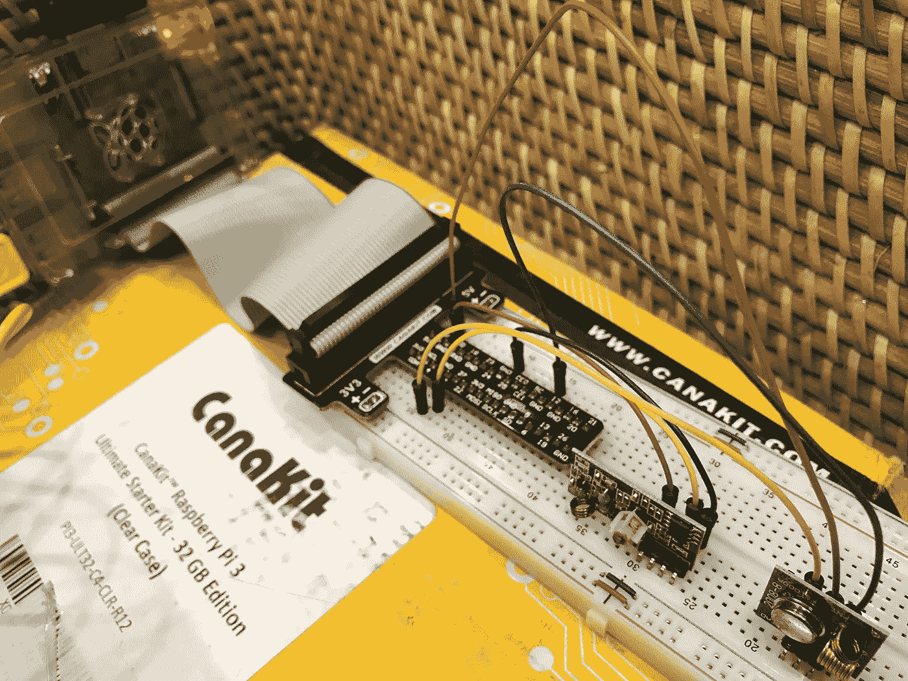
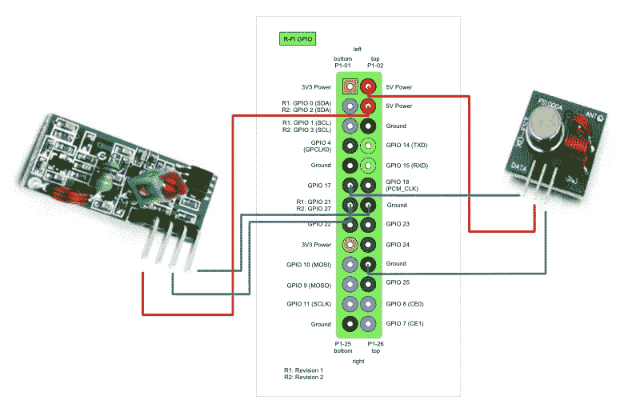
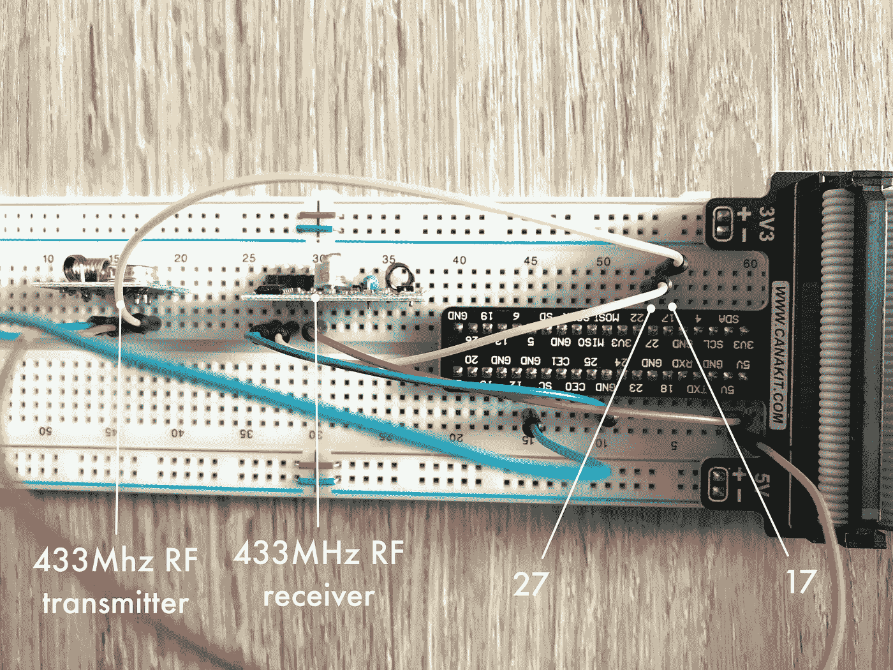
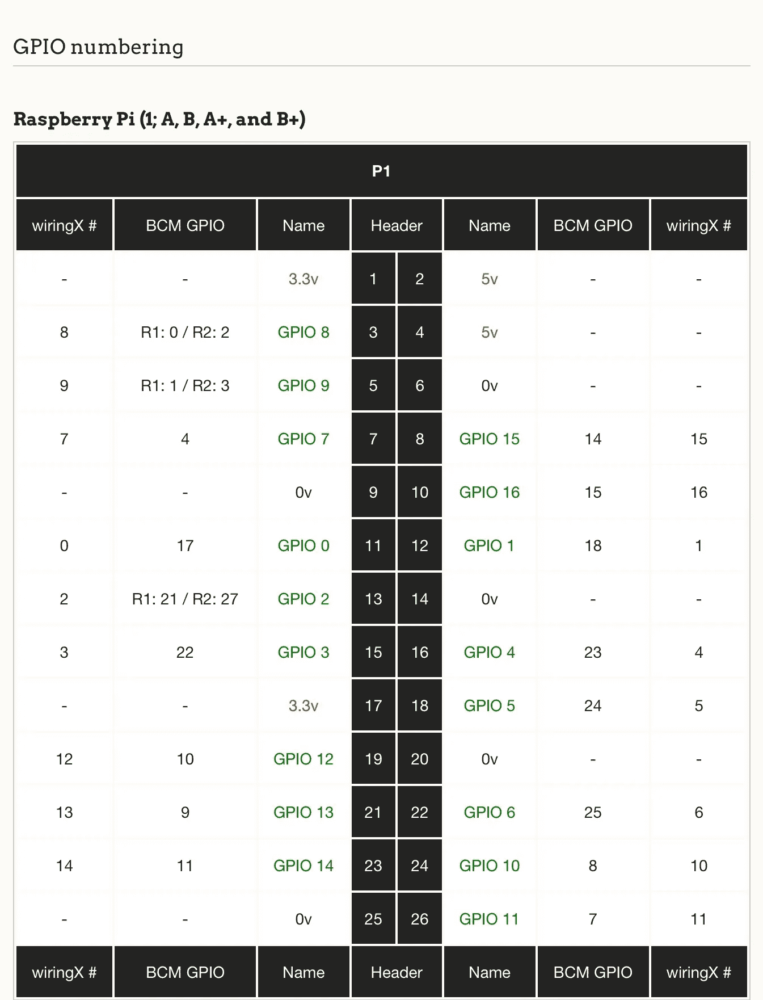
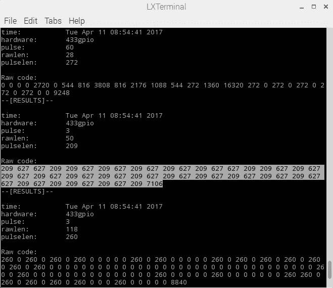
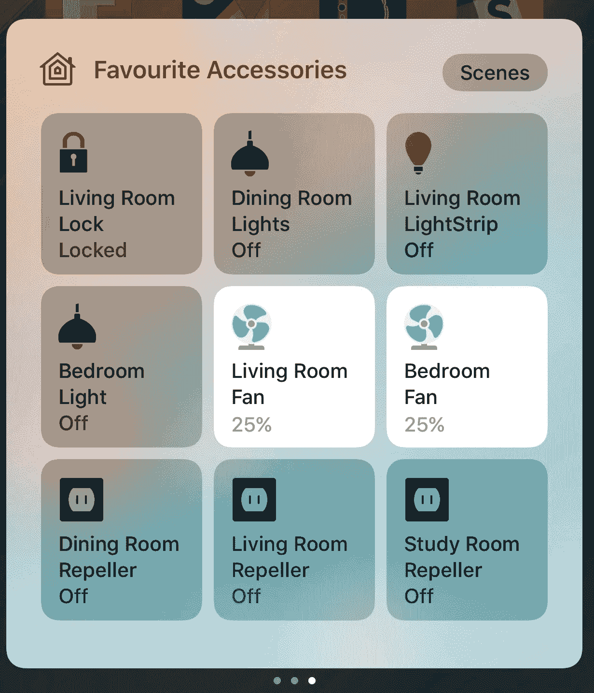
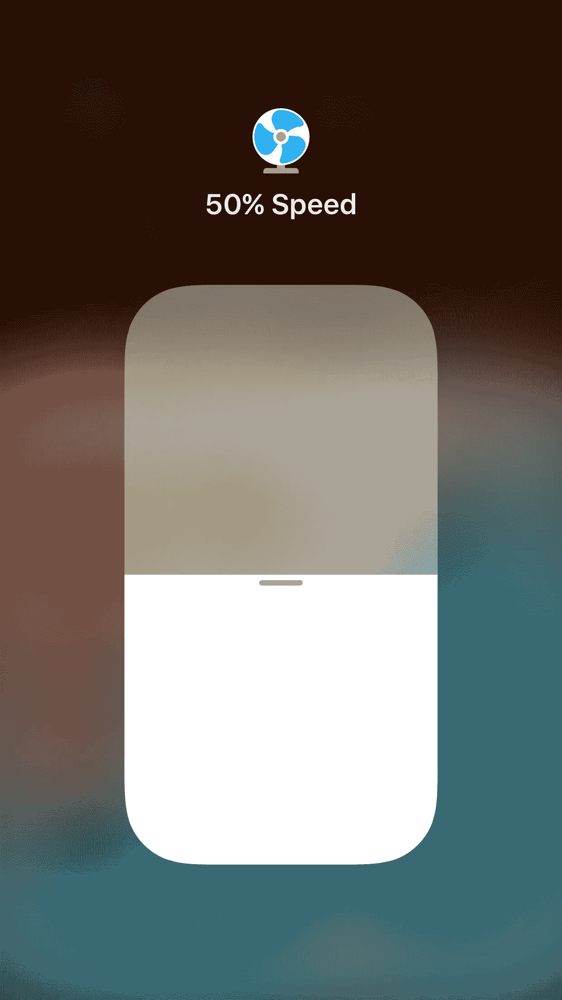

# 我如何用 Raspberry Pi 3、RF 发射器和 HomeBridge 实现家用风扇的自动化

> 原文：<https://medium.com/hackernoon/diy-home-automation-fan-control-with-raspberry-pi-3-rf-transmitter-and-homebridge-59ad24845770>

我一直想参与一个硬件项目。我喜欢家庭自动化。因此，自动化我的家庭风扇似乎是一个完美的项目开始。



我用 HomeKit 装门锁和灯。当我离开时，HomeKit 会锁上我的门，关掉所有的灯。但我总是要搜索我的风扇遥控器来手动关闭它。这不是我想象中的智能家居。

# 设置树莓 Pi

由于没有硬件方面的经验，开始我的第一个项目相当令人生畏。我对我需要的东西做了一些研究，然后购买了一个[树莓 Pi 入门套件](https://www.amazon.com/CanaKit-Raspberry-Ultimate-Starter-Kit/dp/B01C6Q4GLE/ref=sr_1_1?ie=UTF8&qid=1491809908&sr=8-1-spons&keywords=canakit+ultimate+raspberry+pi+3&psc=1)和[一对 433Mhz 接收器/发射器](https://www.amazon.com/433Mhz-Transmitter-Receiver-Link-Arduino/dp/B016V18KZ8/ref=sr_1_2?ie=UTF8&qid=1491810017&sr=8-2&keywords=433+Mhz+RF+Transmitter)。


设置 Raspberry Pi 3 比我想象的要容易得多。[cana Kit Ultimate Starter Kit](https://www.amazon.com/CanaKit-Raspberry-Ultimate-Starter-Kit/dp/B01C6Q4GLE/ref=sr_1_1?ie=UTF8&qid=1491809908&sr=8-1-spons&keywords=canakit+ultimate+raspberry+pi+3&psc=1)附带预装在 microSD 卡中的操作系统。它还配有跳线、试验板、GPIO 至试验板接口板、led 和电阻。

接下来我做的事情是，我浏览了一个 [LED 教程](https://thepihut.com/blogs/raspberry-pi-tutorials/27968772-turning-on-an-led-with-your-raspberry-pis-gpio-pins)，并弄明白了如何使用试验板。我不确定如果没有正确连接，我是否会油炸我的覆盆子酱，所以我在设置期间关闭了设备，当我完成时打开它。如果连接错误，设备根本无法启动。我很幸运，LED 测试很顺利。这相当于编码的“Hello World”。

# 读取射频信号

我怀疑我的风扇遥控器使用射频，因为它可以在不同的房间工作，但我不确定 433Mhz 接收器/发射器是正确的硬件购买。这是一个猜测，但它为我工作。



Left: 433Mhz RF receiver. Right: 433Mhz RF transmitter.

我的第一项任务是用射频接收器读取信号。我紧紧跟随[这个指南](http://www.princetronics.com/how-to-read-433-mhz-codes-w-raspberry-pi-433-mhz-receiver/)——安装 *wiringPi* 和 *433Utils* ，将射频接收器的数据引脚连接到 GPIO27，GND 连接到 GND，VCC 连接到 5V，运行*射频嗅探器*并按下我的遥控器。成功了！

# 发送射频信号

接下来，我按照这里的说明[连接了 433Mhz 射频发射机。我能够使用 *codesend* 发送一个数字，并由运行 *RFSniffer* 的 RF 接收器接收，测试发射机工作正常。](https://shop.ninjablocks.com/blogs/how-to/7506204-adding-433-to-your-raspberry-pi)

# 发送射频信号以模拟风扇遥控

在这之前，一切都很顺利。然而，使用 *RFSniffer* 从我的遥控器接收的信号在使用 *codesend* 重新传输时无法控制我的风扇。关于射频遥控的工作原理，肯定有什么地方我理解错了。看起来硬件是最简单的部分。

然后偶然看到这个[用 pilight](http://stevenhickson.blogspot.sg/2015/02/control-anything-electrical-with.html) 的帖子。



RF Transmitter connected to pin 17, and the RF receiver connected to pin 27

安装了 *pilight* 之后，我将它配置为与我的设置一起工作。上图显示，射频发射器连接到引脚 17，射频接收器连接到引脚 27。



GPIO numbering table from http://wiringx.org

config.json 文件中的发送方和接收方值可以通过参考上面的 GPIO 表来确定。引脚 17 的发送方值应为 0，引脚 27 的接收方值应为 2。

pilight configuration file: sender=0 and receiver=2, by referencing the GPIO table above

然后我用[*pilight-debug*](https://wiki.pilight.org/doku.php/pdebug)从我的遥控器读取并输出原始信息。记得在运行 *pilight-debug* 之前杀死 *pilight-daemon* 。

```
pi@raspberrypi:~/ $ sudo killall pilight-daemonpi@raspberrypi:~/ $ pilight-debug
```



Run pilight-debug and press the buttons in the remote to capture the signals.

来自 *pilight-debug* 的原始代码是一系列数字，每个数字测量高低或高低转换之间的时间差。还有很多其他的噪音信号，所以我不得不手动过滤来自遥控器的正确信号。看起来诀窍是寻找一系列只包含三个唯一数字的数字。这些“干净”的数字只是对我有用的。我不得不一直按着我的遥控器，直到我得到一个看起来像这样“干净”的代码。

```
209 627 627 209 209 627 209 627 209 627 209 627 209 627 627 209 209 627 209 627 209 627 209 627 209 627 209 627 209 627 209 627 627 209 627 209 209 627 209 627 209 627 209 627 209 627 209 627 209 7106
```

然后我用 *pilight-send* 发送了原代码(如果你之前杀了 *pilight-daemon* ，记得再启动一次`sudo pilight-daemon`)。维奥拉。成功了。我对遥控器上的所有按钮重复了这一过程，以获得不同的关闭和变速代码。不同遥控器的信号也不同，所以我不得不为我卧室的风扇重复相同的步骤，尽管它是同一型号。

```
pi@raspberrypi:~/ $ sudo pilight-daemonpi@raspberrypi:~/ $ pilight-send -p raw -c “209 627 627 209 209 627 209 627 209 627 209 627 209 627 627 209 209 627 209 627 209 627 209 627 209 627 209 627 209 627 209 627 627 209 627 209 209 627 209 627 209 627 209 627 209 627 209 627 209 7106”
```

# Apple HomeKit 与 HomeBridge 的集成

现在我已经成功地用命令行控制了我的风扇，下一步是让它与 HomeKit 一起工作。 *HomeBridge* 是一个开源的 *NodeJS* 服务器，用来模拟 iOS *HomeKit* API。你可以在这里找到树莓 Pi [中安装 *HomeBridge* 的说明。](https://github.com/nfarina/homebridge/wiki/Running-HomeBridge-on-a-Raspberry-Pi)

[](https://github.com/nfarina/homebridge/wiki/Running-HomeBridge-on-a-Raspberry-Pi) [## nfarina/homebridge

### homebridge -为缺乏耐心的人提供 HomeKit 支持

github.com](https://github.com/nfarina/homebridge/wiki/Running-HomeBridge-on-a-Raspberry-Pi) 

*pilight* 有一个 [*HomeBridge* 插件](https://www.npmjs.com/package/homebridge-pilight)。然而，我不得不创建一个自定义插件，因为我不知道如何设置 *pilight* 来做到这一点。我找到了一个开源的 *HomeBridge* 插件，通过 API 调用来控制一个三速 TOSR0x 风扇 [homebridge-tosr0x-fan](https://github.com/jasoncodes/homebridge-tosr0x-fan) 。我用它作为我插件的模板。

我使用 *Python/Flask* 创建了一个 REST API，它通过命令行执行 *pilight-send* 。

[](https://github.com/honcheng/rfremote-fan-api) [## honcheng/rfremote-fan-api

### 在 Raspberry Pi 中使用 pilight 控制 RF 风扇

github.com](https://github.com/honcheng/rfremote-fan-api) 

然后我修改了插件调用了 *REST API* ，去掉了温度传感器，我的风扇不支持。

[](https://github.com/honcheng/homebridge-rfremote-fan) [## 洪城/homebridge-rfremote-fan

### home bridge-RF remote-fan-home bridge 插件，用于替换风扇的 RF 遥控器

github.com=](https://github.com/honcheng/homebridge-rfremote-fan) 

我使用下面的命令来安装插件，尽管它比[建立一个开发文件夹](https://github.com/nfarina/homebridge#plugin-development)要慢一些。

```
pi@raspberrypi:~/ $ npm install -g homebridge
```

安装插件后，我通过编辑~ */中的配置文件，将我的粉丝添加到 *HomeBridge* 中。homebridge/config.json* 。密钥“附件”必须与插件中声明的名称相同。

HomeBridge configuration file: Adding fans as accessories

重启 *HomeBridge* 以使更改生效。

```
pi@raspberrypi:~/ $ sudo killall homebridgepi@raspberrypi:~/ $ homebridge
```



Fan controls in iOS Control Center



Changing fan speed in HomeKit

对于我的第一次硬件破解来说，这已经不错了，一个周末就搞定了。

如果你试图为你的射频遥控风扇复制相同的设置，你将不得不再次识别信号，因为它将与我的不同。祝你好运！

[](http://bit.ly/HackernoonFB)[](https://goo.gl/k7XYbx)[](https://goo.gl/4ofytp)

> [黑客中午](http://bit.ly/Hackernoon)是黑客如何开始他们的下午。我们是 [@AMI](http://bit.ly/atAMIatAMI) 家庭的一员。我们现在[接受投稿](http://bit.ly/hackernoonsubmission)，并乐意[讨论广告&赞助](mailto:partners@amipublications.com)机会。
> 
> 如果你喜欢这个故事，我们推荐你阅读我们的[最新科技故事](http://bit.ly/hackernoonlatestt)和[趋势科技故事](https://hackernoon.com/trending)。直到下一次，不要把世界的现实想当然！

