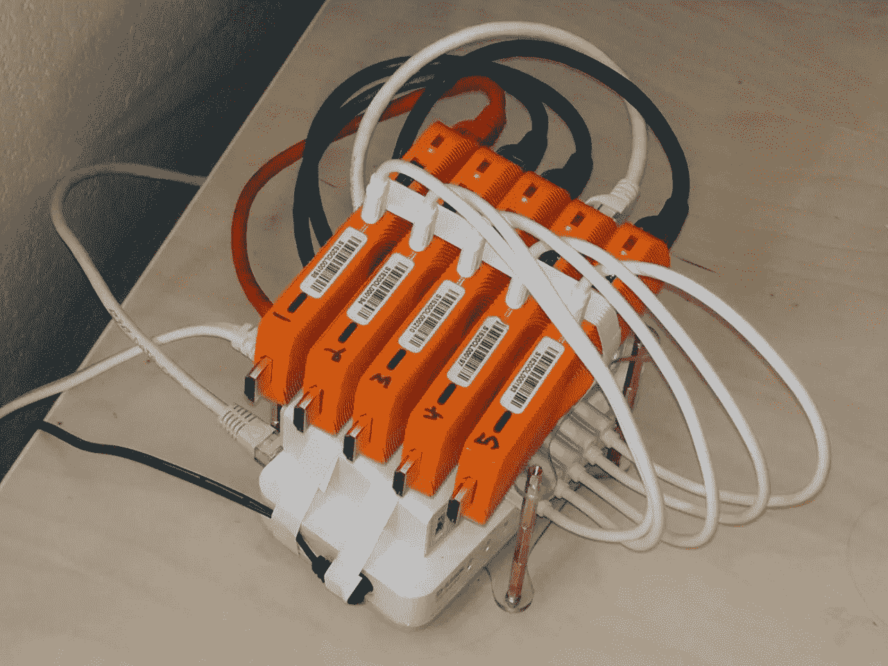
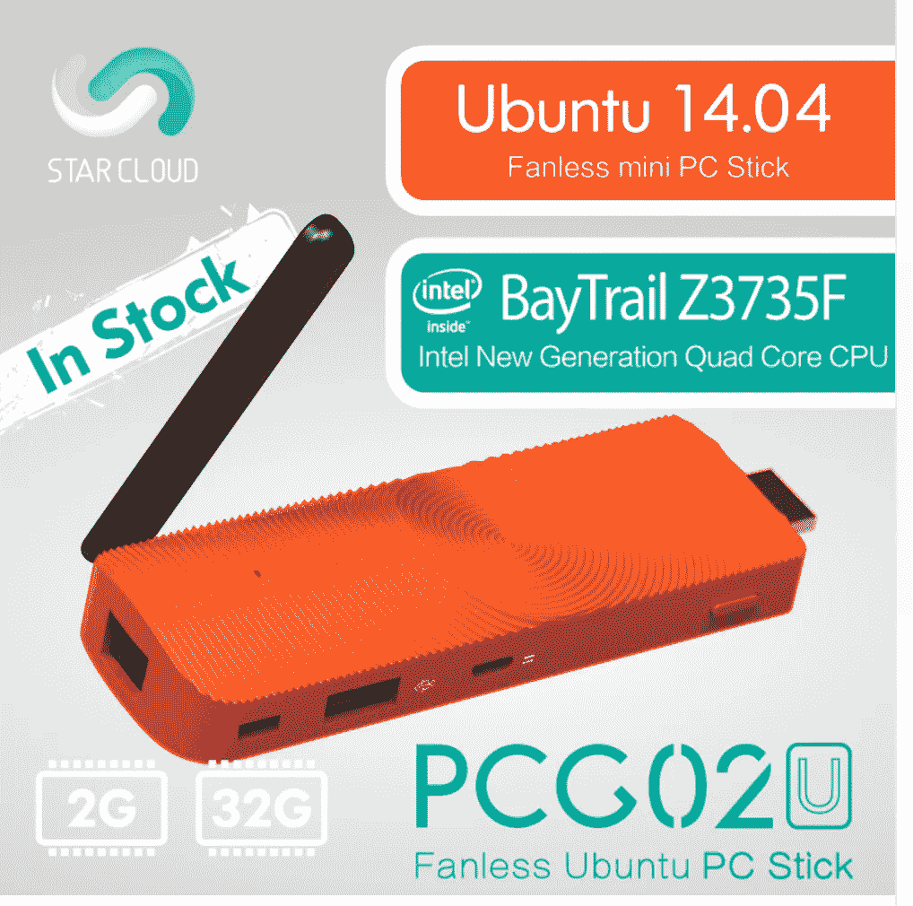
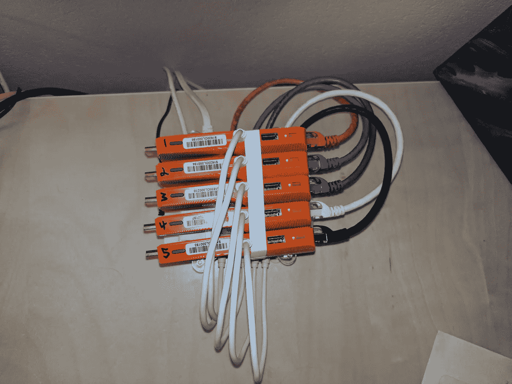
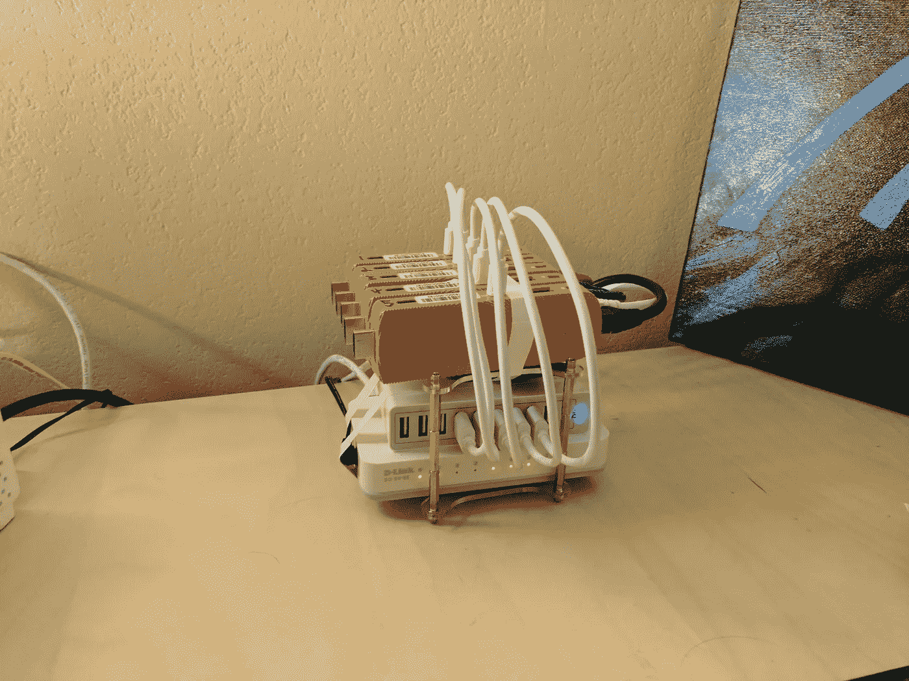

# 使用 x86 小型电脑 DIY Kubernetes 集群

> 原文：<https://medium.com/hackernoon/diy-kubernetes-cluster-with-x86-stick-pcs-b0b6b879f8a7>

树莓 Pi kubernetes 集群以前做过很多次。这些迷你集群放在一起真的很有趣。使用 raspis 的问题是它们是 ARM 设备。这意味着他们只能运行 ARM 兼容的容器，这是一个巨大的缺点。Dockerhub 中的绝大多数容器都是 x86。

我开始为我的集群寻找一个价格便宜且符合我要求的构建块:

1.  x86 兼容平台
2.  便宜的
3.  至少 2GB 内存
4.  由 usb 供电
5.  以太网端口

浏览速卖通我偶然发现了这颗击中所有标记的宝石:[https://www . Aliexpress . com/item/Fanless-Ubuntu-14-04-Intel-PC-Stick-Star-Cloud-PCG 02u-Mini-PC-Bay-Trail-z 3735 f-2GB/32653580885 . html？SPM = 2114.13010608 . 0 . 0 . 5 uvt 7 o](https://www.aliexpress.com/item/Fanless-Ubuntu-14-04-Intel-PC-Stick-Star-Cloud-PCG02U-Mini-PC-Bay-Trail-Z3735F-2GB/32653580885.html?spm=2114.13010608.0.0.5uVT7o)

这真的是一个光滑的小“坚持电脑”。每包不到 70 美元:

*   x86 四核 1.33 ghz 英特尔凌动处理器
*   2GB 内存
*   32GB 闪存存储
*   紧凑的无风扇设计，由微型 usb 供电

我立即抓起其中的 5 个。花 340 美元，我就有了一个集群

*   20 个 x86 内核
*   10GB 内存
*   160GB 存储空间

然后，我将它们与一个 usb 集线器和一个开关配对，以获得电源和连接

棍子一到，我就开始玩其中的一根。他们来与 14.04 trusty 安装。桌面性能还可以，但是我想为容器释放内存和空间，而不是浪费在桌面上。这些棒的伟大之处在于它们实际上只是微型电脑，你可以很容易地安装任何 linux 发行版。我重新启动了一个，捣碎了一堆 f 键，直到我能够进入 BIOS。在那里，我可以改变启动顺序，从 u 盘安装 Ubuntu Xenial。成功！

重复 5 次后，我就可以轻松地用`apt-get install docker.io`安装 Docker 了

一旦 docker 准备就绪，我决定使用 [kube-deploy](https://github.com/kubernetes/kube-deploy) 来启动我的集群。

我对集群的下一步包括让 [Spinnaker](http://spinnaker.io) 在集群上运行。这可以用作最终的连续输送装置。

> [黑客中午](http://bit.ly/Hackernoon)是黑客如何开始他们的下午。我们是 [@AMI](http://bit.ly/atAMIatAMI) 家庭的一员。我们现在[接受投稿](http://bit.ly/hackernoonsubmission)，并乐意[讨论广告&赞助](mailto:partners@amipublications.com)机会。
> 
> 如果你喜欢这个故事，我们推荐你阅读我们的[最新科技故事](http://bit.ly/hackernoonlatestt)和[趋势科技故事](https://hackernoon.com/trending)。直到下一次，不要把世界的现实想当然！

