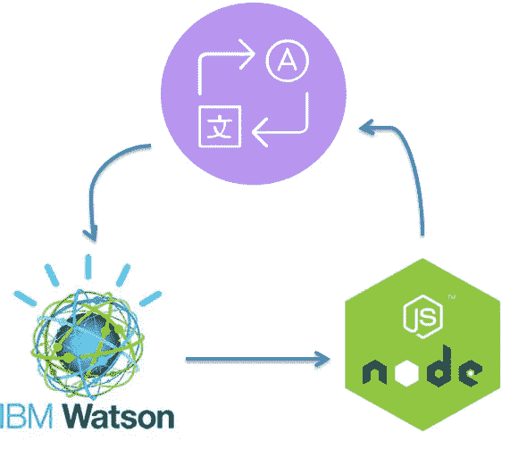

# 使用 Node.js 和 IBM Watson 的 DIY 语言翻译器 API

> 原文：<https://medium.com/hackernoon/diy-language-translator-api-using-node-js-and-ibm-watson-54888f863a93>



Just an overview

语言翻译器确实是学习自然语言处理的一个好项目。然而，理解这些概念需要时间和知识。那么，如何利用人工智能即服务进行语言翻译呢？对我来说听起来不错，因为它们提供了更好的准确性，并且花费更少的时间来设置。在这个简短的 DIY 之旅中，让我们了解 IBM Watson，以及如何将其功能与 [Node.js](https://hackernoon.com/tagged/node-js) 集成，以创建一个简单但有用的 REST API。

但是 IBM Watson 是什么呢？这是一台 IBM 超级计算机，它结合了人工智能(AI)和复杂的分析软件，作为一台“问题回答”机器具有最佳性能。Watson API 提供了大量的功能，其中大部分是免费的。在本教程中，我们将使用“language-translator/v2”API 进行语言翻译。该 API 提供 6 种语言的免费翻译，包括阿拉伯语、法语、西班牙语、葡萄牙语，并提供付费版本的其他语言的转换。

既然理论部分已经完成，让我们动手做点什么吧。假设您已经在 IBM Bluemix 中注册，请接收您的语言翻译凭证(在 Bluemix 中的 watson services 下找到)。凭据应该是这样的:-

```
{
  "url": "https://gateway.watsonplatform.net/language-translator/api",
  "username": "USERNAME",
  "password": "PASSWORD"
}
```

> **注意:-*IBM 自己也提供了一个名为 IBM-Bluemix-Docs 的 Github 存储库，不仅提供了这方面的知识，还提供了其他功能方面的知识。您可以查看语言翻译***[https://github . com/IBM-Bluemix-Docs/Language-translator/blob/master/getting-started . MD](https://github.com/IBM-Bluemix-Docs/language-translator/blob/master/getting-started.md)

继续，现在是 Javascript 的时候了:)

首先，不要将敏感凭证存储在我们的 javascript 文件中，而是将它存储在一个。env "文件。在这里，我将我的用户名和密码存储在一个. env 文件中，并使用 dotenv 模块来访问它。

然后使用 express 作为我们的中间件，我们创建一个 API 端点`/api`,通过它我们传递我们要翻译的单词。

> 注意:-es 代表西班牙语。这可以根据您喜欢的语言进行更改。

## **此外，不要忘记托管以访问此 API。**


yay!!

就是这样，伙计们！！你刚刚自己创造了一个语言翻译器，却没有多少 NLP 方面的知识！！

我希望这篇文章是有用的。请喜欢，推荐，留下关于这个项目的任何反应。

链接到项目:-

[](https://github.com/S2606/Language-Translator_IBMWatson) [## s 2606/Language-Translator _ IBM Watson

### 这是一个使用 IBMWatson 和 nodejs 的简单语言翻译器

github.com](https://github.com/S2606/Language-Translator_IBMWatson) 

页（page 的缩写）希望我没有让你失望。我是一个自学成才、充满激情的程序员，想创造一些从未听说过、见过或想过的东西。你可以在[https://github.com/S2606,](https://github.com/S2606)LinkedIn:-[https://www.linkedin.com/in/shagun-khemka/](https://www.linkedin.com/in/shagun-khemka-b55843118/)看到我的其他项目