# 使用 Raspberry Pi、Node.js 和 Watson 视觉识别进行 DIY 对象识别

> 原文：<https://medium.com/hackernoon/diy-object-recognition-with-raspberry-pi-node-js-watson-b478dfd7ce50>

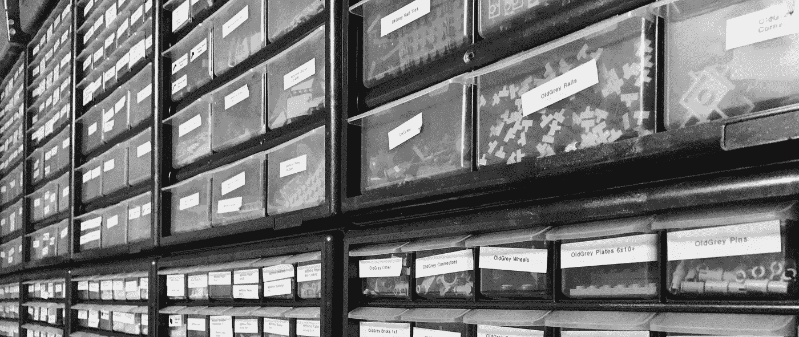

The LEGO collection which I intended to categorize using object recognition.

如今一件光荣的事情是，你不必是一名人工智能研究员，也不必拥有昂贵的硬件来在你的项目中利用机器学习。

当然，从长远来看，特定领域的设计会带来更大的好处。然而，直到最近，一个通用的、现成的解决方案还不容易被一般的开发人员(也就是我)使用。由于 API 的作用，这样一个庞然大物对于资源受限的设备来说也是不可用的。

下面，我将向读者(就是你)介绍基于 API 的对象识别，以及如何用廉价的硬件和 [JavaScript](https://hackernoon.com/tagged/javascript) 实现。

# 树莓派零度 W

首先，你需要一个能上网的树莓派。

对于这个项目来说，你能得到的最有价值的东西可能是[树莓派 Zero W](https://www.raspberrypi.org/products/raspberry-pi-zero-w/) 。

> 有不同的覆盆子酱吗？
> 
> 大多数 RPi 板都有摄像头接口。RPi Zero v1.3 版(带摄像头接口的非 WiFi 版)还需要一个 USB WiFi 加密狗、以太网适配器或“帽子”来提供连接。
> 
> “原始的”RPi Zero，v1.2，没有摄像头接口，将无法工作。

虽然 Zero 速度不快，但它可以运行 Linux，这使得它比普通的微控制器更强大。正如你所看到的，执行一个 [Node.js](https://hackernoon.com/tagged/nodejs) “无用脚本”是很麻烦的:

```
$ time node -e 'process.exit()'
node -e 'process.exit()'  5.94s user 0.16s system 99% cpu 6.157 total
```

综上所述，我将*小心翼翼地假设*在基于 ARMv6 的单板计算机上训练[卷积神经网络](https://en.wikipedia.org/wiki/Convolutional_neural_network)是徒劳的。但这不是你买 Zero W 的原因，也不是你用它造任何东西的原因。这就是为什么:

*   它是十美元。
*   在三个维度中，有两个维度比信用卡还小。
*   十(10)美元。
*   通过一些努力和更便宜的硬件，它可以通过以太网供电。
*   它暴露 GPIO 引脚。发疯吧。
*   我说过是 10 美元吗？

> 品牌 X 单板电脑怎么样？
> 
> Node.js 代码利用了 [raspicam](https://npm.im/raspicam) 包，它是`raspistill`的包装器。所以，如果它不能运行`raspistill`，我们就不能用它来做这个教程。

一旦我们有了 RPi，我们就需要一台摄像机。

# 照相机

基于 OV5647 的支持模块(“v1”；[数据表](https://cdn.sparkfun.com/datasheets/Dev/RaspberryPi/ov5647_full.pdf))或 imx 219(" v2 "；[数据表](http://img.filipeflop.com/files/download/Datasheet_IMX219_20140910.pdf)会起作用。有“官方”模块可以运行到 30 美元，但我见过一个来自中国的山寨“v1”大约 6 美元的低端。**你不需要 8MP 摄像头**来做这个；我们将拍摄分辨率相当低的照片。

这些相机配有*定焦*镜头。我发现您希望将相机放置在距离目标不小于 12 英寸(30.48 厘米)的位置(另一个选项可能是安装变焦镜头)。我将把这作为练习留给读者，但这里是我的解决方案:

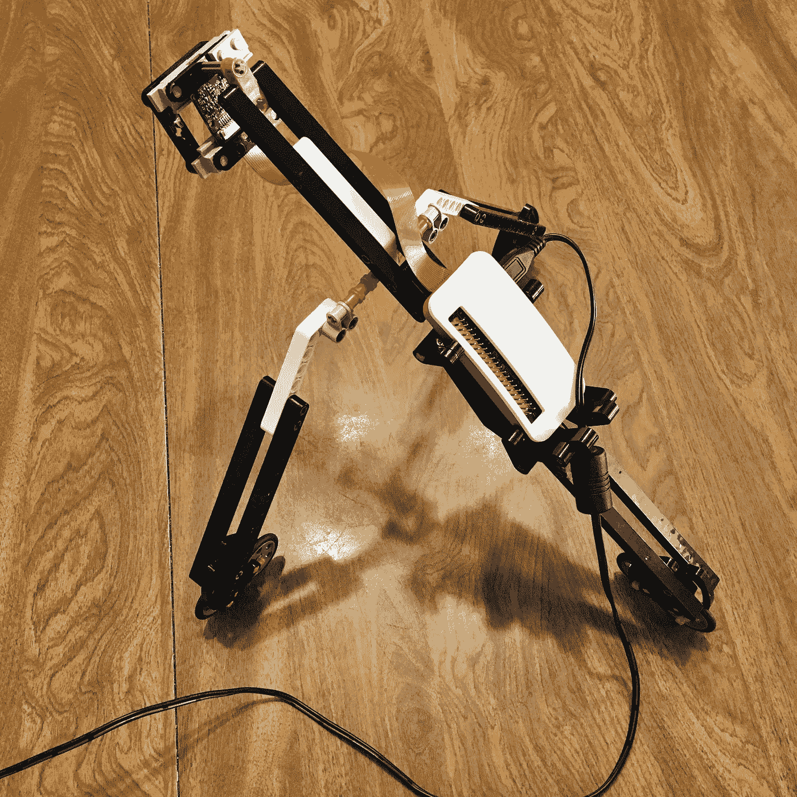

My jerry-rigged tripod

摄像机模块通过[柔性扁平电缆](https://en.wikipedia.org/wiki/Flexible_flat_cable)连接到 [ZIF](https://en.wikipedia.org/wiki/Zero_insertion_force) 插座。RPi Zero 支持宽度为 11.5 毫米的电缆，但*其他*接口预期宽度约为 16 毫米。存在适配器和转换电缆；其中一条这样的电缆与[官方保护套](https://www.raspberrypi.org/products/raspberry-pi-zero-case/)一起提供。

> 用乐高积木搭建？
> 
> 对于那些试图用乐高建造一个定制三脚架的人，我注意到我的“v1”相机模块的尺寸(无论如何是一维的)大约为 24 毫米，这相当于 3L 的长度，或者一个 [3623 板](https://rebrickable.com/parts/3623/plate-1-x-3/)的长度。1 x 5 工艺板 [32124](https://rebrickable.com/parts/32124/technic-plate-1-x-5-with-smooth-ends-4-studs-and-centre-axle-hole/) 和 [2711](https://rebrickable.com/parts/2711/technic-plate-1-x-5-with-toothed-ends-2-studs-and-center-axle-hole/) 以及 [32028](https://rebrickable.com/parts/32028/plate-special-1-x-2-with-door-rail/) 有助于将模块固定到位。

现在我们已经有了基本的硬件，让我们安装 Node.js。

# Node.js

我会假设你已经安装了拉斯宾杰西。理论上，任何基于 Debian Jessie 的发行版都可以工作。也许其他的也是，但是我没试过！

对于这个项目，我们使用 node . js 8(7 . x 版本可能支持某些命令行标志，但我没有试过)。通常，我会从[节点源](https://github.com/nodesource/distributions)获取二进制文件。但是，它们不支持 ARMv6。

> 如果您使用的是 RPi 3(我们需要 ARMv7 或更快的版本)，直接使用 NodeSource 的发行版，然后跳到下一节。

但是对于零，你有几个选择，其中两个我可以推荐:

1.  手动安装 nodejs.org 的 tarball[；以超级用户的身份，解压缩档案并通过`/usr`或`/usr/local`、*或*将其解压缩](https://nodejs.org/en/download/current/)
2.  我的首选方法:通过[节点版本管理器](https://github.com/creationix/nvm)安装。作为*普通用户*(如`pi`)，按照现场和终端的说明安装 NVM。然后，运行:
    `$ nvm install 8` 这将在您的主目录下安装最新版本的 Node.js 8，然后启用它。运行`node -v`来测试你的安装。

下一个难题是 API 密匙。

# 云

这个项目使用了 IBM 的[沃森视觉识别](https://www.ibm.com/watson/services/visual-recognition/)(以下简称“WVR”)。它可以从 IBM 的 PaaS，Bluemix ( [wiki](https://wikipedia.org/wiki/Bluemix) )中获得。

你可以使用现有的 Bluemix 登录，或者在这里注册[。登录后，从](https://console.bluemix.net/catalog/services/visual-recognition)[同一个页面](https://console.bluemix.net/catalog/services/visual-recognition)，创建一个服务实例；随便你怎么命名。

准备好之后，您将进入实例的仪表板。在这里，您可以找到您的 API 密钥:

1.  单击“服务凭据”。
2.  单击“操作”下的“查看凭据”。
3.  复制 API 密匙并粘贴到某个安全的地方(比如密码管理器应用程序)以方便使用。

有了 API 密匙，让我们简短地了解一下概念。我保证这不会痛。

# 概念

你需要知道这些东西，否则你会被警察逮捕。

## 班级

你需要理解的最重要的概念是“类”。事实上，WVR 网站上的图片很好地说明了这一点:

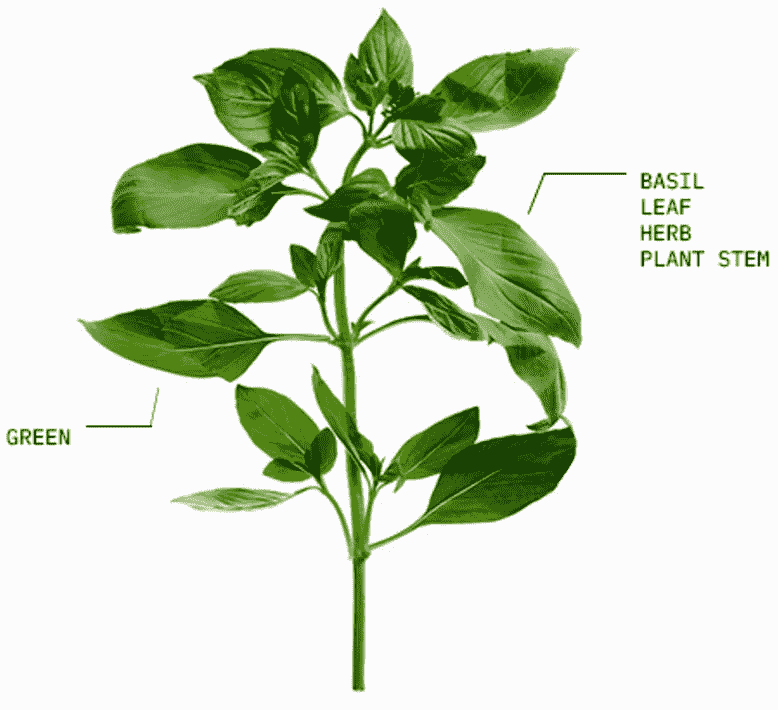

An example of “classes”

在上图中，我们有五(5)个班级:

1.  绿色:图像的主题是绿色
2.  树叶:图像的主题包含一片树叶
3.  植物茎:受试者包含植物茎
4.  药草:图像的主题是“药草”类的植物
5.  罗勒:这个主题特别是罗勒药草

需要注意的是，一个类可以如你所愿的那样窄或宽。例如，*有许多*种色调的“绿色”——但只有一种植物叫做“罗勒”！

虽然 WVR 有一些现成的类，但我们的目标是*创建我们自己的定制类*。

为此，我们需要创建一个*分类器*。

## 分类器

“分类器”可以被认为是类的逻辑*集合*。例如，假设你有四个朋友和家人，你想让他们认出你的面孔。每个个体可以对应一个“类”:

1.  斯尼姆叔叔
2.  巴特斯阿姨
3.  湿冷妹妹
4.  账单

分类器可以是“朋友和家人的脸”，或者类似的东西。也许您可以向这个分类器添加另一个类，它只是“family”——您可以重用相同的图像。

除此之外，WVR 允许在你的分类器中有一个*单独的*特殊类来表示不在分类器中的*图像。例如，你可以把随机的陌生人(或你的敌人)的图片放在这个“负面”类别中。这有助于底层网络避免误报。*

> 如果你在这个项目中没有敌人，我可以提供一些如何获得他们的建议。我将把它留到以后的文章中。

分类器的更多使用案例包括:

*   通过限制 WVR 比较图像的类别范围，我们增加了良好匹配的可能性
*   类似地，如果我们知道我们的图片不会在分类器 *X* 中，那么我们不需要使用分类器 *X* 进行分类
*   限制范围将会提高性能(虽然我不知道提高多少——但是似乎是合理的！)

那么，我们如何创建类和分类器呢？

# 训练制度

当我们创建一个类时，我们给 WVR 一个图像档案(一个`.zip`文件)。这些图像是阶级成员的正面例子。一旦这个档案被上传，培训的过程就开始了。训练是一个在“机器学习”中“学习”的过程。根据存档中图像的数量，这可能需要一点时间(对于少量图像，大约需要几分钟)。

> 请记住，您还可以为您的新分类器提供一个额外的、单一的`.zip`负面示例档案。

换句话说，在 WVR，*创建*一个分类器的动作意味着*也训练*它。

现在为了回报。一旦我们训练了一个分类器，我们就可以对图像进行分类了！

# 分类

*分类*是向分类器提供 WVR *一个或多个图像*的动作，并且接收关于每个图像可能“属于”其类别的程度的信息。

对于每张图片，WVR 会给你零个或多个等级，分数在 0 到 1 之间。这个分数代表*置信度*，而不是*准确度*。然后，对于一些分类器来说， *0.6* 的类 *X* 的置信度可以暗示“类 *X* 的成员”，但是对于其他分类器来说，它可以完全取消图像的资格。

> 如果 WVR 的信心低于某个阈值，它将根本不会返回一个数字。该阈值是可配置的；默认值为 0.5。如果你只使用 10-50 张图片，你可以把它降到 0.3-0.4。

让我们回顾一下我们需要知道的四个术语:

*   **类**:一组具有我们想要识别的共同属性的图像
*   **分类器**:类的逻辑集合
*   **分类**:通过报告置信度，使用 WVR 来决定任意图像可以“属于”哪一类
*   **培训**:在 WVR，我们培训一名分类员；我们向服务提供图像，然后用于分类

你会创造什么样的量词？等等——在你回答之前——让我给你泼冷水。我会告诉你我想做什么，直到现实发生。聚集在一起哭泣，我来讲述我自己的悲惨故事！

# 悲哀的故事

我喜欢乐高。受 Jacques Mattheij 的[乐高分类项目](https://jacquesmattheij.com/sorting-two-metric-tons-of-lego)的启发，我想看看我是否可以轻松地为不同类别的乐高积木建立一个准确的分类器。例如，我能认出“盘子”吗？

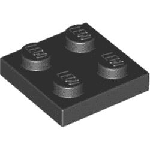

A LEGO “plate”

相对于"砖块"？

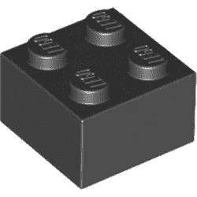

A LEGO “brick”

我可以这样做吗？不，当然不是。冗长的回答:

一旦我有了工具的工作概念模型(见下文)，我就拍了许多乐高积木、盘子等的照片。它们看起来像这样:

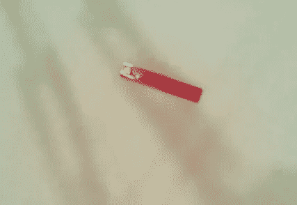

A blurry image of a red 3666 plate on a background of white paper

但是分类效果不佳。我尝试了很多不同的东西，比如去掉颜色信息，改变背景:

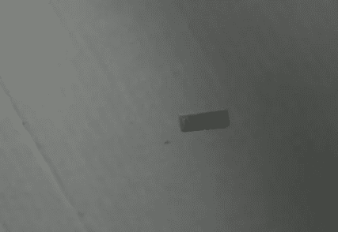

A greyscale image of a red 3623 plate on a background of corrugated cardboard

或者摆弄色温:

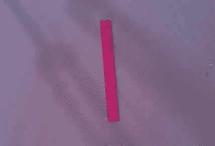

I don’t know what the hell I did here. But it’s a red 4477 plate.

令人心碎的失败。每一个。时间。

我做的一件事是保持较低的分辨率——高分辨率图像不一定会得到更好的结果！事实上，往往相反:更高分辨率的图像将潜在地包含*不必要的细节层次*，导致*额外的无用信息*。

像往常一样，我琢磨着“无用的信息”。

看前面的图像。其分辨率为 428x290 相乘，我们得到`124120`个像素。如果我们稍微旋转它，然后向下裁剪相关信息，我们会得到下图:


也就是 20x202 或者说`4040`像素。所以:

```
4040 / 124120 = ~0.0325
0.0325 * 100 = ~3.25
```

这意味着我拍摄的照片中有 3%多一点包含相关信息。由此可见，每张照片的 97%都是无用的、浪费的垃圾像素。

记住，RPi 相机是定焦的。如果我有一个更好的相机或/和微距镜头，我可能已经完成了这项工作。*唉！*

乐高玩具太小了。我需要更大的东西；一些不太重要的细节。

我扫视了一下房间。在大约 12 英寸远的地方拍照，什么尺寸合适？也许是厨房用具？杯子？那似乎很无聊。后悔？我有很多什么……(我意识到你回答不了这个)？

也许你身边有一些这样的东西:

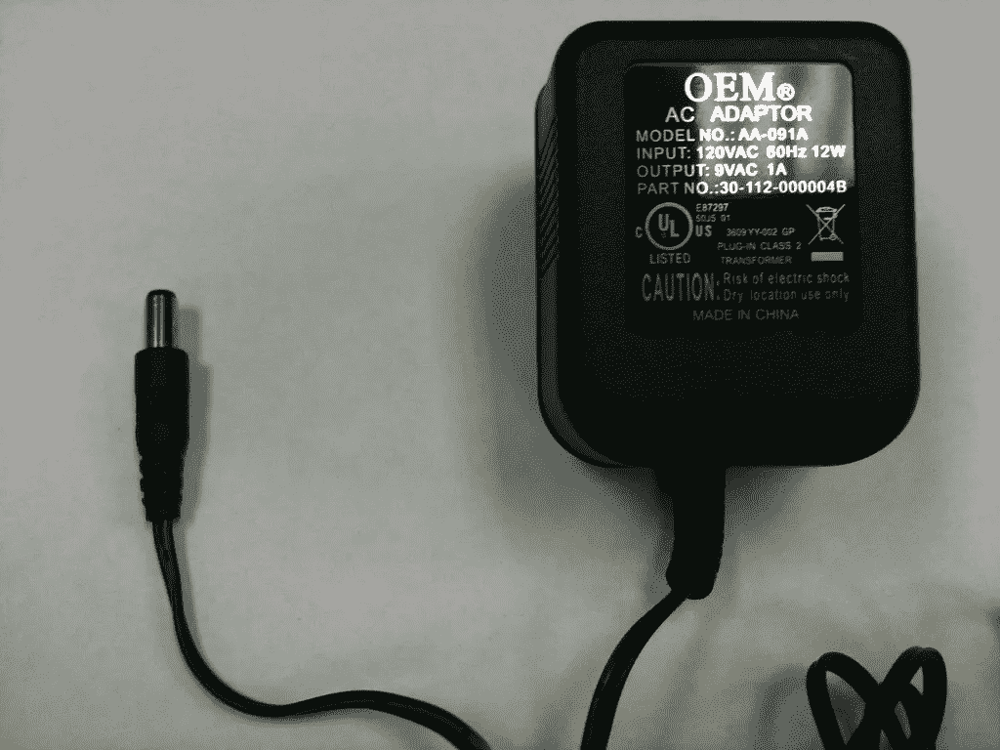

Your friendly neighborhood AC adapter

# 墙疣！

如果你对电子产品感兴趣，你可能真的会*收集* [墙疣](https://wikipedia.org/wiki/AC_adapter)。我有…一些额外的东西。

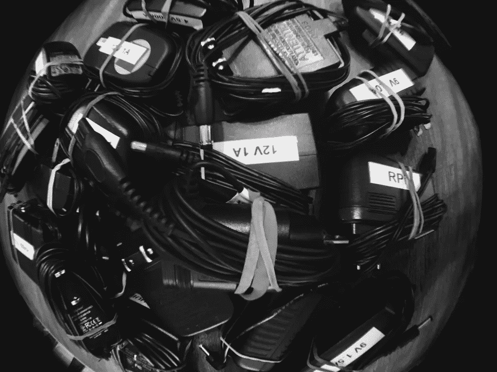

Some of my wall warts in a fish-eye style

你可能手头没有，比如说，20 或 30 个这样的东西(不需要，你知道，拔掉插头)。但是我愿意。如果你能放下你的嫉妒，你会注意到信噪比显著提高:

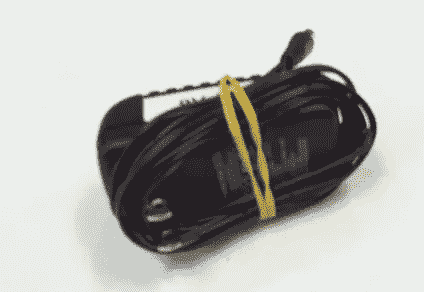

A blurry picture of a wall wart

图像仍然有点模糊，但这没关系——我们没有试图阅读小字。

此外，为一个“反面例子”类扫描相似大小的对象几乎是令人愉快的:

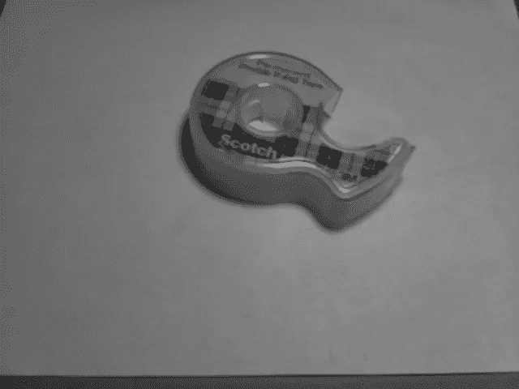

This is not an advertisement for Scotch double-sided tape, though it is good tape.

我选定了 640x480 的分辨率，并选择丢弃颜色信息。如果你想自己尝试的话，可以在这篇文章的末尾找到我的班级档案的链接。

> 鉴于壁疣通常是黑色的，如果我保留颜色数据，可能会有更好的结果？？？

我可以为你自己拍快照提供一些一般性的建议:

1.  保持较高的信噪比；不要包含不必要的像素！
2.  色温、阴影、照明——越不一致，你需要的图像就越多。
3.  不要太担心模糊性
4.  考虑物体的不同位置和角度
5.  每节课 50 张图片或更多。WVR 的下限是 10 %,但 50 是绝对的最低建议！
6.  即使是“低”置信水平也能在实践中发挥作用。调整你的门槛；只要网络比你预期的更加自信，那么你就做得很好！

为了帮助我:

1.  拍下所有这些照片，
2.  把它们放在正确的桶里，
3.  将它们归档，然后
4.  上传给沃森，

最后我写了一个工具。那个工具叫做[螺丝起子](https://npm.im/puddlenuts)。不，真的。

# 介绍 puddlenuts

[puddlenuts](https://npm.im/puddlenuts) 是我为了缓解*拍摄数百张照片*的难以忍受的过程而写的。

> 别害怕。你不需要一次都吃！您可以随时在以后向课程中添加更多图像。这叫做再培训。可以帮上忙。

此时，您应该已经配置了 RPi，安装了 Node.js 并连接了 camera。如果你没有，你有什么问题？

在你的 RPi 上，安装`puddlenuts`，然后一边等一边去割草:

```
# this may require `sudo` if you aren't using NVM
$ npm install --global puddlenuts
- [ ] # ... time passes ...
+ puddlenuts@0.2.4
added 245 packages in 488.451s
```

`puddlenuts`不是图书馆；这是一个命令行工具。它能做什么？

```
$ puddlenuts --help

Commands:
  classify [..classifier]         Classify an image against one
                                  or more classifiers by a
                                  snapshot or existingimage.
                                  Default is to run against all
                                  classifiers.
  shoot <classifier> <classes..>  Take snapshots to train
                                  classifier with two (2) or
                                  more positive example classes,
                                  OR one (1) or more positive
                                  example classes, and one (1)
                                  negative example class (see
                                  "-n")
  train <classifier>              Train Watson with existing
                                  .zip archives

IO
  --color     Enable color output, if available
                                       [boolean] [default: true]
  --loglevel  Logging level
  [choices: "error", "warn", "info", "debug", "silly"] [default:
                                                         "info"]
  --debug     Shortcut for '--loglevel debug'
                                      [boolean] [default: false]

Watson
  --api-key  Set PUDDLENUTS_API_KEY env var instead!
                                             [string] [required]

Options:
  --help  Show help                                    [boolean]
```

我们要拍照，所以`shoot`就是我们要的命令。

## 拍摄

以下是`shoot`的丑闻:

```
$ puddlenuts shoot --help
puddlenuts shoot <classifier> <classes..>

Camera control
  --raspistill, -r   Options for raspistill in dot notation
                     (e.g. "-r.width 640 -r.height 480")
                                                       [default:
           {"width":640,"height":480,"quality":100,"timeout":1}]
  --limit, -l        Limit to this many snapshots per class
                                          [number] [default: 50]
  --delay, -d        Delay between snapshots in ms
                                   [number] [default: 3000 (3s)]
  --class-delay, -D  Delay between classes in ms
                                 [number] [default: 10000 (10s)]
  --trigger, -t      Set trigger interrupt on this GPIO pin (RPi
                     only)        [number] [default: No trigger]

Watson
  --api-key  Set PUDDLENUTS_API_KEY env var instead!
                                             [string] [required]
  --retrain  Retrain classifier (if exists)
                                      [boolean] [default: false]
  --dry-run  Don't actually upload anything
                                      [boolean] [default: false]

Class
  --negative, -n  Include negative example class in training
                  (will be final class)
                                      [boolean] [default: false]

IO
  --color     Enable color output, if available
                                       [boolean] [default: true]
  --loglevel  Logging level
  [choices: "error", "warn", "info", "debug", "silly"] [default:
                                                         "info"]
  --debug     Shortcut for '--loglevel debug'
                                      [boolean] [default: false]

Options:
  --help  Show help                                    [boolean]

Examples:
  blueface/bin/puddlenuts.js shoot  Take snapshots to train or
  dogs poodles -n --retrain         retrain the "dogs"
                                    classifier, with a positive
                                    example set of "poodles" and
                                    a negative example set (i.e.
                                    non-dogs); upload to Watson
  blueface/bin/puddlenuts.js shoot  Take snapshots to train (do
  fish catfish swordfish --dry-run  not retrain if "fish"
                                    exists") the "fish"
                                    classifier with positive
                                    examples of "catfish" and
                                    "swordfish"; don't upload
```

“摄像机控制”选项将允许您对 [raspistill](https://www.raspberrypi.org/documentation/usage/camera/raspicam/raspistill.md) 进行精细控制，这是 RPi 摄像机的官方命令行界面。这就是你如何改变分辨率，摆弄颜色校正，愚蠢的效果，等等。

这些选项还允许您定义*拍摄多少张照片*和*多快拍摄*。每张照片拍完之后，都会有短暂的停顿。我发现图片之间不到三秒的延迟(`--delay`)不足以让你舒服地将一个对象切换到另一个对象，或者重新调整，所以这是默认设置。

既然你告诉`puddlenuts`为多个类拍摄快照，你也可以告诉它从一个类的最后一张图片切换到下一个类的第一张图片之间暂停多长时间。当类改变时，我花了一点时间来设置(例如，将我的一堆墙疣换成一堆随机的、非墙疣的对象)——这默认为十(10)秒。

最后，`--limit`将限制每个类的图片数量(最少 10 张)。

> `--trigger`选项允许您将交换机连接到 RPi 的一个 GPIOs。如果 GPIO 为“高”，将拍摄快照(有指定的延迟)。但是如果是“低”，那么`puddlenuts`会暂停，直到你再次将开关扳回到“高”。整洁！

我意识到第一个例子可能会给我带来一些意想不到的搜索引擎流量，但是我们开始吧:

```
$ puddlenuts shoot dogs poodles --negative --retrain
```

但是上面的命令将要做的是，非常详细地说:

1.  给“狮子狗”拍 50 张照片，每张之间有 3 秒钟的延迟
2.  暂停 10 秒钟
3.  拍 50 张“不是狗”的照片，每张之间有 3 秒钟的延迟
4.  为每组 50 个创建`.zip`档案
5.  如果“dogs”分类器不存在，就会被创建
6.  如果“狮子狗”类不存在，它会被创建/训练
7.  如果“贵宾犬”类别*存在*，这 50 张图片将用于更多的训练
8.  如果“反面例子”(“不是狗”)类不存在，它会被创建/训练
9.  如果“负样本”类别*存在*，则 50 幅图像用于更多训练

在这种情况下，您还会看到大量漂亮的控制台输出。

这里当然有改进的空间；尝试一下[让我知道什么会更简单](https://github.com/boneskull/puddlenuts/issues/new)。

Here’s a time-lapse of me taking a bunch of pictures using puddlenuts.

## 火车

执行`puddlenuts train --help`以获得更多信息，因为我意识到在这里复制和粘贴输出是愚蠢的。

`train`命令允许您使用现有的`.zip`档案创建(或重新训练)课程。**它不拍照**。

例如，如果你不得不拼凑几个“拍摄”运行(使用`puddlenuts shoot --dry-run`创建`.zip`文件 w/o 上传；位置见日志输出)，或者需要通过其他方式采集一些图像，应该使用`puddlenuts train`。

## 分类

这是一个“有趣”的命令——它将拍摄一张照片，并尝试根据您提供的分类器对其进行分类。

如果*没有*提供分类器，图像将与*所有*分类器进行比较。Watson 提供了一个“默认”的分类器，可能会有用—试试看吧。

另外两个值得注意的选项:

*   你也可以告诉`puddlenuts classify`只上传一个文件(通过`--input <path/to/file>`选项)而不是拍照。
*   您可以使用`--threshold <number between 0 and 1 inclusive>`指定置信度阈值。你*可能*不想把这个设置为`0`或者`1`，因为前者会给你太多的信息，而后者会给你*一点点的蹲*。

这个命令提供了一个带有分类信息的漂亮的数据结构。这是一棵笨重的树，我不确定如何更好地提炼和/或表现它。所以你只能去拉屎。你必须承认，这真的是你应得的。不管怎样，如果你有更好的主意，请告诉我。

对于结论，我们就此打住。

# 结论

一个 ML API 的新手用户可能会在一个系统没有做你所期望的事情时出错或变得沮丧。你必须记住，将这种力量降低到“我们”的水平会带来警告。这些收缩包装解决方案所能提供的有局限性，但是只要坚持下去，我相信这些技术会被广泛应用。

我希望你能从我的错误中吸取教训(我也希望我能从中吸取教训)。总的来说，这比我想象的要容易得多。而且更便宜。用更少的*做更多的*(T3 )(计算机视觉)( 10 美元一台计算机)是微不足道的。**

我的预测是这种趋势将继续下去。在未来的帖子中，我将解释如何几乎什么都不用做。

# 附录

下面是我用于“疣墙”分类器的图像链接。只有两个类别:

*   [阳性例子(直接下载)](https://www.dropbox.com/s/3wltzy6cgd5013l/wall-warts.zip?dl=1)(疣壁)
*   [阴性例题(直接下载)](https://www.dropbox.com/s/4luwxw13ph4jh16/not-wall-warts.zip?dl=1)(非墙疣)

这是我与 2017 年 8 月 22 日在俄勒冈州波特兰市举行的物联网会议上所做的一次演讲相关的幻灯片。

*本帖原为* [*号，于 2017 年 9 月 12 日出现在 boneskull.com*](https://boneskull.com/diy-object-recognition)*号上。*